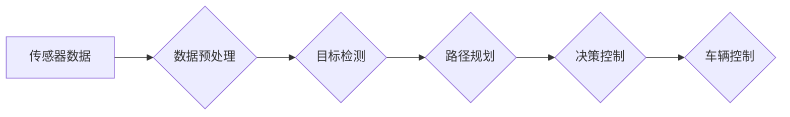

>  特斯拉，FSD，自动驾驶，深度学习，计算机视觉，强化学习，神经网络，模型训练

## 1. 背景介绍

特斯拉自2016年推出Autopilot以来，一直致力于开发全自动驾驶系统，其目标是实现完全无人驾驶，让汽车能够像人类一样感知周围环境，做出安全可靠的驾驶决策。FSD（Full Self-Driving）是特斯拉自动驾驶系统的最高级别，它旨在实现车辆在任何道路和环境条件下都能安全自主驾驶的能力。

FSD的开发是一个复杂的工程挑战，需要整合多领域的知识和技术，包括计算机视觉、传感器融合、路径规划、决策控制等。特斯拉采用了深度学习和强化学习等先进算法，并通过海量数据训练模型，不断提升FSD的性能和可靠性。

## 2. 核心概念与联系

**2.1 核心概念**

* **计算机视觉:**  FSD依赖于强大的计算机视觉算法来识别道路、交通标志、行人、车辆等周围环境中的物体。
* **传感器融合:**  特斯拉车辆配备了多种传感器，包括摄像头、雷达、超声波传感器等，FSD通过融合这些传感器的数据，构建更全面的环境感知。
* **路径规划:**  FSD需要规划车辆行驶的路径，避开障碍物，并根据交通规则行驶。
* **决策控制:**  FSD需要根据环境感知和路径规划的结果，做出驾驶决策，例如加速、减速、转向等。

**2.2 架构图**



**2.3 联系**

FSD系统是一个复杂的闭环系统，传感器数据首先经过预处理，然后被用于目标检测，目标检测的结果被用于路径规划，路径规划的结果被用于决策控制，最终决策控制指令被用于车辆控制。

## 3. 核心算法原理 & 具体操作步骤

**3.1 算法原理概述**

特斯拉FSD的核心算法主要基于深度学习和强化学习。

* **深度学习:**  用于图像识别、目标检测、路径预测等任务。特斯拉使用卷积神经网络（CNN）来提取图像特征，并通过多层网络进行特征学习，最终实现对目标的识别和分类。
* **强化学习:**  用于训练车辆的决策控制策略。强化学习算法通过奖励机制来引导车辆学习最佳的驾驶决策。

**3.2 算法步骤详解**

1. **数据采集:**  特斯拉收集大量驾驶数据，包括摄像头图像、雷达数据、传感器数据等。
2. **数据预处理:**  对采集到的数据进行清洗、格式化、标注等处理，使其适合用于模型训练。
3. **模型训练:**  使用深度学习和强化学习算法对模型进行训练，训练目标是让模型能够准确识别周围环境、规划合理的路径、做出安全的驾驶决策。
4. **模型评估:**  使用测试数据对模型进行评估，评估指标包括准确率、召回率、平均精度等。
5. **模型部署:**  将训练好的模型部署到车辆上，使其能够实时感知环境并控制车辆行驶。

**3.3 算法优缺点**

* **优点:**  深度学习和强化学习算法能够学习复杂的驾驶规则，并不断提升模型性能。
* **缺点:**  模型训练需要大量数据和计算资源，并且模型的泛化能力有限，可能在未见过的场景下表现不佳。

**3.4 算法应用领域**

* **自动驾驶:**  FSD是自动驾驶技术的代表性应用。
* **智能交通:**  FSD可以用于优化交通流量、提高道路安全。
* **物流运输:**  FSD可以用于自动驾驶卡车，提高物流效率。

## 4. 数学模型和公式 & 详细讲解 & 举例说明

**4.1 数学模型构建**

FSD的数学模型可以抽象为一个状态空间模型，其中状态表示车辆的当前位置、速度、方向等信息，动作表示车辆可以执行的操作，例如加速、减速、转向等。

**4.2 公式推导过程**

状态转移方程：

$$
x_{t+1} = f(x_t, u_t)
$$

其中：

* $x_t$ 表示车辆在时间 $t$ 的状态。
* $u_t$ 表示车辆在时间 $t$ 执行的动作。
* $f$ 表示状态转移函数。

奖励函数：

$$
R(x_t, u_t)
$$

其中：

* $R(x_t, u_t)$ 表示车辆在状态 $x_t$ 执行动作 $u_t$ 得到的奖励。

**4.3 案例分析与讲解**

假设车辆的目标是到达终点，并且需要避开障碍物。

* 状态空间：车辆的位置、速度、方向、障碍物的位置等。
* 动作空间：加速、减速、转向等。
* 状态转移函数：描述车辆在执行特定动作后状态的变化。
* 奖励函数：奖励车辆到达终点，惩罚车辆与障碍物碰撞。

通过强化学习算法，车辆可以学习到最佳的驾驶策略，以最大化奖励。

## 5. 项目实践：代码实例和详细解释说明

**5.1 开发环境搭建**

* 操作系统：Ubuntu 20.04
* 编程语言：Python 3.8
* 深度学习框架：TensorFlow 2.0

**5.2 源代码详细实现**

```python
# 导入必要的库
import tensorflow as tf

# 定义模型结构
model = tf.keras.models.Sequential([
    tf.keras.layers.Conv2D(32, (3, 3), activation='relu', input_shape=(64, 64, 3)),
    tf.keras.layers.MaxPooling2D((2, 2)),
    tf.keras.layers.Conv2D(64, (3, 3), activation='relu'),
    tf.keras.layers.MaxPooling2D((2, 2)),
    tf.keras.layers.Flatten(),
    tf.keras.layers.Dense(10, activation='softmax')
])

# 定义损失函数和优化器
loss_fn = tf.keras.losses.CategoricalCrossentropy()
optimizer = tf.keras.optimizers.Adam(learning_rate=0.001)

# 训练模型
model.compile(loss=loss_fn, optimizer=optimizer)
model.fit(x_train, y_train, epochs=10)

# 评估模型
loss, accuracy = model.evaluate(x_test, y_test)
print('Loss:', loss)
print('Accuracy:', accuracy)
```

**5.3 代码解读与分析**

这段代码定义了一个简单的卷积神经网络模型，用于图像分类任务。

* `tf.keras.models.Sequential` 创建了一个顺序模型，其中层级依次连接。
* `tf.keras.layers.Conv2D` 定义了一个卷积层，用于提取图像特征。
* `tf.keras.layers.MaxPooling2D` 定义了一个最大池化层，用于降低特征图的大小。
* `tf.keras.layers.Flatten` 将多维特征图转换为一维向量。
* `tf.keras.layers.Dense` 定义了一个全连接层，用于分类。
* `tf.keras.losses.CategoricalCrossentropy` 定义了分类任务的损失函数。
* `tf.keras.optimizers.Adam` 定义了优化器，用于更新模型参数。
* `model.fit` 用于训练模型。
* `model.evaluate` 用于评估模型性能。

**5.4 运行结果展示**

训练完成后，模型可以用于预测图像类别。

## 6. 实际应用场景

**6.1 自动驾驶**

FSD是特斯拉自动驾驶系统的核心，它可以实现车辆在高速公路、城市道路等各种场景下自动驾驶。

**6.2 智能交通**

FSD可以用于优化交通流量，提高道路安全。例如，FSD可以帮助车辆提前预判红灯，避免急刹车，从而减少交通拥堵和事故发生。

**6.3 物流运输**

FSD可以用于自动驾驶卡车，提高物流效率。自动驾驶卡车可以减少人工成本，提高运输效率，并降低运输事故的发生率。

**6.4 未来应用展望**

FSD的未来应用前景广阔，它可以应用于更多领域，例如：

* **无人配送:**  FSD可以用于无人配送服务，例如送餐、送货等。
* **自动驾驶出租车:**  FSD可以用于自动驾驶出租车，提供更便捷、更安全的出行体验。
* **智能城市:**  FSD可以与其他智能城市系统集成，例如交通管理系统、公共安全系统等，构建更加智能、高效的城市。

## 7. 工具和资源推荐

**7.1 学习资源推荐**

* **书籍:**
    * 《深度学习》
    * 《强化学习：原理、算法和应用》
* **在线课程:**
    * Coursera: 深度学习
    * Udacity: 自动驾驶工程师
* **开源项目:**
    * TensorFlow
    * PyTorch

**7.2 开发工具推荐**

* **编程语言:** Python
* **深度学习框架:** TensorFlow, PyTorch
* **仿真平台:** CARLA, Gazebo

**7.3 相关论文推荐**

* **论文标题:** End to End Learning for Self-Driving Cars
* **作者:** Bojarski, M. et al.
* **发表期刊:** arXiv preprint arXiv:1604.07316

## 8. 总结：未来发展趋势与挑战

**8.1 研究成果总结**

近年来，自动驾驶技术取得了显著进展，FSD作为自动驾驶技术的代表性应用，也取得了突破性进展。

**8.2 未来发展趋势**

* **模型性能提升:**  通过更强大的计算能力和更丰富的训练数据，FSD模型的性能将进一步提升，能够应对更复杂的环境和场景。
* **场景覆盖范围扩大:**  FSD将能够应用于更多场景，例如城市道路、高速公路、乡村道路等。
* **安全性增强:**  通过更完善的安全机制和冗余系统，FSD将更加安全可靠。

**8.3 面临的挑战**

* **数据获取和标注:**  训练FSD模型需要海量数据，数据获取和标注成本较高。
* **模型泛化能力:**  FSD模型的泛化能力有限，可能在未见过的场景下表现不佳。
* **伦理和法律问题:**  自动驾驶技术涉及到伦理和法律问题，例如责任归属、数据隐私等。

**8.4 研究展望**

未来，FSD的研究将继续朝着更安全、更可靠、更智能的方向发展。


## 9. 附录：常见问题与解答

**9.1 FSD是否可以完全替代人类驾驶员？**

目前，FSD仍然需要人类驾驶员的监督和干预。虽然FSD已经能够在某些场景下实现自动驾驶，但它仍然无法完全替代人类驾驶员。

**9.2 FSD的安全性如何保证？**

特斯拉采取了多重安全措施来保证FSD的安全性，例如冗余系统、安全冗余、紧急制动系统等。

**9.3 FSD的成本如何？**

FSD的成本取决于车辆的配置和购买方式。

**9.4 FSD的未来发展趋势是什么？**

FSD的未来发展趋势是朝着更安全、更可靠、更智能的方向发展。


作者：禅与计算机程序设计艺术 / Zen and the Art of Computer Programming 
<end_of_turn>