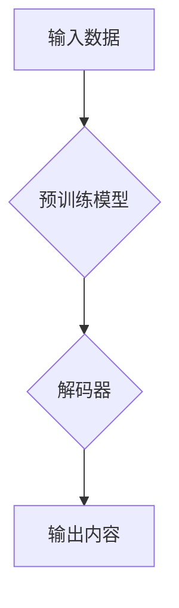

> 生成式AI，AIGC，自然语言处理，图像生成，文本生成，代码生成，商业应用，未来趋势

## 1. 背景介绍

近年来，人工智能（AI）技术取得了飞速发展，特别是生成式人工智能（Generative AI）的兴起，为各行各业带来了前所未有的机遇。生成式AI是指能够根据输入数据生成新内容的AI模型，例如文本、图像、音频、视频等。与传统的AI模型相比，生成式AI更具创造性和灵活性，能够突破人类的想象力，为我们创造出全新的内容和体验。

AIGC（AI-Generated Content）是生成式AI在内容创作领域的应用，它利用AI算法自动生成各种类型的文本内容，例如文章、故事、诗歌、广告文案、代码等。AIGC技术的发展，将深刻地改变内容创作的方式，提高效率，降低成本，并为人们带来更多个性化和定制化的内容体验。

## 2. 核心概念与联系

**2.1 生成式AI的核心概念**

生成式AI的核心概念是学习数据中的模式和规律，并根据这些模式生成新的数据。它通常基于深度学习算法，例如生成对抗网络（GAN）、变分自编码器（VAE）和Transformer等。

**2.2 AIGC与其他AI技术的联系**

AIGC与其他AI技术密切相关，例如：

* **自然语言处理（NLP）：** AIGC依赖于NLP技术来理解和生成文本内容。NLP技术包括词嵌入、句法分析、语义理解等。
* **计算机视觉（CV）：** AIGC可以结合CV技术生成图像、视频等多模态内容。
* **知识图谱（KG）：** AIGC可以利用KG中的知识和关系来生成更准确、更有逻辑的文本内容。

**2.3 AIGC的架构**



**2.4 AIGC的应用场景**

AIGC技术在各个领域都有广泛的应用场景，例如：

* **内容创作：** 自动生成新闻报道、广告文案、社交媒体内容、小说、诗歌等。
* **教育培训：** 生成个性化学习内容、自动批改作业、提供智能辅导等。
* **客户服务：** 自动回复客户咨询、提供个性化服务建议等。
* **软件开发：** 自动生成代码、文档、测试用例等。

## 3. 核心算法原理 & 具体操作步骤

### 3.1 算法原理概述

生成式AI的核心算法原理是学习数据中的模式和规律，并根据这些模式生成新的数据。常见的生成式AI算法包括：

* **生成对抗网络（GAN）：** GAN由两个网络组成：生成器和判别器。生成器试图生成逼真的数据，而判别器试图区分真实数据和生成数据。两者相互竞争，最终生成器能够生成与真实数据相似的样本。
* **变分自编码器（VAE）：** VAE通过编码器将输入数据压缩成低维表示，然后通过解码器将低维表示解码成输出数据。VAE能够学习数据的潜在结构，并生成新的数据样本。
* **Transformer：** Transformer是一种基于注意力机制的深度学习模型，能够处理序列数据，例如文本。Transformer在自然语言处理领域取得了突破性的进展，也应用于生成式AI领域。

### 3.2 算法步骤详解

以GAN为例，其训练步骤如下：

1. **初始化生成器和判别器网络参数。**
2. **从真实数据集中随机采样数据。**
3. **生成器生成伪造数据样本。**
4. **判别器对真实数据和伪造数据样本进行分类。**
5. **根据判别器的输出，更新生成器和判别器的网络参数。**
6. **重复步骤2-5，直到生成器能够生成逼真的数据样本。**

### 3.3 算法优缺点

**GAN：**

* **优点：**能够生成逼真的数据样本，应用广泛。
* **缺点：**训练过程复杂，容易出现模式崩溃问题。

**VAE：**

* **优点：**训练过程相对稳定，能够学习数据的潜在结构。
* **缺点：**生成的样本质量可能不如GAN。

**Transformer：**

* **优点：**能够处理长序列数据，在自然语言处理领域表现出色。
* **缺点：**计算量大，训练成本高。

### 3.4 算法应用领域

生成式AI算法广泛应用于各个领域，例如：

* **图像生成：**生成逼真的图像、艺术作品、照片等。
* **文本生成：**生成小说、诗歌、新闻报道、对话等。
* **音频生成：**生成音乐、语音、音效等。
* **视频生成：**生成动画、电影片段、视频特效等。

## 4. 数学模型和公式 & 详细讲解 & 举例说明

### 4.1 数学模型构建

**4.1.1 GAN模型数学公式**

* **生成器网络：**G(z)
* **判别器网络：**D(x)
* **真实数据样本：**x
* **随机噪声：**z

**目标函数：**

* **判别器损失函数：**

$$
L_D(D,G) = E_{x \sim p_{data}(x)}[log D(x)] + E_{z \sim p_z(z)}[log(1 - D(G(z)))]
$$

* **生成器损失函数：**

$$
L_G(D,G) = E_{z \sim p_z(z)}[log D(G(z))]
$$

**4.1.2 VAE模型数学公式**

* **编码器网络：**z = E(x)
* **解码器网络：**x' = D(z)
* **真实数据样本：**x
* **编码后的数据表示：**z

**目标函数：**

$$
L_{VAE}(x, z) = KL(p(z|x)||q(z|x)) + E_{x \sim p_{data}(x)}[D_{KL}(p(x|z)||q(x|z))]
$$

其中：

* KL表示Kullback-Leibler散度
* p(z|x)表示真实数据分布
* q(z|x)表示编码器输出的分布
* p(x|z)表示解码器输出的分布
* q(x|z)表示解码器输出的分布

### 4.2 公式推导过程

**4.2.1 GAN模型目标函数推导**

GAN模型的目标函数是通过最小化判别器损失函数和最大化生成器损失函数来训练模型。

* 判别器损失函数旨在使判别器能够准确区分真实数据和生成数据。
* 生成器损失函数旨在使生成器能够生成逼真的数据样本，以欺骗判别器。

**4.2.2 VAE模型目标函数推导**

VAE模型的目标函数是通过最小化编码器和解码器的损失函数来训练模型。

* KL散度项旨在使编码器输出的分布接近于标准正态分布，从而保证编码后的数据表示的稳定性。
* 重建损失项旨在使解码器能够将编码后的数据表示解码回原始数据，从而保证数据信息的完整性。

### 4.3 案例分析与讲解

**4.3.1 GAN模型应用案例：图像生成**

使用GAN模型可以生成逼真的图像，例如人脸、风景、物体等。例如，DeepFake技术利用GAN模型生成逼真的视频，可以用于娱乐、教育、新闻报道等领域。

**4.3.2 VAE模型应用案例：图像压缩**

使用VAE模型可以对图像进行压缩，同时保持图像质量。VAE模型可以学习图像的潜在结构，并将其压缩成低维表示，从而减少存储空间和传输带宽。

## 5. 项目实践：代码实例和详细解释说明

### 5.1 开发环境搭建

* **操作系统：** Linux/macOS
* **编程语言：** Python
* **深度学习框架：** TensorFlow/PyTorch
* **其他依赖库：** NumPy、Pandas、Matplotlib等

### 5.2 源代码详细实现

以下是一个使用TensorFlow实现GAN模型生成图像的简单代码示例：

```python
import tensorflow as tf

# 定义生成器网络
def generator(z):
  # ...

# 定义判别器网络
def discriminator(x):
  # ...

# 定义损失函数和优化器
optimizer_G = tf.keras.optimizers.Adam(learning_rate=0.0002)
optimizer_D = tf.keras.optimizers.Adam(learning_rate=0.0002)
loss_fn = tf.keras.losses.BinaryCrossentropy()

# 训练循环
for epoch in range(num_epochs):
  for batch in dataset:
    # ...

# 保存生成图像
generator.save("generator_model.h5")
```

### 5.3 代码解读与分析

* **生成器网络：** 生成器网络从随机噪声向量z中生成图像数据。
* **判别器网络：** 判别器网络判断输入数据是真实数据还是生成数据。
* **损失函数：** 损失函数用于衡量生成器和判别器的性能。
* **优化器：** 优化器用于更新生成器和判别器的网络参数。

### 5.4 运行结果展示

训练完成后，可以使用生成器网络生成新的图像数据。生成的图像可以与真实图像进行比较，评估生成器的性能。

## 6. 实际应用场景

### 6.1 内容创作

* **自动生成新闻报道：** 利用AIGC技术自动生成新闻报道，提高新闻生产效率。
* **创作小说、诗歌：** 利用AIGC技术创作小说、诗歌等文学作品，为创作提供新的灵感和思路。
* **生成广告文案：** 利用AIGC技术生成吸引人的广告文案，提高广告效果。

### 6.2 教育培训

* **个性化学习内容：** 根据学生的学习进度和知识水平，自动生成个性化的学习内容。
* **自动批改作业：** 利用AIGC技术自动批改作业，节省教师的时间和精力。
* **提供智能辅导：** 利用AIGC技术提供智能辅导，帮助学生解决学习难题。

### 6.3 客户服务

* **自动回复客户咨询：** 利用AIGC技术自动回复客户咨询，提高客户服务效率。
* **提供个性化服务建议：** 根据客户的需求和历史记录，利用AIGC技术提供个性化的服务建议。

### 6.4 未来应用展望

AIGC技术的发展将带来更多新的应用场景，例如：

* **虚拟助手：** 更智能、更人性化的虚拟助手，能够理解和响应用户的自然语言指令。
* **个性化娱乐：** 根据用户的喜好，自动生成个性化的娱乐内容，例如电影、音乐、游戏等。
* **科学研究：** 利用AIGC技术加速科学研究，例如药物研发、材料设计等。

## 7. 工具和资源推荐

### 7.1 学习资源推荐

* **书籍：**
    * 《深度学习》
    * 《生成对抗网络》
* **在线课程：**
    * Coursera
    * edX
    * Udacity

### 7.2 开发工具推荐

* **深度学习框架：** TensorFlow、PyTorch
* **编程语言：** Python
* **云计算平台：** AWS、Google Cloud、Azure

### 7.3 相关论文推荐

* **Generative Adversarial Networks**
* **Variational Autoencoders for Generation**
* **Transformer-based Language Models for Text Generation**

## 8. 总结：未来发展趋势与挑战

### 8.1 研究成果总结

AIGC技术取得了显著的进展，能够生成逼真的文本、图像、音频等内容。

### 8.2 未来发展趋势

* **模型能力提升：** 模型将更加强大，能够生成更复杂、更逼