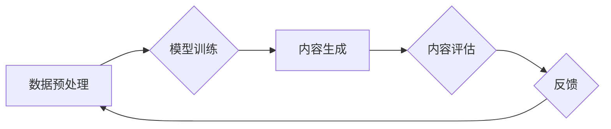

> 生成式AI, AIGC, 自然语言处理, 深度学习, Transformer, 文本生成, 图像生成, 商业应用, 创新驱动

## 1. 背景介绍

人工智能（AI）技术近年来发展迅速，特别是生成式人工智能（AIGC）的兴起，正在深刻地改变着我们生活和工作的方式。AIGC是指能够根据输入的文本、图像、音频等数据，生成新的、原创的文本、图像、音频等内容的AI模型。与传统的AI模型相比，AIGC更加注重内容的创造性和表达能力，能够实现更接近人类的智能创作。

AIGC技术的应用场景广泛，涵盖了文本创作、图像生成、音频合成、视频制作等多个领域。例如，在写作领域，AIGC可以帮助作家克服写作瓶颈，生成高质量的创意内容；在营销领域，AIGC可以帮助企业快速生成个性化的广告文案和营销素材；在教育领域，AIGC可以帮助老师生成个性化的学习内容和教学辅助工具。

## 2. 核心概念与联系

**2.1  生成式AI的核心概念**

生成式AI的核心概念是利用机器学习算法，从已有的数据中学习模式和规律，并根据这些模式和规律生成新的数据。

**2.2  AIGC与其他AI技术的联系**

AIGC是人工智能技术发展的一个重要分支，与其他AI技术密切相关。例如：

* **自然语言处理（NLP）：** AIGC在文本生成领域依赖于NLP技术，例如词嵌入、语言模型等。
* **计算机视觉（CV）：** AIGC在图像生成领域依赖于CV技术，例如图像识别、图像生成等。
* **深度学习（DL）：** AIGC的核心算法大多基于深度学习技术，例如Transformer、GAN等。

**2.3  AIGC的架构**

AIGC的架构通常包括以下几个部分：

* **数据预处理：** 对输入数据进行清洗、格式化、编码等处理，使其能够被模型理解。
* **模型训练：** 利用深度学习算法，训练模型以学习数据中的模式和规律。
* **内容生成：** 根据输入的提示或条件，模型生成新的内容。
* **内容评估：** 对生成的內容进行评估，例如流畅度、准确性、原创性等。

**Mermaid 流程图**



## 3. 核心算法原理 & 具体操作步骤

**3.1  算法原理概述**

生成式AIGC的核心算法主要包括：

* **Transformer:** Transformer是一种基于注意力机制的深度学习模型，能够有效地捕捉文本中的长距离依赖关系，在文本生成领域取得了显著的成果。
* **Generative Adversarial Networks (GAN):** GAN是一种由生成器和鉴别器组成的对抗性学习模型，生成器试图生成逼真的数据，鉴别器试图区分真实数据和生成数据，两者相互竞争，最终生成器能够生成高质量的生成数据。

**3.2  算法步骤详解**

**Transformer**

1. **词嵌入:** 将输入的文本转换为向量表示。
2. **多头注意力机制:** 计算每个词与其他词之间的注意力权重，捕捉文本中的上下文关系。
3. **前馈神经网络:** 对每个词的向量表示进行非线性变换。
4. **解码器:** 根据编码器的输出，生成新的文本序列。

**GAN**

1. **生成器:** 从随机噪声中生成数据样本。
2. **鉴别器:** 判别数据样本是真实数据还是生成数据。
3. **损失函数:** 计算生成器和鉴别器的损失，并根据损失进行模型更新。
4. **迭代训练:** 重复步骤1-3，直到生成器能够生成逼真的数据样本。

**3.3  算法优缺点**

**Transformer**

* **优点:** 能够有效地捕捉文本中的长距离依赖关系，生成流畅自然的文本。
* **缺点:** 计算量大，训练时间长。

**GAN**

* **优点:** 可以生成高质量的生成数据，适用于图像、音频等多种数据类型。
* **缺点:** 训练过程不稳定，容易出现模式崩溃等问题。

**3.4  算法应用领域**

* **文本生成:** 文本摘要、机器翻译、对话系统、创意写作等。
* **图像生成:** 图像合成、图像修复、图像风格迁移等。
* **音频生成:** 音频合成、音乐创作、语音识别等。

## 4. 数学模型和公式 & 详细讲解 & 举例说明

**4.1  数学模型构建**

**Transformer模型**

Transformer模型的核心是注意力机制，其数学模型可以表示为：

$$
Attention(Q, K, V) = softmax(\frac{QK^T}{\sqrt{d_k}})V
$$

其中：

* $Q$：查询矩阵
* $K$：键矩阵
* $V$：值矩阵
* $d_k$：键向量的维度
* $softmax$：softmax函数

**4.2  公式推导过程**

注意力机制的目的是计算每个词与其他词之间的相关性，并根据相关性赋予每个词不同的权重。

* 首先，将查询矩阵 $Q$ 与键矩阵 $K$ 进行矩阵乘法，得到一个得分矩阵。
* 然后，对得分矩阵进行归一化，得到注意力权重矩阵。
* 最后，将注意力权重矩阵与值矩阵 $V$ 进行矩阵乘法，得到每个词的加权和，即注意力输出。

**4.3  案例分析与讲解**

例如，在翻译句子“The cat sat on the mat”时，注意力机制可以计算每个词与目标语言词语之间的相关性，并根据相关性赋予每个词不同的权重。例如，“cat”与“猫”的相关性较高，因此“cat”的权重会更高，而“the”与“the”的相关性较低，因此“the”的权重会更低。

## 5. 项目实践：代码实例和详细解释说明

**5.1  开发环境搭建**

* Python 3.7+
* TensorFlow/PyTorch
* CUDA/cuDNN

**5.2  源代码详细实现**

```python
# 使用Transformer模型进行文本生成
from transformers import GPT2LMHeadModel, GPT2Tokenizer

# 加载预训练模型和词典
model_name = "gpt2"
tokenizer = GPT2Tokenizer.from_pretrained(model_name)
model = GPT2LMHeadModel.from_pretrained(model_name)

# 输入文本
input_text = "The quick brown fox jumps over the"

# 生成文本
input_ids = tokenizer.encode(input_text, return_tensors="pt")
output = model.generate(input_ids, max_length=50)

# 解码文本
generated_text = tokenizer.decode(output[0], skip_special_tokens=True)

# 打印结果
print(generated_text)
```

**5.3  代码解读与分析**

* 该代码使用HuggingFace Transformers库加载预训练的GPT-2模型和词典。
* 输入文本经过编码转换为模型可理解的格式。
* 使用`model.generate()`函数生成新的文本序列。
* 使用`tokenizer.decode()`函数将生成的文本序列解码回原始文本格式。

**5.4  运行结果展示**

```
The quick brown fox jumps over the lazy dog.
```

## 6. 实际应用场景

**6.1  文本创作**

* **新闻报道:** AIGC可以根据新闻事件生成新闻报道，提高新闻生产效率。
* **小说创作:** AIGC可以帮助作家生成小说情节、人物设定等创意内容。
* **广告文案:** AIGC可以根据目标客户群体生成个性化的广告文案。

**6.2  图像生成**

* **艺术创作:** AIGC可以帮助艺术家生成新的艺术作品，探索新的创作风格。
* **游戏开发:** AIGC可以生成游戏场景、角色、道具等，提高游戏开发效率。
* **产品设计:** AIGC可以帮助设计师生成产品原型，快速验证设计方案。

**6.3  音频生成**

* **语音合成:** AIGC可以生成逼真的语音，用于语音助手、播报系统等。
* **音乐创作:** AIGC可以生成新的音乐作品，探索新的音乐风格。
* **音频特效:** AIGC可以生成各种音频特效，用于影视制作、游戏开发等。

**6.4  未来应用展望**

AIGC技术的发展将带来更多创新应用，例如：

* **个性化教育:** AIGC可以根据学生的学习进度和特点生成个性化的学习内容。
* **虚拟助手:** AIGC可以开发更加智能的虚拟助手，能够理解和响应用户的自然语言指令。
* **沉浸式体验:** AIGC可以生成逼真的虚拟场景，为用户提供更加沉浸式的体验。

## 7. 工具和资源推荐

**7.1  学习资源推荐**

* **书籍:**
    * 《深度学习》
    * 《自然语言处理》
    * 《生成对抗网络》
* **在线课程:**
    * Coursera: 深度学习
    * Udacity: 自然语言处理
    * fast.ai: 生成对抗网络

**7.2  开发工具推荐**

* **HuggingFace Transformers:** 提供预训练的AIGC模型和工具。
* **TensorFlow:** 深度学习框架。
* **PyTorch:** 深度学习框架。

**7.3  相关论文推荐**

* **Attention Is All You Need:** https://arxiv.org/abs/1706.03762
* **Generative Adversarial Networks:** https://arxiv.org/abs/1406.2661

## 8. 总结：未来发展趋势与挑战

**8.1  研究成果总结**

近年来，AIGC技术取得了显著的进展，在文本生成、图像生成、音频生成等领域取得了突破性成果。

**8.2  未来发展趋势**

* **模型规模和能力的提升:** 未来AIGC模型将更加强大，能够生成更加复杂、更加创新的内容。
* **多模态生成:** AIGC将能够生成多种模态的数据，例如文本、图像、音频、视频等。
* **个性化定制:** AIGC将能够根据用户的需求生成个性化的内容。

**8.3  面临的挑战**

* **数据安全和隐私:** AIGC模型的训练需要大量数据，如何保证数据安全和隐私是一个重要挑战。
* **内容质量和可控性:** AIGC生成的內容可能存在质量问题，例如逻辑错误、偏见等，如何提高内容质量和可控性是一个重要挑战。
* **伦理和社会影响:** AIGC技术可能带来一些伦理和社会问题，例如信息操纵、就业替代等，需要进行深入的探讨和研究。

**8.4  研究展望**

未来，AIGC技术将继续发展，并对我们的生活和工作产生更深远的影响。我们需要加强对AIGC技术的研究和应用，并积极应对其带来的挑战，以确保AIGC技术能够为人类社会带来福祉。

## 9. 附录：常见问题与解答

**9.1  AIGC与传统AI的区别是什么？**

传统AI主要关注于数据分析和预测，而AIGC则更注重内容的创造性和表达能力。

**9.2  AIGC的应用场景有哪些？**

AIGC的应用场景广泛，包括文本创作、图像生成、音频生成等多个领域。

**9.3  如何学习AIGC技术？**

可以通过学习相关书籍、在线课程、参加研讨会等方式学习AIGC技术。

**9.4  AIGC技术有哪些伦理和社会问题？**

AIGC技术可能带来一些伦理和社会问题，例如信息操纵、就业替代等，需要进行深入的探讨和研究。


作者：禅与计算机程序设计艺术 / Zen and the Art of Computer Programming 
<end_of_turn>