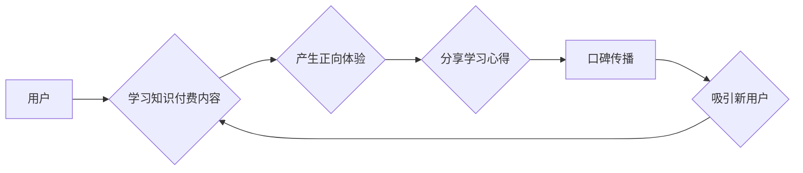

> 知识付费, 口碑传播, 病毒式营销, 社交网络, 内容营销, 用户体验, 数据分析

## 1. 背景介绍

知识付费作为一种新型的商业模式，近年来发展迅速，其核心在于将知识和技能转化为有价值的商品，通过线上平台向用户提供付费学习服务。随着互联网的普及和用户对知识的需求不断增长，知识付费市场呈现出巨大的发展潜力。然而，知识付费市场竞争激烈，如何有效地提升产品知名度和用户粘性，实现口碑传播和病毒式营销，成为众多知识付费平台和创作者面临的共同挑战。

## 2. 核心概念与联系

**2.1 口碑传播**

口碑传播是指用户通过自身的体验和评价，向他人推荐产品或服务的一种传播方式。它是一种基于信任和真实体验的传播模式，具有强大的感染力和说服力。

**2.2 病毒式营销**

病毒式营销是指通过创造具有传播性的内容，利用社交网络和用户分享行为，快速扩散营销信息的一种营销策略。它类似于病毒的传播方式，能够在短时间内迅速扩大影响范围。

**2.3 知识付费与口碑传播与病毒式营销的联系**

知识付费平台和创作者可以通过以下方式将口碑传播和病毒式营销与知识付费模式相结合：

* **提供高品质的知识内容：** 高品质的内容能够满足用户的学习需求，提升用户体验，从而产生正面的口碑传播。
* **鼓励用户分享和互动：** 平台可以设置分享机制，鼓励用户分享学习心得和课程内容，并通过互动活动增强用户粘性。
* **利用社交网络进行推广：** 平台可以利用社交网络平台进行推广，吸引更多用户关注和参与。
* **打造优质的社区氛围：** 平台可以建立学习社区，让用户之间互相交流学习，形成良好的口碑传播氛围。

**2.4  核心概念原理和架构的 Mermaid 流程图**



## 3. 核心算法原理 & 具体操作步骤

**3.1 算法原理概述**

在知识付费平台中，算法可以用于推荐课程、分析用户行为、预测用户转化率等方面。例如，推荐算法可以根据用户的学习历史、兴趣偏好等信息，推荐与用户需求相匹配的课程。

**3.2 算法步骤详解**

1. **数据收集:** 收集用户学习行为数据，包括课程浏览记录、学习时长、评价等信息。
2. **数据预处理:** 对收集到的数据进行清洗、转换和特征提取等操作，以便于算法训练和使用。
3. **模型选择:** 选择合适的推荐算法模型，例如协同过滤、内容过滤、深度学习等。
4. **模型训练:** 使用训练数据训练选择的推荐算法模型。
5. **模型评估:** 使用测试数据评估模型的性能，例如准确率、召回率等指标。
6. **模型部署:** 将训练好的模型部署到线上平台，用于推荐课程。

**3.3 算法优缺点**

* **优点:** 能够根据用户的个性化需求推荐课程，提高用户学习体验和转化率。
* **缺点:** 需要大量的用户数据进行训练，算法模型的复杂度较高，需要专业的技术人员进行维护和优化。

**3.4 算法应用领域**

* **课程推荐:** 根据用户的学习历史和兴趣偏好，推荐与用户需求相匹配的课程。
* **用户画像:** 分析用户的学习行为数据，构建用户的学习画像，以便于平台进行个性化运营。
* **转化率预测:** 利用机器学习算法预测用户的转化率，帮助平台优化营销策略。

## 4. 数学模型和公式 & 详细讲解 & 举例说明

**4.1 数学模型构建**

知识付费平台的口碑传播和病毒式营销可以建模为一个网络传播模型。其中，用户可以看作是网络节点，课程内容可以看作是传播信息，用户之间的互动可以看作是传播路径。

**4.2 公式推导过程**

假设一个知识付费平台有N个用户，每个用户都有一个传播系数，表示用户分享课程内容的概率。则用户i分享课程内容给用户j的概率为：

$$P(i \rightarrow j) = a_i \cdot b_j$$

其中，$a_i$ 是用户i的传播系数，$b_j$ 是用户j接受课程内容的概率。

**4.3 案例分析与讲解**

假设一个知识付费平台有100个用户，其中用户A的传播系数为0.8，用户B的接受课程内容的概率为0.5。则用户A分享课程内容给用户B的概率为：

$$P(A \rightarrow B) = 0.8 \cdot 0.5 = 0.4$$

**5. 项目实践：代码实例和详细解释说明**

**5.1 开发环境搭建**

* Python 3.x
* Flask 或 Django 框架
* 数据库 (例如 MySQL 或 PostgreSQL)

**5.2 源代码详细实现**

```python
from flask import Flask, render_template

app = Flask(__name__)

@app.route('/')
def index():
    return render_template('index.html')

if __name__ == '__main__':
    app.run(debug=True)
```

**5.3 代码解读与分析**

* 该代码是一个简单的Flask web应用，用于展示知识付费平台的首页。
* `render_template('index.html')` 函数用于渲染模板文件 `index.html`，该文件包含了平台的首页内容。

**5.4 运行结果展示**

运行该代码后，可以在浏览器中访问 `http://127.0.0.1:5000/`，查看知识付费平台的首页。

## 6. 实际应用场景

**6.1 在线课程平台**

在线课程平台可以利用口碑传播和病毒式营销，提高课程的知名度和用户粘性。例如，平台可以设置分享机制，鼓励用户分享学习心得和课程内容，并通过互动活动增强用户粘性。

**6.2 知识付费社区**

知识付费社区可以利用口碑传播和病毒式营销，吸引更多用户加入社区，形成良好的学习氛围。例如，社区可以建立学习小组，让用户之间互相交流学习，并通过线上线下活动增强用户粘性。

**6.3 个人知识付费**

个人知识付费创作者可以利用口碑传播和病毒式营销，推广自己的知识产品，扩大影响力。例如，创作者可以利用社交网络平台进行推广，吸引更多用户关注和参与。

**6.4 未来应用展望**

随着人工智能、大数据等技术的不断发展，知识付费平台将更加注重用户体验和个性化服务。口碑传播和病毒式营销也将更加智能化和精准化，能够更好地帮助平台和创作者实现商业目标。

## 7. 工具和资源推荐

**7.1 学习资源推荐**

* **书籍:**
    * 《网络营销实战》
    * 《内容营销》
    * 《社交媒体营销》
* **在线课程:**
    * Udemy
    * Coursera
    * edX

**7.2 开发工具推荐**

* **Python:**
    * Flask
    * Django
* **数据库:**
    * MySQL
    * PostgreSQL

**7.3 相关论文推荐**

* **病毒式营销的理论与实践**
* **口碑传播的网络模型**
* **知识付费平台的用户行为分析**

## 8. 总结：未来发展趋势与挑战

**8.1 研究成果总结**

本文探讨了知识付费如何实现口碑传播和病毒式营销，分析了核心概念、算法原理、应用场景等方面。

**8.2 未来发展趋势**

* **个性化推荐:** 利用人工智能技术，为用户提供更加个性化的课程推荐。
* **沉浸式体验:** 利用虚拟现实、增强现实等技术，为用户提供更加沉浸式的学习体验。
* **社区化运营:** 构建更加活跃的学习社区，增强用户之间的互动和交流。

**8.3 面临的挑战**

* **内容质量:** 知识付费平台需要不断提升内容质量，才能赢得用户的信任和口碑。
* **用户粘性:** 知识付费平台需要不断创新，才能提高用户的粘性，避免用户流失。
* **监管政策:** 知识付费行业需要制定完善的监管政策，规范市场秩序。

**8.4 研究展望**

未来，我们将继续深入研究知识付费的传播机制，探索更加有效的口碑传播和病毒式营销策略，为知识付费平台和创作者提供更加专业的技术支持。

## 9. 附录：常见问题与解答

**9.1 如何提高知识付费产品的口碑传播？**

* 提供高品质的知识内容
* 鼓励用户分享和互动
* 利用社交网络进行推广
* 打造优质的社区氛围

**9.2 如何实现知识付费产品的病毒式营销？**

* 创造具有传播性的内容
* 利用社交网络和用户分享行为
* 设置激励机制，鼓励用户分享
* 与KOL合作，扩大影响力

**9.3 知识付费平台如何应对用户流失？**

* 提供个性化推荐
* 增强用户粘性
* 构建活跃的学习社区
* 提供优质的售后服务


作者：禅与计算机程序设计艺术 / Zen and the Art of Computer Programming 
<end_of_turn>