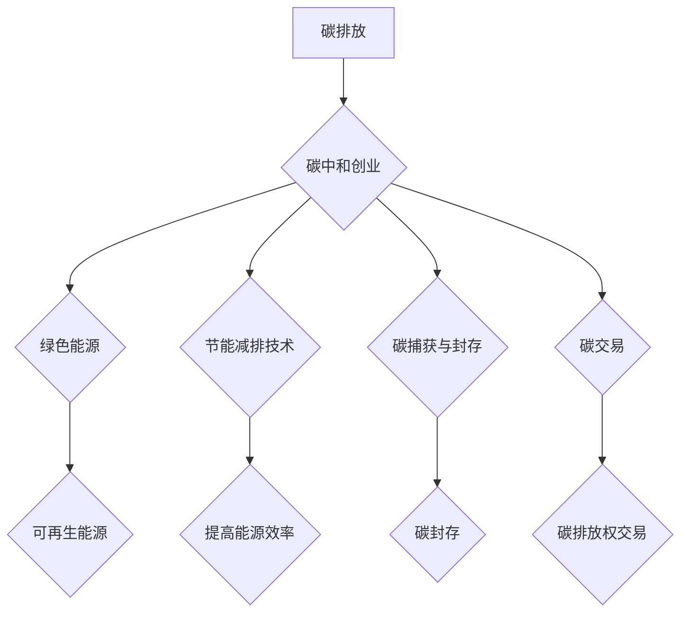

> 碳中和、绿色技术、可持续发展、人工智能、数据分析、区块链

## 1. 背景介绍

全球气候变化已成为人类面临的严峻挑战，碳排放是导致气候变化的主要因素之一。为了应对气候变化，世界各国纷纷制定了碳中和目标，旨在实现经济发展与环境保护的平衡。碳中和创业，即利用技术创新和商业模式，帮助企业和个人减少碳排放，实现碳中和的目标，正成为一个充满机遇和挑战的领域。

近年来，绿色技术和可持续发展理念逐渐深入人心，消费者对环保产品的需求不断增长。同时，政府也出台了一系列政策措施，鼓励企业发展绿色技术和低碳产业。这些因素共同推动了碳中和创业的蓬勃发展。

## 2. 核心概念与联系

**2.1 碳中和的概念**

碳中和是指通过减少碳排放和增加碳汇，实现碳排放量净零的状况。

**2.2 碳中和创业的模式**

碳中和创业涵盖了多个领域，包括：

* **绿色能源:** 开发和推广可再生能源，如太阳能、风能、水能等，替代传统化石能源。
* **节能减排技术:** 推广节能减排技术，提高能源利用效率，减少碳排放。
* **碳捕获与封存:** 开发碳捕获与封存技术，从大气中捕获二氧化碳，并将其封存于地下或其他安全场所。
* **碳交易:** 建立碳交易市场，通过市场机制引导企业减少碳排放。

**2.3 核心概念与联系的流程图**



## 3. 核心算法原理 & 具体操作步骤

**3.1 算法原理概述**

碳中和创业涉及到多种算法和技术，例如：

* **数据分析算法:** 用于分析碳排放数据，识别碳排放热点和趋势。
* **机器学习算法:** 用于预测碳排放量，优化碳减排策略。
* **优化算法:** 用于设计碳交易机制，提高碳市场效率。

**3.2 算法步骤详解**

以数据分析算法为例，其步骤如下：

1. 收集碳排放数据，包括企业、行业、地区等不同层面的数据。
2. 数据清洗和预处理，去除无效数据，格式化数据。
3. 数据分析和挖掘，使用统计分析、数据可视化等方法，分析碳排放数据，识别碳排放热点和趋势。
4. 建立碳排放模型，使用机器学习算法，建立碳排放预测模型。
5. 评估模型性能，使用测试数据评估模型的准确性和可靠性。

**3.3 算法优缺点**

数据分析算法具有以下优点：

* 可以有效识别碳排放热点和趋势。
* 可以帮助企业制定更精准的碳减排策略。
* 可以为政府制定碳减排政策提供数据支持。

但也存在以下缺点：

* 数据质量对算法结果影响较大。
* 算法模型的建立需要大量数据和计算资源。

**3.4 算法应用领域**

数据分析算法广泛应用于碳中和创业领域，例如：

* 企业碳排放管理
* 碳交易市场监管
* 碳减排政策制定

## 4. 数学模型和公式 & 详细讲解 & 举例说明

**4.1 数学模型构建**

碳排放量可以表示为以下公式：

$$
C = \sum_{i=1}^{n} E_i \cdot F_i
$$

其中：

* $C$ 表示总碳排放量
* $E_i$ 表示第 $i$ 种能源的消耗量
* $F_i$ 表示第 $i$ 种能源的碳排放系数

**4.2 公式推导过程**

该公式的推导过程如下：

1. 碳排放量等于不同能源消耗量乘以其对应的碳排放系数之和。
2. 每个能源的碳排放系数可以根据其燃烧过程中的碳排放量进行计算。

**4.3 案例分析与讲解**

假设一家工厂使用煤炭和天然气两种能源，煤炭的碳排放系数为 0.8 kg CO2/kWh，天然气的碳排放系数为 0.5 kg CO2/kWh，煤炭消耗量为 1000 kWh，天然气消耗量为 500 kWh，则该工厂的总碳排放量为：

$$
C = 1000 \cdot 0.8 + 500 \cdot 0.5 = 800 + 250 = 1050 kg CO2
$$

## 5. 项目实践：代码实例和详细解释说明

**5.1 开发环境搭建**

本项目使用 Python 语言进行开发，所需环境如下：

* Python 3.x
* Jupyter Notebook
* pandas
* matplotlib

**5.2 源代码详细实现**

```python
import pandas as pd
import matplotlib.pyplot as plt

# 数据加载
data = pd.read_csv('carbon_emission.csv')

# 数据分析
total_emission = data['total_emission'].sum()
print(f'总碳排放量: {total_emission} kg CO2')

# 数据可视化
plt.figure(figsize=(10, 6))
plt.bar(data['industry'], data['emission'])
plt.xlabel('行业')
plt.ylabel('碳排放量 (kg CO2)')
plt.title('不同行业碳排放量')
plt.show()
```

**5.3 代码解读与分析**

* 代码首先加载数据，并计算总碳排放量。
* 然后使用 matplotlib 库绘制柱状图，展示不同行业碳排放量。

**5.4 运行结果展示**

运行代码后，将生成一个柱状图，展示不同行业碳排放量。

## 6. 实际应用场景

碳中和创业的应用场景广泛，包括：

* **企业碳排放管理:** 企业可以利用碳中和技术，监测和管理自身的碳排放量，制定碳减排计划，实现碳中和目标。
* **绿色供应链:** 企业可以与供应商合作，建立绿色供应链，减少供应链中的碳排放量。
* **碳交易市场:** 碳交易市场可以为企业提供碳排放权交易平台，鼓励企业减少碳排放。
* **碳抵消:** 企业可以购买碳抵消项目，抵消自身的碳排放量。

**6.4 未来应用展望**

随着技术的进步和政策的支持，碳中和创业将迎来更广阔的发展空间。未来，碳中和创业将更加注重以下方面：

* **人工智能和数据分析:** 利用人工智能和数据分析技术，提高碳排放监测和预测的精度，优化碳减排策略。
* **区块链技术:** 利用区块链技术，构建更加透明和可信的碳交易市场。
* **可再生能源和储能技术:** 推广可再生能源和储能技术，实现能源结构的转型升级。

## 7. 工具和资源推荐

**7.1 学习资源推荐**

* **书籍:**
    * 《碳中和：从理念到实践》
    * 《可持续发展：理论与实践》
* **在线课程:**
    * Coursera: 碳中和与可持续发展
    * edX: 碳交易与市场机制

**7.2 开发工具推荐**

* **Python:** 数据分析、机器学习、算法开发
* **Jupyter Notebook:** 代码开发和可视化
* **pandas:** 数据处理和分析
* **matplotlib:** 数据可视化

**7.3 相关论文推荐**

* **碳中和目标的实现路径**
* **人工智能在碳中和中的应用**
* **区块链技术在碳交易中的应用**

## 8. 总结：未来发展趋势与挑战

**8.1 研究成果总结**

碳中和创业是一个充满机遇和挑战的领域，通过技术创新和商业模式的探索，可以有效减少碳排放，实现经济发展与环境保护的平衡。

**8.2 未来发展趋势**

未来，碳中和创业将更加注重以下方面：

* **人工智能和数据分析:** 利用人工智能和数据分析技术，提高碳排放监测和预测的精度，优化碳减排策略。
* **区块链技术:** 利用区块链技术，构建更加透明和可信的碳交易市场。
* **可再生能源和储能技术:** 推广可再生能源和储能技术，实现能源结构的转型升级。

**8.3 面临的挑战**

碳中和创业也面临着一些挑战，例如：

* **技术成本:** 一些碳减排技术成本较高，需要政府和企业共同投入。
* **政策支持:** 需要完善的政策法规支持，引导企业发展绿色技术和低碳产业。
* **公众认知:** 需要提高公众对碳中和的认知和参与度。

**8.4 研究展望**

未来，需要进一步加强碳中和创业领域的科研投入，探索更加高效、可持续的碳减排技术和商业模式，为实现碳中和目标贡献力量。

## 9. 附录：常见问题与解答

**9.1 什么是碳中和？**

碳中和是指通过减少碳排放和增加碳汇，实现碳排放量净零的状况。

**9.2 碳中和创业有哪些模式？**

碳中和创业涵盖了多个领域，包括绿色能源、节能减排技术、碳捕获与封存、碳交易等。

**9.3 如何参与碳中和创业？**

可以从以下几个方面参与碳中和创业：

* **创业:** 开发和推广碳减排技术和产品。
* **投资:** 投资碳中和创业项目。
* **消费:** 选择环保产品和服务。
* **倡导:** 提高公众对碳中和的认知和参与度。


作者：禅与计算机程序设计艺术 / Zen and the Art of Computer Programming 
<end_of_turn>