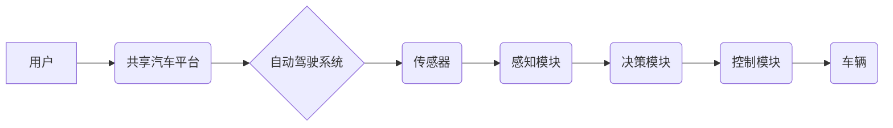

> 自动驾驶,共享汽车,端到端,人工智能,机器学习,深度学习,计算机视觉,传感器融合,路径规划,控制算法,安全保障

## 1. 背景介绍

随着人工智能、机器学习和传感器技术的飞速发展，自动驾驶汽车已经从科幻小说走入现实。自动驾驶技术不仅有望改变出行方式，更将重塑城市交通格局，带来更加安全、高效、便捷的出行体验。自主共享汽车服务作为自动驾驶技术的应用场景之一，正逐渐成为未来交通运输的重要组成部分。

自主共享汽车服务是指利用自动驾驶技术，实现车辆无人驾驶，并通过平台化运营模式，提供按需共享的汽车服务。相较于传统的私家车，自主共享汽车服务具有以下优势：

* **提高资源利用率:** 通过共享模式，减少车辆闲置时间，提高车辆利用率，降低运营成本。
* **缓解交通拥堵:** 通过智能路径规划和协同控制，优化交通流量，缓解城市交通拥堵。
* **提升出行安全:** 自动驾驶技术可以有效降低人为驾驶误差，提高道路交通安全。
* **提供便捷出行体验:** 用户可以通过手机APP预约车辆，无需寻找停车位，享受更加便捷的出行体验。

## 2. 核心概念与联系

**2.1 核心概念**

* **自动驾驶:** 指车辆能够感知周围环境，自主做出决策并控制行驶，实现无人驾驶的功能。
* **共享汽车:** 指通过平台化运营模式，提供按需共享的汽车服务，用户可以根据需要租用车辆。
* **端到端:** 指从感知环境到控制车辆，整个自动驾驶流程都由人工智能算法完成，无需人工干预。

**2.2 架构关系**



**2.3 核心联系**

自主共享汽车服务的核心是将自动驾驶技术与共享汽车模式相结合，通过端到端自动驾驶系统实现车辆无人驾驶，并通过共享汽车平台提供便捷的出行服务。

## 3. 核心算法原理 & 具体操作步骤

**3.1 算法原理概述**

端到端自动驾驶算法的核心是利用深度学习技术，训练一个能够感知周围环境、做出决策并控制车辆的模型。该模型通常由以下几个模块组成：

* **感知模块:** 利用传感器数据，如摄像头、雷达、激光雷达等，感知周围环境，包括道路、车辆、行人等。
* **决策模块:** 根据感知模块获取的环境信息，做出驾驶决策，如加速、减速、转向等。
* **控制模块:** 将决策模块的指令转化为车辆控制信号，控制车辆的运动。

**3.2 算法步骤详解**

1. **数据采集:** 收集大量真实道路场景的数据，包括图像、雷达数据、激光雷达数据等。
2. **数据预处理:** 对采集到的数据进行预处理，如图像增强、数据标注等。
3. **模型训练:** 利用深度学习算法，训练感知模块、决策模块和控制模块。
4. **模型评估:** 利用测试数据评估模型的性能，并进行模型调优。
5. **部署上线:** 将训练好的模型部署到车辆上，实现自动驾驶功能。

**3.3 算法优缺点**

* **优点:**

    * 能够学习复杂的驾驶规则和场景。
    * 性能优于传统算法。
    * 具有良好的泛化能力。

* **缺点:**

    * 训练数据量大，需要大量的计算资源。
    * 模型解释性差，难以理解模型的决策过程。
    * 对传感器数据质量要求高。

**3.4 算法应用领域**

端到端自动驾驶算法广泛应用于自动驾驶汽车、无人机、机器人等领域。

## 4. 数学模型和公式 & 详细讲解 & 举例说明

**4.1 数学模型构建**

自动驾驶系统的核心是构建一个数学模型，描述车辆与环境之间的关系。该模型通常包括以下几个方面：

* **车辆动力学模型:** 描述车辆的运动状态，如速度、加速度、转角等。
* **环境感知模型:** 描述周围环境的信息，如道路、车辆、行人等。
* **路径规划模型:** 根据环境信息，规划车辆行驶路径。
* **控制模型:** 根据路径规划结果，控制车辆的运动。

**4.2 公式推导过程**

车辆动力学模型通常使用牛顿第二定律来描述：

$$F = ma$$

其中：

* $F$ 是车辆受到的合力
* $m$ 是车辆的质量
* $a$ 是车辆的加速度

**4.3 案例分析与讲解**

假设一辆汽车想要加速行驶，需要克服摩擦力和空气阻力。根据牛顿第二定律，可以推导出车辆的加速度与合力之间的关系。

## 5. 项目实践：代码实例和详细解释说明

**5.1 开发环境搭建**

* 操作系统: Ubuntu 20.04
* 编程语言: Python 3.8
* 深度学习框架: TensorFlow 2.0
* 仿真环境: CARLA

**5.2 源代码详细实现**

```python
# 感知模块代码示例
import cv2
import numpy as np

def perceive_environment(image):
    # 使用计算机视觉算法对图像进行处理，识别道路、车辆、行人等
    # ...
    return perceived_objects

# 决策模块代码示例
def make_decision(perceived_objects):
    # 根据感知到的环境信息，做出驾驶决策，如加速、减速、转向等
    # ...
    return action

# 控制模块代码示例
def control_vehicle(action):
    # 将决策指令转化为车辆控制信号，控制车辆的运动
    # ...
```

**5.3 代码解读与分析**

* 感知模块使用计算机视觉算法对图像进行处理，识别周围环境的信息。
* 决策模块根据感知到的环境信息，做出驾驶决策。
* 控制模块将决策指令转化为车辆控制信号，控制车辆的运动。

**5.4 运行结果展示**

在CARLA仿真环境中，可以运行上述代码，观察车辆的自动驾驶行为。

## 6. 实际应用场景

**6.1 城市交通**

自主共享汽车服务可以缓解城市交通拥堵，提高道路交通效率。

**6.2 公共交通**

自主共享汽车可以作为公共交通的一部分，提供更加便捷的出行服务。

**6.3 特殊人群出行**

自主共享汽车可以为行动不便的人群提供出行便利。

**6.4 未来应用展望**

随着自动驾驶技术的不断发展，自主共享汽车服务将应用于更多场景，例如：

* **物流运输:** 自动驾驶货车可以提高物流效率，降低运输成本。
* **农业生产:** 自动驾驶无人机可以用于农田监测、施肥、喷洒等。
* **救援服务:** 自动驾驶车辆可以用于灾害救援、医疗救护等。

## 7. 工具和资源推荐

**7.1 学习资源推荐**

* **书籍:**
    * 《深度学习》
    * 《自动驾驶汽车》
* **在线课程:**
    * Coursera: 自动驾驶汽车
    * Udacity: 自动驾驶工程师

**7.2 开发工具推荐**

* **仿真环境:** CARLA, Gazebo
* **深度学习框架:** TensorFlow, PyTorch
* **编程语言:** Python

**7.3 相关论文推荐**

* **论文:**
    * End to End Learning for Self-Driving Cars
    * Deep Reinforcement Learning for Autonomous Driving

## 8. 总结：未来发展趋势与挑战

**8.1 研究成果总结**

近年来，自动驾驶技术取得了显著进展，端到端自动驾驶算法的性能不断提升。

**8.2 未来发展趋势**

* **更安全的自动驾驶系统:** 提高自动驾驶系统的安全性是未来发展的重要方向。
* **更智能的自动驾驶系统:** 开发更智能的自动驾驶系统，能够更好地理解和应对复杂环境。
* **更广泛的应用场景:** 自动驾驶技术将应用于更多场景，例如物流运输、农业生产等。

**8.3 面临的挑战**

* **数据安全:** 自动驾驶系统需要大量数据进行训练，数据安全是一个重要的挑战。
* **伦理问题:** 自动驾驶系统可能会面临一些伦理问题，例如事故责任归属。
* **法律法规:** 自动驾驶技术的应用需要完善的法律法规。

**8.4 研究展望**

未来，自动驾驶技术将继续发展，为人类社会带来更多便利。

## 9. 附录：常见问题与解答

**9.1 自动驾驶汽车安全吗？**

自动驾驶汽车的安全性是目前最关注的问题之一。虽然自动驾驶技术已经取得了显著进展，但仍然存在一些风险。

**9.2 自动驾驶汽车会取代人类驾驶员吗？**

自动驾驶技术的发展可能会改变驾驶员的工作模式，但不会完全取代人类驾驶员。

**9.3 自动驾驶汽车的成本如何？**

目前，自动驾驶汽车的成本较高，但随着技术的成熟，成本将会逐渐降低。


作者：禅与计算机程序设计艺术 / Zen and the Art of Computer Programming 
<end_of_turn>