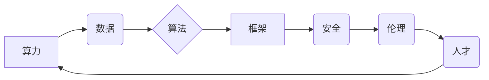

> AI 2.0, 基础设施, 算力, 数据, 算法, 框架, 安全, 伦理, 人才

## 1. 背景介绍

人工智能（AI）技术近年来发展迅速，从语音识别、图像识别到自然语言处理等领域取得了突破性进展。然而，当前的AI技术还面临着诸多挑战，例如数据孤岛、算法黑盒、安全风险等。为了推动AI技术的进一步发展，构建完善的AI 2.0基础设施至关重要。

AI 2.0是指基于新一代算力、数据、算法、框架、安全、伦理和人才的下一代人工智能技术。它将更加智能、更加安全、更加可解释、更加普惠。

## 2. 核心概念与联系

AI 2.0的基础设施由七大支柱构成：

* **算力:** 提供AI训练和推理所需的强大计算能力。
* **数据:** 为AI模型训练和优化提供高质量的数据资源。
* **算法:** 构建AI模型的核心，包括机器学习、深度学习等算法。
* **框架:** 提供AI模型开发、训练和部署的工具和平台。
* **安全:** 保护AI系统和数据免受攻击和滥用。
* **伦理:** 确保AI技术的发展和应用符合伦理道德规范。
* **人才:** 培养和吸引AI领域的专业人才。

这些支柱相互关联，共同支撑AI 2.0的发展。



## 3. 核心算法原理 & 具体操作步骤

### 3.1  算法原理概述

深度学习是AI 2.0的核心算法之一，它通过多层神经网络模拟人类大脑的学习过程，能够从海量数据中提取特征，并进行复杂的模式识别和预测。

### 3.2  算法步骤详解

1. **数据预处理:** 将原始数据清洗、转换、规范化，使其适合深度学习模型训练。
2. **网络结构设计:** 根据任务需求设计神经网络的层数、节点数、激活函数等参数。
3. **模型训练:** 使用训练数据训练神经网络，调整网络参数，使模型的预测结果与真实值尽可能接近。
4. **模型评估:** 使用测试数据评估模型的性能，例如准确率、召回率、F1-score等指标。
5. **模型调优:** 根据评估结果，调整网络结构、训练参数等，进一步提高模型性能。
6. **模型部署:** 将训练好的模型部署到实际应用场景中，用于预测和决策。

### 3.3  算法优缺点

**优点:**

* 能够从海量数据中自动提取特征，无需人工特征工程。
* 能够学习复杂非线性关系，具有较强的表达能力。
* 在图像识别、自然语言处理等领域取得了突破性进展。

**缺点:**

* 训练数据量大，计算资源消耗高。
* 模型训练过程复杂，需要专业知识和经验。
* 模型解释性差，难以理解模型的决策过程。

### 3.4  算法应用领域

深度学习算法广泛应用于以下领域：

* **计算机视觉:** 图像识别、物体检测、图像分割、人脸识别等。
* **自然语言处理:** 文本分类、情感分析、机器翻译、对话系统等。
* **语音识别:** 语音转文本、语音助手等。
* **推荐系统:** 商品推荐、内容推荐等。
* **医疗诊断:** 疾病诊断、影像分析等。

## 4. 数学模型和公式 & 详细讲解 & 举例说明

### 4.1  数学模型构建

深度学习模型通常采用多层神经网络结构，每个神经元接收多个输入信号，并通过激活函数进行处理，输出一个信号。

### 4.2  公式推导过程

神经网络的输出可以表示为：

$$
y = f(W^L x^L + b^L)
$$

其中：

* $y$ 是网络的输出
* $f$ 是激活函数
* $W^L$ 是第L层的权重矩阵
* $x^L$ 是第L层的输入
* $b^L$ 是第L层的偏置向量

### 4.3  案例分析与讲解

例如，在图像识别任务中，深度学习模型可以将图像像素作为输入，经过多层神经网络处理，最终输出图像类别。

## 5. 项目实践：代码实例和详细解释说明

### 5.1  开发环境搭建

使用Python语言和深度学习框架TensorFlow或PyTorch搭建开发环境。

### 5.2  源代码详细实现

```python
import tensorflow as tf

# 定义模型结构
model = tf.keras.models.Sequential([
    tf.keras.layers.Conv2D(32, (3, 3), activation='relu', input_shape=(28, 28, 1)),
    tf.keras.layers.MaxPooling2D((2, 2)),
    tf.keras.layers.Conv2D(64, (3, 3), activation='relu'),
    tf.keras.layers.MaxPooling2D((2, 2)),
    tf.keras.layers.Flatten(),
    tf.keras.layers.Dense(10, activation='softmax')
])

# 编译模型
model.compile(optimizer='adam',
              loss='sparse_categorical_crossentropy',
              metrics=['accuracy'])

# 训练模型
model.fit(x_train, y_train, epochs=5)

# 评估模型
loss, accuracy = model.evaluate(x_test, y_test)
print('Test loss:', loss)
print('Test accuracy:', accuracy)
```

### 5.3  代码解读与分析

这段代码定义了一个简单的卷积神经网络模型，用于手写数字识别任务。

* `tf.keras.models.Sequential` 创建一个顺序模型，层级结构清晰。
* `tf.keras.layers.Conv2D` 定义卷积层，提取图像特征。
* `tf.keras.layers.MaxPooling2D` 定义最大池化层，降低特征维度。
* `tf.keras.layers.Flatten` 将多维特征转换为一维向量。
* `tf.keras.layers.Dense` 定义全连接层，进行分类。
* `model.compile` 编译模型，指定优化器、损失函数和评价指标。
* `model.fit` 训练模型，使用训练数据进行迭代训练。
* `model.evaluate` 评估模型，使用测试数据计算损失和准确率。

### 5.4  运行结果展示

训练完成后，模型可以用于识别新的手写数字图像。

## 6. 实际应用场景

AI 2.0技术在各个领域都有广泛的应用场景：

### 6.1  医疗保健

* 疾病诊断：利用深度学习算法分析医学影像，辅助医生诊断疾病。
* 药物研发：加速药物研发过程，预测药物疗效和副作用。
* 个性化医疗：根据患者的基因信息和生活习惯，提供个性化的医疗方案。

### 6.2  金融服务

* 风险管理：识别和评估金融风险，降低损失。
* 欺诈检测：识别和预防金融欺诈行为。
* 个性化金融服务：根据客户的财务状况和需求，提供个性化的金融产品和服务。

### 6.3  制造业

* 预测性维护：预测设备故障，提前进行维护，降低停机时间。
* 工厂自动化：利用机器人和人工智能技术，提高生产效率和质量。
* 产品设计：利用AI算法辅助产品设计，优化产品性能和外观。

### 6.4  未来应用展望

AI 2.0技术将继续推动各行各业的数字化转型，带来更多创新应用。例如：

* 人工智能驱动的自动驾驶汽车
* 人工智能辅助的教育和培训
* 人工智能增强的人机交互

## 7. 工具和资源推荐

### 7.1  学习资源推荐

* **在线课程:** Coursera, edX, Udacity 等平台提供丰富的AI课程。
* **书籍:** 《深度学习》、《人工智能：一种现代方法》等经典书籍。
* **博客和论坛:** AI相关的博客和论坛，例如Towards Data Science, Reddit 等。

### 7.2  开发工具推荐

* **深度学习框架:** TensorFlow, PyTorch, Keras 等。
* **云计算平台:** AWS, Azure, Google Cloud 等。
* **数据处理工具:** Pandas, NumPy 等。

### 7.3  相关论文推荐

* **《ImageNet Classification with Deep Convolutional Neural Networks》**
* **《Attention Is All You Need》**
* **《BERT: Pre-training of Deep Bidirectional Transformers for Language Understanding》**

## 8. 总结：未来发展趋势与挑战

### 8.1  研究成果总结

AI 2.0技术取得了显著进展，在各个领域都有广泛的应用。

### 8.2  未来发展趋势

* **模型规模和能力的提升:** 训练更大规模的模型，提高模型的性能和泛化能力。
* **模型解释性和可信度的增强:** 研究更可解释的AI模型，提高模型的透明度和可信度。
* **边缘计算和联邦学习的应用:** 将AI模型部署到边缘设备，保护数据隐私，提高模型的效率。
* **跨模态学习:** 研究能够处理多种数据类型的AI模型，例如文本、图像、音频等。

### 8.3  面临的挑战

* **数据安全和隐私保护:** 确保AI模型训练和应用过程中数据的安全和隐私。
* **算法偏见和公平性:** 避免AI模型产生偏见和歧视，确保公平公正的应用。
* **伦理和社会影响:** 关注AI技术的伦理和社会影响，制定相应的规范和政策。

### 8.4  研究展望

未来，AI研究将继续探索更智能、更安全、更普惠的人工智能技术，为人类社会带来更多福祉。

## 9. 附录：常见问题与解答

**Q1: 如何选择合适的深度学习框架？**

**A1:** TensorFlow和PyTorch是目前最流行的深度学习框架，选择哪个框架取决于个人喜好和项目需求。

**Q2: 如何解决AI模型的过拟合问题？**

**A2:** 可以使用正则化技术、数据增强、Dropout等方法来解决AI模型的过拟合问题。

**Q3: 如何评估AI模型的性能？**

**A3:** 可以使用准确率、召回率、F1-score等指标来评估AI模型的性能。

**作者：禅与计算机程序设计艺术 / Zen and the Art of Computer Programming**


<end_of_turn>