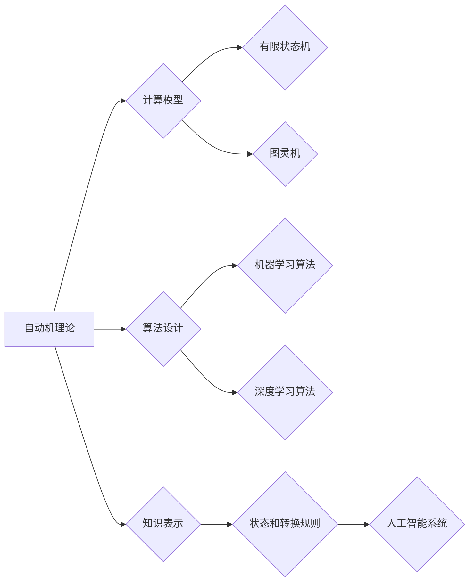

> 自动机理论，人工智能，计算模型，状态机，图灵机，学习算法，知识表示

## 1. 背景介绍

人工智能（Artificial Intelligence，AI）作为21世纪最具影响力的科技之一，正在深刻地改变着我们的生活。从智能手机的语音助手到自动驾驶汽车，AI技术的应用日益广泛。而自动机理论作为计算机科学的基础理论之一，为理解和构建人工智能提供了坚实的理论基础。

自动机理论研究的是抽象的计算模型，即自动机，以及它们能够解决的问题。这些模型可以模拟计算机的运行过程，并帮助我们理解计算的本质。人工智能则致力于构建能够像人类一样思考、学习和解决问题的智能系统。

## 2. 核心概念与联系

### 2.1 自动机理论

自动机理论研究的是抽象的计算模型，即自动机，以及它们能够解决的问题。自动机是一种具有有限状态和输入输出功能的系统，它通过接受输入信号并根据内部状态转换来产生输出信号。

常见的自动机类型包括：

* **有限状态机（Finite State Machine，FSM）：** 具有有限个状态的自动机，每个状态对应一个特定的输入输出行为。
* **图灵机（Turing Machine）：** 具有无限存储空间和无限个状态的理论模型，能够模拟任何算法。
* **推式逻辑系统（Horn Clause Logic）：** 基于逻辑推理的自动机，能够从已知知识中推导出新的结论。

### 2.2 人工智能

人工智能的目标是构建能够像人类一样思考、学习和解决问题的智能系统。人工智能的实现需要多种技术，包括：

* **机器学习（Machine Learning）：** 允许计算机从数据中学习并改进其性能的算法。
* **深度学习（Deep Learning）：** 使用多层神经网络进行学习的机器学习方法。
* **自然语言处理（Natural Language Processing，NLP）：** 允许计算机理解和处理人类语言的算法。
* **计算机视觉（Computer Vision）：** 允许计算机“看”和理解图像的算法。

### 2.3 自动机理论与人工智能的关系

自动机理论为人工智能提供了重要的理论基础。

* **计算模型：** 自动机理论提供了各种计算模型，例如有限状态机和图灵机，这些模型可以用来模拟人工智能系统的行为。
* **算法设计：** 自动机理论中的算法设计方法可以应用于人工智能算法的开发。
* **知识表示：** 自动机理论中的状态和转换规则可以用来表示人工智能系统中的知识和推理过程。

**Mermaid 流程图**



## 3. 核心算法原理 & 具体操作步骤

### 3.1 算法原理概述

在自动机理论中，许多算法可以用于解决人工智能中的问题，例如：

* **状态空间搜索算法：** 用于在状态空间中搜索最优路径，例如在游戏AI中寻找最佳策略。
* **决策树算法：** 用于构建决策树模型，用于分类和预测任务。
* **神经网络算法：** 用于构建多层神经网络模型，用于图像识别、自然语言处理等任务。

### 3.2 算法步骤详解

以状态空间搜索算法为例，其基本步骤如下：

1. **定义状态空间：** 将问题分解成一系列状态，每个状态代表问题的某个阶段。
2. **定义目标状态：** 确定问题的最终目标状态。
3. **定义动作集：** 确定在每个状态下可以执行的动作。
4. **评估状态价值：** 为每个状态赋予一个价值，表示该状态离目标状态的距离。
5. **搜索算法：** 使用搜索算法，例如广度优先搜索或深度优先搜索，在状态空间中搜索从初始状态到目标状态的路径。

### 3.3 算法优缺点

每个算法都有其优缺点，需要根据具体问题选择合适的算法。

* **状态空间搜索算法：** 优点：易于理解和实现，适用于问题规模较小的场景。缺点：在问题规模较大时，搜索空间可能过于庞大，效率低下。
* **决策树算法：** 优点：易于解释和理解，适用于分类和预测任务。缺点：容易过拟合，对数据分布变化敏感。
* **神经网络算法：** 优点：能够学习复杂模式，适用于图像识别、自然语言处理等任务。缺点：训练过程复杂，需要大量数据。

### 3.4 算法应用领域

自动机理论中的算法广泛应用于人工智能领域，例如：

* **游戏AI：** 使用状态空间搜索算法寻找最佳策略。
* **机器人控制：** 使用状态机模型控制机器人的行为。
* **自然语言处理：** 使用有限状态机模型进行词法分析和语法分析。
* **图像识别：** 使用神经网络算法识别图像中的物体。

## 4. 数学模型和公式 & 详细讲解 & 举例说明

### 4.1 数学模型构建

自动机理论中的数学模型通常使用集合论、逻辑学和图论等数学工具构建。

* **状态集合：** 表示自动机可以处于的所有状态。
* **输入字母表：** 表示自动机可以接受的输入符号。
* **转换函数：** 描述自动机在接受输入符号后状态如何变化。
* **接受状态：** 表示自动机接受输入序列的终态。

### 4.2 公式推导过程

例如，对于一个有限状态机，其转换函数可以表示为：

$$
\delta: Q \times \Sigma \rightarrow Q
$$

其中：

* $Q$ 是状态集合。
* $\Sigma$ 是输入字母表。
* $\delta(q, a)$ 表示在状态 $q$ 接受输入符号 $a$ 后进入的状态。

### 4.3 案例分析与讲解

例如，一个简单的有限状态机可以用来识别一个字符串是否以“ab”开头。

* 状态集合：$Q = \{q_0, q_1, q_2\}$
* 输入字母表：$\Sigma = \{a, b\}$
* 转换函数：

$$
\delta(q_0, a) = q_1, \delta(q_1, b) = q_2, \delta(q_0, b) = q_0, \delta(q_1, a) = q_0, \delta(q_2, a) = q_2, \delta(q_2, b) = q_2
$$

* 接受状态：$F = \{q_2\}$

当输入字符串为“abab”时，自动机会从状态 $q_0$ 开始，依次接受输入符号 “a” 和 “b”，进入状态 $q_1$ 和 $q_2$，最终到达接受状态 $q_2$，因此该字符串被识别为以“ab”开头的字符串。

## 5. 项目实践：代码实例和详细解释说明

### 5.1 开发环境搭建

本项目使用 Python 语言进行开发，需要安装以下软件：

* Python 3.x
* Jupyter Notebook

### 5.2 源代码详细实现

```python
class FiniteStateMachine:
    def __init__(self, states, alphabet, transitions, accept_states):
        self.states = states
        self.alphabet = alphabet
        self.transitions = transitions
        self.accept_states = accept_states
        self.current_state = None

    def reset(self):
        self.current_state = self.states[0]

    def step(self, input_symbol):
        next_state = self.transitions[(self.current_state, input_symbol)]
        self.current_state = next_state

    def is_accepting(self):
        return self.current_state in self.accept_states

# 创建一个识别以“ab”开头的字符串的有限状态机
states = ['q0', 'q1', 'q2']
alphabet = ['a', 'b']
transitions = {
    ('q0', 'a'): 'q1',
    ('q1', 'b'): 'q2',
    ('q0', 'b'): 'q0',
    ('q1', 'a'): 'q0',
    ('q2', 'a'): 'q2',
    ('q2', 'b'): 'q2'
}
accept_states = ['q2']

fsm = FiniteStateMachine(states, alphabet, transitions, accept_states)
fsm.reset()

# 测试
input_string = "abab"
for symbol in input_string:
    fsm.step(symbol)

print(fsm.is_accepting())  # 输出 True
```

### 5.3 代码解读与分析

代码首先定义了一个 `FiniteStateMachine` 类，用于表示有限状态机。该类包含状态集合、输入字母表、转换函数和接受状态等属性。

然后，代码创建了一个识别以“ab”开头的字符串的有限状态机实例，并测试了该状态机的识别能力。

### 5.4 运行结果展示

运行代码后，输出结果为 `True`，表明输入字符串“abab”被识别为以“ab”开头的字符串。

## 6. 实际应用场景

### 6.1 语音识别

语音识别系统可以使用有限状态机模型识别语音中的单词和句子。

### 6.2 机器人控制

机器人控制系统可以使用状态机模型控制机器人的行为，例如移动、抓取和放置物体。

### 6.3 网络安全

网络安全系统可以使用自动机理论中的模式识别算法检测网络攻击。

### 6.4 未来应用展望

随着人工智能技术的不断发展，自动机理论将在人工智能领域发挥越来越重要的作用。例如：

* **更复杂的智能系统：** 自动机理论可以用于构建更复杂的智能系统，例如能够学习和适应环境变化的智能机器人。
* **个性化服务：** 自动机理论可以用于构建个性化服务系统，例如能够根据用户的喜好推荐商品的电商平台。
* **自动驾驶汽车：** 自动机理论可以用于构建自动驾驶汽车的控制系统，使其能够安全地行驶在道路上。

## 7. 工具和资源推荐

### 7.1 学习资源推荐

* **书籍：**
    * 《自动机理论》
    * 《计算机科学导论》
* **在线课程：**
    * Coursera 上的《自动机理论》课程
    * edX 上的《计算机科学基础》课程

### 7.2 开发工具推荐

* **Python：** 广泛用于人工智能开发的编程语言。
* **Jupyter Notebook：** 用于编写和运行 Python 代码的交互式笔记本环境。
* **TensorFlow：** 用于深度学习开发的开源框架。

### 7.3 相关论文推荐

* **Turing Machine and Computability:** Alan Turing, 1936
* **Finite Automata and Formal Languages:** John Hopcroft, Rajeev Motwani, Jeffrey Ullman, 2001

## 8. 总结：未来发展趋势与挑战

### 8.1 研究成果总结

自动机理论为人工智能提供了重要的理论基础，并推动了人工智能技术的进步。

### 8.2 未来发展趋势

未来，自动机理论将在人工智能领域继续发挥重要作用，例如：

* **更强大的计算模型：** 研究更强大的计算模型，例如量子自动机，以解决更复杂的问题。
* **更智能的算法：** 开发更智能的算法，例如能够学习和适应环境变化的算法。
* **更广泛的应用场景：** 将自动机理论应用于更广泛的领域，例如医疗保健、金融和教育。

### 8.3 面临的挑战

自动机理论的发展也面临着一些挑战，例如：

* **复杂性：** 随着人工智能系统的复杂性增加，自动机理论的应用也变得更加复杂。
* **可解释性：** 许多人工智能算法难以解释，这使得它们难以被公众接受。
* **伦理问题：** 自动机理论的应用可能引发一些伦理问题，例如人工智能的失控和隐私泄露。

