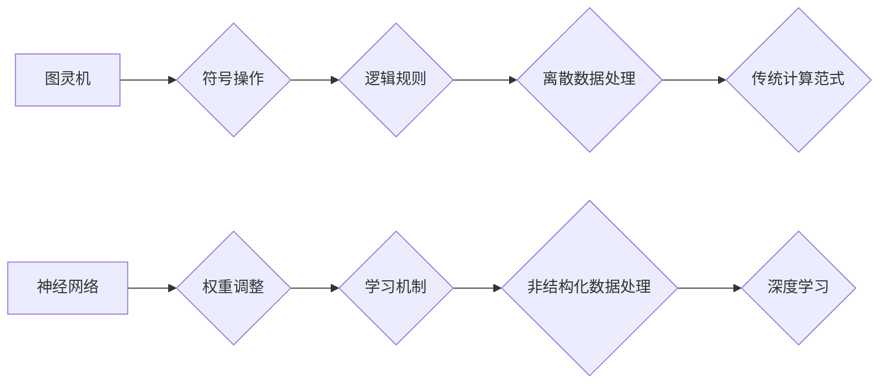

> 图灵机，神经网络，计算范式，深度学习，机器学习，人工智能，算法，模型

## 1. 背景介绍

自20世纪中叶以来，计算机科学经历了飞速发展，计算范式也经历了深刻的变革。从最初的图灵机模型到如今的深度学习，我们不断探索更强大、更灵活的计算方式。

图灵机作为计算机科学的基石，奠定了通用计算的理论基础。它以有限的符号和规则，模拟了人类的逻辑思维过程，为现代计算机的诞生提供了理论支撑。然而，图灵机的计算能力受限于其固定的规则和离散的符号表示，难以处理复杂、非结构化的数据，例如图像、语音和文本。

随着人工智能的兴起，对处理复杂数据的需求日益增长。深度学习作为人工智能的重要分支，利用多层神经网络结构，模拟了人类大脑的学习机制，取得了令人瞩目的成果。从图像识别、语音识别到自然语言处理，深度学习在各个领域展现出强大的应用潜力。

## 2. 核心概念与联系

### 2.1 图灵机

图灵机是一种抽象的计算模型，由以下几个基本要素组成：

* **无限长的带**: 用于存储数据，带上的每个位置可以存储一个符号。
* **读写头**: 可以读取和写入带上的符号。
* **状态机**: 控制读写头的动作，根据当前状态和读取的符号，决定下一步的动作。

图灵机的计算过程是通过状态机的状态转移和读写头的动作来实现的。每个状态机状态对应一个特定的计算规则，规则决定了读写头在带上的移动方向和符号的写入操作。

### 2.2 神经网络

神经网络是一种模仿人类大脑结构和功能的计算模型。它由大量相互连接的神经元组成，每个神经元接收来自其他神经元的输入信号，并根据一定的权重进行处理，最终输出一个信号。

神经网络的学习过程是通过调整神经元之间的权重来实现的。通过训练数据，神经网络可以学习到输入和输出之间的映射关系，从而实现对复杂数据的处理和预测。

### 2.3 计算范式

计算范式是指一种特定的计算方法和模型，它决定了计算机如何处理数据和执行任务。

图灵机代表了传统的计算范式，它基于符号操作和逻辑规则，处理数据的方式是离散的和结构化的。而深度学习则代表了新的计算范式，它基于神经网络的结构和学习机制，能够处理复杂、非结构化的数据。

**Mermaid 流程图**



## 3. 核心算法原理 & 具体操作步骤

### 3.1 算法原理概述

深度学习的核心算法是反向传播算法，它用于训练神经网络，调整神经元之间的权重。反向传播算法的基本思想是：

1. 将输入数据输入到神经网络中，计算输出结果。
2. 计算输出结果与真实值的误差。
3. 根据误差反向传播，调整神经元之间的权重，使得误差最小化。

### 3.2 算法步骤详解

1. **初始化权重**: 将神经网络中的权重随机初始化。
2. **前向传播**: 将输入数据输入到神经网络中，逐层计算，最终得到输出结果。
3. **计算损失**: 计算输出结果与真实值的误差，称为损失函数。
4. **反向传播**: 根据损失函数的梯度，反向传播误差，计算每个神经元的权重梯度。
5. **更新权重**: 使用梯度下降算法，更新神经元之间的权重，使得损失函数最小化。
6. **重复步骤2-5**: 重复上述步骤，直到损失函数收敛。

### 3.3 算法优缺点

**优点**:

* 能够处理复杂、非结构化的数据。
* 学习能力强，能够自动提取特征。
* 应用范围广泛，在图像识别、语音识别、自然语言处理等领域取得了突破性进展。

**缺点**:

* 训练时间长，需要大量的计算资源。
* 训练数据量大，对数据质量要求高。
* 模型解释性差，难以理解模型的决策过程。

### 3.4 算法应用领域

深度学习算法广泛应用于以下领域：

* **图像识别**: 人脸识别、物体检测、图像分类。
* **语音识别**: 语音转文本、语音助手。
* **自然语言处理**: 机器翻译、文本摘要、情感分析。
* **推荐系统**: 商品推荐、内容推荐。
* **医疗诊断**: 疾病诊断、影像分析。

## 4. 数学模型和公式 & 详细讲解 & 举例说明

### 4.1 数学模型构建

深度学习模型通常由多层神经网络组成，每层神经元之间通过权重连接。每个神经元接收来自前一层神经元的输入信号，并通过激活函数进行处理，输出到下一层神经元。

**神经元模型**:

$$
y = f(w^T x + b)
$$

其中：

* $y$ 是神经元的输出值。
* $f$ 是激活函数。
* $w$ 是权重向量。
* $x$ 是输入向量。
* $b$ 是偏置项。

### 4.2 公式推导过程

反向传播算法的核心是计算损失函数对每个权重的梯度。损失函数通常是输出结果与真实值的平方差，称为均方误差。

**均方误差**:

$$
L = \frac{1}{2} \sum_{i=1}^{n} (y_i - t_i)^2
$$

其中：

* $L$ 是损失函数。
* $y_i$ 是预测值。
* $t_i$ 是真实值。
* $n$ 是样本数量。

通过链式法则，可以计算损失函数对每个权重的梯度。

### 4.3 案例分析与讲解

假设我们有一个简单的神经网络，用于预测房价。输入特征包括房屋面积、房间数量和地理位置。输出是房价。

我们可以使用反向传播算法训练这个神经网络，调整权重，使得预测的房价与真实房价的误差最小化。

## 5. 项目实践：代码实例和详细解释说明

### 5.1 开发环境搭建

* Python 3.x
* TensorFlow 或 PyTorch

### 5.2 源代码详细实现

```python
import tensorflow as tf

# 定义模型
model = tf.keras.models.Sequential([
    tf.keras.layers.Dense(64, activation='relu', input_shape=(3,)),
    tf.keras.layers.Dense(1)
])

# 编译模型
model.compile(optimizer='adam', loss='mse')

# 训练模型
model.fit(X_train, y_train, epochs=10)

# 评估模型
loss = model.evaluate(X_test, y_test)
```

### 5.3 代码解读与分析

* `tf.keras.models.Sequential`: 创建一个顺序模型，神经层按顺序连接。
* `tf.keras.layers.Dense`: 定义一个全连接层，每个神经元连接到上一层所有神经元。
* `activation='relu'`: 使用ReLU激活函数。
* `input_shape=(3,)`: 输入特征维度为3。
* `optimizer='adam'`: 使用Adam优化器。
* `loss='mse'`: 使用均方误差作为损失函数。
* `model.fit`: 训练模型。
* `model.evaluate`: 评估模型。

### 5.4 运行结果展示

训练完成后，我们可以使用测试数据评估模型的性能，例如计算预测房价与真实房价的均方误差。

## 6. 实际应用场景

深度学习在各个领域都有广泛的应用场景，例如：

* **图像识别**: 自动驾驶汽车、人脸识别、医学影像分析。
* **语音识别**: 语音助手、语音转文本、听力障碍者辅助设备。
* **自然语言处理**: 机器翻译、文本摘要、聊天机器人。
* **推荐系统**: 商品推荐、内容推荐、个性化服务。

### 6.4 未来应用展望

随着深度学习技术的不断发展，未来将有更多新的应用场景出现，例如：

* **个性化医疗**: 基于患者基因和病史，提供个性化的医疗方案。
* **智能制造**: 自动化生产线，提高生产效率和产品质量。
* **科学研究**: 加速科学发现，解决复杂科学问题。

## 7. 工具和资源推荐

### 7.1 学习资源推荐

* **书籍**:
    * 深度学习
    * 构建深度学习模型
* **在线课程**:
    * Coursera 深度学习课程
    * Udacity 深度学习工程师 Nanodegree
* **博客**:
    * 深度学习博客
    * 机器学习博客

### 7.2 开发工具推荐

* **TensorFlow**: 开源深度学习框架。
* **PyTorch**: 开源深度学习框架。
* **Keras**: 高级深度学习API，可以用于TensorFlow和Theano。

### 7.3 相关论文推荐

* **ImageNet Classification with Deep Convolutional Neural Networks**
* **Deep Learning**
* **Attention Is All You Need**

## 8. 总结：未来发展趋势与挑战

### 8.1 研究成果总结

深度学习取得了令人瞩目的成果，在图像识别、语音识别、自然语言处理等领域取得了突破性进展。

### 8.2 未来发展趋势

* **模型规模**: 模型规模将继续扩大，训练更复杂、更强大的模型。
* **算法创新**: 新的深度学习算法将不断涌现，提高模型的效率和性能。
* **硬件加速**: 特化的硬件将加速深度学习模型的训练和推理。
* **跨模态学习**: 深度学习模型将能够处理多种模态数据，例如图像、文本和语音。

### 8.3 面临的挑战

* **数据隐私**: 深度学习模型需要大量的训练数据，如何保护数据隐私是一个重要挑战。
* **模型解释性**: 深度学习模型的决策过程难以解释，如何提高模型的透明度是一个重要问题。
* **可解释性**: 如何解释深度学习模型的决策过程，使其更易于理解和信任。
* **公平性**: 深度学习模型可能存在偏见，如何确保模型的公平性和公正性是一个重要挑战。

### 8.4 研究展望

未来，深度学习将继续发展，在更多领域发挥重要作用。我们需要不断探索新的算法、模型和应用场景，同时也要关注深度学习带来的伦理和社会问题，确保深度学习技术能够造福人类。

## 9. 附录：常见问题与解答

**Q1: 深度学习和机器学习有什么区别？**

**A1:** 机器学习是深度学习的父概念，深度学习是机器学习的一种特殊形式。深度学习使用多层神经网络，而机器学习可以使用各种算法，例如决策树、支持向量机等。

**Q2: 如何选择合适的深度学习框架？**

**A2:** TensorFlow和PyTorch是两个最流行的深度学习框架。TensorFlow更适合于生产环境，PyTorch更适合于研究和开发。

**Q3: 如何评估深度学习模型的性能？**

**A3:** 常见的评估指标包括准确率、召回率、F1-score等。选择合适的评估指标取决于具体的应用场景。


作者：禅与计算机程序设计艺术 / Zen and the Art of Computer Programming 
<end_of_turn>