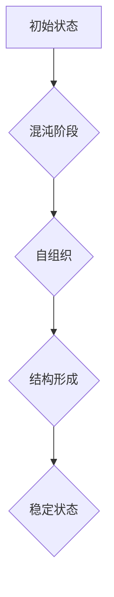

> 认知发展、混沌理论、复杂系统、人工智能、神经网络、学习算法、自组织

## 1. 背景介绍

人类的认知发展是一个复杂而迷人的过程，从婴儿时期无知无觉到成年后拥有丰富的知识和经验，这个过程充满了挑战和机遇。近年来，混沌理论和复杂系统理论为我们理解认知发展提供了新的视角。这些理论揭示了复杂系统中自组织、非线性性和反馈机制等关键特征，为解释认知发展中的突变、涌现和适应性提供了理论基础。

## 2. 核心概念与联系

**2.1 混沌理论**

混沌理论研究的是看似随机的复杂系统，其行为受初始条件和反馈机制的强烈影响。即使微小的初始差异也会导致系统演化轨迹的巨大差异，这种现象被称为“蝴蝶效应”。混沌系统具有以下特征：

* **非线性性:** 系统的输出与输入之间存在非线性的关系，微小的输入变化可能导致巨大的输出变化。
* **反馈机制:** 系统的输出会反馈到输入中，影响系统的未来状态。
* **自组织:** 复杂系统能够自发地组织成具有特定结构和功能的模式。

**2.2 复杂系统理论**

复杂系统理论研究的是由许多相互作用的个体组成的系统，这些个体之间存在着复杂的相互作用关系。复杂系统具有以下特征：

* **分层结构:** 复杂系统通常具有多层次的结构，每个层次都有其独特的特性和功能。
* **自适应性:** 复杂系统能够根据环境变化进行调整和适应。
* **涌现现象:** 复杂系统中会涌现出一些新的、不可预测的现象，这些现象是由个体相互作用的结果。

**2.3 认知发展与混沌复杂理论**

认知发展可以看作是一个复杂系统，大脑中的神经元是系统中的个体，它们之间通过复杂的连接和信号传递进行相互作用。混沌理论和复杂系统理论可以帮助我们理解认知发展中的以下几个方面：

* **认知突变:** 认知发展并非线性连续的，而是会经历一些突变性的发展阶段。混沌理论可以解释这种突变性，因为微小的变化可能导致系统状态的剧烈变化。
* **知识的涌现:** 复杂系统中会涌现出一些新的、不可预测的现象，这与认知发展中的知识积累和创新能力相一致。
* **学习和适应:** 复杂系统能够根据环境变化进行调整和适应，这与人类学习和适应新知识的能力相一致。

**2.4 Mermaid 流程图**



## 3. 核心算法原理 & 具体操作步骤

**3.1 算法原理概述**

在认知发展中，混沌理论和复杂系统理论启发了多种算法，例如神经网络、遗传算法和粒子群算法。这些算法模拟了复杂系统的自组织、学习和适应能力，被广泛应用于人工智能、机器学习和数据分析等领域。

**3.2 算法步骤详解**

以神经网络为例，其核心算法原理是通过调整神经元之间的连接权重来学习数据模式。具体步骤如下：

1. **数据预处理:** 将原始数据转换为神经网络可以理解的格式。
2. **网络结构设计:** 根据任务需求设计神经网络的层数、神经元数量和连接方式。
3. **权重初始化:** 为神经网络中的连接权重赋予初始值。
4. **前向传播:** 将输入数据通过神经网络传递，计算输出结果。
5. **误差计算:** 将输出结果与真实值进行比较，计算误差。
6. **反向传播:** 将误差信号反向传播到神经网络各层，调整连接权重。
7. **迭代训练:** 重复步骤4-6，直到误差达到预设阈值。

**3.3 算法优缺点**

* **优点:** 神经网络能够学习复杂的数据模式，具有强大的泛化能力。
* **缺点:** 神经网络训练过程复杂，需要大量数据和计算资源。

**3.4 算法应用领域**

神经网络被广泛应用于图像识别、自然语言处理、语音识别、机器翻译等领域。

## 4. 数学模型和公式 & 详细讲解 & 举例说明

**4.1 数学模型构建**

神经网络可以看作是一个复杂的数学模型，其核心是激活函数和权重矩阵。激活函数决定了神经元的输出，权重矩阵控制着神经元之间的连接强度。

**4.2 公式推导过程**

神经网络的输出可以表示为：

$$
y = f(W x + b)
$$

其中：

* $y$ 是神经网络的输出
* $f$ 是激活函数
* $W$ 是权重矩阵
* $x$ 是输入向量
* $b$ 是偏置项

**4.3 案例分析与讲解**

假设我们有一个简单的感知器，其输入为两个特征，输出为一个类别。感知器的激活函数为阶跃函数，权重矩阵为：

$$
W = \begin{bmatrix}
0.5 & 0.3
\end{bmatrix}
$$

偏置项为：

$$
b = -0.2
$$

当输入向量为 $x = \begin{bmatrix} 1 & 2 \end{bmatrix}$ 时，感知器的输出为：

$$
y = f(W x + b) = f(0.5 \cdot 1 + 0.3 \cdot 2 - 0.2) = f(0.8) = 1
$$

## 5. 项目实践：代码实例和详细解释说明

**5.1 开发环境搭建**

可以使用Python语言和TensorFlow或PyTorch深度学习框架进行神经网络的开发。

**5.2 源代码详细实现**

```python
import tensorflow as tf

# 定义神经网络模型
model = tf.keras.models.Sequential([
    tf.keras.layers.Dense(128, activation='relu', input_shape=(784,)),
    tf.keras.layers.Dense(10, activation='softmax')
])

# 编译模型
model.compile(optimizer='adam',
              loss='sparse_categorical_crossentropy',
              metrics=['accuracy'])

# 训练模型
model.fit(x_train, y_train, epochs=10)

# 评估模型
loss, accuracy = model.evaluate(x_test, y_test)
print('Test loss:', loss)
print('Test accuracy:', accuracy)
```

**5.3 代码解读与分析**

这段代码定义了一个简单的多层感知器，包含两个全连接层。第一层有128个神经元，使用ReLU激活函数。第二层有10个神经元，使用softmax激活函数，用于分类任务。模型使用Adam优化器，损失函数为稀疏类别交叉熵，评估指标为准确率。

**5.4 运行结果展示**

训练完成后，模型会输出测试集上的损失值和准确率。

## 6. 实际应用场景

**6.1 认知科学研究**

混沌理论和复杂系统理论为认知科学研究提供了新的视角，可以帮助我们理解记忆、学习、决策和语言等认知过程。

**6.2 人工智能开发**

神经网络等算法被广泛应用于人工智能开发，例如图像识别、自然语言处理和机器人控制。

**6.3 其他领域应用**

混沌理论和复杂系统理论也应用于其他领域，例如金融市场预测、气候变化模拟和社会网络分析。

**6.4 未来应用展望**

随着人工智能和计算能力的不断发展，混沌理论和复杂系统理论在认知科学、人工智能和其他领域的应用将更加广泛。

## 7. 工具和资源推荐

**7.1 学习资源推荐**

* **书籍:**
    * 《混沌：从蝴蝶效应到宇宙秩序》
    * 《复杂系统：从理论到应用》
    * 《深度学习》
* **在线课程:**
    * Coursera: 复杂系统
    * edX: 深度学习

**7.2 开发工具推荐**

* **Python:** 
* **TensorFlow:** 
* **PyTorch:** 

**7.3 相关论文推荐**

* **The Strange Attractor of Cognition**
* **Complexity and Cognition**
* **Artificial Neural Networks: A Comprehensive Foundation**

## 8. 总结：未来发展趋势与挑战

**8.1 研究成果总结**

混沌理论和复杂系统理论为我们理解认知发展提供了新的视角，并启发了多种算法的开发。这些算法在人工智能、机器学习和数据分析等领域取得了显著成果。

**8.2 未来发展趋势**

未来，混沌理论和复杂系统理论的研究将更加深入，并与其他学科交叉融合，例如生物学、心理学和社会学。

**8.3 面临的挑战**

* 复杂系统的建模和分析仍然是一个挑战。
* 缺乏对认知发展中混沌现象的深入理解。
* 需要开发更加高效和鲁棒的算法。

**8.4 研究展望**

未来研究将重点关注以下几个方面：

* 构建更加精确的认知发展模型。
* 探索混沌现象在认知发展中的具体机制。
* 开发更加智能和适应性的人工智能系统。

## 9. 附录：常见问题与解答

**9.1 问题:** 混沌理论和复杂系统理论与传统认知心理学有什么区别？

**9.2 答案:** 传统认知心理学主要关注认知过程的结构和功能，而混沌理论和复杂系统理论则关注认知过程的动态性和非线性性。

**9.3 问题:** 神经网络是如何模拟复杂系统的自组织能力的？

**9.4 答案:** 神经网络的权重调整过程类似于复杂系统中的自组织过程，通过反馈机制和迭代学习，神经网络能够自发地形成能够处理特定任务的结构。


作者：禅与计算机程序设计艺术 / Zen and the Art of Computer Programming 
<end_of_turn>