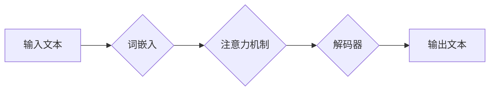

> 大语言模型，认知障碍，语言理解，思维模拟，人工智能，深度学习，自然语言处理

## 1. 背景介绍

近年来，大语言模型（LLM）的蓬勃发展，标志着人工智能领域迈向新的里程碑。这些模型，例如GPT-3、LaMDA和BERT，展现出惊人的文本生成、翻译、摘要和问答能力，甚至能够创作诗歌、剧本和代码。然而，尽管LLM在模拟人类语言方面取得了显著成就，它们是否真正理解语言，是否具备人类的思维能力，仍然是一个备受争议的话题。

本篇文章将探讨语言与思维的本质差异，分析LLM在理解和生成语言方面的局限性，揭示其潜在的认知障碍。

## 2. 核心概念与联系

**2.1 语言与思维的本质区别**

语言是人类交流和表达思想的工具，而思维则是人类认知世界、解决问题和创造的内在过程。两者之间存在着密切的联系，但并非完全等同。

* **语言是符号系统：** 语言由一系列符号组成，这些符号代表着特定的概念、对象或动作。通过组合这些符号，我们可以构建复杂的句子，表达复杂的思想。
* **思维是抽象概念：** 思维涉及到对概念、关系和模式的理解和推理。它超越了语言的符号限制，能够处理抽象、模糊和多义性的信息。

**2.2 LLM的运作机制**

LLM基于深度学习算法，通过训练海量文本数据，学习语言的统计规律和语义关系。它们能够预测下一个词的出现概率，从而生成流畅的文本。

**2.3 LLM的局限性**

尽管LLM在语言处理方面表现出色，但它们仍然存在着一些关键的局限性：

* **缺乏真正的理解：** LLM仅仅是学习了语言的表面结构和统计规律，并没有真正理解语言背后的含义和语义。
* **难以处理抽象概念：** LLM难以处理抽象、模糊和多义性的信息，例如道德、美学和情感等。
* **缺乏世界知识：** LLM的知识主要来自于训练数据，缺乏对现实世界的丰富经验和理解。

**Mermaid 流程图**



## 3. 核心算法原理 & 具体操作步骤

### 3.1  算法原理概述

LLM的核心算法是基于Transformer架构的深度神经网络。Transformer模型利用注意力机制，能够捕捉文本中长距离依赖关系，从而实现更准确的语言理解和生成。

### 3.2  算法步骤详解

1. **词嵌入:** 将输入文本中的每个词转换为向量表示，每个向量代表词的语义信息。
2. **编码器:** 利用多层Transformer编码器，将词向量序列编码成更高级的语义表示。
3. **注意力机制:** 在编码器中，注意力机制能够学习到文本中不同词之间的重要关系，并赋予它们不同的权重。
4. **解码器:** 利用多层Transformer解码器，根据编码后的语义表示生成目标文本。
5. **输出层:** 将解码器的输出转换为概率分布，预测下一个词的出现概率。

### 3.3  算法优缺点

**优点:**

* 能够捕捉长距离依赖关系，提高语言理解和生成能力。
* 训练效率高，能够处理海量文本数据。

**缺点:**

* 计算量大，需要强大的计算资源。
* 训练数据对模型性能影响很大，需要大量高质量的文本数据。

### 3.4  算法应用领域

* **自然语言处理:** 文本分类、情感分析、机器翻译、问答系统等。
* **人工智能:** 聊天机器人、虚拟助手、文本生成等。
* **其他领域:** 代码生成、药物研发、科学研究等。

## 4. 数学模型和公式 & 详细讲解 & 举例说明

### 4.1  数学模型构建

LLM的数学模型主要基于概率论和统计学。

* **词嵌入:** 使用词向量模型，例如Word2Vec或GloVe，将每个词映射到一个低维向量空间。

* **注意力机制:** 使用注意力机制计算每个词对其他词的权重，从而捕捉文本中长距离依赖关系。

* **解码器:** 使用循环神经网络或Transformer解码器，根据编码后的语义表示生成目标文本。

### 4.2  公式推导过程

**注意力机制公式:**

$$
\text{Attention}(Q, K, V) = \text{softmax}\left(\frac{Q K^T}{\sqrt{d_k}}\right) V
$$

其中:

* $Q$：查询矩阵
* $K$：键矩阵
* $V$：值矩阵
* $d_k$：键向量的维度

**解码器公式:**

$$
p(w_t | w_{<t}) = \text{softmax}(W_d h_t + b_d)
$$

其中:

* $w_t$：目标文本中的第t个词
* $w_{<t}$：目标文本中的前t个词
* $h_t$：编码器输出的隐藏状态
* $W_d$：解码器权重矩阵
* $b_d$：解码器偏置项

### 4.3  案例分析与讲解

**案例:**

假设我们输入文本“The cat sat on the mat”，LLM需要预测下一个词。

**分析:**

* 注意力机制会计算每个词对其他词的权重，例如“cat”与“sat”之间的关系更强。
* 解码器会根据编码后的语义表示和注意力权重，预测下一个词的出现概率。

**结果:**

LLM可能会预测下一个词为“the”，因为在语境中，“the”是常见的冠词，可以修饰后续的词。

## 5. 项目实践：代码实例和详细解释说明

### 5.1  开发环境搭建

* Python 3.7+
* TensorFlow 或 PyTorch
* CUDA 和 cuDNN (可选)

### 5.2  源代码详细实现

```python
# 使用 TensorFlow 实现简单的 Transformer 模型

import tensorflow as tf

# 定义词嵌入层
embedding_layer = tf.keras.layers.Embedding(vocab_size, embedding_dim)

# 定义编码器层
encoder_layer = tf.keras.layers.TransformerEncoderLayer(num_heads=8, d_model=512)
encoder = tf.keras.layers.TransformerEncoder(encoder_layer, num_layers=6)

# 定义解码器层
decoder_layer = tf.keras.layers.TransformerDecoderLayer(num_heads=8, d_model=512)
decoder = tf.keras.layers.TransformerDecoder(decoder_layer, num_layers=6)

# 定义模型
model = tf.keras.Model(inputs=inputs, outputs=decoder(encoder(inputs)))

# 编译模型
model.compile(optimizer='adam', loss='sparse_categorical_crossentropy', metrics=['accuracy'])

# 训练模型
model.fit(train_data, train_labels, epochs=10)
```

### 5.3  代码解读与分析

* 词嵌入层将每个词映射到一个低维向量空间。
* 编码器层利用Transformer架构，捕捉文本中长距离依赖关系。
* 解码器层根据编码后的语义表示，生成目标文本。
* 模型使用Adam优化器，交叉熵损失函数和准确率作为评估指标。

### 5.4  运行结果展示

训练完成后，模型可以用于文本生成、翻译、摘要等任务。

## 6. 实际应用场景

### 6.1  聊天机器人

LLM可以用于构建更智能的聊天机器人，能够理解用户的意图，并提供更自然、更流畅的对话体验。

### 6.2  虚拟助手

LLM可以用于开发虚拟助手，例如Siri和Alexa，能够帮助用户完成各种任务，例如设置提醒、播放音乐和查询信息。

### 6.3  文本生成

LLM可以用于生成各种类型的文本，例如文章、故事、诗歌和代码。

### 6.4  未来应用展望

LLM在未来将有更广泛的应用场景，例如：

* **个性化教育:** 根据学生的学习进度和需求，提供个性化的学习内容和辅导。
* **医疗诊断:** 辅助医生进行疾病诊断，提高诊断准确率。
* **科学研究:** 帮助科学家进行数据分析和模型构建，加速科学发现。

## 7. 工具和资源推荐

### 7.1  学习资源推荐

* **书籍:**
    * 《深度学习》
    * 《自然语言处理》
* **在线课程:**
    * Coursera: 自然语言处理
    * edX: 深度学习

### 7.2  开发工具推荐

* **TensorFlow:** 开源深度学习框架
* **PyTorch:** 开源深度学习框架
* **Hugging Face:** 提供预训练的LLM模型和工具

### 7.3  相关论文推荐

* 《Attention Is All You Need》
* 《BERT: Pre-training of Deep Bidirectional Transformers for Language Understanding》
* 《GPT-3: Language Models are Few-Shot Learners》

## 8. 总结：未来发展趋势与挑战

### 8.1  研究成果总结

LLM在语言理解和生成方面取得了显著的进展，为人工智能的发展做出了重要贡献。

### 8.2  未来发展趋势

* **模型规模和能力的提升:** 未来LLM模型规模将进一步扩大，能力将更加强大。
* **多模态理解:** LLM将与其他模态数据，例如图像和音频，进行融合，实现多模态理解。
* **可解释性和安全性:** 研究将更加注重LLM的解释性和安全性，使其更加透明和可控。

### 8.3  面临的挑战

* **数据获取和标注:** 训练高质量的LLM模型需要海量数据，数据获取和标注仍然是一个挑战。
* **计算资源:** 训练大型LLM模型需要大量的计算资源，成本较高。
* **伦理和社会影响:** LLM的应用可能带来一些伦理和社会问题，需要谨慎考虑。

### 8.4  研究展望

未来LLM研究将更加注重以下方面:

* **理解和模拟人类思维:** 研究如何使LLM能够更好地理解和模拟人类思维，从而实现更智能的交互和决策。
* **赋予LLM知识和常识:** 研究如何将知识和常识融入LLM模型，使其能够更好地理解和应对现实世界的问题。
* **开发可解释和可控的LLM:** 研究如何使LLM更加透明和可控，使其能够更好地服务于人类社会。

## 9. 附录：常见问题与解答

**常见问题:**

* **LLM是否真的理解语言？**

LLM能够模拟人类语言的生成和理解，但它们是否真正理解语言仍然是一个开放性问题。

* **LLM的训练数据会影响其输出结果吗？**

是的，LLM的训练数据会对其输出结果产生很大的影响。如果训练数据存在偏差，LLM的输出结果也可能存在偏差。

* **LLM的应用有哪些伦理和社会问题？**

LLM的应用可能带来一些伦理和社会问题，例如信息操纵、隐私泄露和就业替代等。

**解答:**

* 这个问题目前还没有确切的答案，需要进一步的研究和探讨。
* 为了避免训练数据带来的偏差，需要使用高质量、多样化的训练数据，并对模型进行评估和调优。
* 针对LLM的伦理和社会问题，需要制定相应的规范和政策，并加强公众的监督和参与。


作者：禅与计算机程序设计艺术 / Zen and the Art of Computer Programming 
<end_of_turn>