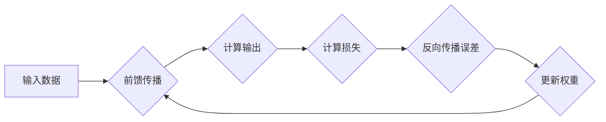

> 误差逆传播，反向传播，神经网络，深度学习，梯度下降，优化算法，机器学习

## 1. 背景介绍

深度学习的蓬勃发展离不开一个关键算法：误差逆传播 (Backpropagation)。它为训练复杂的神经网络提供了高效的途径，推动了人工智能领域的飞速进步。

传统的机器学习算法通常依赖于特征工程，需要人工提取特征才能进行训练。而深度学习则能够自动学习特征，无需人工干预。神经网络作为深度学习的核心模型，由多个层级的神经元组成，每个神经元接收来自上一层的输入，并通过权重进行计算，最终输出结果。

然而，神经网络的训练过程并非易事。网络参数的调整需要根据输入数据和输出结果的误差进行优化。误差逆传播算法正是解决这一问题的关键。它通过反向传播误差信号，逐层调整神经网络的权重，最终使网络的输出与真实值尽可能接近。

## 2. 核心概念与联系

误差逆传播算法的核心概念是梯度下降法。梯度下降法是一种迭代优化算法，通过不断调整参数，使目标函数的值最小化。

在误差逆传播算法中，目标函数是网络的损失函数，它衡量网络输出与真实值的差异。梯度下降法通过计算损失函数对每个参数的梯度，并根据梯度方向调整参数值，从而逐步降低损失函数的值。

**误差逆传播算法流程图:**



## 3. 核心算法原理 & 具体操作步骤

### 3.1  算法原理概述

误差逆传播算法的基本原理是：

1. **前馈传播:** 将输入数据通过神经网络逐层传递，计算最终输出。
2. **误差计算:** 计算输出与真实值的误差。
3. **反向传播:** 将误差信号反向传播到网络的每一层，计算每个参数的梯度。
4. **权重更新:** 根据梯度值，更新每个参数的值，从而降低损失函数的值。

### 3.2  算法步骤详解

1. **初始化:** 随机初始化神经网络的权重和偏置。
2. **前馈传播:** 将输入数据输入到神经网络的第一层，逐层计算输出，直到得到最终输出。
3. **损失函数计算:** 计算最终输出与真实值的误差，使用损失函数衡量误差的大小。
4. **反向传播:** 从输出层开始，反向传播误差信号到网络的每一层。
5. **梯度计算:** 计算每个参数的梯度，即损失函数对该参数的偏导数。
6. **权重更新:** 使用梯度下降法更新每个参数的值，减小损失函数的值。
7. **重复步骤2-6:** 重复上述步骤，直到损失函数收敛到一个足够小的值。

### 3.3  算法优缺点

**优点:**

* **高效:** 误差逆传播算法能够有效地训练深层神经网络。
* **通用:** 它可以应用于各种类型的机器学习任务，例如图像识别、自然语言处理等。
* **可解释性:** 误差逆传播算法的原理相对简单，易于理解和解释。

**缺点:**

* **梯度消失/爆炸问题:** 在训练深层神经网络时，梯度可能会消失或爆炸，导致训练不稳定。
* **局部最优解:** 梯度下降法可能会陷入局部最优解，导致无法找到全局最优解。
* **计算量大:** 误差逆传播算法的计算量较大，需要大量的计算资源。

### 3.4  算法应用领域

误差逆传播算法广泛应用于以下领域:

* **图像识别:** 用于识别图像中的物体、场景和人脸。
* **自然语言处理:** 用于机器翻译、文本摘要、情感分析等任务。
* **语音识别:** 用于将语音转换为文本。
* **推荐系统:** 用于推荐用户感兴趣的内容。
* **药物发现:** 用于预测药物的活性。

## 4. 数学模型和公式 & 详细讲解 & 举例说明

### 4.1  数学模型构建

误差逆传播算法的核心是梯度下降法，其目标是找到使损失函数最小化的参数值。损失函数通常定义为预测值与真实值的均方差。

假设神经网络有 L 层，第 l 层有 n_l 个神经元，每个神经元接收来自上一层的输入，并通过权重进行计算，最终输出一个激活值。

**损失函数:**

$$
L = \frac{1}{2} \sum_{i=1}^{N} (y_i - \hat{y}_i)^2
$$

其中：

* $L$ 是损失函数
* $N$ 是样本数量
* $y_i$ 是第 i 个样本的真实值
* $\hat{y}_i$ 是第 i 个样本的预测值

**参数:**

* $W_{ij}^{l}$ 是第 l 层第 i 个神经元与第 j 个神经元之间的权重
* $b_i^l$ 是第 l 层第 i 个神经元的偏置

### 4.2  公式推导过程

误差逆传播算法通过反向传播误差信号，计算每个参数的梯度，并根据梯度值更新参数值。

**梯度计算:**

$$
\frac{\partial L}{\partial W_{ij}^{l}} = \frac{\partial L}{\partial a_i^l} \cdot \frac{\partial a_i^l}{\partial W_{ij}^{l}}
$$

其中：

* $a_i^l$ 是第 l 层第 i 个神经元的激活值

**权重更新:**

$$
W_{ij}^{l} = W_{ij}^{l} - \eta \cdot \frac{\partial L}{\partial W_{ij}^{l}}
$$

其中：

* $\eta$ 是学习率

### 4.3  案例分析与讲解

假设我们有一个简单的两层神经网络，用于分类手写数字。

* 输入层：784 个神经元，对应图像的像素值。
* 输出层：10 个神经元，对应 10 个数字类别。

我们使用误差逆传播算法训练这个神经网络，目标是使网络能够准确地识别手写数字。

在训练过程中，我们首先将手写数字图像作为输入，网络会输出一个概率分布，表示每个数字类别的概率。然后，我们计算输出与真实值的误差，并反向传播误差信号，更新网络的权重和偏置。

重复上述步骤多次，网络的性能会逐渐提高，最终能够准确地识别手写数字。

## 5. 项目实践：代码实例和详细解释说明

### 5.1  开发环境搭建

* Python 3.x
* TensorFlow 或 PyTorch 等深度学习框架

### 5.2  源代码详细实现

```python
import tensorflow as tf

# 定义模型
model = tf.keras.models.Sequential([
    tf.keras.layers.Dense(128, activation='relu', input_shape=(784,)),
    tf.keras.layers.Dense(10, activation='softmax')
])

# 编译模型
model.compile(optimizer='adam',
              loss='sparse_categorical_crossentropy',
              metrics=['accuracy'])

# 训练模型
model.fit(x_train, y_train, epochs=10)

# 评估模型
loss, accuracy = model.evaluate(x_test, y_test)
print('Loss:', loss)
print('Accuracy:', accuracy)
```

### 5.3  代码解读与分析

* **模型定义:** 使用 TensorFlow 的 `keras` API 定义了一个简单的两层神经网络。
* **编译模型:** 使用 Adam 优化器、交叉熵损失函数和准确率指标编译模型。
* **训练模型:** 使用训练数据 `x_train` 和标签 `y_train` 训练模型，训练 10 个 epochs。
* **评估模型:** 使用测试数据 `x_test` 和标签 `y_test` 评估模型的性能。

### 5.4  运行结果展示

训练完成后，模型会输出训练过程中的损失值和准确率，以及测试集上的损失值和准确率。

## 6. 实际应用场景

误差逆传播算法在深度学习领域有着广泛的应用场景，例如：

* **图像识别:** 识别物体、场景、人脸等。
* **自然语言处理:** 机器翻译、文本摘要、情感分析等。
* **语音识别:** 将语音转换为文本。
* **推荐系统:** 推荐用户感兴趣的内容。
* **药物发现:** 预测药物的活性。

## 7. 工具和资源推荐

### 7.1  学习资源推荐

* **书籍:**
    * Deep Learning by Ian Goodfellow, Yoshua Bengio, and Aaron Courville
    * Neural Networks and Deep Learning by Michael Nielsen
* **在线课程:**
    * Coursera: Deep Learning Specialization by Andrew Ng
    * Udacity: Deep Learning Nanodegree

### 7.2  开发工具推荐

* **TensorFlow:** 开源深度学习框架，支持多种硬件平台。
* **PyTorch:** 开源深度学习框架，以其灵活性和易用性而闻名。
* **Keras:** 高级深度学习 API，可以运行在 TensorFlow、Theano 或 CNTK 后端。

### 7.3  相关论文推荐

* **Backpropagation Through Time:** Hochreiter, S., & Schmidhuber, J. (1997).
* **Gradient-Based Learning Applied to Document Recognition:** LeCun, Y., Boser, B., Denker, J. S., Henderson, D., Howard, R. E., Hubbard, W., & Jackel, L. D. (1989).

## 8. 总结：未来发展趋势与挑战

### 8.1  研究成果总结

误差逆传播算法是深度学习领域的重要突破，推动了人工智能的快速发展。它为训练复杂的神经网络提供了高效的途径，并广泛应用于各种机器学习任务。

### 8.2  未来发展趋势

* **加速训练:** 研究更有效的优化算法和硬件加速技术，加速深度学习模型的训练速度。
* **提高泛化能力:** 研究提高深度学习模型泛化能力的方法，使其能够更好地应对未知数据。
* **解释性:** 研究更有效的解释深度学习模型决策的方法，提高模型的可解释性。

### 8.3  面临的挑战

* **梯度消失/爆炸问题:** 在训练深层神经网络时，梯度可能会消失或爆炸，导致训练不稳定。
* **局部最优解:** 梯度下降法可能会陷入局部最优解，导致无法找到全局最优解。
* **计算量大:** 误差逆传播算法的计算量较大，需要大量的计算资源。

### 8.4  研究展望

未来，误差逆传播算法的研究将继续深入，探索更有效的训练方法、提高模型泛化能力、增强模型可解释性等方面。


## 9. 附录：常见问题与解答

**问题 1:** 误差逆传播算法为什么能够训练深层神经网络？

**解答:** 误差逆传播算法通过反向传播误差信号，逐层调整神经网络的权重，从而降低损失函数的值。即使网络层数较深，也能通过反向传播将误差信号传递到每一层，并更新相应的权重。

**问题 2:** 梯度消失/爆炸问题如何解决？

**解答:** 梯度消失/爆炸问题可以通过以下方法解决：

* 使用ReLU等非线性激活函数
* 使用残差连接
* 使用梯度裁剪
* 使用学习率衰减

**问题 3:** 误差逆传播算法的计算量大，如何提高效率？

**解答:** 提高误差逆传播算法效率的方法包括：

* 使用GPU加速计算
* 使用模型压缩技术
* 使用并行训练技术


作者：禅