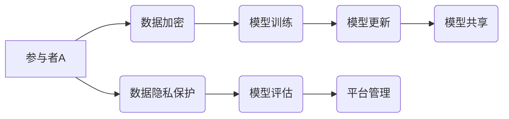

> AI协作、跨组织、开放平台、Lepton AI、联邦学习、数据隐私、模型共享

## 1. 背景介绍

人工智能（AI）技术近年来取得了飞速发展，并在各个领域展现出巨大的应用潜力。然而，现有的AI模型往往依赖于海量的数据和强大的计算资源，这限制了其在实际应用中的推广和普及。此外，数据孤岛问题也阻碍了AI技术的协同发展。

为了解决这些问题，跨组织AI协作成为一个重要的研究方向。跨组织AI协作是指多个组织共享数据和模型资源，共同训练和优化AI模型，从而提升模型性能和应用价值。

Lepton AI是一个致力于构建跨组织AI协作的开放平台，旨在通过联邦学习、数据隐私保护和模型共享等技术，实现AI技术的协同发展和共享共赢。

## 2. 核心概念与联系

Lepton AI的核心概念包括：

* **联邦学习（Federated Learning）：**一种分布式机器学习方法，允许模型在各个参与者本地进行训练，而无需将数据集中到一个中心服务器。
* **数据隐私保护：**通过加密、去敏感化等技术，保护参与者的数据隐私安全。
* **模型共享：**允许参与者共享训练好的模型，促进AI技术的协同发展。

Lepton AI的架构如图所示：



## 3. 核心算法原理 & 具体操作步骤

### 3.1  算法原理概述

Lepton AI基于联邦学习的原理，将模型训练分散到各个参与者本地进行。每个参与者使用自己的数据训练模型，并将训练结果（模型参数更新）发送到平台。平台汇总所有参与者的模型参数更新，并生成新的全局模型。新的全局模型再分发给各个参与者，重复上述过程，直到模型收敛。

### 3.2  算法步骤详解

1. **初始化：**平台将初始模型参数分发给所有参与者。
2. **本地训练：**每个参与者使用自己的数据训练模型，并计算模型参数更新。
3. **模型参数聚合：**参与者将模型参数更新发送到平台。平台汇总所有参与者的模型参数更新，并生成新的全局模型。
4. **模型更新：**平台将新的全局模型分发给所有参与者。
5. **重复步骤2-4：**重复上述步骤，直到模型收敛。

### 3.3  算法优缺点

**优点：**

* 保护数据隐私：数据无需集中到一个中心服务器，有效保护数据隐私安全。
* 提升模型性能：利用多个参与者的数据进行训练，可以提升模型的泛化能力和准确性。
* 促进AI技术协同发展：模型共享机制可以促进AI技术的协同发展和共享共赢。

**缺点：**

* 通信成本高：模型参数更新需要频繁传输，可能会导致通信成本较高。
* 训练效率低：每个参与者只能使用自己的数据进行训练，训练效率可能较低。
* 参与者激励机制：需要设计有效的激励机制，鼓励参与者积极参与平台。

### 3.4  算法应用领域

Lepton AI的算法可以应用于多个领域，例如：

* **医疗保健：**多个医院可以共享患者数据，共同训练疾病诊断模型。
* **金融服务：**多个银行可以共享客户数据，共同训练欺诈检测模型。
* **制造业：**多个工厂可以共享设备数据，共同训练设备故障预测模型。

## 4. 数学模型和公式 & 详细讲解 & 举例说明

### 4.1  数学模型构建

Lepton AI的联邦学习模型可以表示为：

$$
\theta_t = \text{aggregate}\left(\{\theta_{ti}\}\right)
$$

其中：

* $\theta_t$ 表示第t轮迭代的全局模型参数。
* $\theta_{ti}$ 表示第i个参与者在第t轮迭代的模型参数更新。
* $\text{aggregate}$ 表示模型参数聚合函数，例如平均聚合。

### 4.2  公式推导过程

模型参数更新的计算公式可以表示为：

$$
\theta_{ti} = \theta_{ti-1} + \eta \nabla L_i(\theta_{ti-1})
$$

其中：

* $\theta_{ti-1}$ 表示第i个参与者在第t-1轮迭代的模型参数。
* $\eta$ 表示学习率。
* $\nabla L_i(\theta_{ti-1})$ 表示第i个参与者在第t-1轮迭代的损失函数梯度。

### 4.3  案例分析与讲解

假设有两个参与者A和B，他们分别拥有1000个和500个样本数据。

在第一轮迭代中，每个参与者使用自己的数据训练模型，并计算模型参数更新。

平台将参与者的模型参数更新汇总，并生成新的全局模型。

新的全局模型再分发给参与者，重复上述过程，直到模型收敛。

通过联邦学习，Lepton AI可以利用两个参与者的所有数据进行训练，提升模型的泛化能力和准确性。

## 5. 项目实践：代码实例和详细解释说明

### 5.1  开发环境搭建

Lepton AI平台可以使用Python语言开发，并依赖于TensorFlow、PyTorch等深度学习框架。

开发环境需要安装Python、深度学习框架以及Lepton AI平台的依赖库。

### 5.2  源代码详细实现

Lepton AI平台的源代码可以从GitHub等开源平台获取。

代码示例：

```python
# 参与者A的代码示例
from lepton_ai import Client

client = Client(server_address="http://localhost:8080")

# 加载模型
model = client.load_model("my_model")

# 训练模型
client.train(model, data_path="data_a.csv")

# 发送模型参数更新
client.send_update(model)
```

### 5.3  代码解读与分析

代码示例展示了参与者A如何使用Lepton AI平台进行模型训练和参数更新。

* `Client`类用于连接Lepton AI平台。
* `load_model()`方法用于加载预训练模型。
* `train()`方法用于使用本地数据训练模型。
* `send_update()`方法用于发送模型参数更新到平台。

### 5.4  运行结果展示

Lepton AI平台会记录每个参与者的训练结果和模型参数更新，并提供可视化界面展示训练进度和模型性能。

## 6. 实际应用场景

Lepton AI平台可以应用于多个实际场景，例如：

### 6.1  医疗保健

多个医院可以共享患者数据，共同训练疾病诊断模型，提高诊断准确率和效率。

### 6.2  金融服务

多个银行可以共享客户数据，共同训练欺诈检测模型，降低欺诈风险。

### 6.3  制造业

多个工厂可以共享设备数据，共同训练设备故障预测模型，提高设备维护效率。

### 6.4  未来应用展望

Lepton AI平台未来将支持更多AI算法和应用场景，例如：

* **推荐系统：**多个电商平台可以共享用户数据，共同训练个性化推荐模型。
* **自然语言处理：**多个语言服务提供商可以共享文本数据，共同训练机器翻译和文本摘要模型。
* **图像识别：**多个图像识别公司可以共享图像数据，共同训练物体识别和图像分类模型。

## 7. 工具和资源推荐

### 7.1  学习资源推荐

* **Lepton AI官方文档：**https://lepton-ai.com/docs/
* **联邦学习教程：**https://www.tensorflow.org/federated

### 7.2  开发工具推荐

* **TensorFlow：**https://www.tensorflow.org/
* **PyTorch：**https://pytorch.org/

### 7.3  相关论文推荐

* **Federated Learning: Strategies for Improving Communication Efficiency**
* **Communication-Efficient Learning of Deep Networks from Decentralized Data**

## 8. 总结：未来发展趋势与挑战

### 8.1  研究成果总结

Lepton AI平台为跨组织AI协作提供了新的解决方案，有效解决了数据隐私保护和模型共享等问题。

### 8.2  未来发展趋势

Lepton AI平台将继续发展，支持更多AI算法和应用场景，并加强与其他平台的集成，构建更完善的AI生态系统。

### 8.3  面临的挑战

Lepton AI平台还面临一些挑战，例如：

* **数据质量问题：**不同参与者的数据质量可能参差不齐，需要进行数据清洗和预处理。
* **模型公平性问题：**模型训练结果可能受到参与者数据分布的影响，需要保证模型公平性。
* **安全性和可靠性问题：**平台需要保证数据安全和模型可靠性。

### 8.4  研究展望

Lepton AI平台的研究将继续深入，探索更有效的联邦学习算法、数据隐私保护机制和模型共享策略，推动跨组织AI协作的健康发展。

## 9. 附录：常见问题与解答

### 9.1  常见问题

* **Lepton AI平台是否免费使用？**

Lepton AI平台提供免费试用版，并提供付费订阅服务。

* **Lepton AI平台支持哪些AI算法？**

Lepton AI平台支持多种AI算法，例如：

* **机器学习算法：**线性回归、逻辑回归、支持向量机、决策树、随机森林、梯度提升树
* **深度学习算法：**卷积神经网络、循环神经网络、生成对抗网络

* **Lepton AI平台如何保证数据隐私安全？**

Lepton AI平台采用多种数据隐私保护技术，例如：

* **数据加密：**将数据加密传输和存储。
* **去敏感化：**去除数据中的敏感信息。
* **联邦学习：**在本地进行模型训练，无需将数据集中到一个中心服务器。

### 9.2  解答

Lepton AI平台的常见问题解答可以参考官方文档或联系Lepton AI技术支持团队。

作者：禅与计算机程序设计艺术 / Zen and the Art of Computer Programming


<end_of_turn>