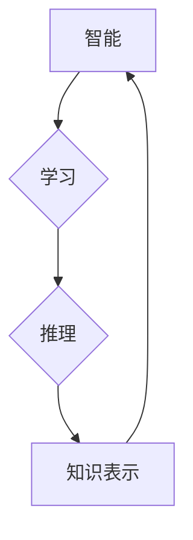

> 达特茅斯会议,人工智能,机器学习,深度学习,自然语言处理,计算机视觉,算法,模型,应用

## 1. 背景介绍

1956年，麻省理工学院的约翰·麦卡锡（John McCarthy）组织了达特茅斯会议，标志着人工智能（Artificial Intelligence，简称AI）的正式诞生。这场会议汇集了当时世界顶尖的科学家和工程师，共同探讨了人工智能的定义、目标和发展方向。达特茅斯会议的成果对人工智能的发展产生了深远的影响，为后来的研究和应用奠定了基础。

### 1.1 会议目标和成果

达特茅斯会议的主要目标是：

* 确定人工智能的定义和目标。
* 探讨人工智能的实现方法。
* 规划人工智能的研究方向。

会议期间，与会者们就人工智能的定义、问题、方法和应用进行了深入的讨论。会议成果包括：

* **人工智能的定义：** 达特茅斯会议上，人工智能被定义为“使机器能够像人类一样思考和学习”。
* **人工智能的实现方法：** 会议上提出了多种实现人工智能的方法，包括符号逻辑、规则系统、机器学习等。
* **人工智能的研究方向：** 会议上确定了人工智能的研究方向，包括自然语言处理、计算机视觉、机器人学等。

### 1.2 会议影响

达特茅斯会议对人工智能的发展产生了深远的影响：

* **推动了人工智能的研究：** 会议激发了人们对人工智能的兴趣，促进了人工智能的研究和发展。
* **建立了人工智能研究的平台：** 会议建立了人工智能研究的平台，促进了人工智能研究人员之间的交流和合作。
* **促进了人工智能的应用：** 会议的成果为人工智能的应用提供了理论基础和技术支撑。

## 2. 核心概念与联系

达特茅斯会议的核心概念包括：

* **智能：** 指机器能够像人类一样思考、学习和解决问题的能力。
* **学习：** 指机器能够从数据中提取知识并改进自身性能的能力。
* **推理：** 指机器能够根据已有的知识和规则进行逻辑推断的能力。
* **知识表示：** 指如何将知识以机器可理解的形式表示出来。

这些概念相互关联，共同构成了人工智能的理论基础。

**Mermaid 流程图：**



## 3. 核心算法原理 & 具体操作步骤

### 3.1 算法原理概述

达特茅斯会议期间，提出了多种人工智能算法，其中包括：

* **符号逻辑：** 基于逻辑规则和符号表示，实现机器推理和决策。
* **规则系统：** 基于一系列预先定义的规则，实现机器的知识表示和推理。
* **机器学习：** 通过数据训练，使机器能够自动学习和改进自身性能。

### 3.2 算法步骤详解

**机器学习算法步骤：**

1. **数据收集和预处理：** 收集相关数据并进行清洗、转换和特征工程。
2. **模型选择：** 根据任务需求选择合适的机器学习模型。
3. **模型训练：** 使用训练数据训练机器学习模型，调整模型参数。
4. **模型评估：** 使用测试数据评估模型性能，并进行调优。
5. **模型部署：** 将训练好的模型部署到实际应用场景中。

### 3.3 算法优缺点

**符号逻辑：**

* **优点：** 能够处理复杂逻辑推理，具有明确的推理过程。
* **缺点：** 知识表示和推理过程较为复杂，难以处理大量数据和模糊知识。

**规则系统：**

* **优点：** 规则易于理解和修改，能够处理特定领域的知识。
* **缺点：** 规则难以表达复杂知识，难以处理变化频繁的知识。

**机器学习：**

* **优点：** 能够自动学习和改进自身性能，能够处理大量数据和模糊知识。
* **缺点：** 模型训练需要大量数据，模型解释性较差。

### 3.4 算法应用领域

人工智能算法广泛应用于各个领域，例如：

* **自然语言处理：** 语音识别、机器翻译、文本摘要等。
* **计算机视觉：** 图像识别、目标检测、图像分割等。
* **机器人学：** 机器人控制、路径规划、物体识别等。
* **医疗保健：** 疾病诊断、药物研发、医疗影像分析等。

## 4. 数学模型和公式 & 详细讲解 & 举例说明

### 4.1 数学模型构建

机器学习算法通常基于数学模型，例如线性回归、逻辑回归、支持向量机等。这些模型通过数学公式来描述数据之间的关系，并预测未知数据。

### 4.2 公式推导过程

**线性回归模型：**

目标是找到一条直线，使得预测值与真实值之间的误差最小。

**公式：**

$$y = w_0 + w_1x$$

其中：

* $y$ 是预测值
* $x$ 是输入特征
* $w_0$ 和 $w_1$ 是模型参数

**损失函数：**

$$L = \frac{1}{n}\sum_{i=1}^{n}(y_i - \hat{y}_i)^2$$

其中：

* $n$ 是样本数量
* $y_i$ 是真实值
* $\hat{y}_i$ 是预测值

**梯度下降算法：**

通过迭代更新模型参数，使得损失函数最小化。

### 4.3 案例分析与讲解

**举例说明：**

假设我们想要预测房价，输入特征是房屋面积，目标是预测房屋价格。我们可以使用线性回归模型，通过训练数据，找到一条最佳的直线，使得预测值与真实值之间的误差最小。

## 5. 项目实践：代码实例和详细解释说明

### 5.1 开发环境搭建

* Python 3.x
* NumPy
* Pandas
* Scikit-learn

### 5.2 源代码详细实现

```python
import numpy as np
from sklearn.linear_model import LinearRegression
from sklearn.model_selection import train_test_split

# 数据加载
data = np.loadtxt('house_data.csv', delimiter=',')
X = data[:, 1]  # 房屋面积
y = data[:, 2]  # 房屋价格

# 数据分割
X_train, X_test, y_train, y_test = train_test_split(X, y, test_size=0.2, random_state=42)

# 模型训练
model = LinearRegression()
model.fit(X_train.reshape(-1, 1), y_train)

# 模型预测
y_pred = model.predict(X_test.reshape(-1, 1))

# 模型评估
print('Coefficients:', model.coef_)
print('Intercept:', model.intercept_)
```

### 5.3 代码解读与分析

* 数据加载：使用 NumPy 加载数据，并分离特征和目标变量。
* 数据分割：使用 Scikit-learn 的 `train_test_split` 函数将数据分割为训练集和测试集。
* 模型训练：使用 Scikit-learn 的 `LinearRegression` 类创建线性回归模型，并使用 `fit` 方法训练模型。
* 模型预测：使用训练好的模型预测测试集数据。
* 模型评估：打印模型系数和截距，并使用其他指标评估模型性能。

### 5.4 运行结果展示

运行代码后，会输出模型系数、截距以及其他评估指标。

## 6. 实际应用场景

人工智能技术在各个领域都有广泛的应用，例如：

* **自然语言处理：** 语音助手、机器翻译、聊天机器人等。
* **计算机视觉：** 自动驾驶、图像识别、医疗影像分析等。
* **机器人学：** 工业机器人、服务机器人、医疗机器人等。
* **金融科技：** 风险管理、欺诈检测、投资决策等。

### 6.4 未来应用展望

人工智能技术还在不断发展，未来将有更多新的应用场景出现，例如：

* **个性化教育：** 根据学生的学习情况提供个性化的学习方案。
* **精准医疗：** 根据患者的基因信息和病史提供个性化的治疗方案。
* **智能城市：** 利用人工智能技术提高城市管理效率和居民生活质量。

## 7. 工具和资源推荐

### 7.1 学习资源推荐

* **在线课程：** Coursera、edX、Udacity 等平台提供丰富的机器学习和人工智能课程。
* **书籍：** 《深度学习》、《机器学习实战》等书籍是学习人工智能的经典教材。
* **开源项目：** TensorFlow、PyTorch 等开源项目提供了丰富的机器学习工具和资源。

### 7.2 开发工具推荐

* **Python：** 机器学习和人工智能开发的常用编程语言。
* **NumPy：** 用于数值计算的 Python 库。
* **Pandas：** 用于数据分析和处理的 Python 库。
* **Scikit-learn：** 用于机器学习的 Python 库。

### 7.3 相关论文推荐

* **《人工神经网络》**
* **《深度学习》**
* **《机器学习》**

## 8. 总结：未来发展趋势与挑战

### 8.1 研究成果总结

达特茅斯会议的成果为人工智能的发展奠定了基础，人工智能技术在各个领域取得了显著的进展。

### 8.2 未来发展趋势

* **深度学习：** 深度学习算法在图像识别、自然语言处理等领域取得了突破性进展，未来将继续发展和完善。
* **强化学习：** 强化学习算法能够使机器通过与环境交互学习，未来将应用于机器人控制、游戏 AI 等领域。
* **解释性 AI：** 如何解释人工智能模型的决策过程，使其更加透明和可信，是未来研究的重要方向。

### 8.3 面临的挑战

* **数据获取和隐私保护：** 训练人工智能模型需要大量数据，如何获取高质量数据并保护用户隐私是一个挑战。
* **算法可解释性和公平性：** 许多人工智能算法难以解释其决策过程，如何保证算法的公平性和避免偏见是一个重要问题。
* **伦理和社会影响：** 人工智能技术的发展可能带来伦理和社会问题，需要进行深入的思考和讨论。

### 8.4 研究展望

未来人工智能研究将继续朝着更智能、更安全、更可解释的方向发展，并为人类社会带来更多福祉。

## 9. 附录：常见问题与解答

### 9.1 什么是人工智能？

人工智能是指使机器能够像人类一样思考、学习和解决问题的能力。

### 9.2 人工智能有哪些应用？

人工智能技术广泛应用于各个领域，例如：自然语言处理、计算机视觉、机器人学、医疗保健等。

### 9.3 如何学习人工智能？

可以通过在线课程、书籍、开源项目等方式学习人工智能。

作者：禅与计算机程序设计艺术 / Zen and the Art of Computer Programming


<end_of_turn>