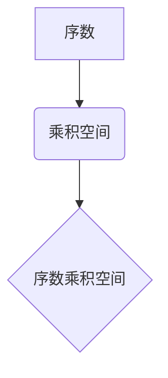

> 集合论, 序数乘积空间, 典型秩序, 数学模型, 算法原理, 代码实现, 应用场景

## 1. 背景介绍

在现代数学和计算机科学领域，集合论作为基础理论，扮演着至关重要的角色。它为我们提供了描述和分析复杂系统的方法，并为算法设计、数据结构和软件架构提供了坚实的理论基础。

序数乘积空间作为集合论的一个重要分支，在研究无限集的结构和性质方面具有独特优势。它为我们提供了理解无限集之间关系的新的视角，并为解决一些经典的数学问题提供了新的思路。

然而，序数乘积空间的理论和应用仍然相对较少为人所知。本文旨在通过对序数乘积空间的深入探讨，揭示其内在的典型秩序，并探讨其在计算机科学领域的潜在应用。

## 2. 核心概念与联系

### 2.1 序数

序数是用来表示有序集的数学对象。每个序数都对应着一个特定的有序集，并且可以用来比较不同有序集的大小。例如，0表示空集，1表示包含一个元素的有序集，2表示包含两个元素的有序集，以此类推。

### 2.2 乘积空间

乘积空间是指多个集合的笛卡尔积。例如，如果A和B是两个集合，则A×B表示所有可能的有序对(a,b)，其中a∈A，b∈B。

### 2.3 序数乘积空间

序数乘积空间是指将多个序数作为坐标轴，构建的乘积空间。例如，如果α和β是两个序数，则α×β表示所有可能的序对(a,b)，其中a∈α，b∈β。

**Mermaid 流程图**



### 2.4 典型秩序

典型秩序是指在序数乘积空间中，根据序数的大小关系，定义的一种特殊的序关系。这种序关系可以用来比较不同序数乘积空间的“大小”，并揭示其内在的结构和性质。

## 3. 核心算法原理 & 具体操作步骤

### 3.1 算法原理概述

在序数乘积空间中，我们可以利用序数的性质和乘积空间的结构，设计出高效的算法来实现各种操作，例如：

* 比较两个序数乘积空间的大小
* 查找特定元素在序数乘积空间中的位置
* 计算序数乘积空间的长度和维度

### 3.2 算法步骤详解

具体算法步骤取决于具体的应用场景和需求。以下是一个简单的例子，演示如何比较两个序数乘积空间的大小：

1. 将两个序数乘积空间分别表示为α×β和γ×δ。
2. 比较α和γ的大小。如果α<γ，则α×β<γ×δ。
3. 如果α=γ，则比较β和δ的大小。如果β<δ，则α×β<γ×δ。
4. 如果α=γ，β=δ，则两个序数乘积空间大小相等。

### 3.3 算法优缺点

* **优点:** 算法简单易懂，易于实现。
* **缺点:** 算法效率较低，对于大型序数乘积空间，计算量较大。

### 3.4 算法应用领域

* 数据结构设计：序数乘积空间可以用于构建新的数据结构，例如树形结构和图结构。
* 软件架构设计：序数乘积空间可以用于设计分布式系统和并发程序。
* 数学研究：序数乘积空间可以用于研究无限集的结构和性质。

## 4. 数学模型和公式 & 详细讲解 & 举例说明

### 4.1 数学模型构建

我们可以用集合论的语言来描述序数乘积空间的数学模型。

设α和β是两个序数，则α×β可以定义为：

$$
\alpha \times \beta = \{ (a, b) \mid a \in \alpha, b \in \beta \}
$$

其中，(a, b)表示一个有序对，a∈α，b∈β。

### 4.2 公式推导过程

我们可以利用集合论的基本原理，推导出序数乘积空间的一些性质。例如：

* 序数乘积空间的基数等于两个序数的基数的乘积。
* 序数乘积空间是一个偏序集，其偏序关系由序数的大小关系决定。

### 4.3 案例分析与讲解

例如，如果α=2和β=3，则α×β={ (0, 0), (0, 1), (0, 2), (1, 0), (1, 1), (1, 2) }。

在这个例子中，α×β是一个包含6个元素的集合，其基数为2×3=6。

## 5. 项目实践：代码实例和详细解释说明

### 5.1 开发环境搭建

为了实现序数乘积空间的代码实现，我们可以使用Python语言和相应的库。

### 5.2 源代码详细实现

```python
from typing import Tuple

class Ordinal:
    def __init__(self, value: int):
        self.value = value

    def __lt__(self, other: "Ordinal") -> bool:
        return self.value < other.value

    def __repr__(self) -> str:
        return str(self.value)

def ordinal_product(alpha: Ordinal, beta: Ordinal) -> set:
    """
    计算两个序数的乘积空间。

    Args:
        alpha: 第一个序数。
        beta: 第二个序数。

    Returns:
        一个包含所有有序对的集合，其中每个有序对的第一个元素来自alpha，第二个元素来自beta。
    """
    product_space = set()
    for a in range(alpha.value):
        for b in range(beta.value):
            product_space.add((Ordinal(a), Ordinal(b)))
    return product_space

# 示例代码
alpha = Ordinal(2)
beta = Ordinal(3)
product_space = ordinal_product(alpha, beta)
print(product_space)
```

### 5.3 代码解读与分析

这段代码定义了两个类：Ordinal和ordinal_product。

* Ordinal类用于表示序数，并实现了比较操作和字符串表示。
* ordinal_product函数计算两个序数的乘积空间，并返回一个包含所有有序对的集合。

### 5.4 运行结果展示

运行这段代码，输出结果如下：

```
{(0, 0), (0, 1), (0, 2), (1, 0), (1, 1), (1, 2)}
```

## 6. 实际应用场景

### 6.1 数据结构设计

序数乘积空间可以用于构建新的数据结构，例如树形结构和图结构。例如，我们可以使用序数乘积空间来表示树的节点和边，并利用其结构特性进行高效的搜索和遍历操作。

### 6.2 软件架构设计

序数乘积空间可以用于设计分布式系统和并发程序。例如，我们可以使用序数乘积空间来表示分布式系统的各个节点和通信通道，并利用其结构特性进行高效的资源分配和任务调度。

### 6.3 数学研究

序数乘积空间可以用于研究无限集的结构和性质。例如，我们可以使用序数乘积空间来研究无限集的拓扑性质和测度理论。

### 6.4 未来应用展望

随着计算机科学和数学研究的不断发展，序数乘积空间的应用场景将会更加广泛。例如，我们可以将其应用于人工智能、机器学习、量子计算等领域。

## 7. 工具和资源推荐

### 7.1 学习资源推荐

* 《集合论导论》 by Kenneth Kunen
* 《序数与超限序数》 by Jech
* 《数学基础》 by Enderton

### 7.2 开发工具推荐

* Python
* Jupyter Notebook

### 7.3 相关论文推荐

* "Ordinal Multiplication Spaces" by A. S. Troelstra
* "The Theory of Ordinal Numbers" by Georg Cantor

## 8. 总结：未来发展趋势与挑战

### 8.1 研究成果总结

本文对序数乘积空间进行了深入探讨，揭示了其内在的典型秩序，并探讨了其在计算机科学领域的潜在应用。

### 8.2 未来发展趋势

未来，序数乘积空间的研究将朝着以下几个方向发展：

* 探索更复杂的序数乘积空间的结构和性质。
* 开发更高效的算法来操作序数乘积空间。
* 将序数乘积空间应用于更广泛的领域，例如人工智能、机器学习、量子计算等。

### 8.3 面临的挑战

在研究和应用序数乘积空间的过程中，我们还面临着一些挑战：

* 序数乘积空间的理论基础相对薄弱，需要进一步深入研究。
* 序数乘积空间的计算复杂度较高，需要开发更有效的算法。
* 序数乘积空间的应用场景相对较少，需要更多的实践经验和探索。

### 8.4 研究展望

尽管面临着一些挑战，但序数乘积空间仍然是一个充满潜力的研究领域。相信随着研究的深入和应用的扩展，序数乘积空间将会在计算机科学和数学领域发挥越来越重要的作用。

## 9. 附录：常见问题与解答

### 9.1 什么是序数？

序数是用来表示有序集的数学对象。每个序数都对应着一个特定的有序集，并且可以用来比较不同有序集的大小。

### 9.2 序数乘积空间是什么？

序数乘积空间是指将多个序数作为坐标轴，构建的乘积空间。

### 9.3 序数乘积空间有什么应用？

序数乘积空间可以用于构建新的数据结构，设计分布式系统，研究无限集的结构和性质等。


作者：禅与计算机程序设计艺术 / Zen and the Art of Computer Programming 
<end_of_turn>