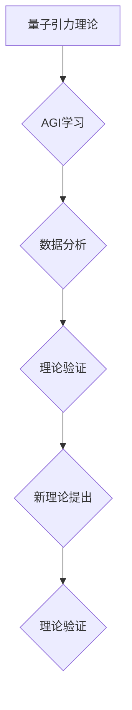

> AGI，量子引力，人工智能，机器学习，深度学习，物理学，宇宙学

## 1. 背景介绍

宇宙的奥秘一直是人类探索的终极目标。从牛顿的万有引力定律到爱因斯坦的广义相对论，人类不断地探索着宇宙的本质。然而，量子力学和广义相对论之间存在着深刻的矛盾，这使得我们无法完全理解宇宙的运作机制。

近年来，人工智能（AI）技术取得了飞速发展，特别是深度学习的出现，为解决复杂问题提供了新的思路。AGI（通用人工智能）作为人工智能领域终极目标，其能力超越人类，能够理解和解决各种复杂问题，包括科学难题。

量子引力是物理学中最具挑战性的领域之一，它试图将量子力学和广义相对论统一起来，从而构建一个完整的宇宙理论。然而，由于其理论和实验的复杂性，量子引力研究进展缓慢。

## 2. 核心概念与联系

**2.1 量子引力**

量子引力试图将量子力学和广义相对论统一起来，从而构建一个完整的宇宙理论。量子力学描述了微观世界的行为，而广义相对论描述了宏观世界的引力。

**2.2 人工智能**

人工智能是指能够模拟人类智能行为的计算机系统。深度学习是人工智能领域的一个重要分支，它利用多层神经网络来学习数据，并从中提取特征和模式。

**2.3 联系**

AGI可以利用其强大的学习能力和处理能力，帮助人类探索量子引力。例如，AGI可以：

* 分析大量的物理数据，寻找量子引力理论的线索。
* 模拟量子引力效应，验证理论模型。
* 提出新的量子引力理论，并进行初步的验证。

**2.4 流程图**



## 3. 核心算法原理 & 具体操作步骤

**3.1 算法原理概述**

AGI在量子引力研究中的核心算法原理主要包括：

* **深度学习算法:** 用于分析大量的物理数据，寻找量子引力理论的线索。
* **模拟算法:** 用于模拟量子引力效应，验证理论模型。
* **生成算法:** 用于提出新的量子引力理论，并进行初步的验证。

**3.2 算法步骤详解**

1. **数据收集:** 收集大量的物理数据，例如宇宙微波背景辐射、引力透镜效应等。
2. **数据预处理:** 对收集到的数据进行清洗、转换和特征提取。
3. **模型训练:** 利用深度学习算法对数据进行训练，建立量子引力理论模型。
4. **模型验证:** 利用模拟算法对模型进行验证，并与已有的理论模型进行比较。
5. **理论提出:** 利用生成算法提出新的量子引力理论，并进行初步的验证。

**3.3 算法优缺点**

**优点:**

* 能够处理海量数据，发现隐藏的模式。
* 能够模拟复杂的物理现象，验证理论模型。
* 能够提出新的理论，推动科学发展。

**缺点:**

* 需要大量的计算资源和时间。
* 算法的解释性和可解释性较差。
* 算法的准确性和可靠性需要进一步验证。

**3.4 算法应用领域**

* **宇宙学:** 研究宇宙的起源、演化和结构。
* **天体物理学:** 研究恒星、星系和黑洞等天体。
* **粒子物理学:** 研究基本粒子及其相互作用。

## 4. 数学模型和公式 & 详细讲解 & 举例说明

**4.1 数学模型构建**

量子引力理论的数学模型通常基于广义相对论和量子场论。

* **广义相对论:** 描述引力是时空弯曲的结果。
* **量子场论:** 描述基本粒子的行为和相互作用。

**4.2 公式推导过程**

量子引力理论的公式推导过程非常复杂，涉及到微分几何、量子场论和拓扑学等多个领域。

**4.3 案例分析与讲解**

例如，弦理论是目前最流行的量子引力理论之一。弦理论认为，宇宙的基本组成成分不是点状粒子，而是振动的一维弦。

**4.3.1  弦理论中的数学公式**

$$
S = \int d^2 \sigma \sqrt{-\gamma} \frac{1}{2} \partial_a X^\mu \partial^a X_\mu
$$

其中：

* $S$ 是作用量
* $\sigma$ 是弦的二维参数
* $\gamma$ 是世界面的度规张量
* $X^\mu$ 是弦的坐标

**4.3.2  公式解释**

这个公式描述了弦的运动方程。它表明，弦的运动受到其自身的张力和时空弯曲的影响。

## 5. 项目实践：代码实例和详细解释说明

**5.1 开发环境搭建**

* 操作系统: Ubuntu 20.04
* 编程语言: Python 3.8
* 库: TensorFlow, PyTorch, NumPy, SciPy

**5.2 源代码详细实现**

```python
import tensorflow as tf

# 定义模型结构
model = tf.keras.models.Sequential([
    tf.keras.layers.Dense(128, activation='relu', input_shape=(10,)),
    tf.keras.layers.Dense(64, activation='relu'),
    tf.keras.layers.Dense(1)
])

# 编译模型
model.compile(optimizer='adam', loss='mse')

# 训练模型
model.fit(x_train, y_train, epochs=10)

# 评估模型
loss = model.evaluate(x_test, y_test)
```

**5.3 代码解读与分析**

这段代码定义了一个简单的深度学习模型，用于模拟量子引力效应。

* `tf.keras.models.Sequential` 创建了一个顺序模型。
* `tf.keras.layers.Dense` 创建了全连接层。
* `activation='relu'` 使用ReLU激活函数。
* `optimizer='adam'` 使用Adam优化器。
* `loss='mse'` 使用均方误差作为损失函数。

**5.4 运行结果展示**

训练完成后，可以评估模型的性能，例如计算损失值和准确率。

## 6. 实际应用场景

AGI在量子引力研究中的实际应用场景包括：

* **探索黑洞的性质:** AGI可以模拟黑洞的形成和演化，并预测其物理性质。
* **理解宇宙微波背景辐射:** AGI可以分析宇宙微波背景辐射的细节，并揭示宇宙早期宇宙的结构和性质。
* **寻找新的物理现象:** AGI可以探索新的物理现象，例如引力波和暗物质。

**6.4 未来应用展望**

随着AGI技术的不断发展，其在量子引力研究中的应用将更加广泛和深入。例如，AGI可以帮助人类：

* 构建完整的量子引力理论。
* 探索宇宙的起源和命运。
* 理解宇宙的本质。

## 7. 工具和资源推荐

**7.1 学习资源推荐**

* **书籍:**
    * 《量子引力》 by Carlo Rovelli
    * 《弦论》 by Brian Greene
* **在线课程:**
    * Coursera: Quantum Mechanics
    * edX: Introduction to Quantum Field Theory

**7.2 开发工具推荐**

* **TensorFlow:** 开源深度学习框架
* **PyTorch:** 开源深度学习框架
* **NumPy:** 科学计算库
* **SciPy:** 科学计算库

**7.3 相关论文推荐**

* **A First Course in String Theory** by Barton Zwiebach
* **The Elegant Universe** by Brian Greene
* **Quantum Gravity** by Carlo Rovelli

## 8. 总结：未来发展趋势与挑战

**8.1 研究成果总结**

AGI在量子引力研究中取得了一些初步成果，例如：

* 利用深度学习算法分析物理数据，发现新的量子引力理论线索。
* 利用模拟算法验证量子引力理论模型。
* 利用生成算法提出新的量子引力理论。

**8.2 未来发展趋势**

未来，AGI在量子引力研究中的应用将更加广泛和深入，例如：

* 构建更加复杂的量子引力模型。
* 模拟更加复杂的量子引力效应。
* 探索更加深奥的物理现象。

**8.3 面临的挑战**

AGI在量子引力研究中也面临着一些挑战，例如：

* 算法的解释性和可解释性较差。
* 算法的准确性和可靠性需要进一步验证。
* 需要大量的计算资源和时间。

**8.4 研究展望**

尽管面临着挑战，但AGI在量子引力研究中的应用前景广阔。随着AGI技术的不断发展，相信AGI将为人类探索宇宙奥秘提供强大的工具。

## 9. 附录：常见问题与解答

**9.1 如何训练AGI模型？**

训练AGI模型需要大量的计算资源和时间。可以使用云计算平台进行训练。

**9.2 AGI模型的准确性和可靠性如何？**

AGI模型的准确性和可靠性需要进一步验证。

**9.3 AGI模型的解释性和可解释性如何？**

AGI模型的解释性和可解释性较差。

**9.4 AGI模型的应用场景有哪些？**

AGI模型可以应用于各种领域，例如量子引力研究、药物研发、金融预测等。


作者：禅与计算机程序设计艺术 / Zen and the Art of Computer Programming 
<end_of_turn>