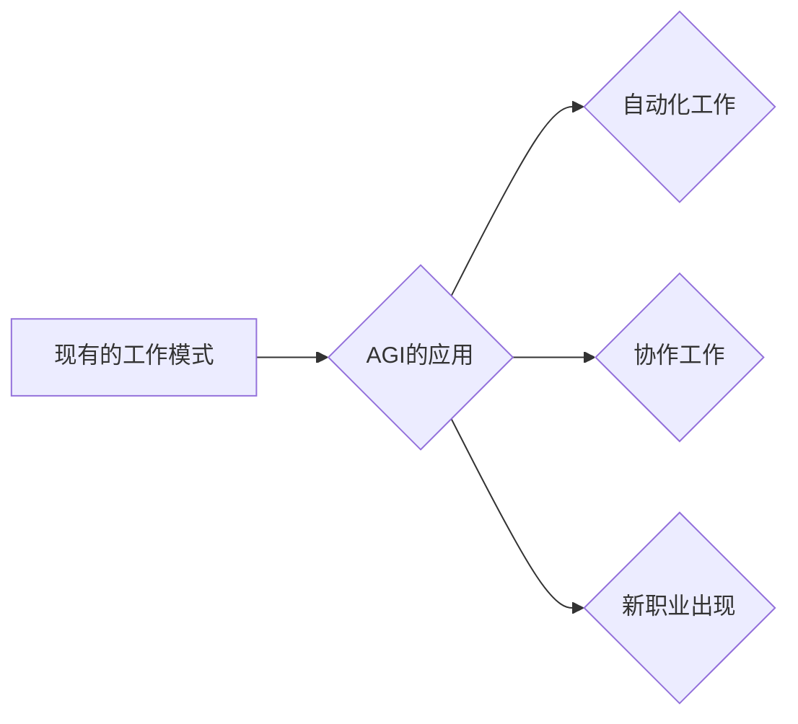

> AGI，人工智能，工作方式，自动化，未来趋势，职业发展，社会影响

## 1. 背景介绍

人工智能（AI）技术近年来发展迅速，特别是深度学习的突破，使得人工智能的应用范围不断扩大。其中，通用人工智能（AGI，Artificial General Intelligence）作为人工智能领域终极目标，一直备受关注。AGI是指能够像人类一样学习、理解和解决各种复杂问题的人工智能系统。

随着AGI技术的不断进步，其对未来工作方式的影响将不可避免。一些专家预测，AGI将彻底改变现有的工作模式，带来前所未有的机遇和挑战。

## 2. 核心概念与联系

**2.1 AGI的概念**

AGI是指能够像人类一样学习、理解和解决各种复杂问题的人工智能系统。它拥有以下关键特征：

* **通用性:** AGI能够处理各种类型的问题，而不是像现有的AI系统那样局限于特定领域。
* **学习能力:** AGI能够从数据中学习，并不断提升其知识和技能。
* **推理能力:** AGI能够进行逻辑推理和决策，并根据情况做出最佳选择。
* **创造力:** AGI能够产生新的想法和解决方案，而不是仅仅重复已有的模式。

**2.2 AGI与工作方式的关系**

AGI的出现将对工作方式产生深远影响，主要体现在以下几个方面：

* **自动化:** AGI能够自动化许多重复性、低技能的工作，释放人类员工的时间和精力，让他们专注于更具创造性和战略性的工作。
* **协作:** AGI可以与人类协作，共同完成复杂的任务，提高工作效率和质量。
* **新职业的出现:** AGI的应用将催生新的职业和工作岗位，例如AGI开发人员、AGI训练师、AGI应用工程师等。

**2.3  AGI对未来工作方式的潜在影响**

* **工作岗位的变化:** 一些现有的工作岗位将被自动化取代，而一些新的工作岗位将出现。
* **技能需求的变化:** 随着AGI的应用，对创造力、批判性思维、解决问题能力等高阶技能的需求将进一步增加。
* **工作模式的变化:** 工作将更加灵活、分散和远程化。

**2.4 Mermaid 流程图**



## 3. 核心算法原理 & 具体操作步骤

**3.1 算法原理概述**

AGI的实现需要多种先进的算法和技术，例如：

* **深度学习:** 用于训练模型，使其能够从数据中学习。
* **强化学习:** 用于训练模型，使其能够通过与环境交互学习最佳策略。
* **自然语言处理:** 用于使AGI能够理解和生成人类语言。
* **计算机视觉:** 用于使AGI能够理解和解释图像和视频。

**3.2 算法步骤详解**

AGI的开发是一个复杂的过程，通常包括以下步骤：

1. **数据收集和预处理:** 收集大量的数据，并对其进行清洗、转换和格式化。
2. **模型选择和训练:** 选择合适的算法模型，并使用训练数据对其进行训练。
3. **模型评估和优化:** 使用测试数据评估模型的性能，并根据评估结果对模型进行优化。
4. **模型部署和应用:** 将训练好的模型部署到实际应用场景中。

**3.3 算法优缺点**

* **优点:** AGI能够解决人类难以解决的复杂问题，提高工作效率和质量。
* **缺点:** AGI的开发成本高，训练数据量大，存在伦理和安全风险。

**3.4 算法应用领域**

* **医疗保健:** 辅助医生诊断疾病、制定治疗方案。
* **金融服务:** 识别欺诈行为、预测市场趋势。
* **制造业:** 自动化生产线、优化生产流程。
* **教育:** 个性化教学、智能辅导。

## 4. 数学模型和公式 & 详细讲解 & 举例说明

**4.1 数学模型构建**

AGI的实现需要构建复杂的数学模型，例如神经网络模型、强化学习模型等。这些模型通常使用数学公式来描述其结构和功能。

**4.2 公式推导过程**

例如，神经网络模型中的激活函数通常使用 sigmoid 函数或 ReLU 函数，这些函数的数学表达式如下：

* **sigmoid 函数:**  f(x) = 1 / (1 + exp(-x))
* **ReLU 函数:** f(x) = max(0, x)

这些函数的推导过程涉及微积分、概率论等数学知识。

**4.3 案例分析与讲解**

例如，在强化学习中，使用 Bellman 方程来描述状态价值函数的更新规则。Bellman 方程的数学表达式如下：

$$
V(s) = \max_{\alpha} \sum_{s'} P(s' | s, \alpha) [R(s, \alpha, s') + \gamma V(s')]
$$

其中：

* V(s) 表示状态 s 的价值函数。
* α 表示动作。
* P(s' | s, α) 表示从状态 s 执行动作 α 到状态 s' 的概率。
* R(s, α, s') 表示从状态 s 执行动作 α 到状态 s' 的奖励。
* γ 表示折扣因子。

Bellman 方程通过迭代的方式更新状态价值函数，使模型能够学习最佳策略。

## 5. 项目实践：代码实例和详细解释说明

**5.1 开发环境搭建**

AGI的开发通常需要使用 Python 语言和相关的库，例如 TensorFlow、PyTorch、OpenAI Gym 等。

**5.2 源代码详细实现**

以下是一个简单的强化学习代码示例，使用 OpenAI Gym 的 CartPole 环境进行训练：

```python
import gym
import numpy as np
import tensorflow as tf

# 创建 CartPole 环境
env = gym.make('CartPole-v1')

# 定义神经网络模型
model = tf.keras.models.Sequential([
    tf.keras.layers.Dense(128, activation='relu', input_shape=(4,)),
    tf.keras.layers.Dense(64, activation='relu'),
    tf.keras.layers.Dense(2, activation='softmax')
])

# 定义损失函数和优化器
loss_fn = tf.keras.losses.CategoricalCrossentropy()
optimizer = tf.keras.optimizers.Adam()

# 训练模型
for episode in range(1000):
    state = env.reset()
    done = False
    while not done:
        # 获取模型预测
        action_probs = model(state.reshape(1, -1))
        action = np.argmax(action_probs[0])

        # 执行动作
        next_state, reward, done, _ = env.step(action)

        # 更新模型参数
        with tf.GradientTape() as tape:
            loss = loss_fn(action_probs, tf.one_hot(action, depth=2))
        gradients = tape.gradient(loss, model.trainable_variables)
        optimizer.apply_gradients(zip(gradients, model.trainable_variables))

        # 更新状态
        state = next_state

    print(f'Episode {episode+1} done')

# 保存模型
model.save('cartpole_model.h5')
```

**5.3 代码解读与分析**

这段代码实现了简单的强化学习算法，用于训练一个 CartPole 环境的智能体。

* 首先，创建 CartPole 环境并定义神经网络模型。
* 然后，定义损失函数和优化器，并使用训练数据训练模型。
* 最后，保存训练好的模型。

**5.4 运行结果展示**

训练完成后，可以将模型加载到环境中，观察智能体的表现。

## 6. 实际应用场景

**6.1 医疗保健**

* **疾病诊断:** AGI可以分析患者的病历、影像数据等信息，辅助医生诊断疾病。
* **个性化治疗:** AGI可以根据患者的基因信息、生活习惯等因素，制定个性化的治疗方案。
* **药物研发:** AGI可以加速药物研发过程，例如预测药物的有效性和安全性。

**6.2 金融服务**

* **欺诈检测:** AGI可以分析交易数据，识别异常行为，防止欺诈行为。
* **风险管理:** AGI可以评估投资风险，帮助投资者做出更明智的决策。
* **客户服务:** AGI可以提供智能客服，解答客户疑问，提高客户满意度。

**6.3 制造业**

* **自动化生产:** AGI可以自动化生产线，提高生产效率和质量。
* ** Predictive Maintenance:** AGI可以预测设备故障，及时进行维护，降低生产成本。
* **质量控制:** AGI可以对产品进行质量检测，确保产品质量。

**6.4 未来应用展望**

AGI的应用前景广阔，未来将应用于更多领域，例如教育、交通、能源等。

## 7. 工具和资源推荐

**7.1 学习资源推荐**

* **书籍:**
    * 《深度学习》
    * 《人工智能：一种现代方法》
    * 《强化学习：原理、算法和应用》
* **在线课程:**
    * Coursera: 深度学习
    * edX: 人工智能
    * Udacity: 强化学习

**7.2 开发工具推荐**

* **TensorFlow:** 开源深度学习框架
* **PyTorch:** 开源深度学习框架
* **OpenAI Gym:** 强化学习环境库

**7.3 相关论文推荐**

* **AlphaGo论文:** https://arxiv.org/abs/1607.02886
* **GPT-3论文:** https://arxiv.org/abs/2005.14165

## 8. 总结：未来发展趋势与挑战

**8.1 研究成果总结**

近年来，AGI领域取得了显著进展，例如 AlphaGo、GPT-3 等模型的出现，证明了AGI技术的潜力。

**8.2 未来发展趋势**

* **模型规模和能力的提升:** 未来AGI模型将更加强大，能够处理更复杂的任务。
* **多模态学习:** AGI将能够理解和处理多种数据类型，例如文本、图像、音频等。
* **可解释性增强:** 研究人员将致力于提高AGI模型的可解释性，使其决策过程更加透明。

**8.3 面临的挑战**

* **数据获取和标注:** AGI的训练需要大量高质量的数据，数据获取和标注是一个挑战。
* **计算资源:** 训练大型AGI模型需要大量的计算资源，成本很高。
* **伦理和安全风险:** AGI的应用可能带来伦理和安全风险，需要谨慎考虑。

**8.4 研究展望**

未来，AGI研究将继续朝着更通用、更安全、更可解释的方向发展。


## 9. 附录：常见问题与解答

**9.1 AGI是否会取代人类工作？**

AGI可能会改变一些工作模式，但不会完全取代人类工作。AGI更像是人类的工具，可以帮助人类提高工作效率和质量。

**9.2 AGI是否会对社会造成威胁？**

AGI的应用可能带来一些风险，例如失业、算法偏见等，但只要我们谨慎规划和管理，可以将AGI的风险降到最低，并将其用于造福人类。

**9.3 如何学习AGI相关知识？**

可以通过阅读书籍、参加在线课程、参与开源项目等方式学习AGI相关知识。

作者：禅与计算机程序设计艺术 / Zen and the Art of Computer Programming


<end_of_turn>