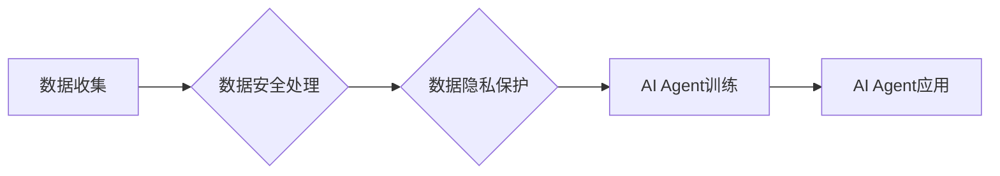

> AI Agent, 数据隐私, 数据安全, Federated Learning, Differential Privacy, Homomorphic Encryption, 隐私计算

## 1. 背景介绍

人工智能（AI）正在以惊人的速度发展，其应用领域不断扩展，从自动驾驶到医疗诊断，再到金融服务，AI正在改变着我们的生活。然而，随着AI技术的进步，数据隐私和数据安全问题也日益突出。AI模型的训练和部署都需要大量的数据，而这些数据往往包含敏感个人信息。如果这些数据被泄露或滥用，将可能导致严重的后果。

传统的集中式数据处理模式，将数据集中存储和处理，容易成为攻击目标，也难以满足用户对数据隐私的控制需求。因此，如何保障数据隐私和安全，成为AI发展面临的重大挑战。

## 2. 核心概念与联系

**2.1 数据隐私**

数据隐私是指个人信息在收集、使用、存储和处理过程中，不被未经授权的第三方访问、使用或披露的权利。

**2.2 数据安全**

数据安全是指保护数据免受未经授权的访问、使用、披露、修改或销毁的措施。

**2.3 AI Agent**

AI Agent是指能够感知环境、做出决策并执行行动的智能体。AI Agent可以独立完成任务，也可以与其他AI Agent或人类用户协作。

**2.4 隐私计算**

隐私计算是指在不泄露原始数据的情况下，对数据进行分析和处理的技术。

**2.5 联邦学习**

联邦学习是一种分布式机器学习方法，它允许模型在多个设备上进行训练，而无需将数据集中存储。

**2.6 差分隐私**

差分隐私是一种数学工具，它可以用来保护数据隐私。差分隐私通过添加噪声来保护数据，使得攻击者无法从数据中推断出任何关于个体的信息。

**2.7 同态加密**

同态加密是一种加密技术，它允许对加密数据进行运算，而无需解密。

**2.8 数据安全与隐私保护的联系**

数据安全和数据隐私保护是相互关联的，但又有所区别。数据安全侧重于保护数据免受未经授权的访问和修改，而数据隐私侧重于保护个人信息不被滥用。

**2.9 AI Agent与数据隐私保护的关系**

AI Agent的应用场景通常涉及大量的数据，因此数据隐私保护对于AI Agent的应用至关重要。

**Mermaid 流程图**



## 3. 核心算法原理 & 具体操作步骤

### 3.1 算法原理概述

联邦学习是一种分布式机器学习方法，它允许模型在多个设备上进行训练，而无需将数据集中存储。

联邦学习的工作原理如下：

1. **模型初始化:** 首先，一个初始模型在中央服务器上进行初始化。
2. **模型分发:** 初始模型被分发到各个设备上。
3. **本地训练:** 每个设备使用其本地数据对模型进行训练。
4. **模型更新:** 每个设备将训练后的模型更新发送回中央服务器。
5. **模型聚合:** 中央服务器将所有设备的模型更新进行聚合，得到一个新的全局模型。
6. **模型迭代:** 新的全局模型被分发到各个设备，重复步骤3-5，直到模型收敛。

### 3.2 算法步骤详解

1. **数据准备:** 将数据分成多个数据集，每个数据集存储在不同的设备上。
2. **模型初始化:** 在中央服务器上初始化一个模型。
3. **模型分发:** 将初始化的模型分发到各个设备上。
4. **本地训练:** 每个设备使用其本地数据对模型进行训练。
5. **模型更新:** 每个设备将训练后的模型更新发送回中央服务器。
6. **模型聚合:** 中央服务器将所有设备的模型更新进行聚合，得到一个新的全局模型。
7. **模型评估:** 对新的全局模型进行评估，判断是否满足预设的性能指标。
8. **迭代训练:** 如果模型性能不满足要求，重复步骤3-7，直到模型收敛。

### 3.3 算法优缺点

**优点:**

* 保护数据隐私: 数据从未离开设备，因此不会泄露到中央服务器。
* 提高数据安全: 数据分散存储，即使某个设备被攻击，也不会导致所有数据丢失。
* 提升模型性能: 可以利用多个设备上的数据进行训练，提高模型的泛化能力。

**缺点:**

* 通信成本高: 模型更新需要频繁传输，会增加通信成本。
* 训练效率低: 每个设备的训练速度可能不同，会影响整体训练效率。
* 模型不一致性: 每个设备的训练数据可能不同，会导致模型之间存在不一致性。

### 3.4 算法应用领域

* **医疗保健:** 保护患者隐私，同时利用多个医院的数据进行疾病诊断和治疗研究。
* **金融服务:** 保护客户隐私，同时利用多个银行的数据进行风险评估和欺诈检测。
* **物联网:** 保护设备数据隐私，同时利用多个设备的数据进行智能分析和决策。

## 4. 数学模型和公式 & 详细讲解 & 举例说明

### 4.1 数学模型构建

联邦学习的数学模型可以概括为以下公式:

$$
\theta_t = \text{Agg}\left(\{w_i^t\}_{i=1}^n\right)
$$

其中:

* $\theta_t$ 是第t轮迭代后的全局模型参数。
* $w_i^t$ 是第i个设备在第t轮迭代后的模型参数更新。
* $\text{Agg}$ 是模型聚合函数，例如平均聚合。

### 4.2 公式推导过程

模型聚合函数的具体实现方式取决于具体的联邦学习算法。常见的聚合函数包括平均聚合、加权平均聚合和投票聚合等。

### 4.3 案例分析与讲解

假设有两个设备，设备1和设备2，每个设备都有自己的数据和模型。

* 设备1的模型参数更新为 $w_1^t$。
* 设备2的模型参数更新为 $w_2^t$。

如果使用平均聚合函数，则全局模型参数更新为:

$$
\theta_t = \frac{w_1^t + w_2^t}{2}
$$

## 5. 项目实践：代码实例和详细解释说明

### 5.1 开发环境搭建

* Python 3.7+
* TensorFlow 2.0+
* PyTorch 1.0+

### 5.2 源代码详细实现

```python
# 联邦学习模型训练代码示例

import tensorflow as tf

# 定义模型
model = tf.keras.models.Sequential([
    tf.keras.layers.Dense(128, activation='relu'),
    tf.keras.layers.Dense(10, activation='softmax')
])

# 定义训练函数
def train_model(model, data, epochs):
    model.compile(optimizer='adam',
                  loss='sparse_categorical_crossentropy',
                  metrics=['accuracy'])
    model.fit(data, epochs=epochs)

# 定义联邦学习训练函数
def federated_train(clients, epochs):
    for _ in range(epochs):
        # 每个客户端本地训练模型
        for client in clients:
            client.train_model(client.data)

        # 模型聚合
        global_model = aggregate_models(clients)

        # 更新全局模型
        for client in clients:
            client.update_model(global_model)

# 聚合模型
def aggregate_models(clients):
    # ...

# 创建客户端实例
clients = [Client(data1), Client(data2)]

# 联邦学习训练
federated_train(clients, epochs=10)
```

### 5.3 代码解读与分析

* 代码首先定义了模型和训练函数。
* 然后定义了联邦学习训练函数，该函数包含以下步骤:
    * 每个客户端本地训练模型。
    * 模型聚合。
    * 更新全局模型。
* 最后创建客户端实例并进行联邦学习训练。

### 5.4 运行结果展示

运行结果展示包括训练过程中的损失值和准确率变化曲线，以及最终训练得到的全局模型的性能指标。

## 6. 实际应用场景

### 6.1 医疗保健

* **疾病诊断:** 利用多个医院的数据进行疾病诊断，提高诊断准确率。
* **药物研发:** 利用多个患者的数据进行药物研发，加速药物研发周期。

### 6.2 金融服务

* **风险评估:** 利用多个银行的数据进行风险评估，降低贷款风险。
* **欺诈检测:** 利用多个交易数据的进行欺诈检测，提高资金安全。

### 6.3 物联网

* **智能分析:** 利用多个设备的数据进行智能分析，提高设备运行效率。
* **安全监控:** 利用多个设备的数据进行安全监控，提高系统安全性。

### 6.4 未来应用展望

随着AI技术的不断发展，AI Agent在更多领域将发挥重要作用。未来，AI Agent将更加智能化、个性化和安全化。

## 7. 工具和资源推荐

### 7.1 学习资源推荐

* **书籍:**
    * 《深度学习》
    * 《机器学习》
    * 《联邦学习》
* **在线课程:**
    * Coursera
    * edX
    * Udacity

### 7.2 开发工具推荐

* **TensorFlow:** 开源机器学习框架
* **PyTorch:** 开源机器学习框架
* **Keras:** 高级API，用于构建和训练深度学习模型

### 7.3 相关论文推荐

* **Federated Learning: Strategies for Improving Communication Efficiency**
* **Differential Privacy**
* **Homomorphic Encryption**

## 8. 总结：未来发展趋势与挑战

### 8.1 研究成果总结

AI Agent在数据隐私保护和数据安全方面取得了显著的成果，例如联邦学习、差分隐私和同态加密等技术。

### 8.2 未来发展趋势

* **更智能的AI Agent:** AI Agent将更加智能化，能够更好地理解和响应用户的需求。
* **更安全的AI Agent:** AI Agent将更加安全，能够更好地保护用户数据隐私。
* **更广泛的AI Agent应用:** AI Agent将应用于更多领域，例如医疗保健、金融服务和教育等。

### 8.3 面临的挑战

* **数据质量问题:** AI Agent的训练需要高质量的数据，而现实世界的数据往往存在噪声和不完整性。
* **模型解释性问题:** AI Agent的决策过程往往难以解释，这可能会导致用户对AI Agent的信任度降低。
* **伦理问题:** AI Agent的应用可能会带来一些伦理问题，例如算法偏见和隐私侵犯等。

### 8.4 研究展望

未来，我们需要继续研究和探索新的技术和方法，以解决AI Agent在数据隐私保护和数据安全方面的挑战，并推动AI技术朝着更加安全、可信和可控的方向发展。

## 9. 附录：常见问题与解答

**Q1: 联邦学习和差分隐私有什么区别？**

**A1:** 联邦学习是一种分布式机器学习方法，它允许模型在多个设备上进行训练，而无需将数据集中存储。差分隐私是一种数学工具，它可以用来保护数据隐私。

**Q2: 同态加密可以用来保护哪些数据？**

**A2:** 同态加密可以用来保护任何类型的加密数据，例如文本、图像和音频数据。

**Q3: AI Agent的应用有哪些？**

**A3:** AI Agent的应用领域非常广泛，例如医疗保健、金融服务、教育和娱乐等。

作者：禅与计算机程序设计艺术 / Zen and the Art of Computer Programming


<end_of_turn>