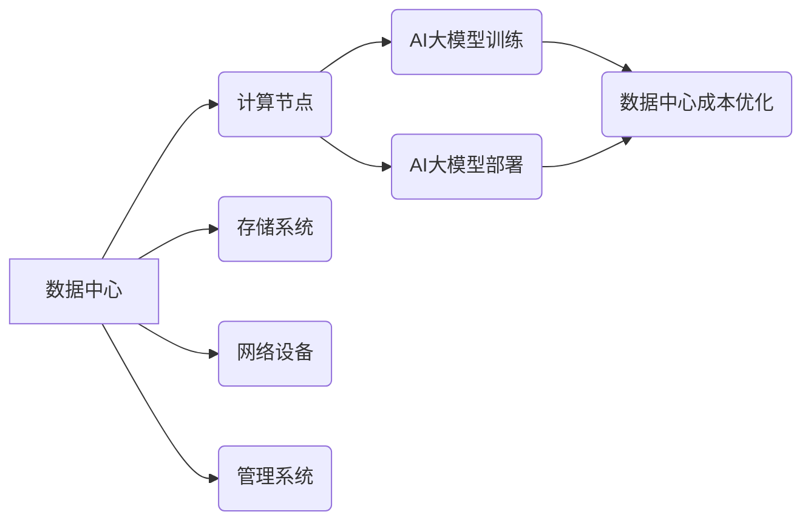

> AI大模型，数据中心，成本优化，资源调度，能源效率，云计算，机器学习

## 1. 背景介绍

近年来，人工智能（AI）技术蓬勃发展，特别是大规模语言模型（LLM）的出现，为各行各业带来了革命性的变革。从自然语言处理到图像识别，从药物研发到金融预测，AI大模型正在深刻地改变着我们的生活和工作方式。然而，训练和部署这些庞大的模型需要大量的计算资源和能源，这给数据中心建设和运营带来了巨大的挑战。

数据中心作为AI大模型应用的基础设施，其成本结构复杂，包括硬件成本、能源成本、运营维护成本等。随着AI应用的不断扩展，数据中心成本将成为制约AI发展的重要因素。因此，如何优化数据中心成本，提高资源利用率和能源效率，成为当前AI领域亟待解决的关键问题。

## 2. 核心概念与联系

**2.1 数据中心架构**

数据中心通常由以下核心组件组成：

* **计算节点:** 包含CPU、GPU等处理单元，负责执行AI模型的训练和推理任务。
* **存储系统:** 用于存储海量训练数据和模型参数，包括本地存储和云存储。
* **网络设备:** 提供数据中心内不同节点之间的通信连接，确保数据传输的快速和可靠。
* **管理系统:** 用于监控数据中心运行状态、管理资源分配和优化系统性能。

**2.2 AI大模型训练与部署**

AI大模型的训练是一个耗时、耗能的计算密集型任务，通常需要分布式训练框架和大量的计算资源。部署阶段则需要将训练好的模型部署到生产环境中，以便为用户提供服务。

**2.3 数据中心成本优化**

数据中心成本优化是指通过各种技术手段和管理策略，降低数据中心运营成本，提高资源利用率和能源效率。

**2.4 核心概念关系图**



## 3. 核心算法原理 & 具体操作步骤

**3.1 算法原理概述**

数据中心成本优化算法通常基于以下核心原理：

* **资源调度:** 通过智能算法，动态分配计算资源、存储资源和网络资源，最大化资源利用率。
* **能源管理:** 通过优化硬件配置、调整冷却系统和利用可再生能源等方式，降低数据中心能耗。
* **虚拟化技术:** 通过虚拟化技术，将物理资源抽象成虚拟资源，提高资源利用率和灵活性。
* **自动化管理:** 通过自动化工具和脚本，简化数据中心管理流程，降低人工成本。

**3.2 算法步骤详解**

1. **数据收集:** 收集数据中心运行状态数据，包括CPU利用率、内存利用率、存储使用率、网络流量等。
2. **数据分析:** 对收集到的数据进行分析，识别资源利用率低、能耗高的区域和时间段。
3. **模型训练:** 利用机器学习算法，训练预测模型，预测未来资源需求和能耗情况。
4. **资源调度:** 根据预测模型的输出，动态调整资源分配策略，优化资源利用率。
5. **能源管理:** 根据能耗分析结果，调整硬件配置、冷却系统和能源供应策略，降低能耗。
6. **自动化管理:** 利用自动化工具和脚本，实现资源监控、报警、调度和优化等功能。

**3.3 算法优缺点**

* **优点:** 能够有效降低数据中心成本，提高资源利用率和能源效率。
* **缺点:** 需要大量的历史数据进行模型训练，算法复杂度较高，需要专业的技术人员进行维护和优化。

**3.4 算法应用领域**

* **云计算平台:** 优化云计算资源分配和调度，降低运营成本。
* **企业数据中心:** 提高企业数据中心资源利用率和能源效率。
* **人工智能训练:** 优化AI模型训练资源分配，加速训练速度。

## 4. 数学模型和公式 & 详细讲解 & 举例说明

**4.1 数学模型构建**

数据中心成本优化模型通常采用线性规划模型或非线性规划模型。

* **线性规划模型:** 假设数据中心成本和资源利用率之间存在线性关系，通过求解线性方程组，找到最优资源分配方案。
* **非线性规划模型:** 假设数据中心成本和资源利用率之间存在非线性关系，需要使用非线性优化算法进行求解。

**4.2 公式推导过程**

假设数据中心有n个计算节点，每个节点的计算能力为c_i，资源利用率为u_i，成本为b_i。目标是最大化资源利用率，同时满足成本约束。

* **目标函数:**

$$
\max \sum_{i=1}^{n} u_i
$$

* **约束条件:**

$$
\sum_{i=1}^{n} c_i u_i \leq C
$$

其中C为总计算能力约束。

**4.3 案例分析与讲解**

假设数据中心有3个计算节点，计算能力分别为100、200、300，成本分别为1000、2000、3000。总计算能力约束为500。

通过线性规划模型求解，可以得到最优资源分配方案，例如：

* 节点1: u_1 = 0.5
* 节点2: u_2 = 0.7
* 节点3: u_3 = 0.8

此时，总资源利用率为0.5 + 0.7 + 0.8 = 2.0。

## 5. 项目实践：代码实例和详细解释说明

**5.1 开发环境搭建**

* 操作系统: Ubuntu 20.04
* 编程语言: Python 3.8
* 库依赖: pandas, numpy, scikit-learn

**5.2 源代码详细实现**

```python
import pandas as pd
from sklearn.linear_model import LinearRegression

# 数据加载
data = pd.read_csv("data.csv")

# 特征选择
features = ["CPU_utilization", "Memory_utilization"]
target = "Cost"

# 模型训练
model = LinearRegression()
model.fit(data[features], data[target])

# 模型预测
new_data = pd.DataFrame({
    "CPU_utilization": [0.7, 0.8],
    "Memory_utilization": [0.6, 0.9]
})
predictions = model.predict(new_data)

# 结果展示
print(predictions)
```

**5.3 代码解读与分析**

* 代码首先加载数据，选择特征和目标变量。
* 然后使用线性回归模型训练模型，并对新数据进行预测。
* 最后输出预测结果。

**5.4 运行结果展示**

运行代码后，将输出预测的成本值。

## 6. 实际应用场景

**6.1 云计算平台**

云计算平台可以利用数据中心成本优化算法，动态调整虚拟机资源分配，提高资源利用率和降低运营成本。

**6.2 企业数据中心**

企业数据中心可以利用数据中心成本优化算法，优化硬件配置、调整冷却系统和能源供应策略，降低能耗和运营成本。

**6.3 AI训练平台**

AI训练平台可以利用数据中心成本优化算法，优化AI模型训练资源分配，加速训练速度和降低训练成本。

**6.4 未来应用展望**

随着AI技术的不断发展，数据中心成本优化将成为越来越重要的研究方向。未来，数据中心成本优化算法将更加智能化、自动化，并与其他技术融合，例如边缘计算、量子计算等，为AI应用提供更低成本、更高效的计算资源。

## 7. 工具和资源推荐

**7.1 学习资源推荐**

* **书籍:**
    * 《数据中心设计与优化》
    * 《云计算架构与设计》
* **在线课程:**
    * Coursera: 数据中心管理
    * Udemy: 云计算基础

**7.2 开发工具推荐**

* **数据分析工具:**
    * Apache Spark
    * Apache Hadoop
* **机器学习库:**
    * scikit-learn
    * TensorFlow

**7.3 相关论文推荐**

* 《数据中心成本优化算法研究》
* 《基于机器学习的云计算资源调度算法》

## 8. 总结：未来发展趋势与挑战

**8.1 研究成果总结**

数据中心成本优化算法已经取得了一定的成果，能够有效降低数据中心运营成本，提高资源利用率和能源效率。

**8.2 未来发展趋势**

* **智能化:** 利用人工智能技术，实现数据中心成本优化的自动化和智能化。
* **边缘计算:** 将数据中心成本优化算法扩展到边缘计算环境，降低边缘计算成本。
* **量子计算:** 利用量子计算技术，加速数据中心成本优化算法的计算速度。

**8.3 面临的挑战**

* **数据质量:** 数据中心成本优化算法依赖于高质量的数据，数据质量问题会影响算法的准确性和有效性。
* **算法复杂度:** 数据中心成本优化算法通常比较复杂，需要专业的技术人员进行维护和优化。
* **安全性和隐私性:** 数据中心成本优化算法需要处理大量敏感数据，需要保证数据的安全性和隐私性。

**8.4 研究展望**

未来，数据中心成本优化研究将继续深入，探索更智能、更高效、更安全的成本优化方案，为AI应用提供更低成本、更高效的计算资源。

## 9. 附录：常见问题与解答

**9.1 Q: 数据中心成本优化算法需要哪些数据？**

**A:** 数据中心成本优化算法需要收集以下数据：

* **资源利用率数据:** CPU利用率、内存利用率、存储使用率、网络流量等。
* **成本数据:** 硬件成本、能源成本、运营维护成本等。
* **环境数据:** 温度、湿度、风速等。

**9.2 Q: 数据中心成本优化算法的实现难度如何？**

**A:** 数据中心成本优化算法的实现难度较高，需要专业的技术人员进行开发和维护。

**9.3 Q: 数据中心成本优化算法的安全性如何？**

**A:** 数据中心成本优化算法需要处理大量敏感数据，需要采取相应的安全措施，例如数据加密、访问控制等，保证数据的安全性和隐私性。


作者：禅与计算机程序设计艺术 / Zen and the Art of Computer Programming 
<end_of_turn>