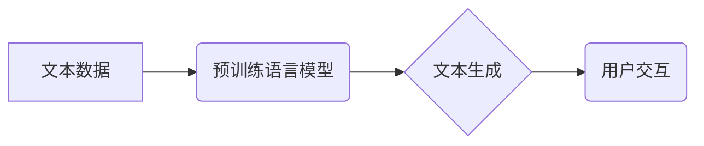

> AIGC, ChatGPT, 自然语言处理, 语言模型, 训练数据, 应用场景, 伦理问题

## 1. 背景介绍

人工智能（AI）技术近年来发展迅速，特别是生成式人工智能（AIGC）的兴起，为人们的生活和工作带来了革命性的改变。AIGC是指能够生成新内容的AI系统，例如文本、图像、音频、视频等。其中，ChatGPT作为一款基于Transformer架构的强大语言模型，以其流畅自然的对话能力和广泛的应用场景，迅速成为了AIGC领域的代表性产品。

ChatGPT的出现，标志着AIGC技术迈入了新的阶段，它不仅能够完成简单的文本生成任务，还可以进行更复杂的对话交互、创意写作、代码生成等，为个人开发者和企业用户提供了无限的可能性。

## 2. 核心概念与联系

### 2.1 自然语言处理（NLP）

自然语言处理（NLP）是人工智能的一个分支，旨在使计算机能够理解、处理和生成人类语言。NLP技术涵盖了文本分析、语音识别、机器翻译等多个领域。

### 2.2 语言模型

语言模型是NLP领域的核心技术之一，它通过学习大量的文本数据，建立语言的统计规律和语法结构，从而能够预测下一个词语或句子。

### 2.3 Transformer 架构

Transformer是一种新型的神经网络架构，它通过自注意力机制（Self-Attention）能够捕捉文本中的长距离依赖关系，从而提高了语言模型的性能。

**Mermaid 流程图**

## 3. 核心算法原理 & 具体操作步骤

### 3.1 算法原理概述

ChatGPT基于Transformer架构，采用自监督学习的方式进行预训练。预训练阶段，模型通过大量的文本数据学习语言的统计规律和语法结构，从而获得强大的语言理解和生成能力。

在微调阶段，模型根据特定任务的数据进行训练，例如对话生成、文本摘要、机器翻译等。微调过程可以进一步提升模型在特定领域的性能。

### 3.2 算法步骤详解

1. **数据预处理:** 将文本数据进行清洗、分词、标记等处理，使其能够被模型理解。
2. **模型训练:** 使用预训练的语言模型作为基础，根据特定任务的数据进行微调训练。
3. **模型评估:** 使用测试数据评估模型的性能，例如准确率、流畅度、多样性等。
4. **模型部署:** 将训练好的模型部署到服务器或云平台，供用户使用。

### 3.3 算法优缺点

**优点:**

* 强大的语言理解和生成能力
* 可适应多种任务场景
* 训练效率高

**缺点:**

* 训练数据量大，需要大量的计算资源
* 模型参数量大，部署成本高
* 存在潜在的偏见和错误

### 3.4 算法应用领域

* **对话系统:** 开发更智能、更自然的对话机器人
* **文本生成:** 自动生成新闻、文章、故事等文本内容
* **机器翻译:** 实现更高质量的机器翻译
* **代码生成:** 自动生成代码片段，提高开发效率
* **教育领域:** 提供个性化学习辅导

## 4. 数学模型和公式 & 详细讲解 & 举例说明

### 4.1 数学模型构建

ChatGPT的核心是Transformer架构，它利用自注意力机制来捕捉文本中的长距离依赖关系。

**自注意力机制**

自注意力机制可以计算每个词语与其他词语之间的相关性，从而理解句子中的语义关系。

**公式:**

$$
Attention(Q, K, V) = softmax(\frac{QK^T}{\sqrt{d_k}})V
$$

其中：

* $Q$：查询矩阵
* $K$：键矩阵
* $V$：值矩阵
* $d_k$：键向量的维度
* $softmax$：softmax函数

### 4.2 公式推导过程

自注意力机制的公式推导过程较为复杂，涉及到矩阵运算、线性变换等数学概念。

### 4.3 案例分析与讲解

通过自注意力机制，ChatGPT能够理解句子中的上下文信息，从而生成更流畅、更自然的文本。

例如，在句子“我爱吃苹果”中，自注意力机制可以计算“我”与“苹果”之间的相关性，从而理解“我”喜欢吃“苹果”。

## 5. 项目实践：代码实例和详细解释说明

### 5.1 开发环境搭建

* Python 3.7+
* TensorFlow 或 PyTorch
* CUDA 和 cuDNN

### 5.2 源代码详细实现

ChatGPT的源代码开源，可以从GitHub上下载。

### 5.3 代码解读与分析

ChatGPT的代码主要包含以下部分：

* 模型架构定义
* 数据加载和预处理
* 模型训练和评估
* 模型部署

### 5.4 运行结果展示

运行ChatGPT的代码，可以生成各种类型的文本内容，例如对话、故事、诗歌等。

## 6. 实际应用场景

### 6.1 文本生成

ChatGPT可以用于自动生成各种类型的文本内容，例如新闻报道、产品描述、广告文案等。

### 6.2 对话系统

ChatGPT可以用于开发更智能、更自然的对话机器人，例如客服机器人、聊天机器人等。

### 6.3 教育领域

ChatGPT可以用于提供个性化学习辅导，例如回答学生的问题、生成练习题等。

### 6.4 未来应用展望

随着AIGC技术的不断发展，ChatGPT的应用场景将会更加广泛，例如：

* **内容创作:** 自动生成小说、剧本、歌曲等创意内容
* **代码生成:** 自动生成更复杂的代码片段，提高开发效率
* **个性化服务:** 提供更加个性化的产品和服务

## 7. 工具和资源推荐

### 7.1 学习资源推荐

* **书籍:**

    * 《深度学习》
    * 《自然语言处理》

* **在线课程:**

    * Coursera
    * edX

### 7.2 开发工具推荐

* **TensorFlow:** 开源深度学习框架
* **PyTorch:** 开源深度学习框架
* **Hugging Face:** 提供预训练模型和工具

### 7.3 相关论文推荐

* **Attention Is All You Need:** https://arxiv.org/abs/1706.03762

## 8. 总结：未来发展趋势与挑战

### 8.1 研究成果总结

ChatGPT的出现，标志着AIGC技术迈入了新的阶段，它为人们的生活和工作带来了革命性的改变。

### 8.2 未来发展趋势

* **模型规模更大:** 未来AIGC模型将会更加庞大，拥有更强的语言理解和生成能力。
* **多模态生成:** AIGC模型将会能够生成多种类型的媒体内容，例如文本、图像、音频、视频等。
* **个性化定制:** AIGC模型将会更加个性化，能够根据用户的需求生成定制化的内容。

### 8.3 面临的挑战

* **数据安全和隐私:** AIGC模型的训练需要大量的文本数据，如何保证数据安全和隐私是一个重要的挑战。
* **算法偏见:** AIGC模型可能会继承训练数据中的偏见，如何解决算法偏见是一个重要的研究方向。
* **伦理问题:** AIGC技术的发展可能会带来一些伦理问题，例如内容造假、信息操控等，需要社会各界共同探讨和解决。

### 8.4 研究展望

未来，AIGC技术将会继续发展，为人们带来更多新的应用场景和价值。

## 9. 附录：常见问题与解答

**常见问题:**

* ChatGPT的训练数据是什么？
* ChatGPT的模型参数量是多少？
* 如何使用ChatGPT进行文本生成？

**解答:**

* ChatGPT的训练数据包括大量的文本数据，例如书籍、文章、代码等。
* ChatGPT的模型参数量非常大，具体数量取决于模型的版本。
* 使用ChatGPT进行文本生成，可以参考官方文档或开源代码进行操作。

作者：禅与计算机程序设计艺术 / Zen and the Art of Computer Programming 
<end_of_turn>