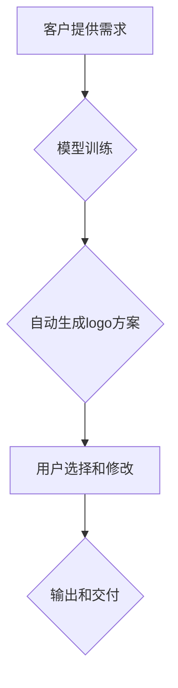

> AIGC, logo 设计, 生成式模型, 图像生成, 深度学习, 算法原理

## 1. 背景介绍

在当今数字时代，视觉识别和品牌识别日益重要。一个简洁、独特、易记的logo能够有效地传达品牌理念，提升品牌形象，并吸引目标客户。传统的logo设计流程通常需要设计师花费大量时间和精力进行构思、绘制和修改，这对于个人创业者和小型企业来说往往成本高昂且效率低下。

近年来，随着人工智能（AI）技术的飞速发展，特别是生成式人工智能（AIGC）的兴起，logo设计领域也迎来了革命性的变革。AIGC能够利用深度学习算法，从海量数据中学习logo设计规律，并自动生成符合特定风格和要求的logo设计方案。这为个人和企业提供了快速、便捷、经济高效的logo设计解决方案。

## 2. 核心概念与联系

**2.1  AIGC 简介**

AIGC是指利用人工智能技术自动生成各种创意内容，包括文本、图像、音频、视频等。它基于深度学习算法，能够学习和理解人类的创作模式，并生成具有原创性和艺术性的内容。

**2.2  logo 设计流程**

传统的logo设计流程通常包括以下几个步骤：

1. **需求分析:** 了解客户的品牌理念、目标受众、行业特点等信息。
2. **构思阶段:** 设计师根据需求分析结果，进行创意构思和草图绘制。
3. **设计阶段:** 根据草图，使用设计软件进行logo的最终设计和制作。
4. **修改和完善:** 根据客户反馈，对logo进行修改和完善。
5. **输出和交付:** 将最终设计好的logo以多种格式输出，并交付给客户。

**2.3  AIGC 在logo 设计中的应用**

AIGC可以应用于logo设计的各个阶段，例如：

* **自动生成logo创意:** AIGC模型可以根据客户提供的关键词、风格偏好等信息，自动生成多种不同的logo创意方案。
* **个性化logo定制:** AIGC可以根据客户的具体需求，定制个性化的logo设计方案。
* **logo风格转换:** AIGC可以将现有logo转换为不同的风格，例如从简约风格转换为复古风格。

**2.4  AIGC logo 设计流程**

AIGClogo设计流程通常包括以下几个步骤：

1. **输入需求:** 客户提供logo设计需求，包括品牌名称、行业、风格偏好等信息。
2. **模型训练:** AIGC模型根据训练数据，学习logo设计规律。
3. **自动生成logo方案:** AIGC模型根据客户需求，自动生成多种不同的logo方案。
4. **用户选择和修改:** 用户从生成的logo方案中选择最合适的方案，并进行必要的修改和完善。
5. **输出和交付:** 将最终设计好的logo以多种格式输出，并交付给客户。



## 3. 核心算法原理 & 具体操作步骤

### 3.1  算法原理概述

AIGClogo设计的核心算法通常是基于生成对抗网络（GAN）的。GAN由两个网络组成：生成器和鉴别器。

* **生成器:** 负责生成新的logo设计方案。
* **鉴别器:** 负责判断生成的logo设计方案是否真实，或者是由生成器生成的。

生成器和鉴别器之间进行对抗训练，生成器不断改进生成logo的设计方案，而鉴别器不断提高识别生成的logo的能力。最终，生成器能够生成逼真、高质量的logo设计方案。

### 3.2  算法步骤详解

1. **数据准备:** 收集大量logo设计数据，包括不同风格、不同行业的logo设计。
2. **模型构建:** 建立GAN模型，包括生成器和鉴别器网络结构。
3. **模型训练:** 利用收集到的logo设计数据，对GAN模型进行训练。
4. **生成logo设计方案:** 根据客户需求，输入相应的关键词和风格偏好，让生成器生成logo设计方案。
5. **方案评估和选择:** 对生成的logo设计方案进行评估，选择最合适的方案。

### 3.3  算法优缺点

**优点:**

* **自动生成创意:** AIGC能够自动生成多种不同的logo创意方案，为设计师提供灵感和参考。
* **快速高效:** AIGC能够快速生成logo设计方案，节省设计师的时间和精力。
* **个性化定制:** AIGC可以根据客户的具体需求，定制个性化的logo设计方案。

**缺点:**

* **缺乏艺术感:** AIGC生成的logo设计方案可能缺乏艺术感和创意，需要设计师进行修改和完善。
* **数据依赖:** AIGC模型的性能取决于训练数据的质量，如果训练数据不足或质量不高，生成的logo设计方案可能不理想。
* **伦理问题:** AIGC生成的logo设计方案可能存在版权问题，需要谨慎使用。

### 3.4  算法应用领域

AIGClogo设计算法可以应用于以下领域：

* **企业品牌设计:** 为企业设计独特的品牌logo。
* **个人品牌设计:** 为个人设计师、艺术家等设计个性化的品牌logo。
* **产品设计:** 为产品设计独特的logo标识。
* **教育培训:** 用于logo设计课程的教学和练习。

## 4. 数学模型和公式 & 详细讲解 & 举例说明

### 4.1  数学模型构建

GAN模型的核心是生成器和鉴别器之间的对抗训练过程。

**4.1.1 生成器网络:**

生成器网络通常是一个神经网络，其输入是一个随机噪声向量，输出是一个logo设计方案的图像。

**4.1.2 鉴别器网络:**

鉴别器网络也是一个神经网络，其输入是一个logo设计方案的图像，输出一个判断该图像是否为真实logo的概率值。

### 4.2  公式推导过程

GAN模型的训练目标是让生成器生成逼真的logo设计方案，同时让鉴别器难以区分真实logo和生成logo。

**4.2.1 生成器损失函数:**

$$
L_G = -E_{z \sim p_z(z)}[log(D(G(z)))]
$$

其中：

* $G(z)$ 是生成器生成的logo设计方案图像。
* $D(x)$ 是鉴别器对图像 $x$ 的判断概率。
* $p_z(z)$ 是随机噪声向量的分布。

**4.2.2 鉴别器损失函数:**

$$
L_D = -E_{x \sim p_{data}(x)}[log(D(x))] - E_{z \sim p_z(z)}[log(1 - D(G(z)))]
$$

其中：

* $p_{data}(x)$ 是真实logo设计方案图像的分布。

**4.2.3 训练过程:**

GAN模型的训练过程是交替训练生成器和鉴别器。首先训练鉴别器，使其能够区分真实logo和生成logo。然后训练生成器，使其能够生成逼真的logo设计方案，以欺骗鉴别器。

### 4.3  案例分析与讲解

**4.3.1 案例:**

假设我们使用GAN模型生成一个科技公司的logo设计方案。

**4.3.2 分析:**

我们可以根据客户提供的关键词，例如“科技”、“创新”、“未来”等，训练GAN模型。模型会学习这些关键词与logo设计风格之间的关系，并生成符合这些关键词的logo设计方案。

**4.3.3 解释:**

通过训练GAN模型，我们可以生成多种不同的科技公司logo设计方案，并根据客户的喜好进行选择。

## 5. 项目实践：代码实例和详细解释说明

### 5.1  开发环境搭建

* **操作系统:** Windows/macOS/Linux
* **编程语言:** Python
* **深度学习框架:** TensorFlow/PyTorch
* **其他工具:** Git、Jupyter Notebook

### 5.2  源代码详细实现

```python
# 导入必要的库
import tensorflow as tf

# 定义生成器网络
def generator(latent_dim):
    # ...

# 定义鉴别器网络
def discriminator(img_shape):
    # ...

# 定义损失函数和优化器
# ...

# 训练GAN模型
# ...

# 生成logo设计方案
# ...
```

### 5.3  代码解读与分析

* **生成器网络:** 生成器网络负责生成logo设计方案的图像。网络结构可以根据实际需求进行调整。
* **鉴别器网络:** 鉴别器网络负责判断图像是否为真实logo。网络结构也可以根据实际需求进行调整。
* **损失函数和优化器:** 损失函数用于衡量生成器和鉴别器的性能，优化器用于更新网络参数。
* **训练过程:** GAN模型的训练过程是交替训练生成器和鉴别器。

### 5.4  运行结果展示

运行代码后，可以生成多种不同的logo设计方案。

## 6. 实际应用场景

### 6.1  企业品牌设计

AIGClogo设计可以帮助企业快速、高效地设计出独特的品牌logo，提升品牌形象和辨识度。

### 6.2  个人品牌设计

AIGClogo设计可以帮助个人设计师、艺术家等设计个性化的品牌logo，打造个人品牌形象。

### 6.3  产品设计

AIGClogo设计可以帮助产品设计师设计独特的产品logo标识，提升产品吸引力和辨识度。

### 6.4  未来应用展望

随着AIGC技术的不断发展，logo设计领域将迎来更多创新应用，例如：

* **动态logo设计:** 生成动态、交互式的logo设计方案。
* **多平台logo适配:** 自动生成不同平台（例如网站、社交媒体、移动应用）适配的logo设计方案。
* **个性化logo定制:** 基于用户画像和行为数据，生成个性化的logo设计方案。

## 7. 工具和资源推荐

### 7.1  学习资源推荐

* **书籍:**
    * 《深度学习》
    * 《生成对抗网络》
* **在线课程:**
    * Coursera: 深度学习
    * Udacity: 生成对抗网络
* **博客和论坛:**
    * TensorFlow博客
    * PyTorch论坛

### 7.2  开发工具推荐

* **深度学习框架:** TensorFlow, PyTorch
* **图像处理库:** OpenCV, Pillow
* **代码编辑器:** VS Code, Atom

### 7.3  相关论文推荐

* **Generative Adversarial Networks**
* **Deep Convolutional Generative Adversarial Networks for Image Synthesis**
* **Progressive Growing of GANs for Improved Quality, Stability, and Variation**

## 8. 总结：未来发展趋势与挑战

### 8.1  研究成果总结

AIGClogo设计技术取得了显著进展，能够自动生成逼真的logo设计方案，为设计师和企业提供了新的创作工具和解决方案。

### 8.2  未来发展趋势

* **模型性能提升:** 未来AIGClogo设计模型将更加强大，能够生成更加逼真、创意的logo设计方案。
* **应用场景拓展:** AIGClogo设计将应用于更多领域，例如动态logo设计、多平台logo适配等。
* **个性化定制:** AIGClogo设计将更加注重个性化定制，根据用户需求生成更加独特的logo设计方案。

### 8.3  面临的挑战

* **数据质量:** AIGClogo设计模型的性能取决于训练数据的质量，收集高质量的logo设计数据仍然是一个挑战。
* **艺术性:** AIGC生成的logo设计方案可能缺乏艺术感和创意，需要设计师进行修改和完善。
* **伦理问题:** AIGC生成的logo设计方案可能存在版权问题，需要谨慎使用。

### 8.4  研究展望

未来研究将重点关注以下几个方面：

* **提高模型生成创意能力:** 研究更有效的生成算法，提高AIGClogo设计模型的创意能力