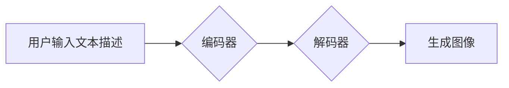

> AIGC, Midjourney, 文生图, AI艺术, 设计工具, 图像生成, 创作流程

## 1. 背景介绍

近年来，人工智能（AI）技术飞速发展，特别是生成式AI模型的突破性进展，为创意产业带来了前所未有的机遇。其中，文生图技术作为AI领域的一颗新星，以其能够根据文本描述生成逼真图像的能力，迅速吸引了广泛的关注。

Midjourney，作为一款基于AI的文本到图像生成工具，凭借其出色的图像质量和易于使用的界面，迅速成为了业界热门话题。它不仅为设计师、艺术家提供了强大的创作工具，也为普通人打开了进入艺术创作的大门。

## 2. 核心概念与联系

**2.1 文生图技术概述**

文生图技术，即文本到图像生成技术，是指利用人工智能算法将文本描述转化为图像的生成过程。它融合了自然语言处理（NLP）和计算机视觉（CV）等多个领域的技术，通过训练大量的文本图像数据对，学习文本和图像之间的映射关系，从而实现文本描述到图像生成的转换。

**2.2 Midjourney 的工作原理**

Midjourney 基于 Transformer 架构的深度学习模型，其核心是利用编码器-解码器结构来完成文本到图像的转换。

* **编码器:** 将输入的文本描述编码成一个向量表示，捕捉文本中的语义信息。
* **解码器:** 根据编码后的文本向量，生成图像像素信息，最终生成图像。

**2.3 Midjourney 的优势**

* **图像质量高:** Midjourney 生成的图像具有逼真度和艺术感，能够满足专业设计和艺术创作的需求。
* **易于使用:** Midjourney 提供了简洁易用的界面，即使没有编程经验的用户也能轻松上手。
* **创意无限:** Midjourney 可以根据用户的文本描述生成各种各样的图像，激发用户的创意灵感。

**Mermaid 流程图**

## 3. 核心算法原理 & 具体操作步骤

**3.1 算法原理概述**

Midjourney 的核心算法是基于 Transformer 架构的深度学习模型，其主要原理是通过学习文本和图像之间的映射关系，实现文本描述到图像生成的转换。

Transformer 模型的核心是注意力机制，它能够捕捉文本中不同词语之间的关系，从而更好地理解文本的语义信息。

**3.2 算法步骤详解**

1. **数据预处理:** 将文本描述和对应的图像数据进行预处理，例如文本分词、图像裁剪等。
2. **模型训练:** 利用训练数据，训练 Transformer 模型，使其能够学习文本和图像之间的映射关系。
3. **文本编码:** 将用户输入的文本描述编码成一个向量表示，捕捉文本中的语义信息。
4. **图像生成:** 根据编码后的文本向量，解码器生成图像像素信息，最终生成图像。

**3.3 算法优缺点**

**优点:**

* 能够生成高质量的图像。
* 能够理解复杂的文本描述。
* 能够进行图像的编辑和修改。

**缺点:**

* 训练模型需要大量的计算资源和时间。
* 模型的输出结果可能存在偏差或错误。
* 模型的生成图像可能缺乏真实感。

**3.4 算法应用领域**

* **艺术创作:** 设计师、艺术家可以使用 Midjourney 生成各种各样的图像，激发创意灵感。
* **游戏开发:** 游戏开发人员可以使用 Midjourney 生成游戏场景、角色和道具。
* **广告设计:** 广告公司可以使用 Midjourney 生成吸引人的广告图片。
* **教育培训:** 教师可以使用 Midjourney 生成教学素材，帮助学生更好地理解知识。

## 4. 数学模型和公式 & 详细讲解 & 举例说明

**4.1 数学模型构建**

Midjourney 的数学模型主要基于 Transformer 架构，其核心是利用注意力机制来捕捉文本中不同词语之间的关系。

**4.2 公式推导过程**

Transformer 模型的注意力机制使用以下公式计算每个词语对其他词语的注意力权重：

$$
Attention(Q, K, V) = softmax(\frac{QK^T}{\sqrt{d_k}})V
$$

其中：

* $Q$：查询矩阵
* $K$：键矩阵
* $V$：值矩阵
* $d_k$：键向量的维度
* $softmax$：softmax 函数

**4.3 案例分析与讲解**

假设我们输入文本描述 "一只可爱的猫在草地上玩耍"，Transformer 模型会将每个词语编码成一个向量表示，然后利用注意力机制计算每个词语对其他词语的注意力权重。

例如，"猫" 这个词语会对 "可爱"、"玩耍" 等词语有较高的注意力权重，因为它与这些词语语义相关。

通过注意力机制，Transformer 模型能够更好地理解文本的语义信息，从而生成更符合文本描述的图像。

## 5. 项目实践：代码实例和详细解释说明

**5.1 开发环境搭建**

为了使用 Midjourney，需要在 Discord 平台上加入其官方服务器。

**5.2 源代码详细实现**

Midjourney 的源代码是开源的，可以从 GitHub 上获取。

**5.3 代码解读与分析**

Midjourney 的源代码主要包含以下几个部分：

* **数据预处理模块:** 对文本描述和图像数据进行预处理。
* **模型训练模块:** 利用训练数据训练 Transformer 模型。
* **文本编码模块:** 将用户输入的文本描述编码成一个向量表示。
* **图像生成模块:** 根据编码后的文本向量，解码器生成图像像素信息。

**5.4 运行结果展示**

在 Discord 上使用 Midjourney 的命令行接口，可以输入文本描述并生成相应的图像。

## 6. 实际应用场景

**6.1 设计领域**

设计师可以使用 Midjourney 生成各种各样的设计素材，例如图标、logo、海报等。

**6.2 艺术领域**

艺术家可以使用 Midjourney 生成艺术作品，例如绘画、雕塑、动画等。

**6.3 教育领域**

教师可以使用 Midjourney 生成教学素材，例如图表、插图、动画等。

**6.4 未来应用展望**

随着 AI 技术的不断发展，Midjourney 将有更多新的应用场景，例如：

* **虚拟现实 (VR) 和增强现实 (AR) 应用:** 生成逼真的虚拟场景和虚拟物品。
* **个性化定制:** 根据用户的需求生成个性化的产品和服务。
* **科学研究:** 用于模拟和预测自然现象。

## 7. 工具和资源推荐

**7.1 学习资源推荐**

* **论文:** "Attention Is All You Need"
* **博客:** OpenAI Blog
* **在线课程:** Coursera, Udemy

**7.2 开发工具推荐**

* **Python:** Midjourney 的源代码是用 Python 编写的。
* **TensorFlow:** TensorFlow 是一个开源的机器学习框架。
* **PyTorch:** PyTorch 是另一个开源的机器学习框架。

**7.3 相关论文推荐**

* "Generative Pre-trained Transformer 2"
* "DALL-E: Creating Images from Text"

## 8. 总结：未来发展趋势与挑战

**8.1 研究成果总结**

Midjourney 的出现标志着文生图技术取得了重大突破，为创意产业带来了新的机遇。

**8.2 未来发展趋势**

未来，文生图技术将朝着以下方向发展：

* **图像质量提升:** 生成更逼真、更具艺术感的图像。
* **控制性增强:** 用户能够更精确地控制图像的生成结果。
* **应用场景拓展:** 应用到更多新的领域，例如医疗、教育、科学研究等。

**8.3 面临的挑战**

文生图技术也面临着一些挑战：

* **数据安全:** 文生图模型的训练需要大量的图像数据，如何保证数据安全是一个重要问题。
* **伦理问题:** 文生图技术可能被用于生成虚假信息或进行恶意攻击，需要制定相应的伦理规范。
* **技术瓶颈:** 文生图技术还存在一些技术瓶颈，例如如何生成更复杂、更具创意的图像。

**8.4 研究展望**

未来，研究人员将继续致力于解决文生图技术面临的挑战，推动其更快、更安全的应用。

## 9. 附录：常见问题与解答

**9.1 如何使用 Midjourney？**

需要在 Discord 平台上加入 Midjourney 的官方服务器，然后使用命令行接口输入文本描述并生成图像。

**9.2 Midjourney 的图像质量如何？**

Midjourney 生成的图像具有逼真度和艺术感，能够满足专业设计和艺术创作的需求。

**9.3 Midjourney 是否开源？**

是的，Midjourney 的源代码是开源的。

**9.4 Midjourney 的应用场景有哪些？**

Midjourney 的应用场景非常广泛，例如设计、艺术、教育、游戏开发等。

作者：禅与计算机程序设计艺术 / Zen and the Art of Computer Programming

<end_of_turn>