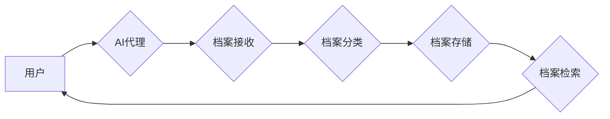

> AI代理，工作流，档案管理，自动化，智能化，数据挖掘，机器学习

## 1. 背景介绍

随着数字化时代的发展，海量数据呈爆炸式增长，档案管理面临着巨大的挑战。传统档案管理模式依赖人工操作，效率低下，容易出现数据丢失、信息混乱等问题。人工智能（AI）技术作为新兴技术，为档案管理带来了新的机遇。

AI代理工作流（AI Agent WorkFlow）是一种利用人工智能技术实现档案管理自动化和智能化的全新模式。它通过设计智能代理，自动完成档案的接收、分类、存储、检索等一系列操作，提高档案管理效率，降低人力成本，并为档案管理提供更智能化的服务。

## 2. 核心概念与联系

**2.1 AI代理（AI Agent）**

AI代理是一种能够自主学习、决策、执行任务的软件实体。它具备以下特征：

* **自主性:** AI代理能够独立完成任务，无需人工干预。
* **智能性:** AI代理能够利用机器学习等技术，从数据中学习，提高决策能力。
* **交互性:** AI代理能够与用户和系统进行交互，获取信息和反馈。

**2.2 工作流（Workflow）**

工作流是一种描述业务流程的模型，它将业务流程分解成一系列步骤，并定义了每个步骤之间的关系。工作流可以帮助组织提高效率、降低成本，并确保业务流程的规范化和可控性。

**2.3 AI代理工作流（AI Agent WorkFlow）**

AI代理工作流将AI代理与工作流相结合，构建了一种智能化的档案管理系统。它利用AI代理自动完成档案管理中的各个步骤，例如：

* **接收档案:** AI代理可以自动接收来自不同来源的档案，并进行初步分类。
* **分类档案:** AI代理可以利用机器学习算法，从档案内容中提取关键词和特征，自动将档案分类到不同的类别。
* **存储档案:** AI代理可以将分类后的档案存储到相应的数据库或文件系统中。
* **检索档案:** 用户可以通过自然语言或关键词查询档案，AI代理可以根据查询条件，快速检索到相关档案。

**2.4 架构图**



## 3. 核心算法原理 & 具体操作步骤

### 3.1  算法原理概述

AI代理工作流的核心算法主要包括：

* **自然语言处理（NLP）:** 用于理解和处理人类语言，例如从档案文本中提取关键词和主题。
* **机器学习（ML）:** 用于训练模型，识别档案类型、预测档案价值等。
* **知识图谱（KG）:** 用于构建档案知识体系，实现档案之间的关联和推理。

### 3.2  算法步骤详解

1. **数据预处理:** 对档案数据进行清洗、格式化和转换，使其适合算法处理。
2. **特征提取:** 利用NLP算法，从档案文本中提取关键词、主题、作者等特征。
3. **模型训练:** 利用ML算法，训练模型，识别档案类型、预测档案价值等。
4. **档案分类:** 将新接收的档案输入模型，根据模型预测结果进行分类。
5. **档案存储:** 将分类后的档案存储到相应的数据库或文件系统中。
6. **档案检索:** 用户可以通过自然语言或关键词查询档案，AI代理根据查询条件，从数据库中检索相关档案。

### 3.3  算法优缺点

**优点:**

* **自动化:** 自动化档案管理流程，提高效率。
* **智能化:** 利用AI技术，实现档案的智能分类、检索等功能。
* **准确性:** 机器学习算法可以提高档案分类的准确性。
* **可扩展性:** 可以根据需要扩展功能，满足不同档案管理需求。

**缺点:**

* **数据依赖:** 算法性能依赖于训练数据的质量。
* **技术复杂性:** 需要专业的技术人员进行开发和维护。
* **成本投入:** 建设AI代理工作流系统需要一定的成本投入。

### 3.4  算法应用领域

AI代理工作流可以应用于各种档案管理领域，例如：

* **政府档案管理:** 自动化政府文件分类、检索和管理。
* **企业档案管理:** 自动化企业文档管理，提高企业运营效率。
* **图书馆档案管理:** 自动化图书分类、检索和管理。
* **历史档案管理:** 自动化历史文献整理、分类和研究。

## 4. 数学模型和公式 & 详细讲解 & 举例说明

### 4.1  数学模型构建

**4.1.1 档案分类模型**

假设我们有一个档案分类模型，它将档案分类为不同的类别，例如“法律文件”、“财务文件”和“人事文件”。我们可以使用一个多分类逻辑回归模型来实现这个分类任务。

**4.1.2 档案检索模型**

我们可以使用一个基于TF-IDF（Term Frequency-Inverse Document Frequency）的文本检索模型来实现档案检索功能。TF-IDF是一种统计方法，用于衡量一个词语在某个文档中的重要性。

### 4.2  公式推导过程

**4.2.1 多分类逻辑回归模型**

多分类逻辑回归模型的输出是一个概率分布，表示档案属于不同类别的概率。假设我们有K个类别，则模型的输出为一个K维向量，每个元素代表档案属于该类别的概率。

**公式:**

$$
P(y=k|x) = \frac{e^{w_k^T x + b_k}}{\sum_{j=1}^{K} e^{w_j^T x + b_j}}
$$

其中：

* $P(y=k|x)$ 是档案属于类别k的概率。
* $x$ 是档案的特征向量。
* $w_k$ 是类别k的权重向量。
* $b_k$ 是类别k的偏置项。

**4.2.2 TF-IDF模型**

TF-IDF模型的计算公式如下：

$$
TF-IDF(t,d) = TF(t,d) \times IDF(t)
$$

其中：

* $TF(t,d)$ 是词语t在文档d中出现的频率。
* $IDF(t)$ 是词语t在整个语料库中出现的逆文档频率。

### 4.3  案例分析与讲解

**4.3.1 档案分类案例**

假设我们有一个档案分类模型，需要将法律文件、财务文件和人事文件进行分类。我们可以使用训练数据，训练一个多分类逻辑回归模型。模型的输入是档案的特征向量，例如关键词、主题、作者等。模型的输出是档案属于不同类别的概率。

**4.3.2 档案检索案例**

假设用户想要检索所有关于“合同”的档案。我们可以使用TF-IDF模型，计算“合同”在所有档案中的TF-IDF值。然后，我们可以根据TF-IDF值，从所有档案中检索出与“合同”相关的档案。

## 5. 项目实践：代码实例和详细解释说明

### 5.1  开发环境搭建

* **操作系统:** Ubuntu 20.04 LTS
* **编程语言:** Python 3.8
* **开发工具:** Jupyter Notebook
* **库依赖:**

```
pip install numpy pandas scikit-learn nltk gensim
```

### 5.2  源代码详细实现

```python
# 档案分类模型
from sklearn.linear_model import LogisticRegression
from sklearn.model_selection import train_test_split
from sklearn.metrics import accuracy_score

# 数据加载和预处理
# ...

# 特征提取
# ...

# 模型训练
X_train, X_test, y_train, y_test = train_test_split(X, y, test_size=0.2)
model = LogisticRegression()
model.fit(X_train, y_train)

# 模型评估
y_pred = model.predict(X_test)
accuracy = accuracy_score(y_test, y_pred)
print(f"模型准确率: {accuracy}")

# 档案检索模型
from sklearn.feature_extraction.text import TfidfVectorizer

# 数据加载和预处理
# ...

# TF-IDF向量化
vectorizer = TfidfVectorizer()
X = vectorizer.fit_transform(documents)

# 档案检索
query = "合同"
query_vector = vectorizer.transform([query])
similarity_scores = cosine_similarity(query_vector, X)
top_k_indices = similarity_scores.argsort()[-5:][::-1]
top_k_documents = [documents[i] for i in top_k_indices]
print(f"与查询 '{query}' 最相关的档案: {top_k_documents}")
```

### 5.3  代码解读与分析

* **档案分类模型:** 使用多分类逻辑回归模型进行档案分类。
* **档案检索模型:** 使用TF-IDF模型进行档案检索。
* **代码实现:** 代码展示了档案分类和档案检索模型的实现过程，包括数据加载、预处理、特征提取、模型训练、模型评估和档案检索等步骤。

### 5.4  运行结果展示

* **档案分类模型:** 模型的准确率可以根据训练数据和模型参数进行调整。
* **档案检索模型:** 运行代码后，会输出与查询“合同”最相关的档案列表。

## 6. 实际应用场景

### 6.1  政府档案管理

AI代理工作流可以帮助政府部门自动化处理大量档案，提高档案管理效率。例如，可以自动分类政府文件，快速检索相关文件，并进行数字化保存。

### 6.2  企业档案管理

企业可以利用AI代理工作流，自动管理企业文档，例如合同、财务报表、员工信息等。可以实现文档的自动分类、检索、版本控制和安全管理。

### 6.3  图书馆档案管理

图书馆可以利用AI代理工作流，自动管理图书信息，例如图书分类、检索、借阅记录等。可以提高图书馆服务效率，并为读者提供更便捷的借阅体验。

### 6.4  未来应用展望

AI代理工作流在档案管理领域的应用前景广阔，未来可以实现以下功能：

* **智能化档案分析:** 利用机器学习算法，从档案数据中挖掘出隐藏的知识和趋势。
* **档案知识图谱构建:** 建立档案知识图谱，实现档案之间的关联和推理，为档案研究提供新的视角。
* **个性化档案服务:** 根据用户的需求，提供个性化的档案检索和展示服务。

## 7. 工具和资源推荐

### 7.1  学习资源推荐

* **书籍:**
    * 《深度学习》
    * 《机器学习实战》
    * 《自然语言处理入门》
* **在线课程:**
    * Coursera: 深度学习
    * edX: 机器学习
    * Udacity: 自然语言处理

### 7.2  开发工具推荐

* **Python:** 强大的编程语言，广泛应用于数据科学和人工智能领域。
* **Jupyter Notebook:** 用于交互式编程和数据可视化的工具。
* **Scikit-learn:** Python机器学习库。
* **NLTK:** Python自然语言处理库。
* **Gensim:** Python主题建模库。

### 7.3  相关论文推荐

* **《Attention Is All You Need》**
* **《BERT: Pre-training of Deep Bidirectional Transformers for Language Understanding》**
* **《Knowledge Graph Embedding: A Survey》**

## 8. 总结：未来发展趋势与挑战

### 8.1  研究成果总结

AI代理工作流在档案管理领域取得了显著的成果，例如提高了档案管理效率、准确性，并为档案研究提供了新的视角。

### 8.2  未来发展趋势

* **更智能化的档案管理:** 利用更先进的AI算法，实现