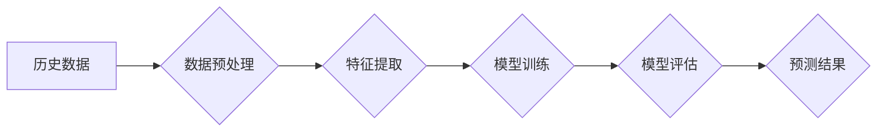

> 深度学习，电力预测，时间序列分析，神经网络，LSTM，GRU，Transformer

## 1. 背景介绍

随着全球能源需求的不断增长和可再生能源的快速发展，电力系统面临着前所未有的挑战。准确的电力预测对于保障电力系统稳定运行、优化能源调度、降低运营成本至关重要。传统电力预测方法通常基于统计模型和经验规则，难以捕捉电力负荷的复杂非线性特征。近年来，深度学习算法凭借其强大的学习能力和对复杂模式的建模能力，在电力预测领域取得了显著的成果。

## 2. 核心概念与联系

深度学习算法的核心是多层神经网络，通过逐层提取特征，学习数据中的复杂模式。在电力预测中，深度学习算法通常用于预测未来电力负荷、风电出力、太阳能发电量等。

**2.1 深度学习算法**

深度学习算法是一种机器学习算法，其特点是使用多层神经网络进行特征提取和模式识别。常见的深度学习算法包括：

* **卷积神经网络 (CNN)**：擅长处理图像和时间序列数据，在电力图像识别和故障诊断方面应用广泛。
* **循环神经网络 (RNN)**：能够处理序列数据，例如电力负荷历史数据，在电力负荷预测方面表现出色。
* **长短期记忆网络 (LSTM)**：一种改进的 RNN，能够更好地处理长序列数据，在电力负荷预测和风电出力预测方面具有优势。
* **门控循环单元 (GRU)**：与 LSTM 相似，但结构更简单，在电力负荷预测方面也取得了不错的效果。
* **Transformer**：一种基于注意力机制的神经网络架构，能够处理长序列数据，在电力负荷预测和风电出力预测方面展现出强大的潜力。

**2.2 电力预测**

电力预测是指根据历史数据和当前状态预测未来电力需求或发电量。电力预测可以分为以下几种类型：

* **短期预测 (短时预测)**：预测未来几分钟到几小时内的电力负荷或发电量。
* **中期预测 (中时预测)**：预测未来几小时到几天内的电力负荷或发电量。
* **长期预测 (长时预测)**：预测未来几天到几周甚至几年的电力负荷或发电量。

**2.3 核心架构**

深度学习算法在电力预测中的应用通常遵循以下架构：



## 3. 核心算法原理 & 具体操作步骤

### 3.1  算法原理概述

深度学习算法的核心是多层神经网络，通过逐层提取特征，学习数据中的复杂模式。在电力预测中，深度学习算法通常用于预测未来电力负荷、风电出力、太阳能发电量等。

### 3.2  算法步骤详解

1. **数据收集和预处理**: 收集历史电力负荷、天气数据、经济数据等相关数据，并进行清洗、转换、归一化等预处理操作。
2. **特征提取**: 从原始数据中提取有用的特征，例如时间特征、天气特征、经济特征等。
3. **模型选择**: 根据预测任务和数据特点选择合适的深度学习算法，例如 LSTM、GRU、Transformer 等。
4. **模型训练**: 使用训练数据训练深度学习模型，调整模型参数，使模型能够准确预测未来电力负荷等。
5. **模型评估**: 使用测试数据评估模型的预测精度，并根据评估结果进行模型调优。
6. **预测结果输出**: 将训练好的模型应用于实际场景，预测未来电力负荷等。

### 3.3  算法优缺点

**优点**:

* 能够捕捉电力负荷的复杂非线性特征。
* 学习能力强，预测精度高。
* 可处理大规模数据。

**缺点**:

* 训练数据量大，需要大量计算资源。
* 模型解释性差，难以理解模型的决策过程。
* 对数据质量要求高，数据噪声会影响模型性能。

### 3.4  算法应用领域

深度学习算法在电力预测领域应用广泛，例如：

* **电力负荷预测**: 预测未来电力需求，帮助电力系统优化调度和资源配置。
* **风电出力预测**: 预测未来风力发电量，帮助风电场优化发电计划和并网控制。
* **太阳能发电量预测**: 预测未来太阳能发电量，帮助太阳能发电站优化发电计划和并网控制。
* **电力故障预测**: 预测电力系统故障的发生时间和地点，帮助电力公司提前预防和处理故障。

## 4. 数学模型和公式 & 详细讲解 & 举例说明

### 4.1  数学模型构建

深度学习算法的数学模型通常基于神经网络，其核心是激活函数、权重和偏置。

**激活函数**: 用于引入非线性，使神经网络能够学习复杂模式。常见的激活函数包括 sigmoid 函数、ReLU 函数、tanh 函数等。

**权重**: 用于连接神经元，控制信息传递强度。

**偏置**: 用于调整神经元的输出值。

### 4.2  公式推导过程

深度学习算法的训练过程是通过反向传播算法来优化模型参数的。反向传播算法的核心是计算损失函数对模型参数的梯度，并根据梯度更新模型参数。

**损失函数**: 用于衡量模型预测结果与真实值的差距。常见的损失函数包括均方误差 (MSE)、交叉熵损失 (Cross-Entropy Loss) 等。

**梯度**: 用于表示损失函数对模型参数的导数。

**更新规则**: 用于更新模型参数，例如随机梯度下降 (SGD) 算法、动量梯度下降 (Momentum) 算法等。

### 4.3  案例分析与讲解

以 LSTM 网络为例，其数学模型可以表示为：

$$
h_t = f_t(W_{hh}h_{t-1} + W_{xh}x_t + b_h)
$$

其中：

* $h_t$ 是时间步 t 的隐藏状态。
* $f_t$ 是 LSTM 网络的激活函数。
* $W_{hh}$ 是隐藏状态之间的权重矩阵。
* $W_{xh}$ 是输入数据与隐藏状态之间的权重矩阵。
* $x_t$ 是时间步 t 的输入数据。
* $b_h$ 是隐藏状态的偏置向量。

## 5. 项目实践：代码实例和详细解释说明

### 5.1  开发环境搭建

* Python 3.x
* TensorFlow 或 PyTorch 深度学习框架
* NumPy 科学计算库
* Pandas 数据处理库
* Matplotlib 数据可视化库

### 5.2  源代码详细实现

```python
import tensorflow as tf

# 定义 LSTM 网络模型
model = tf.keras.models.Sequential([
    tf.keras.layers.LSTM(units=64, return_sequences=True, input_shape=(timesteps, features)),
    tf.keras.layers.LSTM(units=32),
    tf.keras.layers.Dense(units=1)
])

# 编译模型
model.compile(loss='mean_squared_error', optimizer='adam')

# 训练模型
model.fit(X_train, y_train, epochs=10, batch_size=32)

# 预测结果
predictions = model.predict(X_test)
```

### 5.3  代码解读与分析

* **定义 LSTM 网络模型**: 使用 TensorFlow 的 Keras API 定义一个 LSTM 网络模型，包含两层 LSTM 层和一层全连接层。
* **编译模型**: 使用均方误差损失函数和 Adam 优化器编译模型。
* **训练模型**: 使用训练数据训练模型，设置训练轮数和批处理大小。
* **预测结果**: 使用训练好的模型预测测试数据。

### 5.4  运行结果展示

使用 Matplotlib 库可视化模型预测结果与真实值之间的差异。

## 6. 实际应用场景

深度学习算法在电力预测领域已有多种实际应用场景：

* **电力负荷预测**: 帮助电力公司优化电力调度，提高电力系统运行效率。
* **风电出力预测**: 帮助风电场优化发电计划，提高风电利用率。
* **太阳能发电量预测**: 帮助太阳能发电站优化发电计划，提高太阳能利用率。
* **电力故障预测**: 帮助电力公司提前预防和处理电力故障，提高电力系统可靠性。

### 6.4  未来应用展望

随着深度学习算法的不断发展，其在电力预测领域的应用前景十分广阔。未来，深度学习算法将能够更好地捕捉电力负荷的复杂非线性特征，提高预测精度，并应用于更多电力系统管理和运营场景。

## 7. 工具和资源推荐

### 7.1  学习资源推荐

* **书籍**:
    * 深度学习
    * 深度学习实战
* **在线课程**:
    * Coursera 深度学习课程
    * Udacity 深度学习课程

### 7.2  开发工具推荐

* **TensorFlow**: 开源深度学习框架
* **PyTorch**: 开源深度学习框架
* **Keras**: 高级深度学习 API

### 7.3  相关论文推荐

* **LSTM Networks for Time Series Forecasting**
* **Deep Learning for Power System Forecasting**
* **Transformer-Based Deep Learning for Electricity Load Forecasting**

## 8. 总结：未来发展趋势与挑战

### 8.1  研究成果总结

深度学习算法在电力预测领域取得了显著的成果，能够提高预测精度，并应用于多种电力系统管理和运营场景。

### 8.2  未来发展趋势

* **模型复杂度提升**: 开发更复杂、更强大的深度学习模型，例如 Transformer、Graph Neural Networks 等。
* **数据融合**: 将多种数据类型融合在一起，例如电力负荷数据、天气数据、经济数据等，提高预测精度。
* **解释性增强**: 研究深度学习模型的解释性，使模型的决策过程更加透明。

### 8.3  面临的挑战

* **数据质量**: 深度学习算法对数据质量要求高，数据噪声会影响模型性能。
* **计算资源**: 训练深度学习模型需要大量的计算资源。
* **模型解释性**: 深度学习模型的决策过程难以解释，这可能会阻碍其在实际应用中的推广。

### 8.4  研究展望

未来，深度学习算法在电力预测领域将继续发展，并应用于更多电力系统管理和运营场景。研究者将继续探索更复杂、更强大的深度学习模型，并解决数据质量、计算资源和模型解释性等挑战。

## 9. 附录：常见问题与解答

**Q1: 深度学习算法在电力预测中的优势是什么？**

**A1**: 深度学习算法能够捕捉电力负荷的复杂非线性特征，学习能力强，预测精度高。

**Q2: 深度学习算法在电力预测中的应用有哪些？**

**A2**: 深度学习算法在电力负荷预测、风电出力预测、太阳能发电量预测、电力故障预测等方面都有应用。

**Q3: 如何评估深度学习模型的预测精度？**

**A3**: 常用的评估指标包括均方误差 (MSE)、平均绝对误差 (MAE) 等。

**Q4: 深度学习算法在电力预测中面临哪些挑战？**

**A4**: 深度学习算法在电力预测中面临的数据质量、计算资源和模型解释性等挑战。


作者：禅与计算机程序设计艺术 / Zen and the Art of Computer Programming 
<end_of_turn>