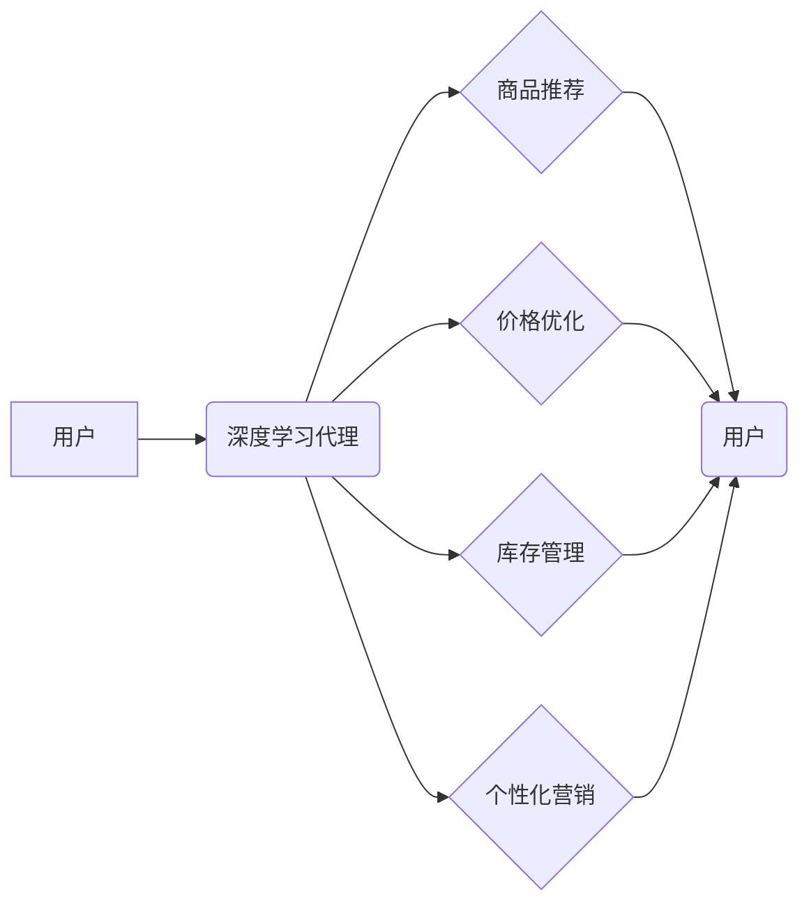

> 深度学习、代理、电子商务、推荐系统、个性化服务、强化学习

## 1. 背景介绍

电子商务行业在全球范围内蓬勃发展，用户对个性化商品推荐、精准营销和便捷购物体验的需求日益增长。深度学习作为人工智能领域的重要分支，凭借其强大的学习能力和数据处理能力，为电子商务行业带来了革命性的变革。

深度学习代理是深度学习技术在电子商务领域的应用之一，它通过学习用户行为、商品特征和市场趋势，自动完成一系列任务，例如商品推荐、价格优化、库存管理等。深度学习代理能够提供更精准、更个性化的服务，提升用户体验，并帮助企业提高运营效率和盈利能力。

## 2. 核心概念与联系

**2.1 深度学习代理**

深度学习代理是一种基于深度学习算法的智能代理，它能够通过学习用户行为、商品特征和市场趋势，自动完成一系列任务，例如：

* **商品推荐:** 根据用户的历史购买记录、浏览记录和兴趣偏好，推荐相关的商品。
* **价格优化:** 根据市场需求、竞争对手价格和库存情况，动态调整商品价格。
* **库存管理:** 预估商品需求，优化库存水平，避免缺货或积压。
* **个性化营销:** 根据用户的个人信息和行为特征，定制个性化的营销活动。

**2.2 深度学习算法**

深度学习算法是深度学习代理的核心技术，常用的深度学习算法包括：

* **卷积神经网络 (CNN):** 用于处理图像和文本数据，例如商品图片识别和文本分类。
* **循环神经网络 (RNN):** 用于处理序列数据，例如用户行为序列和商品评论序列。
* **强化学习 (RL):** 用于训练代理在特定环境中做出最优决策，例如商品推荐和价格优化。

**2.3 电子商务场景**

深度学习代理在电子商务场景中具有广泛的应用前景，例如：

* **个性化推荐:** 为用户提供更精准、更个性化的商品推荐，提升用户体验和转化率。
* **精准营销:** 根据用户的个人信息和行为特征，定制个性化的营销活动，提高营销效果。
* **智能客服:** 利用深度学习技术，构建智能客服系统，自动回答用户问题，提升客户服务效率。
* **欺诈检测:** 利用深度学习算法，识别和预防欺诈行为，保障交易安全。

**2.4 架构图**



## 3. 核心算法原理 & 具体操作步骤

### 3.1 算法原理概述

深度学习代理的核心算法是强化学习算法，它通过训练代理在特定环境中做出最优决策，以最大化奖励。强化学习算法的核心概念包括：

* **状态 (State):** 代理当前所处的环境状态。
* **动作 (Action):** 代理可以采取的行动。
* **奖励 (Reward):** 代理采取行动后获得的反馈。
* **策略 (Policy):** 代理根据当前状态选择动作的策略。

强化学习算法的目标是学习一个最优策略，使得代理在长期内获得最大的总奖励。

### 3.2 算法步骤详解

1. **环境建模:** 建立电子商务环境的模型，包括用户、商品、市场等要素。
2. **代理设计:** 设计深度学习代理，并定义其可采取的动作，例如推荐商品、调整价格等。
3. **奖励函数设计:** 设计奖励函数，定义代理采取不同动作获得的奖励。
4. **策略训练:** 使用强化学习算法，例如Q学习或深度Q网络，训练代理的策略，使其能够在环境中做出最优决策。
5. **策略评估:** 评估训练后的代理策略的性能，例如推荐准确率、转化率等。
6. **策略部署:** 将训练好的代理策略部署到实际的电子商务系统中。

### 3.3 算法优缺点

**优点:**

* **个性化推荐:** 深度学习代理能够根据用户的个性化需求，提供更精准的商品推荐。
* **动态优化:** 深度学习代理能够根据市场变化和用户行为，动态调整策略，实现持续优化。
* **自动化决策:** 深度学习代理能够自动完成决策，提高运营效率。

**缺点:**

* **数据依赖:** 深度学习代理需要大量的数据进行训练，数据质量直接影响代理的性能。
* **计算资源:** 深度学习模型训练需要大量的计算资源，成本较高。
* **解释性:** 深度学习模型的决策过程较为复杂，难以解释，缺乏透明度。

### 3.4 算法应用领域

深度学习代理在电子商务领域之外，还具有广泛的应用前景，例如：

* **金融领域:** 欺诈检测、风险评估、投资决策。
* **医疗领域:** 疾病诊断、药物研发、个性化治疗。
* **交通领域:** 自动驾驶、交通流量预测、智能交通管理。

## 4. 数学模型和公式 & 详细讲解 & 举例说明

### 4.1 数学模型构建

深度学习代理的数学模型通常基于强化学习框架，主要包括状态空间、动作空间、奖励函数和策略函数。

* **状态空间 (S):** 表示代理当前所处的环境状态，例如用户历史购买记录、商品库存情况、市场价格趋势等。
* **动作空间 (A):** 表示代理可以采取的行动，例如推荐商品、调整价格、发送营销邮件等。
* **奖励函数 (R):** 定义代理采取不同动作后获得的奖励，例如用户点击商品、购买商品、好评等。
* **策略函数 (π):** 定义代理根据当前状态选择动作的策略，例如基于价值函数的策略或基于策略梯度的策略。

### 4.2 公式推导过程

强化学习算法的目标是学习一个最优策略，使得代理在长期内获得最大的总奖励。常用的强化学习算法包括Q学习和深度Q网络。

**Q学习:**

Q学习算法通过迭代更新Q值表，Q值表表示代理在每个状态下采取每个动作获得的期望奖励。

$$Q(s,a) = Q(s,a) + \alpha [r + \gamma \max_{a'} Q(s',a') - Q(s,a)]$$

其中：

* $Q(s,a)$: 代理在状态 $s$ 下采取动作 $a$ 的Q值。
* $\alpha$: 学习率。
* $r$: 代理采取动作 $a$ 后获得的奖励。
* $\gamma$: 折扣因子。
* $s'$: 状态 $s$ 后继状态。
* $a'$: 状态 $s'$ 下最优动作。

**深度Q网络:**

深度Q网络将Q值表替换为深度神经网络，利用神经网络的学习能力，学习更复杂的Q函数。

### 4.3 案例分析与讲解

例如，在商品推荐场景中，我们可以使用深度Q网络训练一个代理，使其能够根据用户的历史购买记录和浏览记录，推荐最相关的商品。

* 状态空间: 用户的历史购买记录、浏览记录、商品类别等。
* 动作空间: 推荐不同的商品。
* 奖励函数: 用户点击推荐商品、购买推荐商品、好评等。

通过训练深度Q网络，代理能够学习到用户偏好的商品类型和推荐策略，从而提供更精准的商品推荐。

## 5. 项目实践：代码实例和详细解释说明

### 5.1 开发环境搭建

* Python 3.x
* TensorFlow 或 PyTorch 深度学习框架
* NumPy 科学计算库
* Pandas 数据处理库

### 5.2 源代码详细实现

```python
import tensorflow as tf

# 定义深度Q网络模型
class DeepQNetwork(tf.keras.Model):
    def __init__(self, state_size, action_size):
        super(DeepQNetwork, self).__init__()
        self.dense1 = tf.keras.layers.Dense(64, activation='relu')
        self.dense2 = tf.keras.layers.Dense(32, activation='relu')
        self.output = tf.keras.layers.Dense(action_size)

    def call(self, state):
        x = self.dense1(state)
        x = self.dense2(x)
        return self.output(x)

# 初始化深度Q网络模型
model = DeepQNetwork(state_size=10, action_size=5)

# 定义损失函数和优化器
loss_fn = tf.keras.losses.MeanSquaredError()
optimizer = tf.keras.optimizers.Adam(learning_rate=0.001)

# 训练模型
for epoch in range(100):
    # ... 训练循环 ...
    loss = loss_fn(target_q_values, model(states))
    gradients = optimizer.gradient(loss, model.trainable_variables)
    optimizer.apply_gradients(zip(gradients, model.trainable_variables))

# 保存模型
model.save('deep_q_network.h5')
```

### 5.3 代码解读与分析

* 代码首先定义了一个深度Q网络模型，包含两层全连接层和一个输出层。
* 然后初始化模型，并定义损失函数和优化器。
* 训练循环中，使用训练数据更新模型参数，直到达到预设的损失值。
* 最后保存训练好的模型。

### 5.4 运行结果展示

训练完成后，可以将模型应用于实际的电子商务场景，例如商品推荐。

## 6. 实际应用场景

### 6.1 商品推荐系统

深度学习代理可以根据用户的历史购买记录、浏览记录和兴趣偏好，推荐相关的商品，提升用户体验和转化率。

### 6.2 个性化营销

深度学习代理可以根据用户的个人信息和行为特征，定制个性化的营销活动，例如推荐优惠活动、发送个性化邮件等，提高营销效果。

### 6.3 智能客服

深度学习代理可以构建智能客服系统，自动回答用户问题，例如商品信息查询、订单状态查询等，提升客户服务效率。

### 6.4 未来应用展望

未来，深度学习代理在电子商务领域的应用将更加广泛，例如：

* **个性化价格优化:** 根据用户的购买历史和行为特征，动态调整商品价格，实现精准定价。
* **智能库存管理:** 利用深度学习算法预测商品需求，优化库存水平，避免缺货或积压。
* **欺诈检测:** 利用深度学习算法识别和预防欺诈行为，保障交易安全。

## 7. 工具和资源推荐

### 7.1 学习资源推荐

* **书籍:**
    * 深度学习
    * 强化学习
* **在线课程:**
    * Coursera: 深度学习
    * Udacity: 强化学习
* **博客:**
    * DeepMind Blog
    * OpenAI Blog

### 7.2 开发工具推荐

* **TensorFlow:** 开源深度学习框架
* **PyTorch:** 开源深度学习框架
* **Keras:** 高级深度学习API

### 7.3 相关论文推荐

* Deep Reinforcement Learning for Recommender Systems
* Deep Q-Network for Personalized Product Recommendation
* A Survey of Deep Learning for E-commerce

## 8. 总结：未来发展趋势与挑战

### 8.1 研究成果总结

深度学习代理在电子商务领域取得了显著的成果，例如商品推荐、个性化营销、智能客服等。

### 8.2 未来发展趋势

未来，深度学习代理将朝着以下方向发展：

* **更精准的个性化服务:** 利用更丰富的用户数据和更先进的算法，提供更精准的个性化服务。
* **更智能的决策:** 利用强化学习算法，训练代理做出更智能的决策，例如动态调整商品价格、优化库存水平等。
* **更安全的交易环境:** 利用深度学习算法识别和预防欺诈行为，保障交易安全。

### 8.3 面临的挑战

深度学习代理