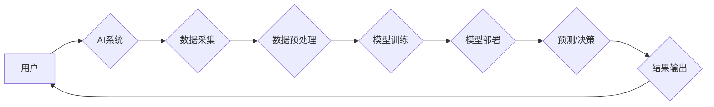

> 人工智能 (AI)、机器学习 (ML)、深度学习 (DL)、自然语言处理 (NLP)、计算机视觉 (CV)、推荐系统、预测分析、自动化

## 1. 背景介绍

人工智能 (AI) 正以惊人的速度发展，从实验室的理论研究走向现实世界的广泛应用。AI技术的突破，特别是深度学习 (DL) 的兴起，为我们提供了前所未有的能力，能够模拟人类的智能行为，例如学习、推理、决策和创造。

AI在现实世界中的应用场景日益广泛，涵盖各个领域，包括医疗保健、金融、教育、交通、娱乐等。AI技术的应用能够提高效率、降低成本、改善用户体验，并为我们带来全新的可能性。

## 2. 核心概念与联系

**2.1  人工智能 (AI)**

人工智能是指模拟或超越人类智能的机器。AI的目标是创建能够执行人类智能任务的系统，例如：

* **学习:** 从数据中学习并识别模式。
* **推理:** 根据已有的知识和信息进行逻辑推理。
* **决策:** 在不确定性环境中做出最佳决策。
* **语言理解:** 理解和生成人类语言。
* **计算机视觉:** 理解和解释图像和视频。

**2.2  机器学习 (ML)**

机器学习是人工智能的一个子领域，它专注于让机器从数据中学习，无需明确编程。机器学习算法通过分析数据，识别模式和规律，从而能够预测未来结果或做出决策。

**2.3  深度学习 (DL)**

深度学习是机器学习的一个子领域，它使用多层神经网络来模拟人类大脑的结构和功能。深度学习算法能够处理海量数据，并学习到更复杂的模式和特征，从而在图像识别、语音识别、自然语言处理等领域取得突破性进展。

**2.4  应用场景**

AI技术在各个领域都有广泛的应用场景，例如：

* **医疗保健:** 疾病诊断、药物研发、个性化治疗。
* **金融:** 欺诈检测、风险管理、投资决策。
* **教育:** 个性化学习、智能辅导、自动批改作业。
* **交通:** 自动驾驶、交通流量预测、智能交通管理。
* **娱乐:** 个性化推荐、游戏开发、虚拟现实体验。

**2.5  架构图**



## 3. 核心算法原理 & 具体操作步骤

### 3.1  算法原理概述

**3.1.1  监督学习**

监督学习是机器学习的一种类型，它使用标记数据来训练模型。标记数据是指每个数据点都带有对应的标签或类别。模型的目标是学习数据的模式，以便能够根据新的数据预测标签或类别。

**3.1.2  无监督学习**

无监督学习是机器学习的一种类型，它使用未标记数据来训练模型。模型的目标是发现数据的内在结构和模式，例如聚类、降维等。

**3.1.3  强化学习**

强化学习是机器学习的一种类型，它使用奖励机制来训练模型。模型在环境中采取行动，并根据环境的反馈获得奖励或惩罚。模型的目标是学习一个策略，能够在环境中获得最大的总奖励。

### 3.2  算法步骤详解

**3.2.1  监督学习算法步骤**

1. **数据收集和预处理:** 收集相关数据，并进行清洗、转换、特征工程等预处理步骤。
2. **模型选择:** 根据任务需求选择合适的监督学习算法，例如线性回归、逻辑回归、决策树、支持向量机、神经网络等。
3. **模型训练:** 使用标记数据训练模型，调整模型参数，使模型能够准确预测标签或类别。
4. **模型评估:** 使用测试数据评估模型的性能，例如准确率、召回率、F1-score等。
5. **模型部署:** 将训练好的模型部署到实际应用场景中，用于预测或决策。

**3.2.2  无监督学习算法步骤**

1. **数据收集和预处理:** 收集相关数据，并进行清洗、转换等预处理步骤。
2. **模型选择:** 根据任务需求选择合适的无监督学习算法，例如k-means聚类、主成分分析、t-SNE降维等。
3. **模型训练:** 使用未标记数据训练模型，发现数据的内在结构和模式。
4. **结果分析:** 分析模型的结果，例如聚类结果、降维后的数据分布等。

**3.2.3  强化学习算法步骤**

1. **环境定义:** 定义强化学习环境，包括状态空间、动作空间、奖励函数等。
2. **代理设计:** 设计强化学习代理，能够在环境中采取行动并接收反馈。
3. **策略学习:** 使用强化学习算法，例如Q-learning、SARSA等，学习一个策略，能够在环境中获得最大的总奖励。
4. **策略评估:** 使用测试环境评估策略的性能。

### 3.3  算法优缺点

**3.3.1  监督学习**

* **优点:** 准确率高，能够处理各种类型的数据。
* **缺点:** 需要大量的标记数据，数据标注成本高。

**3.3.2  无监督学习**

* **优点:** 不需要标记数据，能够发现数据的内在结构。
* **缺点:** 难以评估模型性能，结果解释性较差。

**3.3.3  强化学习**

* **优点:** 能够学习复杂的策略，适应动态环境。
* **缺点:** 训练时间长，需要大量的试错过程。

### 3.4  算法应用领域

**3.4.1  监督学习**

* **图像识别:** 分类、检测、分割。
* **语音识别:** 识别语音命令、转写语音。
* **自然语言处理:** 文本分类、情感分析、机器翻译。

**3.4.2  无监督学习**

* **客户画像:** 将客户进行聚类，分析客户特征。
* **异常检测:** 识别数据中的异常值。
* **推荐系统:** 基于用户行为推荐商品或内容。

**3.4.3  强化学习**

* **自动驾驶:** 控制车辆行驶，避开障碍物。
* **游戏AI:** 训练游戏角色，使其能够智能决策。
* **机器人控制:** 控制机器人完成任务。

## 4. 数学模型和公式 & 详细讲解 & 举例说明

### 4.1  数学模型构建

**4.1.1  线性回归模型**

线性回归模型假设数据之间存在线性关系，可以使用一条直线来拟合数据。模型的目标是找到一条直线，使得预测值与真实值之间的误差最小。

**4.1.2  逻辑回归模型**

逻辑回归模型用于二分类问题，它将线性回归模型的输出映射到0到1之间的概率区间，表示样本属于某个类别的概率。

### 4.2  公式推导过程

**4.2.1  线性回归模型公式**

```latex
y = w_0 + w_1 * x_1 + w_2 * x_2 + ... + w_n * x_n
```

其中：

* $y$ 是预测值。
* $w_0, w_1, w_2, ..., w_n$ 是模型参数。
* $x_1, x_2, ..., x_n$ 是输入特征。

**4.2.2  逻辑回归模型公式**

```latex
p(y=1|x) = \frac{1}{1 + e^{-(w_0 + w_1 * x_1 + w_2 * x_2 + ... + w_n * x_n)}}
```

其中：

* $p(y=1|x)$ 是样本属于类别1的概率。
* $w_0, w_1, w_2, ..., w_n$ 是模型参数。
* $x_1, x_2, ..., x_n$ 是输入特征。

### 4.3  案例分析与讲解

**4.3.1  线性回归模型案例**

假设我们想要预测房屋价格，输入特征包括房屋面积、房间数量、地理位置等。我们可以使用线性回归模型来建立房屋价格预测模型。

**4.3.2  逻辑回归模型案例**

假设我们想要预测客户是否会点击广告，输入特征包括客户年龄、性别、兴趣爱好等。我们可以使用逻辑回归模型来建立客户点击广告预测模型。

## 5. 项目实践：代码实例和详细解释说明

### 5.1  开发环境搭建

* **操作系统:** Ubuntu 20.04 LTS
* **编程语言:** Python 3.8
* **深度学习框架:** TensorFlow 2.0
* **其他工具:** Jupyter Notebook, Git

### 5.2  源代码详细实现

```python
import tensorflow as tf

# 定义模型
model = tf.keras.models.Sequential([
    tf.keras.layers.Dense(64, activation='relu', input_shape=(784,)),
    tf.keras.layers.Dense(10, activation='softmax')
])

# 编译模型
model.compile(optimizer='adam',
              loss='sparse_categorical_crossentropy',
              metrics=['accuracy'])

# 训练模型
model.fit(x_train, y_train, epochs=10)

# 评估模型
loss, accuracy = model.evaluate(x_test, y_test)
print('Test loss:', loss)
print('Test accuracy:', accuracy)
```

### 5.3  代码解读与分析

* **模型定义:** 使用 `tf.keras.models.Sequential` 创建一个顺序模型，包含两层全连接层。第一层有64个神经元，使用ReLU激活函数，输入形状为784。第二层有10个神经元，使用softmax激活函数，用于分类任务。
* **模型编译:** 使用 `adam` 优化器，`sparse_categorical_crossentropy` 损失函数，`accuracy` 评估指标。
* **模型训练:** 使用 `model.fit` 函数训练模型，输入训练数据 `x_train` 和标签 `y_train`，训练10个 epochs。
* **模型评估:** 使用 `model.evaluate` 函数评估模型在测试数据 `x_test` 和标签 `y_test` 上的性能。

### 5.4  运行结果展示

训练完成后，可以查看模型在测试数据上的损失值和准确率。

## 6. 实际应用场景

### 6.1  医疗保健

* **疾病诊断:** 使用AI模型分析患者的医疗影像、病历和基因信息，辅助医生诊断疾病。
* **药物研发:** 使用AI模型加速药物研发过程，例如预测药物的有效性、安全性以及潜在的副作用。
* **个性化治疗:** 使用AI模型分析患者的个体特征，制定个性化的治疗方案。

### 6.2  金融

* **欺诈检测:** 使用AI模型分析交易数据，识别异常交易行为，防止欺诈活动。
* **风险管理:** 使用AI模型评估投资风险，帮助金融机构做出更明智的决策。
* **投资决策:** 使用AI模型分析市场数据，预测股票价格走势，辅助投资决策。

### 6.3  教育

* **个性化学习:** 使用AI模型分析学生的学习进度和能力，提供个性化的学习内容和学习路径。
* **智能辅导:** 使用AI模型解答学生的疑问，提供学习指导。
* **自动批改作业:** 使用AI模型自动批改学生的作业，节省教师的时间和精力。

### 6.4  未来应用展望

AI技术的应用场景还在不断扩展，未来将有更多新的应用场景出现，例如：

* **自动驾驶:** 全自动驾驶汽车将成为现实，改变交通出行方式。
* **个性化推荐:** AI模型将能够提供更加个性化的商品、内容和服务推荐。
* **虚拟助手:** AI虚拟助手将更加智能化，能够更好地理解和响应用户的需求。

## 7. 工具和资源推荐

