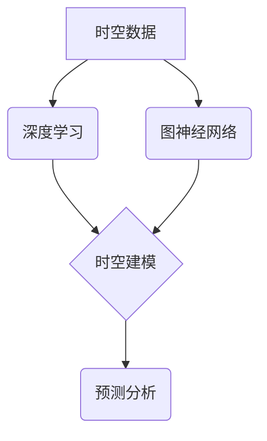

> AI时空建模，时空数据，深度学习，图神经网络，预测分析，时间序列，空间关联

## 1. 背景介绍

随着大数据时代的到来，海量时空数据呈爆发式增长，蕴藏着丰富的价值。时空数据融合了时间和空间维度，反映了事物在时间和空间上的演变规律，对理解和预测社会、经济、环境等复杂现象具有重要意义。

传统时空建模方法往往局限于静态分析或简单的时序分析，难以捕捉时空数据的复杂关联性和动态演化趋势。近年来，人工智能技术特别是深度学习和图神经网络的快速发展，为时空建模带来了新的机遇。

AI时空建模是指利用人工智能技术，对时空数据进行智能分析、建模和预测，以揭示时空数据背后的规律和趋势，并为决策支持、风险预警、资源优化等领域提供决策依据。

## 2. 核心概念与联系

**2.1 时空数据**

时空数据是指包含时间和空间信息的各种数据，例如：

* **地理位置数据:** GPS轨迹、卫星遥感图像、地图数据等
* **传感器数据:** 气象数据、交通流量数据、环境监测数据等
* **社会行为数据:** 用户移动轨迹、社交网络数据、电商交易数据等

**2.2 深度学习**

深度学习是一种机器学习的子领域，利用多层神经网络模拟人类大脑的学习机制，能够从复杂数据中自动提取特征和模式。

**2.3 图神经网络**

图神经网络是一种专门用于处理图结构数据的机器学习模型，能够学习图中节点和边之间的关系，并进行节点分类、边预测、图聚类等任务。

**2.4 时空建模**

时空建模是指利用数学模型和算法，对时空数据进行抽象、表示和分析，以揭示时空数据背后的规律和趋势。

**2.5 核心概念联系**

AI时空建模将深度学习和图神经网络技术应用于时空数据建模，能够有效地捕捉时空数据的复杂关联性和动态演化趋势。



## 3. 核心算法原理 & 具体操作步骤

### 3.1 算法原理概述

AI时空建模算法通常包括以下几个步骤：

1. **数据预处理:** 对时空数据进行清洗、转换、特征提取等操作，以使其适合模型训练。
2. **时空特征编码:** 将时空数据转换为模型可理解的特征向量，例如使用时间戳编码、地理位置编码等。
3. **模型训练:** 利用深度学习或图神经网络模型，对时空数据进行训练，学习时空数据的规律和趋势。
4. **预测分析:** 利用训练好的模型，对未来时空数据进行预测分析，例如预测交通流量、预测犯罪热点等。

### 3.2 算法步骤详解

**3.2.1 数据预处理**

* **数据清洗:** 去除数据中的缺失值、异常值和重复数据。
* **数据转换:** 将数据转换为模型可理解的格式，例如将地理位置数据转换为经纬度坐标。
* **特征提取:** 从时空数据中提取有意义的特征，例如时间戳、地理位置、速度、方向等。

**3.2.2 时空特征编码**

* **时间戳编码:** 使用独热编码、时间序列编码等方法将时间戳转换为数值向量。
* **地理位置编码:** 使用经纬度坐标、栅格编码等方法将地理位置转换为数值向量。
* **时空特征融合:** 将不同类型的时空特征融合在一起，形成更丰富的时空特征向量。

**3.2.3 模型训练**

* **选择模型:** 根据具体任务选择合适的深度学习或图神经网络模型，例如循环神经网络（RNN）、长短期记忆网络（LSTM）、图卷积网络（GCN）等。
* **训练模型:** 利用训练数据对模型进行训练，调整模型参数，使模型能够准确地预测时空数据。

**3.2.4 预测分析**

* **输入数据:** 将需要预测的时空数据输入到训练好的模型中。
* **模型预测:** 模型根据训练数据和输入数据，进行预测分析，输出预测结果。
* **结果评估:** 利用测试数据评估模型的预测精度，并根据结果进行模型优化。

### 3.3 算法优缺点

**优点:**

* 能够有效地捕捉时空数据的复杂关联性和动态演化趋势。
* 能够进行精准的时空预测分析，为决策支持提供依据。
* 能够处理海量时空数据，满足大数据时代的需求。

**缺点:**

* 需要大量的训练数据，否则模型性能会下降。
* 模型训练过程复杂，需要专业的技术人员进行操作。
* 模型解释性较差，难以理解模型的决策过程。

### 3.4 算法应用领域

AI时空建模技术在多个领域具有广泛的应用前景，例如：

* **交通运输:** 交通流量预测、交通拥堵缓解、智能交通管理
* **城市规划:** 城市发展规划、人口流动预测、公共服务优化
* **环境监测:** 环境污染预测、自然灾害预警、生态环境保护
* **医疗卫生:** 病情预测、疾病传播模型、医疗资源配置
* **商业营销:** 用户行为预测、精准营销、市场分析

## 4. 数学模型和公式 & 详细讲解 & 举例说明

### 4.1 数学模型构建

时空建模通常使用以下数学模型：

* **时间序列模型:** 用于分析时间维度上的数据变化趋势，例如ARIMA模型、SARIMA模型等。
* **空间自回归模型:** 用于分析空间维度上的数据关联性，例如空间自回归模型（SAR）、空间误差模型（SEM）等。
* **时空回归模型:** 用于分析时间和空间维度上的数据相互影响关系，例如空间时间回归模型（ST-REG）等。

### 4.2 公式推导过程

**4.2.1 时间序列模型**

ARIMA模型的公式如下：

$$
y_t = c + \phi_1 y_{t-1} + \phi_2 y_{t-2} + ... + \phi_p y_{t-p} + \theta_1 \epsilon_{t-1} + \theta_2 \epsilon_{t-2} + ... + \theta_q \epsilon_{t-q} + \epsilon_t
$$

其中：

* $y_t$ 是时间序列在时间 $t$ 的观测值。
* $c$ 是截距项。
* $\phi_i$ 是自回归系数。
* $\theta_i$ 是移动平均系数。
* $\epsilon_t$ 是白噪声项。

**4.2.2 空间自回归模型**

SAR模型的公式如下：

$$
y_i = \rho \sum_{j \in N(i)} y_j + \epsilon_i
$$

其中：

* $y_i$ 是空间单元 $i$ 的观测值。
* $\rho$ 是空间自回归系数。
* $N(i)$ 是空间单元 $i$ 的邻域单元集合。
* $\epsilon_i$ 是白噪声项。

### 4.3 案例分析与讲解

**4.3.1 交通流量预测**

利用时空建模技术，可以预测城市道路的交通流量，为交通管理提供决策依据。

* **数据:** 收集城市道路的交通流量数据、天气数据、时间数据等。
* **模型:** 使用时空回归模型，将时间、空间和天气等因素作为输入，预测道路交通流量。
* **结果:** 模型可以预测未来道路交通流量，帮助交通管理部门优化交通信号灯、疏导交通拥堵等。

**4.3.2 犯罪热点预测**

利用时空建模技术，可以预测犯罪发生的可能性，为犯罪预防提供依据。

* **数据:** 收集犯罪事件发生地点、时间、类型等数据。
* **模型:** 使用图神经网络，构建犯罪事件发生网络，学习犯罪事件的空间关联性和时间趋势。
* **结果:** 模型可以预测未来犯罪发生的可能性，帮助警方部署警力、预防犯罪等。

## 5. 项目实践：代码实例和详细解释说明

### 5.1 开发环境搭建

* **操作系统:** Ubuntu 20.04 LTS
* **编程语言:** Python 3.8
* **深度学习框架:** TensorFlow 2.0
* **图神经网络库:** PyTorch Geometric

### 5.2 源代码详细实现

```python
import tensorflow as tf
from tensorflow.keras.models import Sequential
from tensorflow.keras.layers import LSTM, Dense

# 数据预处理
# ...

# 模型构建
model = Sequential()
model.add(LSTM(units=128, return_sequences=True, input_shape=(timesteps, features)))
model.add(LSTM(units=64))
model.add(Dense(units=1))

# 模型编译
model.compile(optimizer='adam', loss='mse')

# 模型训练
model.fit(X_train, y_train, epochs=10, batch_size=32)

# 模型预测
predictions = model.predict(X_test)
```

### 5.3 代码解读与分析

* **数据预处理:** 将时空数据转换为模型可理解的格式，例如将时间戳转换为数值向量。
* **模型构建:** 使用LSTM网络构建时空建模模型，LSTM网络能够捕捉时间序列数据中的长期依赖关系。
* **模型编译:** 使用Adam优化器和均方误差损失函数对模型进行编译。
* **模型训练:** 使用训练数据对模型进行训练，调整模型参数。
* **模型预测:** 使用训练好的模型对测试数据进行预测。

### 5.4 运行结果展示

* **预测精度:** 使用测试数据评估模型的预测精度，例如使用均方根误差（RMSE）作为评价指标。
* **预测结果可视化:** 将预测结果与真实值进行对比，可视化预测结果，例如使用折线图或散点图。

## 6. 实际应用场景

### 6.1 交通流量预测

AI时空建模技术可以用于预测城市道路的交通流量，帮助交通管理部门优化交通信号灯、疏导交通拥堵等。

### 6.2 犯罪热点预测

AI时空建模技术可以用于预测犯罪发生的可能性，帮助警方部署警力、预防犯罪等。

### 6.3 自然灾害预警

AI时空建模技术可以用于分析自然灾害的时空演变趋势，预测自然灾害的发生区域和时间，为灾害预警提供依据。

### 6.4 未来应用展望

AI时空建模技术在未来将有更广泛的应用前景，例如：

* **智慧城市:** 建立智慧城市管理平台，利用时空数据进行城市规划、资源优化、公共服务提升等。
* **精准医疗:** 利用时空数据分析患者的健康状况、疾病传播趋势，为精准医疗提供支持。
* **智能农业:** 利用时空数据分析作物生长情况、病虫害发生趋势，提高农业生产效率。

## 7. 工具和资源推荐

### 7.1 学习资源推荐

* **书籍:**
    * 《深度学习》 by Ian Goodfellow, Yoshua Bengio, Aaron Courville
    * 《图神经网络》 by William L. Hamilton, Rex Ying, Jure Leskovec
* **在线课程:**
    * Coursera: 深度学习 Specialization
    * Udacity: 
    * fast.ai: Practical Deep Learning for Coders

### 7.2 开发工具推荐

* **深度学习框架:** TensorFlow, PyTorch, Keras
* **图神经网络库:** PyTorch Geometric, DGL
* **数据处理工具:** Pandas, NumPy

### 7.3 相关论文推荐

* **时间序列建模:**
    * "ARIMA Models" by Box and Jenkins
    * "Forecasting: Principles and Practice" by Hyndman and Athanasopoulos
* **空间自回归模型:**
    * "Spatial Autocorrelation and Spatial Regression" by Anselin
* **时空建模:**
    * "Space-Time Modeling" by Cressie
    *