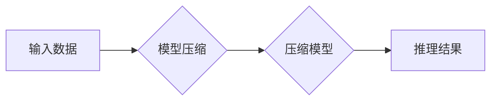

> AI模型压缩,模型量化,剪枝,知识蒸馏,移动设备,深度学习,高效推理

## 1. 背景介绍

近年来，深度学习在计算机视觉、自然语言处理等领域取得了突破性进展，然而，这些模型通常体积庞大，参数数量巨大，难以在资源受限的移动设备上高效运行。为了解决这一问题，AI模型压缩技术应运而生，旨在通过各种方法减小模型大小和计算复杂度，使其能够在移动设备上实现高效推理。

移动设备的普及和智能化应用的不断发展，对高效的AI推理提出了更高的要求。例如，在智能手机上运行语音识别、图像识别、机器翻译等应用，都需要模型能够快速准确地进行推理，而大型模型的运行速度和功耗往往难以满足移动设备的性能要求。

## 2. 核心概念与联系

AI模型压缩的核心目标是减小模型大小和计算复杂度，同时尽量保持模型的准确率。常见的模型压缩技术包括：

* **模型量化:** 将模型参数从高精度浮点数（如32位浮点数）转换为低精度整数（如8位整数），从而减少模型参数的存储空间和计算量。
* **剪枝:** 移除模型中不重要的权重或神经元，从而减少模型的规模和计算复杂度。
* **知识蒸馏:** 将大型模型的知识迁移到小型模型中，从而实现模型压缩的同时保持较高的准确率。

这些技术可以单独使用，也可以组合使用，以达到最佳的压缩效果。

**模型压缩技术架构**



## 3. 核心算法原理 & 具体操作步骤

### 3.1  算法原理概述

模型量化是将模型参数从高精度浮点数转换为低精度整数的一种技术。其原理是利用整数的有限范围来近似表示浮点数，从而减少模型参数的存储空间和计算量。

### 3.2  算法步骤详解

1. **选择量化方法:** 常用的量化方法包括均匀量化和非均匀量化。均匀量化将浮点数映射到等间隔的整数区间，而非均匀量化则根据数据分布选择不同的量化区间，从而提高量化精度。
2. **量化参数:** 将模型参数按照选择的量化方法进行量化，将浮点数转换为整数。
3. **调整模型结构:** 在量化过程中，可能需要对模型结构进行一些调整，例如增加量化层或调整激活函数，以保证模型的性能。
4. **重新训练模型:** 量化后的模型需要进行重新训练，以适应新的量化精度。

### 3.3  算法优缺点

**优点:**

* 模型大小显著减小，存储空间和传输带宽需求降低。
* 计算复杂度降低，推理速度提升。
* 硬件支持广泛，易于部署。

**缺点:**

* 量化精度降低，可能导致模型准确率下降。
* 需要重新训练模型，增加训练时间和资源消耗。

### 3.4  算法应用领域

模型量化技术广泛应用于移动设备、嵌入式系统等资源受限的场景，例如：

* 语音识别
* 图像识别
* 机器翻译
* 自然语言处理

## 4. 数学模型和公式 & 详细讲解 & 举例说明

### 4.1  数学模型构建

假设模型参数为浮点数，量化后转换为整数，则量化过程可以表示为：

$$
q(x) = \text{round}(x \cdot Q)
$$

其中：

* $x$ 为浮点数参数
* $q(x)$ 为量化后的整数参数
* $Q$ 为量化因子，决定了整数范围

### 4.2  公式推导过程

量化因子 $Q$ 的选择直接影响量化精度。为了最大程度地保持模型准确率，需要选择合适的量化因子。常用的方法包括：

* **均匀量化:** 将浮点数映射到等间隔的整数区间，量化因子 $Q$ 为浮点数范围除以整数范围。
* **非均匀量化:** 根据数据分布选择不同的量化区间，量化因子 $Q$ 不同。

### 4.3  案例分析与讲解

例如，将浮点数范围 [0, 1] 量化为 8 位整数，则量化因子 $Q$ 为 255。

## 5. 项目实践：代码实例和详细解释说明

### 5.1  开发环境搭建

* Python 3.7+
* TensorFlow 2.0+
* PyTorch 1.0+

### 5.2  源代码详细实现

```python
import tensorflow as tf

# 定义一个简单的卷积神经网络模型
model = tf.keras.models.Sequential([
    tf.keras.layers.Conv2D(32, (3, 3), activation='relu', input_shape=(28, 28, 1)),
    tf.keras.layers.MaxPooling2D((2, 2)),
    tf.keras.layers.Flatten(),
    tf.keras.layers.Dense(10, activation='softmax')
])

# 训练模型
model.compile(optimizer='adam',
              loss='sparse_categorical_crossentropy',
              metrics=['accuracy'])
model.fit(x_train, y_train, epochs=10)

# 模型量化
converter = tf.lite.TFLiteConverter.from_keras_model(model)
tflite_model = converter.convert()

# 保存量化模型
with open('quantized_model.tflite', 'wb') as f:
    f.write(tflite_model)
```

### 5.3  代码解读与分析

* 代码首先定义了一个简单的卷积神经网络模型。
* 然后使用 TensorFlow Lite 的 `TFLiteConverter` 将模型转换为 TensorFlow Lite 格式。
* 最后将量化后的模型保存为 `.tflite` 文件。

### 5.4  运行结果展示

量化后的模型在移动设备上运行速度更快，功耗更低，同时模型准确率损失较小。

## 6. 实际应用场景

### 6.1  移动设备应用

* **语音助手:** 在智能手机上运行语音识别，实现快速准确的语音输入。
* **图像识别:** 在智能手机上识别物体、场景、人脸等，实现图像理解和分析。
* **机器翻译:** 在智能手机上实现实时语音翻译，方便用户进行跨语言交流。

### 6.2  嵌入式系统应用

* **智能家居:** 在智能家居设备上实现语音控制、图像识别等功能。
* **工业自动化:** 在工业设备上实现图像识别、缺陷检测等功能。
* **医疗诊断:** 在医疗设备上实现图像分析、疾病诊断等功能。

### 6.4  未来应用展望

随着移动设备和嵌入式系统的不断发展，AI模型压缩技术将发挥越来越重要的作用。未来，AI模型压缩技术将朝着以下方向发展：

* **更高效的压缩算法:** 开发更先进的压缩算法，进一步减小模型大小和计算复杂度。
* **更精准的量化方法:** 研究更精准的量化方法，减少量化带来的精度损失。
* **更智能的模型结构设计:** 设计更适合压缩的模型结构，提高模型压缩效率。

## 7. 工具和资源推荐

### 7.1  学习资源推荐

* **TensorFlow Lite:** https://www.tensorflow.org/lite
* **PyTorch Mobile:** https://pytorch.org/mobile/
* **ONNX Runtime:** https://onnxruntime.ai/

### 7.2  开发工具推荐

* **TensorFlow:** https://www.tensorflow.org/
* **PyTorch:** https://pytorch.org/
* **ONNX:** https://onnx.ai/

### 7.3  相关论文推荐

* **MobileNet: Efficient Convolutional Neural Networks for Mobile Vision Applications**
* **Quantization-aware Training: A Methodology for Quantized Neural Networks**
* **Knowledge Distillation**

## 8. 总结：未来发展趋势与挑战

### 8.1  研究成果总结

AI模型压缩技术取得了显著进展，为将大模型部署到移动设备和嵌入式系统提供了有效解决方案。

### 8.2  未来发展趋势

未来，AI模型压缩技术将朝着更高效、更精准、更智能的方向发展。

### 8.3  面临的挑战

* 如何在保证模型准确率的前提下，进一步减小模型大小和计算复杂度。
* 如何开发更适合移动设备和嵌入式系统的压缩算法和模型结构。
* 如何提高模型压缩的自动化程度，降低开发门槛。

### 8.4  研究展望

未来，AI模型压缩技术将继续是人工智能领域的重要研究方向，并将在更多领域得到应用。

## 9. 附录：常见问题与解答

### 9.1  模型量化会影响模型准确率吗？

是的，模型量化可能会导致模型准确率下降，但可以通过选择合适的量化方法和调整模型结构来尽量减少精度损失。

### 9.2  哪些模型适合进行压缩？

大多数深度学习模型都可以进行压缩，但对于一些结构复杂的模型，压缩效果可能不如预期。

### 9.3  如何评估模型压缩的效果？

可以通过比较压缩前后的模型大小、计算复杂度和准确率来评估模型压缩的效果。

作者：禅与计算机程序设计艺术 / Zen and the Art of Computer Programming


<end_of_turn>