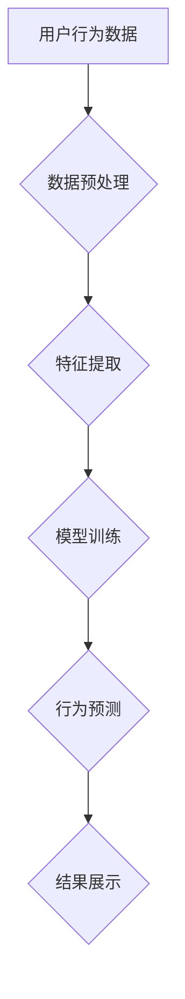

> 用户行为分析，人工智能，机器学习，深度学习，推荐系统，数据挖掘，自然语言处理

## 1. 背景介绍

在当今数据爆炸的时代，用户行为数据已成为企业获取洞察、优化产品和服务、提升用户体验的关键资源。传统的用户行为分析方法往往依赖于人工标注和规则匹配，效率低下且难以捕捉复杂的用户行为模式。而人工智能（AI）技术的兴起为用户行为分析带来了新的机遇。

AI用户行为分析系统能够利用机器学习和深度学习算法，从海量用户行为数据中自动识别和分析用户行为模式，并提供更精准、更深入的洞察。例如，AI系统可以识别用户的兴趣爱好、购买偏好、浏览习惯等，并根据这些信息为用户提供个性化的推荐，提升用户体验和转化率。

## 2. 核心概念与联系

**2.1 用户行为分析**

用户行为分析是指通过收集、分析和解读用户与产品或服务的交互行为，以了解用户需求、行为模式和心理状态，从而为产品设计、营销策略和用户体验优化提供数据支持。

**2.2 人工智能 (AI)**

人工智能是指模拟人类智能的计算机系统，其核心是通过算法和模型学习和理解数据，并根据学习到的知识进行决策和预测。

**2.3 机器学习 (ML)**

机器学习是人工智能的一个分支，它通过算法训练模型，使模型能够从数据中学习并进行预测或分类。

**2.4 深度学习 (DL)**

深度学习是机器学习的一个子领域，它利用多层神经网络结构，能够学习更复杂的特征和模式，从而实现更精准的预测和分析。

**2.5 数据挖掘 (DM)**

数据挖掘是指从海量数据中发现隐藏的模式、趋势和知识，并将其转化为有价值的商业洞察。

**2.6 自然语言处理 (NLP)**

自然语言处理是指使计算机能够理解、处理和生成人类语言的技术。

**2.7 推荐系统**

推荐系统是指根据用户的历史行为、偏好和兴趣，推荐用户可能感兴趣的内容或产品。

**2.8 流程图**



## 3. 核心算法原理 & 具体操作步骤

### 3.1 算法原理概述

AI用户行为分析系统通常采用以下核心算法：

* **聚类算法**: 将用户根据行为相似度进行分组，识别用户群体和行为模式。
* **分类算法**: 根据用户特征预测用户行为，例如是否会购买商品、点击广告等。
* **回归算法**: 预测用户行为的连续值，例如购买金额、浏览时长等。
* **推荐算法**: 根据用户行为和偏好推荐相关内容或产品。

### 3.2 算法步骤详解

**3.2.1 数据预处理**

* 数据清洗：去除无效数据、缺失值和重复数据。
* 数据转换：将数据转换为适合算法处理的格式。
* 数据特征工程：提取用户行为特征，例如浏览历史、购买记录、评论内容等。

**3.2.2 模型训练**

* 选择合适的算法模型。
* 使用训练数据训练模型，调整模型参数。
* 评估模型性能，例如准确率、召回率、F1-score等。

**3.2.3 模型部署**

* 将训练好的模型部署到生产环境中。
* 实时接收用户行为数据，进行预测和分析。

**3.2.4 结果展示**

* 将分析结果以图表、报告等形式展示给用户。
* 提供可视化工具，帮助用户理解用户行为模式。

### 3.3 算法优缺点

**3.3.1 聚类算法**

* **优点**: 可以发现用户群体和行为模式，无需预先定义类别。
* **缺点**: 难以确定最佳聚类数，结果可能存在模糊性。

**3.3.2 分类算法**

* **优点**: 可以准确预测用户行为，例如是否会购买商品。
* **缺点**: 需要大量的标注数据进行训练，对数据质量要求较高。

**3.3.3 回归算法**

* **优点**: 可以预测用户行为的连续值，例如购买金额。
* **缺点**: 对数据分布和噪声敏感，需要进行数据预处理。

**3.3.4 推荐算法**

* **优点**: 可以根据用户兴趣推荐相关内容，提升用户体验。
* **缺点**: 需要考虑冷启动问题，例如新用户和新商品的推荐。

### 3.4 算法应用领域

AI用户行为分析系统广泛应用于以下领域：

* **电商**: 用户画像分析、商品推荐、个性化营销
* **社交媒体**: 用户兴趣分析、内容推荐、社区运营
* **金融**: 风险评估、欺诈检测、客户服务
* **医疗**: 疾病诊断、患者管理、药物研发
* **教育**: 个性化学习、学生评估、教学优化

## 4. 数学模型和公式 & 详细讲解 & 举例说明

### 4.1 数学模型构建

**4.1.1 用户行为模型**

用户行为模型可以表示用户与产品或服务的交互行为，例如用户点击、浏览、购买等行为。

**4.1.2 兴趣模型**

兴趣模型可以表示用户的兴趣爱好，例如用户喜欢阅读哪些类型的文章、观看哪些类型的视频等。

**4.1.3 推荐模型**

推荐模型可以根据用户的兴趣和行为，预测用户可能感兴趣的内容或产品。

### 4.2 公式推导过程

**4.2.1 协同过滤推荐算法**

协同过滤推荐算法基于用户的行为相似度进行推荐。

$$
r_{u,i} = \frac{\sum_{j \in N(u)} s_{u,j} \cdot s_{j,i}}{\sum_{j \in N(u)} s_{u,j}^2}
$$

其中：

* $r_{u,i}$: 用户 $u$ 对物品 $i$ 的评分
* $s_{u,j}$: 用户 $u$ 对物品 $j$ 的评分
* $N(u)$: 用户 $u$ 的邻居用户集合

**4.2.2 矩阵分解推荐算法**

矩阵分解推荐算法将用户-物品评分矩阵分解成两个低维矩阵，分别表示用户特征和物品特征。

$$
R = U \cdot V^T
$$

其中：

* $R$: 用户-物品评分矩阵
* $U$: 用户特征矩阵
* $V$: 物品特征矩阵

### 4.3 案例分析与讲解

**4.3.1 电影推荐系统**

可以使用协同过滤或矩阵分解算法构建电影推荐系统。

**4.3.2 商品推荐系统**

可以使用协同过滤或矩阵分解算法构建商品推荐系统。

## 5. 项目实践：代码实例和详细解释说明

### 5.1 开发环境搭建

* Python 3.x
* Jupyter Notebook
* scikit-learn
* TensorFlow/PyTorch

### 5.2 源代码详细实现

```python
# 导入必要的库
import pandas as pd
from sklearn.model_selection import train_test_split
from sklearn.linear_model import LogisticRegression

# 加载用户行为数据
data = pd.read_csv('user_behavior.csv')

# 数据预处理
# ...

# 特征工程
# ...

# 将数据分为训练集和测试集
X_train, X_test, y_train, y_test = train_test_split(X, y, test_size=0.2)

# 训练逻辑回归模型
model = LogisticRegression()
model.fit(X_train, y_train)

# 评估模型性能
# ...

# 使用模型进行预测
# ...
```

### 5.3 代码解读与分析

* 数据加载和预处理：使用 pandas 库加载用户行为数据，并进行数据清洗、转换和特征工程。
* 数据分割：使用 train_test_split 函数将数据分为训练集和测试集。
* 模型训练：使用 LogisticRegression 类训练逻辑回归模型。
* 模型评估：使用评估指标，例如准确率、召回率、F1-score等，评估模型性能。
* 模型预测：使用训练好的模型对测试数据进行预测。

### 5.4 运行结果展示

* 模型预测结果可视化展示，例如混淆矩阵、ROC曲线等。
* 预测结果分析，例如预测准确率、错误类型等。

## 6. 实际应用场景

### 6.1 电商平台

* **用户画像分析**: 根据用户的购买记录、浏览历史、评价内容等，构建用户画像，了解用户的兴趣爱好、消费习惯等。
* **商品推荐**: 根据用户的兴趣和行为，推荐用户可能感兴趣的商品，提升用户体验和转化率。
* **个性化营销**: 根据用户的画像和行为，进行个性化营销，例如发送个性化优惠券、推荐个性化商品等。

### 6.2 社交媒体平台

* **用户兴趣分析**: 根据用户的点赞、评论、分享等行为，分析用户的兴趣爱好，推荐相关内容。
* **内容推荐**: 根据用户的浏览历史、点赞记录等，推荐用户可能感兴趣的内容，提升用户粘性。
* **社区运营**: 根据用户的行为模式，识别社区活跃用户和潜在用户，进行精准运营。

### 6.3 金融机构

* **风险评估**: 根据用户的交易记录、账户行为等，评估用户的风险等级，防范金融风险。
* **欺诈检测**: 根据用户的交易行为、账户登录记录等，识别异常行为，防范欺诈行为。
* **客户服务**: 根据用户的查询记录、投诉内容等，提供个性化客户服务，提升客户满意度。

### 6.4 未来应用展望

AI用户行为分析系统将在以下领域得到更广泛的应用：

* **医疗保健**: 辅助医生诊断疾病、预测患者风险、个性化治疗方案。
* **教育**: 个性化学习路径、学生行为分析、教学效果评估。
* **智能家居**: 智能家居设备的个性化配置、用户行为分析、安全保障。

## 7. 工具和资源推荐

### 7.1 学习资源推荐

* **书籍**:
    * 《Python机器学习》
    * 《深度学习》
    * 《推荐系统实践》
* **在线课程**:
    * Coursera: 机器学习、深度学习
    * edX: 数据科学、人工智能
* **博客**:
    * Towards Data Science
    * Machine Learning Mastery

### 7.2 开发工具推荐

* **Python**: 广泛应用于数据分析和机器学习
* **Jupyter Notebook**: 用于交互式编程和数据可视化
* **scikit-learn**: 机器学习库
* **TensorFlow/PyTorch**: 深度学习框架

### 7.3 相关论文推荐

* **Collaborative Filtering for Implicit Feedback Datasets**
* **Matrix Factorization Techniques for Recommender Systems**
* **Deep Learning for Recommender Systems**

## 8. 总结：未来发展趋势与挑战

### 8.1 研究成果总结

AI用户行为分析系统已取得了显著成果，能够有效地识别用户行为模式、预测用户行为、提供个性化服务。

### 8.2 未来发展趋势

* **更精准的预测**: 利用更先进的机器学习和深度学习算法，提高用户行为预测的准确率。
* **更个性化的服务**: 基于用户行为和偏好的个性化推荐、个性化营销等服务。
* **更全面的分析**: 分析用户行为背后的动机和心理状态，提供更深入的洞察。
* **更安全的系统**: 加强数据安全和隐私保护，确保用户数据安全。

### 8.3 面临的挑战

* **数据质量**: 用户行为数据往往存在噪声、缺失值等问题，需要进行有效的数据清洗和预处理。
* **算法解释性**: 许多机器学习和深度学习算法的决策过程难以解释，需要开发更可解释的算法模型。
* **数据隐私**: 用户行为数据包含敏感信息，需要采取措施保护用户隐私。
* **伦理问题**: AI用户行为分析系统可能存在偏见和歧视问题