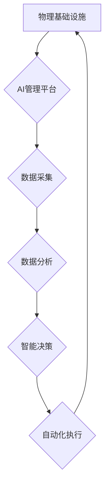

> AI、自动化、物理基础设施、机器学习、深度学习、云计算、数据中心、运维

## 1. 背景介绍

随着人工智能 (AI) 技术的飞速发展，其应用领域不断拓展，对计算资源的需求也呈现指数级增长。传统的人工管理物理基础设施已经难以满足日益增长的需求，因此，AI自动化物理基础设施成为一个重要的研究方向。

物理基础设施是指支撑计算机系统运行的硬件设备和网络，包括服务器、存储设备、网络设备、电源系统、制冷系统等。传统的物理基础设施管理依赖于人工操作，效率低下，容易出现人为错误，且难以应对快速变化的业务需求。

AI自动化物理基础设施是指利用人工智能技术，对物理基础设施进行智能化管理，实现自动化运维、资源优化、故障预测和预警等功能。

## 2. 核心概念与联系

**2.1 核心概念**

* **AI (人工智能):**  指机器能够模拟人类智能行为的能力，例如学习、推理、决策和解决问题。
* **自动化:**  指通过程序或系统自动执行任务，减少人工干预。
* **物理基础设施:** 指支撑计算机系统运行的硬件设备和网络。

**2.2 联系**

AI自动化物理基础设施将AI技术应用于物理基础设施的管理，实现自动化运维、资源优化、故障预测和预警等功能。

**2.3 架构图**



## 3. 核心算法原理 & 具体操作步骤

**3.1 算法原理概述**

AI自动化物理基础设施的核心算法主要包括机器学习、深度学习、强化学习等。

* **机器学习:**  通过训练模型，使模型能够从数据中学习规律，并对新数据进行预测或分类。
* **深度学习:**  一种更高级的机器学习方法，利用多层神经网络模拟人类大脑的学习过程，能够处理更复杂的数据。
* **强化学习:**  通过奖励和惩罚机制，训练模型在特定环境中做出最优决策。

**3.2 算法步骤详解**

1. **数据采集:**  从物理基础设施设备收集各种数据，例如温度、湿度、电压、电流、负载等。
2. **数据预处理:**  对采集到的数据进行清洗、转换、特征提取等处理，使其适合模型训练。
3. **模型训练:**  利用机器学习、深度学习或强化学习算法，训练模型，使其能够从数据中学习规律。
4. **模型评估:**  评估模型的性能，例如准确率、召回率、F1-score等，并根据评估结果进行模型调优。
5. **模型部署:**  将训练好的模型部署到生产环境中，用于对物理基础设施进行智能化管理。

**3.3 算法优缺点**

* **优点:**  自动化程度高，效率提升明显，能够降低运维成本，提高基础设施利用率。
* **缺点:**  需要大量的数据进行训练，模型训练成本较高，对数据质量要求较高，存在一定的安全风险。

**3.4 算法应用领域**

* **服务器管理:**  自动部署、监控、升级和故障修复服务器。
* **存储管理:**  自动分配存储空间、优化存储性能、进行数据备份和恢复。
* **网络管理:**  自动配置网络设备、监控网络流量、进行故障诊断和修复。
* **能源管理:**  优化能源消耗、降低能耗成本。

## 4. 数学模型和公式 & 详细讲解 & 举例说明

**4.1 数学模型构建**

AI自动化物理基础设施的数学模型通常基于优化问题，目标是找到最优的资源配置方案，以满足业务需求并降低成本。

例如，在服务器管理中，可以构建一个优化模型，目标是根据服务器的负载情况，自动分配任务到不同的服务器，以实现资源的均衡利用。

**4.2 公式推导过程**

假设有N台服务器，每个服务器的负载为$L_i$，任务的优先级为$P_j$，则可以构建一个线性规划模型：

```latex
\begin{aligned}
\text{目标函数: } & \min \sum_{i=1}^{N} L_i \\
\text{约束条件: } & \sum_{i=1}^{N} x_{ij} \leq L_i, \quad j=1,2,\ldots,M \\
& \sum_{i=1}^{N} x_{ij} \geq P_j, \quad j=1,2,\ldots,M \\
& x_{ij} \in \{0,1\}, \quad i=1,2,\ldots,N, \quad j=1,2,\ldots,M
\end{aligned}
```

其中，$x_{ij}$表示任务$j$是否分配到服务器$i$，$M$表示任务的数量。

**4.3 案例分析与讲解**

假设有3台服务器，负载分别为100、80、60，有2个任务，优先级分别为50和30。

通过求解上述线性规划模型，可以得到最优的资源分配方案，例如：

* 任务1分配到服务器1，
* 任务2分配到服务器2。

这样可以实现资源的均衡利用，并满足任务的优先级要求。

## 5. 项目实践：代码实例和详细解释说明

**5.1 开发环境搭建**

* 操作系统: Ubuntu 20.04
* Python 版本: 3.8
* 必要的库: TensorFlow, PyTorch, scikit-learn

**5.2 源代码详细实现**

```python
# 导入必要的库
import tensorflow as tf

# 定义模型结构
model = tf.keras.models.Sequential([
    tf.keras.layers.Dense(64, activation='relu', input_shape=(10,)),
    tf.keras.layers.Dense(32, activation='relu'),
    tf.keras.layers.Dense(1, activation='sigmoid')
])

# 编译模型
model.compile(optimizer='adam', loss='binary_crossentropy', metrics=['accuracy'])

# 训练模型
model.fit(X_train, y_train, epochs=10)

# 评估模型
loss, accuracy = model.evaluate(X_test, y_test)
print('Loss:', loss)
print('Accuracy:', accuracy)
```

**5.3 代码解读与分析**

* 该代码示例展示了如何使用TensorFlow框架构建一个简单的机器学习模型。
* 模型结构包括三个全连接层，激活函数为ReLU和sigmoid。
* 模型使用Adam优化器，损失函数为二分类交叉熵，评估指标为准确率。
* 模型训练使用训练数据，并评估模型在测试数据上的性能。

**5.4 运行结果展示**

运行结果将显示模型的训练过程和评估结果，例如损失值和准确率。

## 6. 实际应用场景

**6.1 服务器管理**

* 自动部署和配置服务器，减少人工操作时间。
* 监控服务器负载情况，并根据负载情况自动调整资源分配。
* 自动发现和修复服务器故障，提高服务器可用性。

**6.2 存储管理**

* 自动分配存储空间，优化存储性能。
* 自动备份和恢复数据，保障数据安全。
* 自动识别和清理冗余数据，释放存储空间。

**6.3 网络管理**

* 自动配置网络设备，简化网络管理。
* 监控网络流量，识别异常流量，防止网络攻击。
* 自动诊断和修复网络故障，提高网络可靠性。

**6.4 未来应用展望**

* 更智能的自动化决策，例如基于预测分析的资源预留和故障预警。
* 更广泛的应用场景，例如边缘计算、物联网等。
* 更安全的自动化管理，例如身份验证和访问控制。

## 7. 工具和资源推荐

**7.1 学习资源推荐**

* **书籍:**
    * 《深度学习》
    * 《机器学习实战》
    * 《人工智能：一种现代方法》
* **在线课程:**
    * Coursera: 深度学习
    * edX: 机器学习
    * Udacity: AI Nanodegree

**7.2 开发工具推荐**

* **TensorFlow:** 开源深度学习框架
* **PyTorch:** 开源深度学习框架
* **scikit-learn:** 开源机器学习库

**7.3 相关论文推荐**

* **AutoML: A Survey**
* **Deep Reinforcement Learning for Resource Management in Data Centers**
* **AI-Powered Infrastructure Management: A Survey**

## 8. 总结：未来发展趋势与挑战

**8.1 研究成果总结**

AI自动化物理基础设施已经取得了显著的成果，例如提高了资源利用率、降低了运维成本、提高了基础设施可用性等。

**8.2 未来发展趋势**

* 更智能的自动化决策，例如基于预测分析的资源预留和故障预警。
* 更广泛的应用场景，例如边缘计算、物联网等。
* 更安全的自动化管理，例如身份验证和访问控制。

**8.3 面临的挑战**

* 数据质量问题，AI模型的性能依赖于高质量的数据。
* 模型训练成本高，需要大量的计算资源和时间。
* 安全风险，AI系统可能存在安全漏洞，需要加强安全防护。

**8.4 研究展望**

未来，AI自动化物理基础设施的研究将继续深入，朝着更智能、更安全、更可靠的方向发展。


## 9. 附录：常见问题与解答

**9.1 如何选择合适的AI算法？**

选择合适的AI算法取决于具体的应用场景和数据特点。例如，对于预测性维护问题，可以使用时间序列分析算法；对于资源优化问题，可以使用强化学习算法。

**9.2 如何解决数据质量问题？**

数据质量问题是AI模型训练的重要挑战。可以采取以下措施来解决数据质量问题：

* 数据清洗：去除数据中的噪声、缺失值和重复数据。
* 数据转换：将数据转换为适合模型训练的格式。
* 数据特征提取：提取数据中的重要特征，提高模型的学习效率。

**9.3 如何保障AI系统的安全？**

AI系统的安全是一个重要的研究方向。可以采取以下措施来保障AI系统的安全：

* 身份验证和访问控制：确保只有授权用户才能访问AI系统。
* 数据加密：保护数据不被未授权访问。
* 模型安全：防止模型被攻击或篡改。


作者：禅与计算机程序设计艺术 / Zen and the Art of Computer Programming 
<end_of_turn>