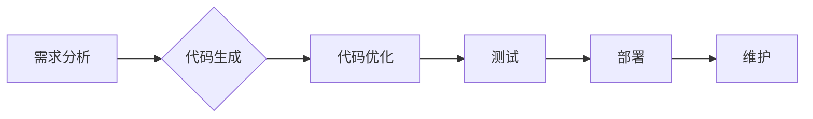

> AI 辅助编程，代码生成，代码优化，深度学习，自然语言处理，软件开发

## 1. 背景介绍

在当今科技飞速发展的时代，软件开发扮演着越来越重要的角色。然而，传统的软件开发模式面临着诸多挑战，例如开发周期长、成本高、人力资源紧张等。为了解决这些问题，人工智能（AI）技术逐渐被应用于软件开发领域，催生了AI辅助编程这一新兴技术。

AI辅助编程是指利用人工智能技术辅助软件开发人员编写、优化和维护代码的全新模式。它通过学习和理解人类编程习惯，自动生成代码片段、识别代码错误、提供代码建议等，极大地提高了软件开发效率和质量。

## 2. 核心概念与联系

**2.1  代码生成**

代码生成是指利用AI模型根据自然语言描述或代码示例自动生成代码。它可以帮助开发人员快速完成重复性任务，例如生成函数、类、接口等代码模板，从而节省开发时间和精力。

**2.2  代码优化**

代码优化是指利用AI模型分析代码结构和性能，并提出改进建议，以提高代码的运行效率、可读性和可维护性。它可以帮助开发人员识别代码中的潜在问题，并进行针对性的优化，从而提升软件的整体性能。

**2.3  AI模型**

AI模型是AI辅助编程的核心，它负责学习和理解代码的结构和语义。常见的AI模型包括：

* **Transformer模型:** Transformer模型是一种基于深度学习的序列模型，能够有效地处理自然语言和代码序列。它在代码生成和代码理解方面取得了显著的成果。
* **循环神经网络(RNN):** RNN是一种能够处理序列数据的深度学习模型，在代码生成和代码理解方面也有一定的应用。

**2.4  自然语言处理(NLP)**

NLP是人工智能的一个分支，它致力于使计算机能够理解和处理人类语言。在AI辅助编程中，NLP技术被用于解析自然语言描述，将其转换为代码，以及理解代码中的语义。

**2.5  软件开发流程**

AI辅助编程可以融入到软件开发的各个阶段，例如需求分析、设计、编码、测试和维护。它可以帮助开发人员提高效率、降低成本，并最终交付更高质量的软件产品。

**Mermaid 流程图**



## 3. 核心算法原理 & 具体操作步骤

### 3.1  算法原理概述

代码生成和代码优化算法通常基于深度学习模型，例如Transformer模型。这些模型通过学习大量的代码数据，建立起代码的语法和语义表示。

**3.1.1  编码器-解码器架构**

Transformer模型通常采用编码器-解码器架构。编码器负责将输入的代码或自然语言描述转换为隐藏表示，解码器则根据隐藏表示生成输出的代码。

**3.1.2  注意力机制**

注意力机制是Transformer模型的核心技术之一，它允许模型关注输入序列中与当前生成元素相关的部分，从而提高生成质量。

### 3.2  算法步骤详解

**3.2.1  代码生成**

1. **预处理:** 将输入的自然语言描述或代码示例进行预处理，例如分词、词嵌入等。
2. **编码:** 使用编码器将预处理后的输入转换为隐藏表示。
3. **解码:** 使用解码器根据隐藏表示生成输出的代码。
4. **后处理:** 对生成的代码进行后处理，例如语法检查、格式化等。

**3.2.2  代码优化**

1. **代码分析:** 使用静态分析工具分析代码结构和性能。
2. **优化策略生成:** 基于代码分析结果，使用AI模型生成优化策略。
3. **代码修改:** 根据优化策略修改代码。
4. **性能评估:** 评估修改后的代码性能，并进行迭代优化。

### 3.3  算法优缺点

**优点:**

* **提高效率:** 自动化代码生成和优化任务，节省开发时间和精力。
* **提升质量:** AI模型能够识别代码中的潜在问题，并提出改进建议，从而提升代码质量。
* **降低成本:** 通过提高开发效率和代码质量，降低软件开发成本。

**缺点:**

* **数据依赖:** AI模型需要大量的代码数据进行训练，否则性能会下降。
* **黑盒问题:** AI模型的决策过程往往难以理解，这可能会导致信任问题。
* **通用性问题:** 目前AI辅助编程技术还主要针对特定编程语言和开发场景，通用性有限。

### 3.4  算法应用领域

AI辅助编程技术在软件开发领域有着广泛的应用前景，例如：

* **代码生成:** 自动生成代码模板、函数、类等，提高开发效率。
* **代码优化:** 优化代码结构和性能，提升软件运行效率。
* **代码修复:** 自动修复代码中的错误，提高代码质量。
* **代码文档生成:** 自动生成代码文档，提高代码可读性和维护性。
* **代码安全分析:** 检测代码中的安全漏洞，提高软件安全性。

## 4. 数学模型和公式 & 详细讲解 & 举例说明

### 4.1  数学模型构建

在AI辅助编程中，常用的数学模型包括Transformer模型、循环神经网络(RNN)等。这些模型通常基于深度学习框架，例如TensorFlow、PyTorch等。

**4.1.1  Transformer模型**

Transformer模型是一种基于注意力机制的序列模型，它能够有效地处理自然语言和代码序列。其核心结构包括编码器和解码器，每个部分由多层Transformer块组成。

**4.1.2  循环神经网络(RNN)**

RNN是一种能够处理序列数据的深度学习模型，它通过循环连接神经元，能够捕捉序列中的时间依赖关系。

### 4.2  公式推导过程

Transformer模型的注意力机制公式如下：

$$
Attention(Q, K, V) = softmax(\frac{QK^T}{\sqrt{d_k}})V
$$

其中：

* $Q$：查询矩阵
* $K$：键矩阵
* $V$：值矩阵
* $d_k$：键向量的维度
* $softmax$：softmax函数

### 4.3  案例分析与讲解

**4.3.1  代码生成案例**

假设我们想要使用AI模型生成一个Python函数，该函数接受一个整数作为输入，并返回该整数的平方。我们可以使用自然语言描述“生成一个Python函数，该函数接受一个整数作为输入，并返回该整数的平方”作为输入，AI模型会根据训练数据生成以下代码：

```python
def square(x):
  return x * x
```

**4.3.2  代码优化案例**

假设我们有一个Python代码片段，其性能较差。我们可以使用AI模型分析代码结构和性能，并生成优化建议。例如，AI模型可能会建议将循环语句替换为列表推导式，从而提高代码运行效率。

## 5. 项目实践：代码实例和详细解释说明

### 5.1  开发环境搭建

为了进行AI辅助编程项目实践，我们需要搭建相应的开发环境。常用的开发环境包括：

* **Python环境:** Python是AI开发的常用语言，需要安装Python解释器和相关库，例如TensorFlow、PyTorch等。
* **代码编辑器:** 使用代码编辑器可以方便地编写和调试代码，例如VS Code、Sublime Text等。
* **云平台:** 云平台可以提供计算资源和存储空间，方便进行大规模数据训练和模型部署。

### 5.2  源代码详细实现

以下是一个简单的代码生成示例，使用Python和TensorFlow框架实现：

```python
import tensorflow as tf

# 定义输入层
input_layer = tf.keras.layers.Input(shape=(10,))

# 定义隐藏层
hidden_layer = tf.keras.layers.Dense(64, activation='relu')(input_layer)

# 定义输出层
output_layer = tf.keras.layers.Dense(10, activation='softmax')(hidden_layer)

# 创建模型
model = tf.keras.Model(inputs=input_layer, outputs=output_layer)

# 训练模型
model.compile(optimizer='adam', loss='categorical_crossentropy', metrics=['accuracy'])
model.fit(x_train, y_train, epochs=10)

# 生成代码
def generate_code(input_data):
  # 使用训练好的模型生成代码
  output = model.predict(input_data)
  # 将输出转换为代码
  return code_generator(output)
```

### 5.3  代码解读与分析

这段代码实现了简单的代码生成模型。

* **输入层:** 接收输入数据，例如代码片段或自然语言描述。
* **隐藏层:** 对输入数据进行处理，提取特征。
* **输出层:** 生成输出代码。
* **训练模型:** 使用训练数据训练模型，使其能够生成符合要求的代码。
* **生成代码:** 使用训练好的模型生成代码。

### 5.4  运行结果展示

运行结果展示需要根据具体的代码生成任务和训练数据进行评估。例如，可以评估生成的代码的语法正确性、功能正确性、代码风格等。

## 6. 实际应用场景

AI辅助编程技术在软件开发领域有着广泛的应用场景，例如：

### 6.1  代码生成工具

* **GitHub Copilot:** 基于OpenAI的 Codex模型，可以根据代码注释自动生成代码片段。
* **Tabnine:** 基于深度学习的代码补全工具，可以预测和建议代码片段。

### 6.2  代码优化工具

* **DeepCode:** 使用深度学习分析代码，识别潜在问题并提供优化建议。
* **Codacy:** 基于静态分析和机器学习的代码质量分析工具，可以检测代码中的错误、漏洞和风格问题。

### 6.3  代码修复工具

* **CodeGuru:** 亚马逊云平台提供的代码修复工具，可以自动修复代码中的常见错误。
* **Infer:** Facebook开发的静态分析工具，可以检测代码中的潜在错误和漏洞。

### 6.4  未来应用展望

AI辅助编程技术的发展前景广阔，未来可能会在以下方面取得突破：

* **更强大的代码生成能力:** AI模型能够生成更复杂、更具创造性的代码。
* **更精准的代码优化:** AI模型能够更精准地识别代码中的性能瓶颈，并提出更有效的优化建议。
* **更智能的代码维护:** AI模型能够自动识别代码中的问题，并提出修复建议。
* **更广泛的应用场景:** AI辅助编程技术将应用于更多领域，例如嵌入式系统、物联网等。

## 7. 工具和资源推荐

### 7.1  学习资源推荐

* **书籍:**
    * 《Deep Learning》 by Ian Goodfellow, Yoshua Bengio, and Aaron Courville
    * 《Hands-On Machine Learning with Scikit-Learn, Keras & TensorFlow》 by Aurélien Géron
* **在线课程:**
    * Coursera: Deep Learning Specialization
    * Udacity: Deep Learning Nanodegree
* **博客和网站:**
    * TensorFlow Blog: https://blog.tensorflow.org/
    * PyTorch Blog: https://pytorch.org/blog/

### 7.2  开发工具推荐

* **Python:** https://www.python.org/
* **TensorFlow:** https://www.tensorflow.org/
* **PyTorch:** https://pytorch.org/
* **VS Code:** https://code.visualstudio.com/
* **Sublime Text:** https://www.sublimetext.com/

### 7.3  相关论文推荐

* **Attention Is All You Need** (Vaswani et al., 2017)
* **BERT: Pre-training of Deep Bidirectional Transformers for Language Understanding** (Devlin et al., 2018)
* **CodeBERT: A Pre-trained Language Model for Code** (Hu et al., 2020)

## 8. 总结：未来发展趋势与挑战

### 8.1  研究成果总结

AI辅助编程技术取得了显著的进展，例如代码生成、代码优化、代码修复等方面