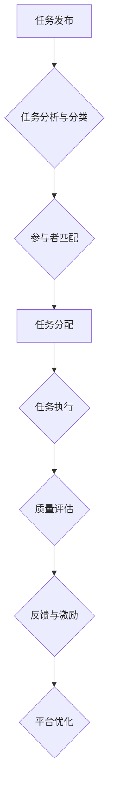

> AI驱动的众包，协作平台，机器学习，任务分配，质量控制，创新驱动

## 1. 背景介绍

在当今数字时代，信息爆炸和全球化趋势的加速发展，催生了新的合作模式和创新模式。众包，作为一种利用互联网平台连接大量分散的个人或群体，共同完成特定任务的模式，近年来迅速发展。它为企业和个人提供了灵活、高效、低成本的资源获取和问题解决途径。然而，传统的众包模式面临着任务分配不合理、质量控制困难、激励机制不足等挑战。

人工智能（AI）技术的快速发展为众包模式带来了新的机遇。AI算法能够智能化地分析任务需求，匹配合适的参与者，自动评估任务质量，并提供个性化的激励机制，从而提升众包效率和效果。

## 2. 核心概念与联系

**2.1 众包模式**

众包是指通过互联网平台，将任务分解成一个个小的单元，并发布到全球范围内，由大量分散的个人或群体（“众包者”）共同完成。

**2.2 人工智能（AI）**

人工智能是指模拟人类智能行为的计算机系统。AI技术涵盖了机器学习、深度学习、自然语言处理、计算机视觉等多个领域。

**2.3 AI驱动的众包**

AI驱动的众包是指利用人工智能技术，对众包平台进行智能化改造，提升任务分配、质量控制、激励机制等方面的效率和效果。

**2.4 核心架构**



## 3. 核心算法原理 & 具体操作步骤

**3.1 算法原理概述**

AI驱动的众包的核心算法主要包括：

* **任务分类与匹配算法:** 利用机器学习算法对任务进行分类和标签化，并根据参与者的技能、经验和兴趣匹配合适的任务。
* **质量控制算法:** 利用深度学习算法对任务结果进行自动评估，识别和过滤低质量的结果。
* **激励机制算法:** 利用强化学习算法设计个性化的激励机制，鼓励参与者积极完成任务并提高任务质量。

**3.2 算法步骤详解**

1. **任务发布:** 企业或个人发布需要完成的任务，并提供详细的任务描述、要求和奖励信息。
2. **任务分析与分类:** AI系统利用自然语言处理算法对任务描述进行分析，提取关键信息，并将其分类到不同的任务类别中。
3. **参与者匹配:** AI系统根据参与者的技能、经验、兴趣等信息，以及任务的类别和要求，进行匹配，推荐合适的参与者。
4. **任务分配:** AI系统将任务分配给匹配的参与者，并提供任务相关的资源和支持。
5. **任务执行:** 参与者根据任务要求完成任务，并提交任务结果。
6. **质量评估:** AI系统利用深度学习算法对任务结果进行自动评估，识别和过滤低质量的结果。
7. **反馈与激励:** AI系统根据任务质量和参与者的贡献，提供相应的反馈和激励，例如奖励、积分、排名等。
8. **平台优化:** AI系统根据平台运行数据和用户反馈，不断优化任务分配、质量控制、激励机制等算法，提升平台效率和效果。

**3.3 算法优缺点**

**优点:**

* **提高效率:** AI算法能够智能化地完成任务分配、质量控制等环节，提升众包平台的效率。
* **降低成本:** AI算法能够自动完成一些人工操作，降低平台运营成本。
* **提升质量:** AI算法能够识别和过滤低质量的结果，提升任务质量。
* **个性化激励:** AI算法能够根据参与者的贡献和需求，提供个性化的激励机制，提高参与者的积极性。

**缺点:**

* **算法依赖:** AI驱动的众包模式依赖于人工智能算法的准确性和可靠性。
* **数据安全:** 众包平台需要处理大量用户数据，需要加强数据安全保护。
* **伦理问题:** AI驱动的众包模式可能引发一些伦理问题，例如算法偏见、数据隐私等。

**3.4 算法应用领域**

AI驱动的众包模式可以应用于多个领域，例如：

* **图像识别:** 利用众包平台，收集大量图像数据，训练图像识别算法。
* **自然语言处理:** 利用众包平台，收集大量文本数据，训练自然语言处理算法。
* **数据标注:** 利用众包平台，标注大量数据，用于训练机器学习算法。
* **软件测试:** 利用众包平台，进行软件测试，发现软件缺陷。
* **创意设计:** 利用众包平台，收集创意想法，进行产品设计。

## 4. 数学模型和公式 & 详细讲解 & 举例说明

**4.1 数学模型构建**

假设我们有一个AI驱动的众包平台，需要对参与者的贡献进行评估。我们可以使用一个基于机器学习的评分模型，将参与者的贡献转化为一个分数。

**4.2 公式推导过程**

评分模型可以采用线性回归模型，其公式如下：

$$
score = w_1 * quality + w_2 * speed + w_3 * feedback
$$

其中：

* $score$：参与者的评分
* $quality$：任务完成质量
* $speed$：任务完成速度
* $feedback$：其他参与者对任务完成的评价
* $w_1$, $w_2$, $w_3$：权重系数，通过训练模型得到

**4.3 案例分析与讲解**

假设一个参与者完成了三个任务，任务质量分别为 90%，85%，95%，任务完成速度分别为 10分钟，15分钟，8分钟，其他参与者对任务完成的评价分别为 4星，5星，4星。

如果我们设定权重系数为 $w_1 = 0.5$, $w_2 = 0.3$, $w_3 = 0.2$，则该参与者的评分为：

$$
score = 0.5 * (0.9 + 0.85 + 0.95) + 0.3 * (1/10 + 1/15 + 1/8) + 0.2 * (4 + 5 + 4)
$$

$$
score = 0.9 + 0.15 + 0.2 = 1.25
$$

## 5. 项目实践：代码实例和详细解释说明

**5.1 开发环境搭建**

* 操作系统：Ubuntu 20.04
* Python 版本：3.8
* 必要的库：TensorFlow, PyTorch, scikit-learn, Flask

**5.2 源代码详细实现**

```python
# 任务分类与匹配算法
from sklearn.feature_extraction.text import TfidfVectorizer
from sklearn.metrics.pairwise import cosine_similarity

def classify_task(task_description):
    # 使用TF-IDF向量化任务描述
    vectorizer = TfidfVectorizer()
    task_vector = vectorizer.fit_transform([task_description])
    # 根据任务向量与已知任务类别进行匹配
    # ...

def match_participant(task_vector, participant_profiles):
    # 计算任务向量与参与者技能向量之间的余弦相似度
    # ...
    # 返回与任务最匹配的参与者

# 质量控制算法
from tensorflow.keras.models import load_model

def evaluate_quality(task_result):
    # 使用预训练的质量控制模型对任务结果进行评估
    model = load_model('quality_control_model.h5')
    # ...
    return quality_score

# 激励机制算法
from tensorflow.keras.models import load_model

def calculate_reward(task_quality, participant_contribution):
    # 使用预训练的激励机制模型计算奖励
    model = load_model('reward_model.h5')
    # ...
    return reward

# 平台优化
def optimize_platform(platform_data):
    # 使用机器学习算法分析平台运行数据，优化任务分配、质量控制、激励机制等
    # ...

```

**5.3 代码解读与分析**

* **任务分类与匹配算法:** 利用TF-IDF向量化任务描述，并根据任务向量与已知任务类别进行匹配，找到最合适的参与者。
* **质量控制算法:** 使用预训练的质量控制模型对任务结果进行评估，识别和过滤低质量的结果。
* **激励机制算法:** 使用预训练的激励机制模型计算奖励，根据任务质量和参与者的贡献提供个性化的激励。
* **平台优化:** 使用机器学习算法分析平台运行数据，优化任务分配、质量控制、激励机制等，提升平台效率和效果。

**5.4 运行结果展示**

通过运行上述代码，可以实现AI驱动的众包平台的功能，例如：

* 自动分类任务，匹配合适的参与者
* 自动评估任务质量，识别和过滤低质量的结果
* 提供个性化的激励机制，鼓励参与者积极完成任务
* 分析平台运行数据，优化平台效率和效果

## 6. 实际应用场景

**6.1 图像识别**

AI驱动的众包平台可以用于收集大量图像数据，并利用这些数据训练图像识别算法。例如，可以利用众包平台收集不同类型的水果图像，训练一个识别不同水果的算法。

**6.2 自然语言处理**

AI驱动的众包平台可以用于收集大量文本数据，并利用这些数据训练自然语言处理算法。例如，可以利用众包平台收集用户评论数据，训练一个情感分析算法。

**6.3 数据标注**

AI驱动的众包平台可以用于标注大量数据，用于训练机器学习算法。例如，可以利用众包平台标注图像中的物体，用于训练目标检测算法。

**6.4 软件测试**

AI驱动的众包平台可以用于进行软件测试，发现软件缺陷。例如，可以利用众包平台让用户测试软件的功能，并报告发现的缺陷。

**6.5 创意设计**

AI驱动的众包平台可以用于收集创意想法，进行产品设计。例如，可以利用众包平台让用户提交产品设计方案，并投票选择最佳方案。

**6.6 未来应用展望**

AI驱动的众包模式在未来将有更广泛的应用场景，例如：

* **医疗保健:** 利用众包平台收集患者数据，辅助医生诊断疾病。
* **教育:** 利用众包平台提供个性化的学习资源，提升教育效率。
* **科学研究:** 利用众包平台收集科学数据，加速科学研究进度。

## 7. 工具和资源推荐

**7.1 学习资源推荐**

* **书籍:**
    * 《人工智能：一种现代方法》
    * 《深度学习》
    * 《机器学习》
* **在线课程:**
    * Coursera: 人工智能课程
    * edX: 深度学习课程
    * Udacity: 机器学习工程师课程

**7.2 开发工具推荐**

* **Python:** 广泛应用于人工智能开发
* **TensorFlow:** 深度学习框架
* **PyTorch:** 深度学习框架
* **scikit-learn:** 机器学习库
* **Flask:** Web框架

**7.3 相关论文推荐**

* **《AI驱动的众包平台》**
* **《机器学习在众包中的应用》**
* **《AI驱动的众包模式的未来发展趋势》**

## 8. 总结：未来发展趋势与挑战

**8.1 研究成果总结**

AI驱动的众包模式在近年来取得了显著的进展，在提高效率、降低成本、提升质量等方面展现出巨大的潜力。

**8.2 未来发展趋势**

* **更智能的算法:** 未来将开发更智能的算法，例如强化学习算法，进一步提升众包平台的效率和效果。
* **更广泛的应用场景:** AI驱动的众包模式将应用于更多领域，例如医疗保健、教育、科学研究等。
* **更安全的平台:** 未来将更加重视数据安全和