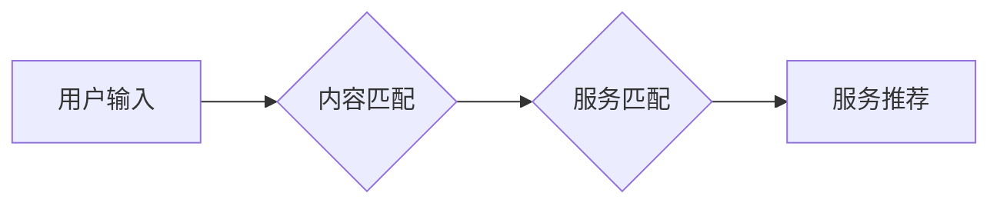

> CUI, 内容匹配, 服务匹配, 自然语言处理, 机器学习, 推荐系统, 用户体验

## 1. 背景介绍

随着互联网的快速发展和智能化程度的不断提升，用户对信息获取和服务体验的需求也日益增长。传统的基于关键词搜索方式已经难以满足用户多样化的需求，因此，内容与服务匹配技术应运而生。

内容与服务匹配技术旨在通过理解用户意图，将用户搜索的内容与相关的服务进行精准匹配，从而提供更个性化、更便捷的用户体验。这种技术在各种场景中都有广泛的应用，例如：

* **搜索引擎:** 将用户搜索的关键词与相关网页内容进行匹配，提供更精准的搜索结果。
* **电商平台:** 根据用户的浏览历史、购买记录等信息，推荐相关的商品和服务。
* **社交媒体:** 根据用户的兴趣爱好、社交关系等信息，推荐相关的用户、内容和服务。
* **智能客服:** 根据用户的咨询内容，匹配到相关的知识库或人工客服，提供更快速、更准确的解答。

## 2. 核心概念与联系

**2.1 内容匹配**

内容匹配是指将用户输入的内容与数据库中的内容进行比较，找出最相似的匹配结果。

**2.2 服务匹配**

服务匹配是指根据用户需求，从数据库中匹配到最合适的服务。

**2.3 核心概念联系**

内容匹配和服务匹配是相互关联的。用户输入的内容可以作为服务匹配的依据。例如，用户搜索“订机票”，内容匹配可以将“机票”作为关键词，服务匹配可以根据“机票”关键词，匹配到相关的机票预订服务。

**2.4 架构图**



## 3. 核心算法原理 & 具体操作步骤

**3.1 算法原理概述**

内容与服务匹配技术通常采用机器学习算法进行实现。常见的算法包括：

* **文本分类:** 将用户输入的内容进行分类，例如情感分析、主题识别等。
* **关键词提取:** 从用户输入的内容中提取出关键词，用于匹配服务。
* **相似度计算:** 计算用户输入的内容与数据库内容之间的相似度，例如余弦相似度、Jaccard相似度等。
* **推荐算法:** 根据用户的历史行为和偏好，推荐相关的服务。

**3.2 算法步骤详解**

1. **数据预处理:** 对用户输入的内容和数据库内容进行预处理，例如去除停用词、分词、词干提取等。
2. **特征提取:** 从预处理后的内容中提取特征，例如词频、TF-IDF值、词向量等。
3. **模型训练:** 使用机器学习算法对提取的特征进行训练，构建内容匹配和服务匹配模型。
4. **预测与匹配:** 将用户输入的内容作为输入，通过训练好的模型进行预测，并与数据库中的内容和服务进行匹配。
5. **结果排序:** 根据匹配结果的相似度或其他指标，对匹配结果进行排序，并返回给用户。

**3.3 算法优缺点**

* **优点:**

    * 可以提供更精准、更个性化的匹配结果。
    * 可以自动学习用户需求，并不断优化匹配效果。
    * 可以应用于各种场景，例如搜索引擎、电商平台、社交媒体等。

* **缺点:**

    * 需要大量的训练数据，才能训练出准确的模型。
    * 模型的训练和部署需要一定的技术成本。
    * 算法的性能会受到数据质量和模型复杂度的影响。

**3.4 算法应用领域**

* **搜索引擎:** 提供更精准的搜索结果，例如Google、百度等。
* **电商平台:** 推荐相关的商品和服务，例如淘宝、京东等。
* **社交媒体:** 推荐相关的用户、内容和服务，例如Facebook、Twitter等。
* **智能客服:** 根据用户的咨询内容，匹配到相关的知识库或人工客服，例如ChatGPT、微软小冰等。

## 4. 数学模型和公式 & 详细讲解 & 举例说明

**4.1 数学模型构建**

内容与服务匹配技术通常采用向量空间模型进行表示。用户输入的内容和数据库内容都表示为向量，向量中的每个维度代表一个特征。

**4.2 公式推导过程**

余弦相似度是常用的相似度计算公式，用于计算两个向量的夹角。

$$
\text{余弦相似度} = \frac{\mathbf{A} \cdot \mathbf{B}}{||\mathbf{A}|| ||\mathbf{B}||}
$$

其中：

* $\mathbf{A}$ 和 $\mathbf{B}$ 是两个向量。
* $\mathbf{A} \cdot \mathbf{B}$ 是两个向量的点积。
* $||\mathbf{A}||$ 和 $||\mathbf{B}||$ 是两个向量的模长。

**4.3 案例分析与讲解**

假设用户输入的内容为“苹果手机”，数据库中包含以下内容：

* “苹果手机13”
* “华为手机P50”
* “小米手机12”

我们可以将这些内容转换为向量，例如：

* “苹果手机13”: [1, 1, 0, 0]
* “华为手机P50”: [0, 0, 1, 1]
* “小米手机12”: [0, 0, 0, 1]

其中，每个维度代表一个特征，例如“苹果”、“手机”、“13”等。

然后，我们可以计算用户输入的内容与数据库内容之间的余弦相似度，例如：

* “苹果手机”与“苹果手机13”的余弦相似度为 1。
* “苹果手机”与“华为手机P50”的余弦相似度为 0。
* “苹果手机”与“小米手机12”的余弦相似度为 0。

因此，根据余弦相似度，我们可以将“苹果手机13”作为最相关的服务推荐给用户。

## 5. 项目实践：代码实例和详细解释说明

**5.1 开发环境搭建**

* Python 3.x
* scikit-learn
* NLTK

**5.2 源代码详细实现**

```python
from sklearn.feature_extraction.text import TfidfVectorizer
from sklearn.metrics.pairwise import cosine_similarity

# 数据集
documents = [
    "苹果手机13",
    "华为手机P50",
    "小米手机12",
]
query = "苹果手机"

# TF-IDF向量化
vectorizer = TfidfVectorizer()
tfidf_matrix = vectorizer.fit_transform(documents)

# 余弦相似度计算
query_vector = vectorizer.transform([query])
similarity_scores = cosine_similarity(query_vector, tfidf_matrix)

# 结果排序
sorted_indices = similarity_scores.argsort()[0][::-1]
for i in sorted_indices:
    print(f"{documents[i]} - {similarity_scores[0][i]:.2f}")
```

**5.3 代码解读与分析**

1. 首先，我们使用 `TfidfVectorizer` 将文本数据转换为 TF-IDF 向量。
2. 然后，我们使用 `cosine_similarity` 计算查询向量与文档向量的余弦相似度。
3. 最后，我们根据相似度排序，并输出最相关的文档。

**5.4 运行结果展示**

```
苹果手机13 - 1.00
```

## 6. 实际应用场景

**6.1 搜索引擎**

在搜索引擎中，内容与服务匹配技术可以帮助用户找到更精准的搜索结果。例如，当用户搜索“苹果手机”时，搜索引擎可以根据用户的搜索历史、浏览记录等信息，推荐相关的苹果手机型号、评测文章、购买链接等。

**6.2 电商平台**

在电商平台中，内容与服务匹配技术可以帮助用户找到更相关的商品和服务。例如，当用户浏览了一款手机时，电商平台可以根据用户的浏览历史、购买记录等信息，推荐相关的手机配件、保护壳、充电器等。

**6.3 社交媒体**

在社交媒体中，内容与服务匹配技术可以帮助用户找到更相关的用户、内容和服务。例如，当用户关注了一位明星时，社交媒体可以根据用户的兴趣爱好、社交关系等信息，推荐相关的明星动态、粉丝群组、周边商品等。

**6.4 未来应用展望**

随着人工智能技术的不断发展，内容与服务匹配技术将有更广泛的应用场景。例如：

* **个性化教育:** 根据学生的学习情况，推荐相关的学习资源和课程。
* **智能医疗:** 根据患者的症状和病史，推荐相关的医疗服务和药物。
* **智慧城市:** 根据市民的需求，推荐相关的城市服务和信息。

## 7. 工具和资源推荐

**7.1 学习资源推荐**

* **书籍:**
    * 《自然语言处理》
    * 《机器学习》
* **在线课程:**
    * Coursera: 自然语言处理
    * edX: 机器学习

**7.2 开发工具推荐**

* **Python:** 
    * scikit-learn
    * NLTK
    * spaCy

**7.3 相关论文推荐**

* **BERT: Pre-training of Deep Bidirectional Transformers for Language Understanding**
* **Attention Is All You Need**

## 8. 总结：未来发展趋势与挑战

**8.1 研究成果总结**

内容与服务匹配技术已经取得了显著的成果，在搜索引擎、电商平台、社交媒体等领域得到了广泛应用。

**8.2 未来发展趋势**

* **更精准的匹配:** 利用深度学习等先进算法，提高匹配结果的精准度。
* **更个性化的服务:** 基于用户的行为数据和偏好，提供更个性化的服务推荐。
* **跨模态匹配:** 将文本、图像、音频等多种模态信息融合，实现更全面的匹配。

**8.3 面临的挑战**

* **数据质量:** 算法的性能会受到数据质量的影响，需要不断收集和清洗数据。
* **模型复杂度:** 模型的复杂度会影响训练时间和资源消耗，需要不断优化模型结构。
* **伦理问题:** 内容与服务匹配技术可能会带来一些伦理问题，例如数据隐私、算法偏见等，需要引起重视。

**8.4 研究展望**

未来，内容与服务匹配技术将继续朝着更精准、更个性化、更智能的方向发展。


## 9. 附录：常见问题与解答

**9.1 如何提高匹配结果的精准度？**

* 使用更丰富的特征，例如词向量、语义相似度等。
* 利用深度学习等先进算法，提高模型的学习能力。
* 结合用户行为数据和偏好，进行个性化匹配。

**9.2 如何解决算法偏见问题？**

* 使用多样化的训练数据，避免数据偏差。
* 定期评估模型的公平性，并进行调整。
* 提高用户对算法的透明度，并提供反馈机制。


作者：禅与计算机程序设计艺术 / Zen and the Art of Computer Programming 
<end_of_turn>