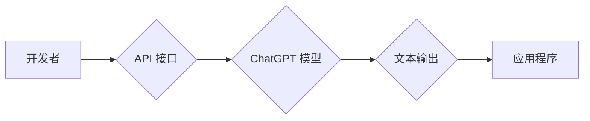

> ChatGPT, 开发者模式, API, 自然语言处理, 语言模型, 应用程序开发

## 1. 背景介绍

ChatGPT，由 OpenAI 开发的强大语言模型，凭借其出色的文本生成能力和自然流畅的对话风格，迅速成为人工智能领域备受瞩目的明星。自其公开发布以来，ChatGPT 已被广泛应用于各种领域，例如聊天机器人、文本摘要、代码生成、创意写作等。

然而，ChatGPT 的强大功能并不局限于其公开的网页版。OpenAI 为开发者提供了 ChatGPT 开发者模式，允许开发者通过 API 接口访问 ChatGPT 的核心能力，并将其集成到自己的应用程序中。这为开发者打开了无限的可能性，让他们能够利用 ChatGPT 的强大功能构建更智能、更具交互性的应用程序。

## 2. 核心概念与联系

ChatGPT 开发者模式的核心概念是 API 接口。API（Application Programming Interface，应用程序编程接口）是一种软件组件之间的通信协议，它允许不同的软件系统相互交互和共享数据。

ChatGPT 开发者模式的 API 接口允许开发者向 ChatGPT 发送文本输入，并接收 ChatGPT 生成的文本输出。开发者可以通过 API 接口控制 ChatGPT 的行为，例如指定生成文本的长度、风格、语气等。

**ChatGPT 开发者模式架构流程图:**



## 3. 核心算法原理 & 具体操作步骤

### 3.1  算法原理概述

ChatGPT 基于 Transformer 架构，是一种深度学习模型，专门用于处理自然语言文本。Transformer 架构的核心是注意力机制，它允许模型关注输入文本中与当前生成词语相关的部分，从而更好地理解上下文信息，生成更准确、更流畅的文本。

### 3.2  算法步骤详解

1. **文本预处理:** 将输入文本进行分词、词嵌入等预处理操作，将文本转换为模型可以理解的数字格式。
2. **编码阶段:** 使用 Transformer 的编码器将预处理后的文本编码成一个向量表示，该向量包含了文本的语义信息。
3. **解码阶段:** 使用 Transformer 的解码器根据编码后的向量表示，逐个生成文本的词语。解码器在生成每个词语时，会利用注意力机制关注之前生成的词语，并根据上下文信息预测下一个词语。
4. **输出结果:** 将生成的词语拼接在一起，得到最终的文本输出。

### 3.3  算法优缺点

**优点:**

* **强大的文本生成能力:** ChatGPT 可以生成高质量、自然流畅的文本。
* **上下文理解能力强:** 注意力机制允许模型理解上下文信息，生成更准确的文本。
* **可定制性强:** 开发者可以通过 API 接口控制 ChatGPT 的行为，例如指定生成文本的长度、风格、语气等。

**缺点:**

* **训练成本高:** ChatGPT 的训练需要大量的计算资源和数据。
* **可能生成不准确或有偏见的文本:** ChatGPT 的训练数据可能包含偏差，导致模型生成不准确或有偏见的文本。
* **缺乏真实世界知识:** ChatGPT 的知识主要来自于其训练数据，缺乏对真实世界事件的实时了解。

### 3.4  算法应用领域

* **聊天机器人:** ChatGPT 可以用于构建更智能、更具交互性的聊天机器人。
* **文本摘要:** ChatGPT 可以自动生成文本的摘要，节省用户阅读时间。
* **代码生成:** ChatGPT 可以根据自然语言描述生成代码，提高开发效率。
* **创意写作:** ChatGPT 可以帮助用户进行创意写作，例如生成故事、诗歌等。

## 4. 数学模型和公式 & 详细讲解 & 举例说明

### 4.1  数学模型构建

ChatGPT 的数学模型主要基于 Transformer 架构，其核心是注意力机制。注意力机制可以理解为模型对输入文本中不同部分的关注程度。

**注意力机制公式:**

$$
Attention(Q, K, V) = softmax(\frac{QK^T}{\sqrt{d_k}})V
$$

其中：

* $Q$：查询矩阵
* $K$：键矩阵
* $V$：值矩阵
* $d_k$：键向量的维度
* $softmax$：softmax 函数，用于将注意力权重归一化

### 4.2  公式推导过程

注意力机制的公式推导过程较为复杂，涉及到矩阵运算、线性变换等数学概念。

简而言之，注意力机制首先计算查询矩阵 $Q$ 和键矩阵 $K$ 的点积，然后通过 softmax 函数将点积结果归一化，得到注意力权重。最后，将注意力权重与值矩阵 $V$ 相乘，得到最终的注意力输出。

### 4.3  案例分析与讲解

假设我们有一个句子 "The cat sat on the mat"，我们想要计算每个词语对 "sat" 的注意力权重。

1. 将句子中的每个词语转换为向量表示，作为 $Q$、$K$ 和 $V$ 的输入。
2. 计算 $Q$ 和 $K$ 的点积，得到一个注意力得分矩阵。
3. 对注意力得分矩阵应用 softmax 函数，得到每个词语对 "sat" 的注意力权重。
4. 将注意力权重与 $V$ 相乘，得到 "sat" 的注意力输出，该输出包含了 "sat" 与其他词语之间的关系信息。

## 5. 项目实践：代码实例和详细解释说明

### 5.1  开发环境搭建

为了使用 ChatGPT 开发者模式，需要先搭建开发环境。

1. 安装 Python 3.7 或更高版本。
2. 安装 OpenAI 的 Python 库：`pip install openai`
3. 获取 OpenAI API 密钥：https://platform.openai.com/account/api-keys

### 5.2  源代码详细实现

```python
import openai

# 设置 OpenAI API 密钥
openai.api_key = "YOUR_API_KEY"

# 定义一个函数，用于发送文本到 ChatGPT 并获取响应
def chat_with_gpt(prompt):
    response = openai.Completion.create(
        engine="text-davinci-003",
        prompt=prompt,
        max_tokens=100,
        temperature=0.7,
    )
    return response.choices[0].text

# 示例用法
prompt = "你好，ChatGPT！请告诉我今天的天气如何？"
response = chat_with_gpt(prompt)
print(response)
```

### 5.3  代码解读与分析

* `openai.api_key = "YOUR_API_KEY"`：设置 OpenAI API 密钥，用于身份验证。
* `openai.Completion.create()`：调用 OpenAI 的 API 接口，发送文本到 ChatGPT 并获取响应。
* `engine="text-davinci-003"`：指定使用的 ChatGPT 模型。
* `prompt=prompt`：传入需要发送给 ChatGPT 的文本提示。
* `max_tokens=100`：限制 ChatGPT 生成的文本长度。
* `temperature=0.7`：控制文本生成的随机性。
* `response.choices[0].text`：获取 ChatGPT 生成的文本输出。

### 5.4  运行结果展示

运行上述代码，将会输出 ChatGPT 对 "你好，ChatGPT！请告诉我今天的天气如何？" 的响应。

## 6. 实际应用场景

### 6.1  聊天机器人

ChatGPT 可以用于构建更智能、更具交互性的聊天机器人。例如，可以开发一个可以进行自然对话的客服机器人，帮助用户解决问题，提供信息。

### 6.2  文本摘要

ChatGPT 可以自动生成文本的摘要，节省用户阅读时间。例如，可以开发一个可以自动生成新闻文章摘要的应用程序，帮助用户快速了解新闻内容。

### 6.3  代码生成

ChatGPT 可以根据自然语言描述生成代码，提高开发效率。例如，可以开发一个可以根据用户描述生成代码片段的工具，帮助开发者快速编写代码。

### 6.4  未来应用展望

ChatGPT 的应用场景远不止以上列举的，随着技术的不断发展，ChatGPT 将在更多领域发挥作用，例如：

* **教育:** 用于个性化学习、自动批改作业等。
* **医疗:** 用于辅助诊断、提供医疗信息等。
* **艺术创作:** 用于生成诗歌、音乐、绘画等艺术作品。

## 7. 工具和资源推荐

### 7.1  学习资源推荐

* **OpenAI 官方文档:** https://platform.openai.com/docs/api-reference
* **ChatGPT GitHub 仓库:** https://github.com/openai/gpt-3

### 7.2  开发工具推荐

* **Python:** https://www.python.org/
* **VS Code:** https://code.visualstudio.com/

### 7.3  相关论文推荐

* **Attention Is All You Need:** https://arxiv.org/abs/1706.03762

## 8. 总结：未来发展趋势与挑战

### 8.1  研究成果总结

ChatGPT 的出现标志着自然语言处理领域取得了重大突破，其强大的文本生成能力和上下文理解能力为人工智能的应用带来了新的可能性。

### 8.2  未来发展趋势

未来，ChatGPT 将朝着以下方向发展：

* **更强大的模型:** 模型规模将进一步扩大，性能将得到提升。
* **更广泛的应用场景:** ChatGPT 将应用于更多领域，例如教育、医疗、艺术等。
* **更个性化的体验:** ChatGPT 将能够根据用户的喜好和需求提供个性化的服务。

### 8.3  面临的挑战

ChatGPT 也面临着一些挑战，例如：

* **数据偏见:** ChatGPT 的训练数据可能包含偏见，导致模型生成不准确或有偏见的文本。
* **可解释性:** ChatGPT 的决策过程难以理解，这使得其应用在一些敏感领域存在风险。
* **伦理问题:** ChatGPT 的强大能力可能被用于恶意目的，例如生成虚假信息、进行网络攻击等。

### 8.4  研究展望

未来，研究者将继续致力于解决 ChatGPT 的挑战，使其更加安全、可靠、可解释。同时，也将探索 ChatGPT 的更多应用场景，推动人工智能技术的发展。

## 9. 附录：常见问题与解答

**Q1: 如何获取 OpenAI API 密钥？**

A1: 请访问 https://platform.openai.com/account/api-keys 获取 OpenAI API 密钥。

**Q2: ChatGPT 的模型有哪些？**

A2: OpenAI 提供了多种 ChatGPT 模型，例如 text-davinci-003、text-curie-001 等。

**Q3: ChatGPT 的使用成本如何？**

A3: ChatGPT 的使用成本取决于使用的模型和请求量。请参考 OpenAI 的官方价格表获取详细信息。


作者：禅与计算机程序设计艺术 / Zen and the Art of Computer Programming 
<end_of_turn>