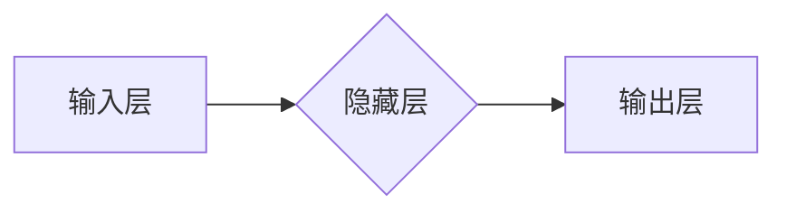

> 深度学习，卷积神经网络，反向传播，自动编码器，生成对抗网络

## 1. 背景介绍

人工智能（AI）的蓬勃发展离不开算法的不断创新。在深度学习领域，Geoffrey Hinton、Yann LeCun 和 Yoshua Bengio 被誉为“深度学习之父”，他们对该领域的贡献不可磨灭。他们的研究成果推动了深度学习的理论发展和实际应用，为我们构建更智能的机器提供了强大的工具。

## 2. 核心概念与联系

深度学习的核心概念是多层神经网络，它模仿了人脑的结构和功能。

**Mermaid 流程图：**



Hinton、LeCun 和 Bengio分别在不同的领域做出了突出贡献：

* **Geoffrey Hinton:** 他对反向传播算法的改进和自动编码器的提出，为深度学习奠定了基础。
* **Yann LeCun:** 他在卷积神经网络（CNN）的开发和应用方面做出了重要贡献，CNN在图像识别、语音识别等领域取得了突破性进展。
* **Yoshua Bengio:** 他在深度学习的理论研究和应用方面做出了重要贡献，例如递归神经网络（RNN）和生成对抗网络（GAN）。

他们的研究成果相互补充，共同推动了深度学习的发展。

## 3. 核心算法原理 & 具体操作步骤

### 3.1  算法原理概述

**反向传播算法:**

反向传播算法是深度学习训练神经网络的关键算法。它通过计算误差并反向传播到网络各层，调整神经元的权重，从而使网络的输出更接近真实值。

**自动编码器:**

自动编码器是一种无监督学习算法，它通过学习数据的压缩表示来学习数据的特征。它由编码器和解码器组成，编码器将输入数据压缩成低维表示，解码器将低维表示恢复成原始数据。

**卷积神经网络 (CNN):**

CNN是一种专门用于处理图像数据的深度学习算法。它利用卷积操作来提取图像特征，并通过池化操作来降低特征维度。CNN的结构可以有效地学习图像的局部和全局特征，从而实现图像识别、分类等任务。

### 3.2  算法步骤详解

**反向传播算法步骤:**

1. 将输入数据输入到神经网络中。
2. 计算网络的输出值。
3. 计算输出值与真实值的误差。
4. 将误差反向传播到网络各层。
5. 根据误差调整神经元的权重。
6. 重复步骤1-5，直到误差达到最小值。

**自动编码器步骤:**

1. 将输入数据输入到编码器中。
2. 编码器将输入数据压缩成低维表示。
3. 将低维表示输入到解码器中。
4. 解码器将低维表示恢复成原始数据。
5. 计算原始数据与恢复数据的误差。
6. 根据误差调整编码器和解码器的参数。

**CNN步骤:**

1. 将输入图像输入到卷积层中。
2. 卷积层使用卷积核提取图像特征。
3. 池化层降低特征维度。
4. 将特征传递到全连接层。
5. 全连接层进行分类或回归。

### 3.3  算法优缺点

**反向传播算法:**

* **优点:** 能够有效地训练深度神经网络。
* **缺点:** 训练过程可能很慢，容易陷入局部最优解。

**自动编码器:**

* **优点:** 可以学习数据的压缩表示，用于降维、特征提取等任务。
* **缺点:** 训练过程可能比较复杂，需要选择合适的编码器和解码器结构。

**CNN:**

* **优点:** 能够有效地提取图像特征，在图像识别、分类等任务中表现出色。
* **缺点:** 训练数据量较大，计算量较大。

### 3.4  算法应用领域

**反向传播算法:**

* 自然语言处理
* 图像识别
* 语音识别
* 机器翻译

**自动编码器:**

* 数据压缩
* 降维
* 特征提取
* 异常检测

**CNN:**

* 图像识别
* 物体检测
* 图像分类
* 语义分割

## 4. 数学模型和公式 & 详细讲解 & 举例说明

### 4.1  数学模型构建

**反向传播算法:**

反向传播算法的核心是利用链式法则计算误差梯度。假设神经网络的输出为y，真实值是t，则误差函数为：

$$
E = \frac{1}{2} \sum_{i=1}^{N} (y_i - t_i)^2
$$

其中N是样本数量。

误差梯度为：

$$
\frac{\partial E}{\partial w} = \frac{\partial E}{\partial y} \cdot \frac{\partial y}{\partial w}
$$

其中w是神经网络的权重。

**自动编码器:**

自动编码器的数学模型可以表示为：

$$
z = f(x; \theta_e)
$$

$$
\hat{x} = g(z; \theta_d)
$$

其中x是输入数据，z是编码器输出的低维表示，$\hat{x}$是解码器输出的恢复数据，$\theta_e$和$\theta_d$分别是编码器和解码器的参数。

**CNN:**

CNN的数学模型主要包括卷积操作、池化操作和全连接层。

* **卷积操作:**

$$
y_{ij} = \sum_{m=0}^{M-1} \sum_{n=0}^{N-1} x_{i+m, j+n} * w_{m,n}
$$

其中$x_{i+m, j+n}$是输入图像的像素值，$w_{m,n}$是卷积核的权重，$y_{ij}$是卷积层的输出值。

* **池化操作:**

$$
y_i = \max(x_i, x_{i+1}, ..., x_{i+k-1})
$$

其中$x_i$是输入特征图的像素值，$k$是池化窗口的大小，$y_i$是池化层的输出值。

### 4.2  公式推导过程

**反向传播算法:**

误差梯度的计算过程可以通过链式法则逐步推导。

**自动编码器:**

自动编码器的训练目标是最小化输入数据与恢复数据的误差。可以使用梯度下降算法来更新编码器和解码器的参数。

**CNN:**

CNN的训练过程也是通过反向传播算法来更新卷积核和全连接层的权重。

### 4.3  案例分析与讲解

**反向传播算法:**

在图像识别任务中，可以使用反向传播算法训练卷积神经网络，学习图像特征并进行分类。

**自动编码器:**

在文本生成任务中，可以使用自动编码器学习文本的语义表示，并生成新的文本。

**CNN:**

在医学图像分析任务中，可以使用CNN识别病灶，辅助医生诊断。

## 5. 项目实践：代码实例和详细解释说明

### 5.1  开发环境搭建

* Python 3.x
* TensorFlow 或 PyTorch
* Jupyter Notebook

### 5.2  源代码详细实现

```python
# 使用 TensorFlow 实现一个简单的 CNN

import tensorflow as tf

# 定义模型结构
model = tf.keras.models.Sequential([
    tf.keras.layers.Conv2D(32, (3, 3), activation='relu', input_shape=(28, 28, 1)),
    tf.keras.layers.MaxPooling2D((2, 2)),
    tf.keras.layers.Conv2D(64, (3, 3), activation='relu'),
    tf.keras.layers.MaxPooling2D((2, 2)),
    tf.keras.layers.Flatten(),
    tf.keras.layers.Dense(10, activation='softmax')
])

# 编译模型
model.compile(optimizer='adam',
              loss='sparse_categorical_crossentropy',
              metrics=['accuracy'])

# 训练模型
model.fit(x_train, y_train, epochs=5)

# 评估模型
loss, accuracy = model.evaluate(x_test, y_test)
print('Test loss:', loss)
print('Test accuracy:', accuracy)
```

### 5.3  代码解读与分析

* **模型结构:** 该代码定义了一个简单的 CNN 模型，包含两个卷积层、两个池化层和一个全连接层。
* **激活函数:** 使用 ReLU 激活函数，可以提高模型的表达能力。
* **损失函数:** 使用 sparse_categorical_crossentropy 损失函数，用于多分类任务。
* **优化器:** 使用 Adam 优化器，可以快速收敛。
* **训练过程:** 使用 model.fit() 函数训练模型，指定训练数据、 epochs 和其他参数。
* **评估过程:** 使用 model.evaluate() 函数评估模型在测试集上的性能。

### 5.4  运行结果展示

训练完成后，可以打印出模型在测试集上的损失值和准确率。

## 6. 实际应用场景

### 6.1  图像识别

CNN 在图像识别领域取得了突破性进展，例如：

* **人脸识别:** 用于解锁手机、身份验证等。
* **物体检测:** 用于自动驾驶、安防监控等。
* **图像分类:** 用于医学图像分析、电商商品分类等。

### 6.2  自然语言处理

深度学习算法在自然语言处理领域也取得了显著成果，例如：

* **机器翻译:** 将一种语言翻译成另一种语言。
* **文本摘要:** 自动生成文本的摘要。
* **情感分析:** 分析文本的情感倾向。

### 6.3  语音识别

深度学习算法可以用于语音识别，例如：

* **语音助手:** 例如 Siri、Alexa 等。
* **语音搜索:** 例如语音搜索引擎。
* **语音转文本:** 例如会议记录、语音转录等。

### 6.4  未来应用展望

深度学习的应用前景广阔，未来可能在以下领域得到更广泛的应用：

* **医疗诊断:** 辅助医生诊断疾病，提高诊断准确率。
* **个性化教育:** 根据学生的学习情况提供个性化的学习方案。
* **金融风险管理:** 识别金融风险，降低风险损失。
* **科学研究:** 加速科学研究，发现新的知识。

## 7. 工具和资源推荐

### 7.1  学习资源推荐

* **书籍:**
    * Deep Learning by Ian Goodfellow, Yoshua Bengio, and Aaron Courville
    * Hands-On Machine Learning with Scikit-Learn, Keras & TensorFlow by Aurélien Géron
* **在线课程:**
    * Coursera: Deep Learning Specialization by Andrew Ng
    * Udacity: Deep Learning Nanodegree
* **博客和网站:**
    * Towards Data Science
    * Machine Learning Mastery

### 7.2  开发工具推荐

* **TensorFlow:** 开源深度学习框架，支持多种硬件平台。
* **PyTorch:** 开源深度学习框架，以其灵活性和易用性而闻名。
* **Keras:** 高级深度学习 API，可以运行在 TensorFlow、Theano 或 CNTK 后端。

### 7.3  相关论文推荐

* **AlexNet:** ImageNet Classification with Deep Convolutional Neural Networks
* **VGGNet:** Very Deep Convolutional Networks for Large-Scale Image Recognition
* **ResNet:** Deep Residual Learning for Image Recognition
* **GAN:** Generative Adversarial Networks

## 8. 总结：未来发展趋势与挑战

### 8.1  研究成果总结

Hinton、LeCun 和 Bengio 的研究成果推动了深度学习的发展，使深度学习成为人工智能领域最活跃的研究方向之一。

### 8.2  未来发展趋势

* **模型规模和复杂度:** 深度学习模型