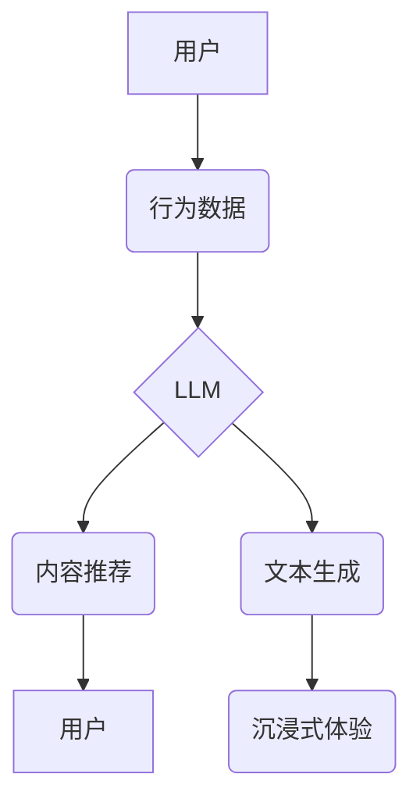

> Large Language Model (LLM), 娱乐行业, 沉浸式体验, 内容推荐, 自然语言处理 (NLP), 人工智能 (AI), 个性化推荐, 虚拟现实 (VR), 增强现实 (AR)

## 1. 背景介绍

娱乐行业一直是科技创新的前沿阵地，从传统的电影、电视到如今的网络游戏、虚拟现实，不断涌现出新的娱乐形式。随着人工智能技术的快速发展，大型语言模型 (LLM) 作为人工智能领域的一项重要突破，正在深刻地改变着娱乐行业的格局。LLM 拥有强大的文本生成、理解和翻译能力，为娱乐行业带来了前所未有的机遇。

## 2. 核心概念与联系

**2.1 核心概念**

* **大型语言模型 (LLM):** 训练于海量文本数据上的深度学习模型，能够理解和生成人类语言。
* **沉浸式体验:**  指用户能够高度沉浸在虚拟环境中，并与之互动，产生身临其境的感受。
* **内容推荐:**  根据用户的兴趣和偏好，推荐相关的内容，提升用户体验。

**2.2 联系**

LLM 可以通过分析用户的行为数据、偏好信息和文本反馈，理解用户的兴趣和需求，从而为用户提供个性化的内容推荐。同时，LLM 可以生成高质量的文本内容，例如故事、剧本、对话等，为沉浸式体验提供丰富的文本素材。

**2.3 架构图**



## 3. 核心算法原理 & 具体操作步骤

**3.1 算法原理概述**

LLM 的核心算法是基于 Transformer 架构的深度神经网络，它能够捕捉文本中的长距离依赖关系，并学习语言的语法和语义。常用的训练方法包括自监督学习和强化学习。

**3.2 算法步骤详解**

1. **数据预处理:** 将文本数据进行清洗、分词、标记等预处理操作，使其适合模型训练。
2. **模型训练:** 使用训练数据训练 LLM 模型，通过反向传播算法不断调整模型参数，使其能够生成准确的文本预测。
3. **模型评估:** 使用测试数据评估模型的性能，例如准确率、困惑度等指标。
4. **模型部署:** 将训练好的模型部署到服务器或云平台，以便进行实际应用。

**3.3 算法优缺点**

* **优点:** 能够生成高质量的文本内容，理解复杂的语言结构，适应不同的语言任务。
* **缺点:** 训练成本高，需要大量的计算资源和数据，容易受到训练数据偏差的影响。

**3.4 算法应用领域**

* 文本生成：小说、剧本、诗歌等
* 机器翻译：将一种语言翻译成另一种语言
* 聊天机器人：与用户进行自然语言对话
* 内容推荐：根据用户的兴趣推荐相关内容

## 4. 数学模型和公式 & 详细讲解 & 举例说明

**4.1 数学模型构建**

LLM 的核心数学模型是 Transformer，它使用注意力机制来捕捉文本中的长距离依赖关系。

**4.2 公式推导过程**

Transformer 的注意力机制使用以下公式计算每个词的权重：

$$
Attention(Q, K, V) = softmax(\frac{QK^T}{\sqrt{d_k}})V
$$

其中：

* Q：查询矩阵
* K：键矩阵
* V：值矩阵
* $d_k$：键向量的维度

**4.3 案例分析与讲解**

例如，在翻译句子 "The cat sat on the mat" 时，注意力机制会将 "cat" 和 "sat" 关联起来，理解它们之间的语义关系，从而更好地翻译成目标语言。

## 5. 项目实践：代码实例和详细解释说明

**5.1 开发环境搭建**

* Python 3.7+
* TensorFlow 或 PyTorch
* CUDA 和 cuDNN

**5.2 源代码详细实现**

```python
# 使用 TensorFlow 实现简单的 Transformer 模型
import tensorflow as tf

# 定义 Transformer 的编码器层
class EncoderLayer(tf.keras.layers.Layer):
    def __init__(self, d_model, num_heads, dff, rate=0.1):
        super(EncoderLayer, self).__init__()
        self.mha = tf.keras.layers.MultiHeadAttention(num_heads=num_heads, key_dim=d_model)
        self.ffn = tf.keras.layers.Dense(dff, activation="relu")
        self.layernorm1 = tf.keras.layers.LayerNormalization(epsilon=1e-6)
        self.layernorm2 = tf.keras.layers.LayerNormalization(epsilon=1e-6)
        self.dropout1 = tf.keras.layers.Dropout(rate)
        self.dropout2 = tf.keras.layers.Dropout(rate)

    def call(self, x, training):
        attn_output = self.mha(x, x, x)
        attn_output = self.dropout1(attn_output, training=training)
        out1 = self.layernorm1(x + attn_output)
        ffn_output = self.ffn(out1)
        ffn_output = self.dropout2(ffn_output, training=training)
        out2 = self.layernorm2(out1 + ffn_output)
        return out2

# 定义 Transformer 的解码器层
class DecoderLayer(tf.keras.layers.Layer):
    def __init__(self, d_model, num_heads, dff, rate=0.1):
        super(DecoderLayer, self).__init__()
        self.mha1 = tf.keras.layers.MultiHeadAttention(num_heads=num_heads, key_dim=d_model)
        self.mha2 = tf.keras.layers.MultiHeadAttention(num_heads=num_heads, key_dim=d_model)
        self.ffn = tf.keras.layers.Dense(dff, activation="relu")
        self.layernorm1 = tf.keras.layers.LayerNormalization(epsilon=1e-6)
        self.layernorm2 = tf.keras.layers.LayerNormalization(epsilon=1e-6)
        self.layernorm3 = tf.keras.layers.LayerNormalization(epsilon=1e-6)
        self.dropout1 = tf.keras.layers.Dropout(rate)
        self.dropout2 = tf.keras.layers.Dropout(rate)
        self.dropout3 = tf.keras.layers.Dropout(rate)

    def call(self, x, encoder_output, training):
        attn1_output = self.mha1(x, x, x)
        attn1_output = self.dropout1(attn1_output, training=training)
        out1 = self.layernorm1(x + attn1_output)
        attn2_output = self.mha2(out1, encoder_output, encoder_output)
        attn2_output = self.dropout2(attn2_output, training=training)
        out2 = self.layernorm2(out1 + attn2_output)
        ffn_output = self.ffn(out2)
        ffn_output = self.dropout3(ffn_output, training=training)
        out3 = self.layernorm3(out2 + ffn_output)
        return out3

# 定义 Transformer 模型
class Transformer(tf.keras.Model):
    def __init__(self, vocab_size, d_model, num_heads, dff, num_layers, rate=0.1):
        super(Transformer, self).__init__()
        self.embedding = tf.keras.layers.Embedding(vocab_size, d_model)
        self.encoder = tf.keras.Sequential([
            EncoderLayer(d_model, num_heads, dff, rate) for _ in range(num_layers)
        ])
        self.decoder = tf.keras.Sequential([
            DecoderLayer(d_model, num_heads, dff, rate) for _ in range(num_layers)
        ])
        self.fc_out = tf.keras.layers.Dense(vocab_size)

    def call(self, encoder_input, decoder_input, training):
        encoder_output = self.encoder(self.embedding(encoder_input), training=training)
        decoder_output = self.decoder(self.embedding(decoder_input), encoder_output, training=training)
        output = self.fc_out(decoder_output)
        return output

```

**5.3 代码解读与分析**

以上代码实现了基本的 Transformer 模型，包括编码器、解码器和输出层。编码器用于处理输入文本，解码器用于生成输出文本。

**5.4 运行结果展示**

运行该模型需要准备训练数据和进行模型训练。训练完成后，可以将模型用于文本生成、机器翻译等任务。

## 6. 实际应用场景

**6.1 沉浸式游戏体验**

LLM 可以生成逼真的游戏场景、人物对话和剧情，为玩家提供更沉浸式的游戏体验。例如，在角色扮演游戏中，LLM 可以根据玩家的行动和选择，生成动态的对话和剧情发展，让游戏体验更加真实和个性化。

**6.2 个性化内容推荐**

LLM 可以分析用户的观看历史、评分和评论等数据，推荐符合用户兴趣的电影、电视剧、音乐等内容。例如，Netflix 使用 LLM 为用户提供个性化的电影推荐，提升用户体验和留存率。

**6.3 智能虚拟助手**

LLM 可以构建智能虚拟助手，例如聊天机器人、语音助手等，能够理解用户的自然语言指令，并提供相应的服务。例如，Amazon Alexa 使用 LLM 理解用户的语音指令，并控制智能家居设备。

**6.4 创意内容创作**

LLM 可以辅助人类进行创意内容创作，例如生成故事、剧本、诗歌等。例如，一些写作软件使用 LLM 提供写作灵感和文本生成功能，帮助用户克服写作瓶颈。

**6.5 未来应用展望**

LLM 在娱乐行业的应用前景广阔，未来可能在以下方面得到进一步发展：

* 更逼真的虚拟现实和增强现实体验
* 更个性化和智能化的内容推荐
* 更智能和自然的交互体验
* 更丰富的创意内容创作工具

## 7. 工具和资源推荐

**7.1 学习资源推荐**

* **书籍:**
    * 《深度学习》
    * 《自然语言处理》
* **在线课程:**
    * Coursera: 自然语言处理
    * edX: 深度学习
* **博客和网站:**
    * TensorFlow Blog
    * PyTorch Blog
    * Hugging Face

**7.2 开发工具推荐**

* **TensorFlow:** 开源深度学习框架
* **PyTorch:** 开源深度学习框架
* **Hugging Face Transformers:** 提供预训练的 Transformer 模型和工具

**7.3 相关论文推荐**

* Attention Is All You Need
* BERT: Pre-training of Deep Bidirectional Transformers for Language Understanding
* GPT-3: Language Models are Few-Shot Learners

## 8. 总结：未来发展趋势与挑战

**8.1 研究成果总结**

LLM 在娱乐行业取得了显著的成果，为用户带来了更沉浸式、个性化和智能化的体验。

**8.2 未来发展趋势**

未来，LLM 将朝着以下方向发展：

* 更强大的模型能力
* 更广泛的应用场景
* 更安全的模型部署

**8.3 面临的挑战**

LLM 还面临一些挑战，例如：

* 数据获取和隐私问题
* 模型训练成本
* 模型解释性和可信度

**8.4 研究展望**

未来研究将重点关注解决上述挑战，并探索 LLMs 在娱乐行业的新应用场景。

## 9. 附录：常见问题与解答

**