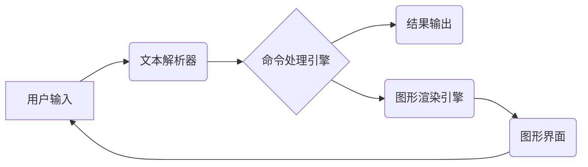

> LUI, CUI, 用户界面, 人机交互, 自然语言处理, 认知科学, 界面设计, 未来趋势

## 1. 背景介绍

随着科技的飞速发展，计算机技术已经渗透到生活的方方面面。用户与计算机的交互方式也从最初的命令行界面 (CLI) 演变为图形用户界面 (GUI)，再到如今更加智能化的自然语言交互界面 (NLUI)。其中，文本用户界面 (CUI) 作为一种简洁高效的交互方式，仍然在许多领域发挥着重要作用，例如命令行工具、嵌入式系统、服务器管理等。

然而，CUI 的交互方式相对简单，缺乏直观性和用户友好性。为了提升用户体验，近年来，一种新的交互模式——轻量级用户界面 (LUI) 逐渐受到关注。LUI 旨在在保留 CUI 简洁高效性的基础上，引入一些图形化元素和智能化功能，从而提供更加直观、便捷的用户体验。

## 2. 核心概念与联系

### 2.1  CUI 和 LUI 的区别

CUI 是一种基于文本命令的交互方式，用户通过输入文本命令来控制计算机。其优点在于简洁高效，占用资源少，适合处理复杂命令和数据。但其缺点在于交互方式较为复杂，需要用户掌握一定的命令语法，学习成本较高。

LUI 则是在 CUI 的基础上，引入一些图形化元素和智能化功能，例如：

* **简化命令结构:** LUI 可以使用缩写、自动补全等功能，简化命令输入，降低用户学习成本。
* **提供提示和帮助:** LUI 可以根据用户输入提供提示和帮助信息，引导用户正确使用命令。
* **使用图标和图形:** LUI 可以使用图标和图形来表示命令和功能，提高用户理解和记忆效率。
* **支持自然语言交互:** 一些 LUI 系统甚至支持自然语言交互，用户可以用更接近日常语言的方式与计算机进行交互。

### 2.2  LUI 的架构

LUI 的架构通常包括以下几个部分：

* **文本解析器:** 解析用户输入的文本命令，将其转换为计算机可理解的指令。
* **命令处理引擎:** 根据解析后的指令，执行相应的操作，并返回结果。
* **图形渲染引擎:** 负责渲染 LUI 的图形界面，包括图标、菜单、提示信息等。
* **智能化模块:** 可以包含自然语言处理、机器学习等模块，用于提供更智能化的交互体验。



## 3. 核心算法原理 & 具体操作步骤

### 3.1  算法原理概述

LUI 的核心算法主要包括文本解析、命令处理和图形渲染。

* **文本解析:** 使用正则表达式、语法分析等技术，将用户输入的文本命令解析成计算机可理解的指令。
* **命令处理:** 根据解析后的指令，调用相应的函数或程序，执行相应的操作。
* **图形渲染:** 使用图形库或引擎，将命令处理的结果以图形化的形式呈现给用户。

### 3.2  算法步骤详解

1. **用户输入:** 用户通过键盘或其他输入设备输入文本命令。
2. **文本解析:** 文本解析器将用户输入的文本命令解析成指令结构，包括命令名称、参数和选项等。
3. **命令处理:** 命令处理引擎根据解析后的指令，调用相应的函数或程序执行操作。
4. **结果处理:** 命令处理引擎处理操作结果，并将其转换为可视化的格式。
5. **图形渲染:** 图形渲染引擎将处理后的结果以图形化的形式呈现给用户，例如显示文本信息、图标、菜单等。

### 3.3  算法优缺点

**优点:**

* **简洁高效:** LUI 的命令结构相对简单，执行效率高。
* **易于学习:** LUI 可以使用缩写、自动补全等功能，降低用户学习成本。
* **可扩展性强:** LUI 可以通过添加新的命令和功能来扩展其功能。

**缺点:**

* **交互体验有限:** 相比于 GUI，LUI 的交互体验相对有限，缺乏直观性和用户友好性。
* **可视化程度低:** LUI 的可视化程度相对较低，难以表达复杂的逻辑关系。

### 3.4  算法应用领域

LUI 广泛应用于以下领域：

* **命令行工具:** 许多命令行工具，例如 Linux 的 shell，都采用了 LUI 的设计理念。
* **嵌入式系统:** 由于资源限制，嵌入式系统通常采用 LUI 来实现用户交互。
* **服务器管理:** 服务器管理员可以使用 LUI 来管理服务器资源和配置。
* **文本编辑器:** 一些文本编辑器也采用了 LUI 的设计理念，例如 Vim 和 Emacs。

## 4. 数学模型和公式 & 详细讲解 & 举例说明

### 4.1  数学模型构建

LUI 的文本解析过程可以抽象为一个有限状态机模型。

* **状态:** 表示解析器当前处理的文本位置和语法状态。
* **输入:** 用户输入的文本字符。
* **转移函数:** 根据当前状态和输入字符，确定解析器下一个状态。
* **接受状态:** 表示解析器成功解析了完整的命令。

### 4.2  公式推导过程

假设 LUI 的文本解析器是一个 n 状态的有限状态机，则其状态转移函数可以表示为：

$$
S_{i+1} = f(S_i, c)
$$

其中：

* $S_i$ 表示解析器在第 i 个字符时的状态。
* $c$ 表示第 i 个字符。
* $S_{i+1}$ 表示解析器在第 i+1 个字符时的状态。

### 4.3  案例分析与讲解

例如，解析命令 "ls -l"，解析器可以根据命令语法规则，将命令分解为以下几个部分：

* 命令名称: "ls"
* 选项: "-l"

解析器可以根据状态转移函数，将这些部分解析成相应的指令结构，并将其传递给命令处理引擎执行操作。

## 5. 项目实践：代码实例和详细解释说明

### 5.1  开发环境搭建

LUI 的开发环境可以根据具体需求选择不同的工具和框架。例如，可以使用 Python 和其丰富的库来实现 LUI 的文本解析和命令处理功能。

### 5.2  源代码详细实现

```python
# LUI 示例代码

class LUI:
    def __init__(self):
        self.commands = {
            "ls": self.list_files,
            "cd": self.change_directory,
        }

    def parse_command(self, command):
        parts = command.split()
        command_name = parts[0]
        args = parts[1:]
        return command_name, args

    def execute_command(self, command_name, args):
        if command_name in self.commands:
            self.commands[command_name](args)
        else:
            print("Unknown command:", command_name)

    def list_files(self, args):
        # 列出当前目录下的文件
        print("Listing files...")

    def change_directory(self, args):
        # 切换到指定目录
        print("Changing directory...")

# 主程序
if __name__ == "__main__":
    lui = LUI()
    while True:
        command = input("> ")
        command_name, args = lui.parse_command(command)
        lui.execute_command(command_name, args)
```

### 5.3  代码解读与分析

这段代码实现了简单的 LUI 系统。

* `LUI` 类定义了命令处理引擎，包含 `commands` 字典用于存储命令和对应的处理函数。
* `parse_command` 函数用于解析用户输入的命令，将其分解成命令名称和参数。
* `execute_command` 函数根据命令名称调用相应的处理函数执行操作。
* `list_files` 和 `change_directory` 函数分别模拟了列出文件和切换目录的操作。

### 5.4  运行结果展示

当用户输入命令 "ls" 时，程序会输出 "Listing files..."。当用户输入命令 "cd /home" 时，程序会输出 "Changing directory..."。

## 6. 实际应用场景

### 6.1  命令行工具

LUI 可以用于开发更加用户友好的命令行工具。例如，可以添加自动补全功能，帮助用户快速输入命令。

### 6.2  嵌入式系统

在资源受限的嵌入式系统中，LUI 可以提供简洁高效的用户交互方式。例如，可以用于控制工业设备、家用电器等。

### 6.3  服务器管理

服务器管理员可以使用 LUI 来管理服务器资源和配置。例如，可以使用 LUI 来查看服务器状态、重启服务、安装软件等。

### 6.4  未来应用展望

随着人工智能技术的进步，LUI 将更加智能化，能够理解用户的自然语言指令，并提供更加个性化的交互体验。

## 7. 工具和资源推荐

### 7.1  学习资源推荐

* **书籍:**
    * "The Pragmatic Programmer" by Andrew Hunt and David Thomas
    * "Clean Code" by Robert C. Martin
* **在线课程:**
    * Coursera: "Programming for Everybody (Getting Started with Python)"
    * edX: "Introduction to Computer Science and Programming Using Python"

### 7.2  开发工具推荐

* **Python:** 
    * **IDLE:** Python 的内置 IDE
    * **PyCharm:** 专业的 Python IDE
* **Shell:** 
    * **Bash:** Linux 的默认 shell
    * **Zsh:** 功能强大的 shell

### 7.3  相关论文推荐

* "A Survey of User Interface Design for Command-Line Interfaces"
* "Towards a Unified Framework for Command-Line Interface Design"

## 8. 总结：未来发展趋势与挑战

### 8.1  研究成果总结

LUI 作为一种介于 CUI 和 GUI 之间的交互模式，在用户体验、效率和可扩展性方面都具有优势。

### 8.2  未来发展趋势

* **更智能化的交互:** 利用自然语言处理和机器学习技术，实现更智能化的 LUI 系统，能够理解用户的自然语言指令。
* **更丰富的可视化:** 结合图形化元素和动画效果，提升 LUI 的可视化程度，提供更直观的交互体验。
* **跨平台支持:** 实现 LUI 系统在不同平台（例如 Windows、Linux、macOS）上的跨平台支持。

### 8.3  面临的挑战

* **设计复杂性:** 设计一个功能丰富、易于使用的 LUI 系统面临着一定的挑战。
* **用户学习成本:** 尽管 LUI 旨在降低用户学习成本，但仍然需要用户学习一些基本的命令语法。
* **可视化程度:** LUI 的可视化程度相对较低，难以表达复杂的逻辑关系。

### 8.4  研究展望

未来，LUI 将继续朝着更智能化、更直观、更易用化的方向发展。研究者将继续探索新的算法和技术，以提升 LUI 的性能和用户体验。

## 9. 附录：常见问题与解答

### 9.1  Q: LUI 和 GUI 的区别是什么？

### 9.2  A: LUI 和 GUI 都是用户界面，但它们在交互方式和视觉效果上有所不同。GUI 使用图形化元素和鼠标交互，而 LUI 使用文本命令和键盘交互。

### 9.3  Q: LUI 的优势是什么？

### 9.4  A: LUI 的优势在于简洁高效、易于学习、可扩展性强。

### 9.5  Q: LUI 的应用场景有哪些？

### 9.6  A: LUI 应用于命令行工具、嵌入式系统、服务器管理等领域。

作者：禅与计算机程序设计艺术 / Zen and the Art of Computer Programming


<end_of_turn>