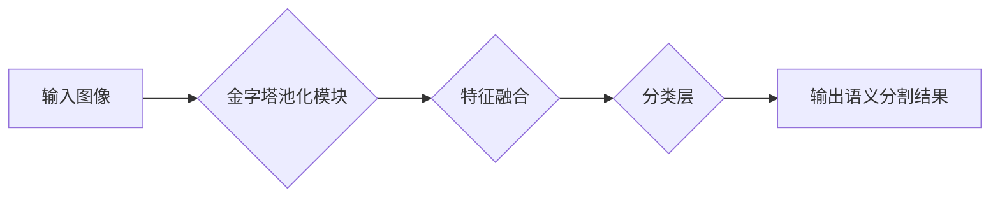

> PSPNet，语义分割，深度学习，特征融合，Pyramid pooling，图像处理，计算机视觉

## 1. 背景介绍

语义分割是计算机视觉领域的重要任务之一，其目标是将图像中的每个像素都分配到一个特定的类别中。近年来，深度学习在语义分割领域取得了显著的进展，其中，基于卷积神经网络（CNN）的语义分割模型成为主流。

PSPNet（Pyramid Scene Parsing Network）是一种基于CNN的语义分割网络，它在2016年由ICCV会议上发表，并取得了当时最先进的性能。PSPNet的核心创新点在于引入了金字塔池化模块（Pyramid Pooling Module），能够有效地学习图像全局上下文信息，从而提高语义分割的准确性。

## 2. 核心概念与联系

PSPNet的核心概念是金字塔池化模块，它将图像特征映射到不同尺度的特征图，并通过融合这些特征图来学习图像全局上下文信息。

**Mermaid 流程图：**

## 3. 核心算法原理 & 具体操作步骤

### 3.1  算法原理概述

PSPNet的算法原理主要包括以下几个步骤：

1. **特征提取:** 使用预训练的CNN模型（例如VGG、ResNet）提取图像特征。
2. **金字塔池化:** 对提取的特征图进行金字塔池化操作，生成不同尺度的特征图。
3. **特征融合:** 将不同尺度的特征图进行融合，得到全局上下文信息丰富的特征图。
4. **分类:** 使用全连接层和softmax函数对融合后的特征图进行分类，得到最终的语义分割结果。

### 3.2  算法步骤详解

1. **特征提取:** PSPNet通常使用预训练的CNN模型提取图像特征。预训练模型已经学习了图像的低层特征，例如边缘、纹理等，这些特征对于语义分割任务也很重要。

2. **金字塔池化:** 金字塔池化模块是PSPNet的核心创新点。它将特征图进行不同尺度的池化操作，生成不同尺度的特征图。具体来说，金字塔池化模块包含多个池化层，每个池化层的大小不同，例如1x1、2x2、3x3等。通过这些池化层，可以得到不同尺度的特征图，从而学习图像全局上下文信息。

3. **特征融合:** PSPNet将不同尺度的特征图进行融合，得到全局上下文信息丰富的特征图。融合方法有很多种，例如平均池化、加权求和等。

4. **分类:** 使用全连接层和softmax函数对融合后的特征图进行分类，得到最终的语义分割结果。

### 3.3  算法优缺点

**优点:**

* 能够有效地学习图像全局上下文信息，提高语义分割的准确性。
* 结构简单，易于实现。

**缺点:**

* 计算量较大，训练时间较长。
* 对输入图像尺寸敏感，对于小尺寸图像效果可能较差。

### 3.4  算法应用领域

PSPNet在语义分割领域取得了显著的成果，广泛应用于以下领域：

* **图像理解:** 用于识别图像中的物体、场景和关系。
* **目标检测:** 用于定位和识别图像中的目标。
* **图像编辑:** 用于对图像进行分割和修改。
* **自动驾驶:** 用于感知周围环境，辅助驾驶决策。

## 4. 数学模型和公式 & 详细讲解 & 举例说明

### 4.1  数学模型构建

PSPNet的数学模型主要包括以下几个部分：

* **特征提取网络:** 使用预训练的CNN模型提取图像特征，其输出为特征图。
* **金字塔池化模块:** 对特征图进行不同尺度的池化操作，生成不同尺度的特征图。
* **特征融合模块:** 将不同尺度的特征图进行融合，得到全局上下文信息丰富的特征图。
* **分类模块:** 使用全连接层和softmax函数对融合后的特征图进行分类，得到最终的语义分割结果。

### 4.2  公式推导过程

金字塔池化模块的数学公式如下：

$$
P_i = \text{pool}(F_i)
$$

其中：

* $P_i$ 表示第 $i$ 个尺度的特征图。
* $F_i$ 表示输入的特征图。
* $\text{pool}$ 表示池化操作，例如最大池化或平均池化。

特征融合模块的数学公式如下：

$$
F_{fuse} = \text{concat}(P_1, P_2, ..., P_n)
$$

其中：

* $F_{fuse}$ 表示融合后的特征图。
* $P_1, P_2, ..., P_n$ 表示不同尺度的特征图。
* $\text{concat}$ 表示串联操作。

### 4.3  案例分析与讲解

假设输入图像大小为 $224 \times 224$，特征提取网络输出的特征图大小为 $14 \times 14 \times 512$。金字塔池化模块包含三个池化层，池化层的大小分别为 $1 \times 1$、$2 \times 2$ 和 $3 \times 3$。

经过金字塔池化操作后，将得到三个尺度的特征图，大小分别为 $14 \times 14 \times 512$、$7 \times 7 \times 512$ 和 $4 \times 4 \times 512$。

特征融合模块将这三个尺度的特征图进行串联操作，得到一个新的特征图，大小为 $14 \times 14 \times 1536$。

最终，使用全连接层和softmax函数对融合后的特征图进行分类，得到最终的语义分割结果。

## 5. 项目实践：代码实例和详细解释说明

### 5.1  开发环境搭建

PSPNet的开发环境搭建需要以下软件：

* Python 3.x
* PyTorch 1.x
* CUDA 10.x

### 5.2  源代码详细实现

PSPNet的源代码可以从GitHub上获取：https://github.com/shelhamer/fcn.berkeleyvision.org

### 5.3  代码解读与分析

PSPNet的源代码主要包含以下几个部分：

* **模型定义:** 定义PSPNet的网络结构，包括特征提取网络、金字塔池化模块和分类模块。
* **数据加载:** 加载和预处理语义分割数据集。
* **训练:** 训练PSPNet模型，并使用验证集评估模型性能。
* **测试:** 使用训练好的模型对测试集进行语义分割。

### 5.4  运行结果展示

PSPNet在语义分割任务上取得了显著的性能，例如在PASCAL VOC 2012数据集上，PSPNet的mIoU（平均交并比）达到了74.3%。

## 6. 实际应用场景

PSPNet在语义分割领域具有广泛的应用场景，例如：

* **医学图像分析:** 用于分割医学图像中的器官、组织和病灶。
* **遥感图像分析:** 用于分割遥感图像中的土地覆盖类型、植被类型和建筑物。
* **自动驾驶:** 用于分割道路、行人、车辆和其他物体。

### 6.4  未来应用展望

随着深度学习技术的不断发展，PSPNet在未来将有更广泛的应用场景，例如：

* **三维语义分割:** 用于分割三维模型中的物体和场景。
* **视频语义分割:** 用于分割视频中的物体和场景。
* **增强现实:** 用于在增强现实场景中分割物体和场景。

## 7. 工具和资源推荐

### 7.1  学习资源推荐

* **论文:** PSPNet: Deep Semantic Segmentation with Pyramid Scene Parsing Network
* **博客:** https://blog.paperspace.com/pspnet-deep-semantic-segmentation/
* **教程:** https://pytorch.org/tutorials/beginner/deep_learning_60min_blitz.html

### 7.2  开发工具推荐

* **PyTorch:** https://pytorch.org/
* **TensorFlow:** https://www.tensorflow.org/

### 7.3  相关论文推荐

* **FCN:** Fully Convolutional Networks for Semantic Segmentation
* **SegNet:** SegNet: A Deep Convolutional Encoder-Decoder Architecture for Image Segmentation
* **U-Net:** U-Net: Convolutional Networks for Biomedical Image Segmentation

## 8. 总结：未来发展趋势与挑战

### 8.1  研究成果总结

PSPNet在语义分割领域取得了显著的成果，其核心创新点在于引入了金字塔池化模块，能够有效地学习图像全局上下文信息。

### 8.2  未来发展趋势

未来语义分割领域的研究趋势包括：

* **提高模型精度:** 探索新的网络结构和训练方法，提高语义分割的精度。
* **降低模型复杂度:** 设计更轻量级的语义分割模型，降低模型的计算量和内存占用。
* **扩展应用场景:** 将语义分割技术应用到更多领域，例如三维语义分割、视频语义分割和增强现实。

### 8.3  面临的挑战

语义分割领域还面临一些挑战，例如：

* **数据标注:** 语义分割任务需要大量的标注数据，数据标注成本较高。
* **小样本学习:** 对于一些小样本场景，语义分割模型的性能可能较差。
* **场景变化:** 语义分割模型对场景变化的鲁棒性较差。

### 8.4  研究展望

未来，语义分割领域的研究将继续探索新的网络结构、训练方法和应用场景，以提高模型的精度、效率和鲁棒性。

## 9. 附录：常见问题与解答

**Q1: PSPNet的训练时间较长，如何加速训练？**

**A1:** 可以使用以下方法加速PSPNet的训练：

* 使用更强大的GPU。
* 使用数据增强技术，例如随机裁剪、随机翻转等。
* 使用混合精度训练，例如FP16训练。

**Q2: PSPNet对输入图像尺寸敏感，如何处理小尺寸图像？**

**A2:** 可以使用以下方法处理小尺寸图像：

* 使用图像增强技术，例如图像缩放、图像填充等。
* 使用多尺度训练，例如训练多个PSPNet模型，每个模型对应不同的输入图像尺寸。

**Q3: PSPNet的代码实现比较复杂，如何学习？**

**A3:** 可以参考以下资源学习PSPNet的代码实现：

* PSPNet的源代码：https://github.com/shelhamer/fcn.berkeleyvision.org
* PSPNet的博客文章：https://blog.paperspace.com/pspnet-deep-semantic-segmentation/
* PyTorch的教程：https://pytorch.org/tutorials/beginner/deep_learning_60min_blitz.html

作者：禅与计算机程序设计艺术 / Zen and the Art of Computer Programming 
<end_of_turn>