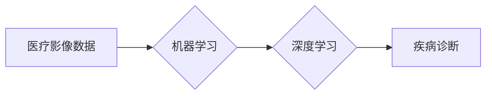

> 机器学习，医疗影像，诊断，Python，深度学习，卷积神经网络

## 1. 背景介绍

医疗影像诊断是临床医学的重要环节，它为医生提供疾病诊断、治疗方案制定和病情监测的重要依据。随着医学影像技术的不断发展，影像数据量呈指数级增长，传统的影像诊断方法难以满足临床需求。机器学习作为一种强大的数据分析技术，在医疗影像诊断领域展现出巨大的潜力。

机器学习算法能够从海量影像数据中学习特征，识别疾病模式，并辅助医生进行诊断。相比于传统的基于经验的诊断方法，机器学习方法具有以下优势：

* **提高诊断准确率:** 机器学习算法能够识别出人类难以察觉的微小特征，从而提高诊断的准确率。
* **加速诊断速度:** 机器学习算法能够快速处理大量影像数据，显著缩短诊断时间。
* **降低诊断成本:** 机器学习算法可以自动化部分诊断流程，降低人工成本。

## 2. 核心概念与联系

### 2.1  医疗影像数据

医疗影像数据是指通过各种医学影像设备（如X射线机、CT扫描仪、MRI扫描仪等）获取的图像数据。这些数据通常包含丰富的病理信息，是机器学习算法进行疾病诊断的重要数据源。

### 2.2  机器学习

机器学习是一种人工智能技术，它通过算法学习数据中的模式和规律，从而实现对未知数据的预测和分类。在医疗影像诊断领域，机器学习算法可以用于识别疾病特征、预测疾病风险、辅助医生进行诊断等。

### 2.3  深度学习

深度学习是机器学习的一个子领域，它利用多层神经网络来模拟人类大脑的学习过程。深度学习算法能够从复杂的数据中学习更深层次的特征，在图像识别、语音识别等领域取得了突破性进展。

**核心概念与联系流程图:**



## 3. 核心算法原理 & 具体操作步骤

### 3.1  算法原理概述

卷积神经网络（Convolutional Neural Network，CNN）是一种专门用于处理图像数据的深度学习算法。CNN的结构灵感来源于生物视觉系统，它利用卷积操作和池化操作来提取图像特征，并通过全连接层进行分类或识别。

### 3.2  算法步骤详解

1. **输入层:** 将医疗影像数据作为输入，每个像素点对应一个神经元。
2. **卷积层:** 使用卷积核对输入图像进行卷积操作，提取图像局部特征。
3. **池化层:** 对卷积层的输出进行池化操作，降低特征维度，提高算法鲁棒性。
4. **全连接层:** 将池化层的输出连接到全连接层，进行分类或识别。
5. **输出层:** 输出分类结果或识别结果。

### 3.3  算法优缺点

**优点:**

* **提取图像特征能力强:** CNN能够自动学习图像特征，无需人工特征工程。
* **鲁棒性强:** 池化操作可以降低算法对图像噪声和变形的影响。
* **适用性广:** CNN可以应用于多种医疗影像诊断任务，如肿瘤检测、骨折诊断、眼底疾病识别等。

**缺点:**

* **训练数据量大:** CNN需要大量的训练数据才能达到较高的准确率。
* **计算资源消耗大:** CNN的训练过程需要大量的计算资源。
* **可解释性差:** CNN的决策过程较为复杂，难以解释其决策依据。

### 3.4  算法应用领域

CNN在医疗影像诊断领域有着广泛的应用，例如：

* **肿瘤检测:** 识别肺癌、乳腺癌、脑肿瘤等。
* **骨折诊断:** 识别骨折类型和位置。
* **眼底疾病识别:** 识别糖尿病视网膜病变、黄斑变性等。
* **心脏病诊断:** 识别心肌梗死、心律失常等。

## 4. 数学模型和公式 & 详细讲解 & 举例说明

### 4.1  数学模型构建

CNN的数学模型主要包括卷积层、池化层和全连接层。

**卷积层:**

卷积操作的数学表达式为：

$$
y_{i,j} = \sum_{m=0}^{M-1} \sum_{n=0}^{N-1} x_{i+m,j+n} * w_{m,n} + b
$$

其中：

* $y_{i,j}$ 是卷积层的输出特征图上的像素值。
* $x_{i+m,j+n}$ 是输入图像上的像素值。
* $w_{m,n}$ 是卷积核的权重值。
* $b$ 是卷积层的偏置值。
* $M$ 和 $N$ 是卷积核的大小。

**池化层:**

池化操作通常采用最大池化或平均池化。最大池化操作的数学表达式为：

$$
y_{i,j} = \max_{m=0}^{k-1} \max_{n=0}^{l-1} x_{i*s+m,j*s+n}
$$

其中：

* $y_{i,j}$ 是池化层的输出特征图上的像素值。
* $x_{i*s+m,j*s+n}$ 是输入特征图上的像素值。
* $s$ 是池化窗口的大小。
* $k$ 和 $l$ 是池化窗口的大小。

**全连接层:**

全连接层的数学表达式为：

$$
y_i = \sum_{j=0}^{N} x_j * w_{ij} + b_i
$$

其中：

* $y_i$ 是全连接层的输出值。
* $x_j$ 是输入特征的数值。
* $w_{ij}$ 是连接权重。
* $b_i$ 是偏置值。
* $N$ 是输入特征的数量。

### 4.2  公式推导过程

卷积操作的数学表达式推导过程：

1. 将卷积核与输入图像进行滑动窗口操作，每次滑动一个窗口大小。
2. 在每个窗口内，将卷积核与对应区域的像素值进行点乘运算，并将结果相加。
3. 每个窗口的计算结果对应卷积层的输出特征图上的一个像素值。

池化操作的数学表达式推导过程：

1. 将池化窗口滑动到输入特征图上。
2. 在每个窗口内，采用最大池化或平均池化操作，得到窗口内最大值或平均值。
3. 每个窗口的计算结果对应池化层的输出特征图上的一个像素值。

### 4.3  案例分析与讲解

假设我们有一个输入图像大小为 32x32，卷积核大小为 3x3，步长为 1，池化窗口大小为 2x2。

1. 卷积层：卷积核与输入图像进行滑动窗口操作，每次滑动一个 3x3 的窗口，得到一个 30x30 的输出特征图。
2. 池化层：将 2x2 的池化窗口滑动到输出特征图上，得到一个 15x15 的输出特征图。

## 5. 项目实践：代码实例和详细解释说明

### 5.1  开发环境搭建

* Python 3.6+
* TensorFlow 2.0+
* Keras 2.0+
* Jupyter Notebook

### 5.2  源代码详细实现

```python
import tensorflow as tf
from tensorflow.keras.models import Sequential
from tensorflow.keras.layers import Conv2D, MaxPooling2D, Flatten, Dense

# 定义 CNN 模型
model = Sequential()
model.add(Conv2D(32, (3, 3), activation='relu', input_shape=(32, 32, 3)))
model.add(MaxPooling2D((2, 2)))
model.add(Conv2D(64, (3, 3), activation='relu'))
model.add(MaxPooling2D((2, 2)))
model.add(Flatten())
model.add(Dense(10, activation='softmax'))

# 编译模型
model.compile(optimizer='adam',
              loss='sparse_categorical_crossentropy',
              metrics=['accuracy'])

# 训练模型
model.fit(x_train, y_train, epochs=10, batch_size=32)

# 评估模型
loss, accuracy = model.evaluate(x_test, y_test)
print('Test Loss:', loss)
print('Test Accuracy:', accuracy)
```

### 5.3  代码解读与分析

* **模型定义:** 使用 Keras 的 Sequential 模型构建 CNN 模型。
* **卷积层:** 使用 Conv2D 层进行卷积操作，提取图像特征。
* **池化层:** 使用 MaxPooling2D 层进行池化操作，降低特征维度。
* **全连接层:** 使用 Flatten 层将特征图展平，然后使用 Dense 层进行分类。
* **模型编译:** 使用 Adam 优化器、交叉熵损失函数和准确率指标编译模型。
* **模型训练:** 使用训练数据训练模型，设置 epochs 和 batch_size。
* **模型评估:** 使用测试数据评估模型的性能。

### 5.4  运行结果展示

训练完成后，可以查看模型的训练和测试准确率，以及损失函数的变化趋势。

## 6. 实际应用场景

### 6.1  肿瘤检测

CNN 可以用于识别肺癌、乳腺癌、脑肿瘤等多种类型的肿瘤。

### 6.2  骨折诊断

CNN 可以识别骨折类型和位置，帮助医生快速诊断骨折。

### 6.3  眼底疾病识别

CNN 可以识别糖尿病视网膜病变、黄斑变性等多种眼底疾病。

### 6.4  未来应用展望

未来，机器学习在医疗影像诊断领域将有更广泛的应用，例如：

* **个性化医疗:** 根据患者的影像数据，为患者提供个性化的诊断和治疗方案。
* **远程医疗:** 利用机器学习算法，实现远程医疗诊断，提高医疗资源的利用率。
* **辅助手术:** 利用机器学习算法，辅助医生进行手术，提高手术的精准度和安全性。

## 7. 工具和资源推荐

### 7.1  学习资源推荐

* **书籍:**
    * 《Python机器学习实战》
    * 《深度学习》
* **在线课程:**
    * Coursera: 深度学习
    * Udacity: 机器学习工程师

### 7.2  开发工具推荐

* **Python:** 
* **TensorFlow:** 深度学习框架
* **Keras:** 高级API，简化TensorFlow的使用
* **PyTorch:** 深度学习框架

### 7.3  相关论文推荐

* **AlexNet:** ImageNet Classification with Deep Convolutional Neural Networks
* **VGGNet:** Very Deep Convolutional Networks for Large-Scale Image Recognition
* **ResNet:** Deep Residual Learning for Image Recognition

## 8. 总结：未来发展趋势与挑战

### 8.1  研究成果总结

机器学习在医疗影像诊断领域取得了显著的成果，能够提高诊断准确率、加速诊断速度、降低诊断成本。

### 8.2  未来发展趋势

* **模型更深更复杂:** 研究更深层次、更复杂的 CNN 模型，提高诊断精度。
* **数据量更大更丰富:** 收集更多、更丰富的数据，提高模型的泛化能力。
* **解释性更强:** 研究更具解释性的机器学习模型，帮助医生理解模型的决策过程。
* **个性化医疗:** 利用机器学习算法，为患者提供个性化的诊断和治疗方案。

### 8.3  面临的挑战

* **数据隐私和安全:** 医疗影像数据包含敏感信息，需要保障数据隐私和安全。
* **算法可解释性:** 现有的机器学习模型难以解释其决策过程，这可能会阻碍医生对模型的信任。
* **模型部署和维护:** 将机器学习模型