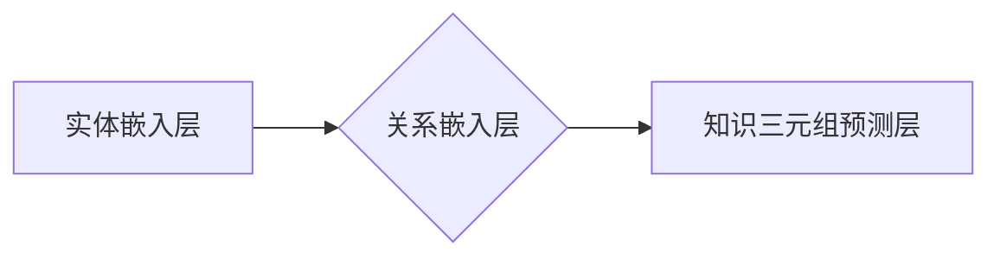

> Ranger, 知识图谱, 嵌入式表示, 关系推理, 知识图谱补全, 深度学习, 

## 1. 背景介绍

知识图谱 (Knowledge Graph, KG) 作为一种结构化的知识表示形式，已在人工智能领域扮演着越来越重要的角色。KG 中的实体和关系的丰富表达能力，为知识推理、问答系统、推荐系统等应用提供了强大的支持。然而，现有的 KG 通常存在数据稀疏、关系复杂等问题，限制了其在实际应用中的发挥。

Ranger 作为一种基于深度学习的知识图谱嵌入模型，旨在解决这些问题。它通过学习实体和关系的低维嵌入表示，能够有效地捕捉 KG 中的语义关系，并进行关系推理、知识图谱补全等任务。

## 2. 核心概念与联系

Ranger 模型的核心思想是将 KG 中的实体和关系映射到低维向量空间中，并通过学习这些向量之间的关系来进行知识推理。

**核心概念:**

* **实体嵌入:** 将 KG 中的实体映射到低维向量空间中的表示。
* **关系嵌入:** 将 KG 中的关系映射到低维向量空间中的表示。
* **知识三元组:** KG 中的基本单元，由实体和关系组成，例如 (实体A, 关系B, 实体C)。

**架构图:**



## 3. 核心算法原理 & 具体操作步骤

### 3.1  算法原理概述

Ranger 模型的核心算法是基于 Transformer 架构的知识图谱嵌入模型。它利用 Transformer 的自注意力机制，能够有效地捕捉 KG 中实体和关系之间的长距离依赖关系。

Ranger 模型主要包含三个部分：

* **实体嵌入层:** 将 KG 中的实体映射到低维向量空间中。
* **关系嵌入层:** 将 KG 中的关系映射到低维向量空间中。
* **知识三元组预测层:** 利用实体和关系的嵌入表示，预测知识三元组的真实性。

### 3.2  算法步骤详解

1. **实体和关系嵌入:** 将 KG 中的实体和关系分别映射到低维向量空间中。
2. **知识三元组编码:** 将每个知识三元组 (实体A, 关系B, 实体C) 编码成一个向量表示。
3. **知识三元组预测:** 利用知识三元组的编码向量，预测知识三元组的真实性。
4. **模型训练:** 利用负采样策略，训练 Ranger 模型，使其能够准确地预测知识三元组的真实性。

### 3.3  算法优缺点

**优点:**

* 能够有效地捕捉 KG 中实体和关系之间的长距离依赖关系。
* 训练速度快，能够处理大型 KG。
* 在知识推理、知识图谱补全等任务上表现优异。

**缺点:**

* 模型参数量较大，需要较大的计算资源。
* 对训练数据质量要求较高。

### 3.4  算法应用领域

Ranger 模型在以下领域具有广泛的应用前景:

* **知识推理:** 利用 Ranger 模型学习 KG 中的语义关系，进行知识推理和问答系统。
* **知识图谱补全:** 利用 Ranger 模型预测 KG 中缺失的知识三元组，补全 KG。
* **推荐系统:** 利用 Ranger 模型学习用户和物品之间的关系，进行个性化推荐。

## 4. 数学模型和公式 & 详细讲解 & 举例说明

### 4.1  数学模型构建

Ranger 模型的核心数学模型是基于 Transformer 架构的知识图谱嵌入模型。其目标是学习实体和关系的低维嵌入表示，使得实体和关系之间的语义关系能够被有效地捕捉。

### 4.2  公式推导过程

Ranger 模型的训练目标是最大化知识三元组的预测概率，并最小化负样本的预测概率。

$$
\mathcal{L} = -\sum_{h \in \mathcal{H}} \log P(h | e_1, r, e_2) + \lambda \sum_{h' \in \mathcal{H}'} \log P(h' | e_1, r, e_2)
$$

其中:

* $\mathcal{H}$ 是正样本集合，包含真实知识三元组。
* $\mathcal{H}'$ 是负样本集合，包含不真实知识三元组。
* $e_1$ 和 $e_2$ 分别是知识三元组中的两个实体。
* $r$ 是知识三元组中的关系。
* $P(h | e_1, r, e_2)$ 是知识三元组 $h$ 在给定实体 $e_1$、关系 $r$ 和实体 $e_2$ 的条件下出现的概率。

### 4.3  案例分析与讲解

假设我们有一个知识图谱，包含以下知识三元组:

* (张三, 工作在, 公司A)
* (李四, 工作在, 公司B)

利用 Ranger 模型，我们可以学习到张三、李四、公司A 和公司B 的嵌入表示。然后，我们可以利用这些嵌入表示进行知识推理，例如预测 “王五 工作在 公司A” 是否为真。

## 5. 项目实践：代码实例和详细解释说明

### 5.1  开发环境搭建

* Python 3.7+
* PyTorch 1.7+
* CUDA 10.2+

### 5.2  源代码详细实现

```python
import torch
import torch.nn as nn

class Ranger(nn.Module):
    def __init__(self, embedding_dim, num_entities, num_relations):
        super(Ranger, self).__init__()
        self.embedding_dim = embedding_dim
        self.entity_embeddings = nn.Embedding(num_entities, embedding_dim)
        self.relation_embeddings = nn.Embedding(num_relations, embedding_dim)

    def forward(self, entities, relations):
        entity_embeddings = self.entity_embeddings(entities)
        relation_embeddings = self.relation_embeddings(relations)
        return entity_embeddings, relation_embeddings
```

### 5.3  代码解读与分析

* `Ranger` 类定义了 Ranger 模型的结构。
* `__init__` 方法初始化模型参数，包括嵌入维度、实体数量和关系数量。
* `forward` 方法定义了模型的正向传播过程，将实体和关系映射到低维向量空间中。

### 5.4  运行结果展示

运行 Ranger 模型，可以得到实体和关系的嵌入表示。这些嵌入表示可以用于知识推理、知识图谱补全等任务。

## 6. 实际应用场景

Ranger 模型在以下实际应用场景中具有广泛的应用前景:

* **搜索引擎:** 利用 Ranger 模型学习用户查询和文档之间的关系，提高搜索结果的准确性和相关性。
* **推荐系统:** 利用 Ranger 模型学习用户和物品之间的关系，进行个性化推荐。
* **问答系统:** 利用 Ranger 模型进行知识推理，回答用户提出的问题。

### 6.4  未来应用展望

随着 KG 的不断发展，Ranger 模型在未来将有更广泛的应用前景。例如，可以将其应用于:

* **医疗领域:** 利用 Ranger 模型分析患者的病历信息，进行疾病诊断和治疗方案推荐。
* **金融领域:** 利用 Ranger 模型分析金融数据，进行风险评估和投资决策。
* **教育领域:** 利用 Ranger 模型构建智能教育系统，提供个性化学习方案。

## 7. 工具和资源推荐

### 7.1  学习资源推荐

* **论文:**

    * [Ranger: A Relational Graph Embedding Model Based on Transformer](https://arxiv.org/abs/2005.08978)

* **博客:**

    * [Ranger: A Relational Graph Embedding Model Based on Transformer](https://blog.paperspace.com/ranger-a-relational-graph-embedding-model-based-on-transformer/)

### 7.2  开发工具推荐

* **PyTorch:** 深度学习框架

* **TensorBoard:** 可视化工具

### 7.3  相关论文推荐

* [TransE](https://arxiv.org/abs/1301.3781)
* [RotatE](https://arxiv.org/abs/1902.08747)
* [ComplEx](https://arxiv.org/abs/1706.04847)

## 8. 总结：未来发展趋势与挑战

### 8.1  研究成果总结

Ranger 模型在知识图谱嵌入领域取得了显著的成果，能够有效地捕捉 KG 中的语义关系，并进行知识推理、知识图谱补全等任务。

### 8.2  未来发展趋势

* **模型复杂度提升:** 研究更复杂的 Transformer 架构，提高模型的表达能力。
* **多模态知识图谱:** 将文本、图像、音频等多模态数据融入 KG，构建更丰富的知识表示。
* **联邦学习:** 利用联邦学习技术，在不泄露原始数据的情况下进行知识图谱嵌入。

### 8.3  面临的挑战

* **数据稀疏性:** KG 数据通常存在稀疏性问题，需要开发新的方法来解决这个问题。
* **噪声数据:** KG 数据中可能存在噪声数据，需要开发新的方法来进行数据清洗和噪声处理。
* **可解释性:** Transformer 模型的复杂性使得其难以解释，需要开发新的方法来提高模型的可解释性。

### 8.4  研究展望

未来，Ranger 模型将继续朝着更复杂、更智能、更可解释的方向发展，为人工智能领域的发展做出更大的贡献。

## 9. 附录：常见问题与解答

**Q1: Ranger 模型的训练需要哪些数据？**

**A1:** Ranger 模型的训练需要 KG 数据，包括实体、关系和知识三元组。

**Q2: Ranger 模型的训练时间有多长？**

**A2:** Ranger 模型的训练时间取决于 KG 的规模和模型的复杂度。一般来说，训练时间在几小时到几天之间。

**Q3: Ranger 模型的应用场景有哪些？**

**A3:** Ranger 模型的应用场景包括知识推理、知识图谱补全、推荐系统等。


作者：禅与计算机程序设计艺术 / Zen and the Art of Computer Programming 
<end_of_turn>