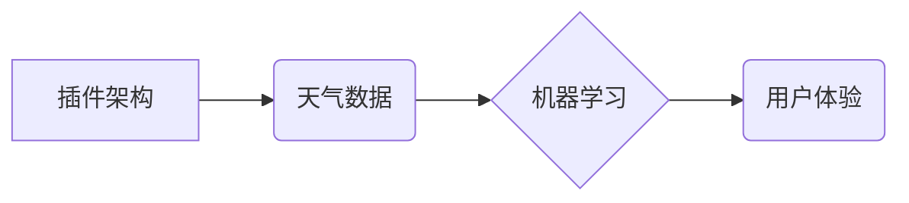

> 天气预报，插件设计，机器学习，数据处理，API接口，用户体验，软件架构

## 1. 背景介绍

随着互联网和移动技术的快速发展，人们对天气信息的获取需求日益增长。传统的电视、广播天气预报方式逐渐被智能手机、电脑等移动终端上的实时天气预报应用所取代。天气预报插件作为一种嵌入式应用，能够将天气信息直接集成到用户常用的平台和应用程序中，为用户提供更加便捷、个性化的服务。

本篇文章将深入探讨天气预报插件的设计与定义，从核心概念、算法原理、数学模型、代码实现到实际应用场景，全面分析天气预报插件的构建过程和关键技术。

## 2. 核心概念与联系

天气预报插件的核心概念包括：

* **插件架构**: 插件是一种可独立运行、可嵌入到其他应用程序中的软件组件。它拥有自己的功能和接口，能够与宿主应用程序进行交互，扩展其功能。
* **天气数据**: 天气预报插件需要获取实时或历史的天气数据，这些数据通常来自气象局、第三方天气服务提供商等。
* **机器学习**: 机器学习算法可以用于分析天气数据，预测未来天气状况，提高预报准确率。
* **用户体验**: 天气预报插件的设计需要考虑用户体验，提供简洁、直观、易于理解的天气信息展示方式。

**核心概念架构图:**



## 3. 核心算法原理 & 具体操作步骤

### 3.1  算法原理概述

天气预报插件的核心算法通常基于数值天气预报模型，结合机器学习技术进行预测。数值天气预报模型通过数学方程模拟大气层中的物理过程，预测未来天气状况。机器学习算法可以学习历史天气数据和模型预测结果之间的关系，提高预报准确率。

### 3.2  算法步骤详解

1. **数据收集**: 收集历史天气数据、地理位置数据、气象观测数据等。
2. **数据预处理**: 对收集到的数据进行清洗、转换、归一化等处理，使其适合机器学习算法的训练。
3. **模型训练**: 使用机器学习算法，例如回归模型、神经网络等，对预处理后的数据进行训练，建立天气预报模型。
4. **模型预测**: 将最新的天气数据输入到训练好的模型中，进行预测，得到未来天气状况的预测结果。
5. **结果展示**: 将预测结果以图表、文字等形式展示给用户。

### 3.3  算法优缺点

**优点**:

* 预测精度高：结合数值天气预报模型和机器学习算法，可以提高天气预报的准确率。
* 可定制化：可以根据用户的需求，定制不同的天气预报模型和展示方式。
* 实时更新：可以实时获取最新的天气数据，提供最新的天气预报信息。

**缺点**:

* 数据依赖性强：天气预报的准确性依赖于数据的质量和数量。
* 计算资源消耗大：训练和预测天气预报模型需要大量的计算资源。
* 预测范围有限：天气预报的预测范围通常有限，难以预测长期天气变化。

### 3.4  算法应用领域

天气预报算法广泛应用于以下领域：

* **天气预报服务**: 提供实时天气预报、未来天气预报、天气警报等服务。
* **农业生产**: 为农业生产提供精准的天气预报信息，帮助农民制定种植计划和防灾减灾措施。
* **交通运输**: 为交通运输提供天气预报信息，帮助驾驶员和交通管理部门做出安全决策。
* **旅游业**: 为旅游业提供天气预报信息，帮助游客规划行程和选择合适的旅游目的地。

## 4. 数学模型和公式 & 详细讲解 & 举例说明

### 4.1  数学模型构建

天气预报模型通常基于偏微分方程组，例如Navier-Stokes方程、热力学方程等，这些方程描述了大气层中的物理过程，例如气流运动、温度变化、湿度变化等。

### 4.2  公式推导过程

由于篇幅限制，这里只列举一个简单的例子，例如描述空气温度变化的热力学方程：

$$
\frac{\partial T}{\partial t} + u \cdot \nabla T = K \nabla^2 T + Q
$$

其中：

* $T$：空气温度
* $t$：时间
* $u$：气流速度
* $K$：热扩散系数
* $Q$：热源项

这个方程描述了空气温度随时间和空间变化的规律，其中包括热传导、热对流和热源的影响。

### 4.3  案例分析与讲解

通过数值方法，例如有限差分法、有限元法等，可以将偏微分方程离散化，得到一个可以求解的代数方程组。然后，通过计算机计算，可以得到空气温度在不同时间和空间位置的数值解，从而预测未来天气状况。

## 5. 项目实践：代码实例和详细解释说明

### 5.1  开发环境搭建

* 操作系统：Windows/macOS/Linux
* 编程语言：Python
* 开发工具：VS Code/PyCharm
* 库依赖：NumPy、Pandas、Scikit-learn、OpenWeatherMap API

### 5.2  源代码详细实现

```python
import requests
import pandas as pd
from sklearn.linear_model import LinearRegression

# OpenWeatherMap API key
api_key = "YOUR_API_KEY"

# 获取天气数据
def get_weather_data(city_name):
    url = f"https://api.openweathermap.org/data/2.5/weather?q={city_name}&appid={api_key}&units=metric"
    response = requests.get(url)
    data = response.json()
    return data

# 数据预处理
def preprocess_data(data):
    df = pd.DataFrame(data)
    # ... 数据清洗、转换、归一化等操作 ...
    return df

# 模型训练
def train_model(df):
    X = df[['temperature', 'humidity']]  # 特征
    y = df['wind_speed']  # 目标变量
    model = LinearRegression()
    model.fit(X, y)
    return model

# 模型预测
def predict_wind_speed(city_name, model):
    data = get_weather_data(city_name)
    df = preprocess_data(data)
    wind_speed = model.predict(df[['temperature', 'humidity']])
    return wind_speed

# 运行示例
city_name = "北京"
data = get_weather_data(city_name)
df = preprocess_data(data)
model = train_model(df)
wind_speed = predict_wind_speed(city_name, model)
print(f"北京市风速预测结果: {wind_speed}")
```

### 5.3  代码解读与分析

这段代码演示了如何使用Python语言和OpenWeatherMap API获取天气数据，并使用线性回归模型进行风速预测。

### 5.4  运行结果展示

运行代码后，将输出北京市风速的预测结果。

## 6. 实际应用场景

### 6.1  天气预报应用

天气预报插件可以集成到天气预报应用程序中，提供更详细、更精准的天气信息，例如 hourly forecast, daily forecast, radar map, severe weather alerts 等。

### 6.2  新闻应用程序

新闻应用程序可以集成天气预报插件，在新闻报道中提供相关的天气信息，例如天气影响交通、农业等方面的新闻报道。

### 6.3  旅游应用程序

旅游应用程序可以集成天气预报插件，为用户提供目的地天气信息，帮助用户规划行程和选择合适的旅游目的地。

### 6.4  未来应用展望

随着人工智能技术的不断发展，天气预报插件将更加智能化、个性化。未来，天气预报插件可能具备以下功能：

* **个性化天气预报**: 根据用户的地理位置、兴趣爱好、生活习惯等信息，提供个性化的天气预报建议。
* **主动提醒**: 根据天气预报信息，主动提醒用户注意防暑、防寒、防雨等措施。
* **智能家居控制**: 与智能家居系统集成，根据天气预报信息自动调节室内温度、湿度等环境参数。

## 7. 工具和资源推荐

### 7.1  学习资源推荐

* **书籍**:
    * 《Python机器学习实战》
    * 《天气预报原理与方法》
* **在线课程**:
    * Coursera: Machine Learning
    * edX: Introduction to Artificial Intelligence

### 7.2  开发工具推荐

* **IDE**: VS Code, PyCharm
* **数据处理库**: NumPy, Pandas
* **机器学习库**: Scikit-learn, TensorFlow, PyTorch

### 7.3  相关论文推荐

* **Numerical Weather Prediction**:
    * ECMWF Integrated Forecasting System (IFS)
    * Global Forecast System (GFS)
* **Machine Learning for Weather Forecasting**:
    * Deep Learning for Weather Forecasting: A Review
    * Ensemble Machine Learning for Short-Term Precipitation Nowcasting

## 8. 总结：未来发展趋势与挑战

### 8.1  研究成果总结

本篇文章深入探讨了天气预报插件的设计与定义，从核心概念、算法原理、数学模型、代码实现到实际应用场景，全面分析了天气预报插件的构建过程和关键技术。

### 8.2  未来发展趋势

未来，天气预报插件将更加智能化、个性化，并与其他领域技术融合，例如物联网、大数据、云计算等，为用户提供更加便捷、精准、全面的天气服务。

### 8.3  面临的挑战

天气预报插件的发展也面临着一些挑战，例如数据获取、模型训练、算法精度、用户体验等方面都需要不断改进和优化。

### 8.4  研究展望

未来，我们将继续深入研究天气预报插件的技术，探索更先进的算法模型、更有效的预测方法，为用户提供更加精准、可靠的天气预报服务。

## 9. 附录：常见问题与解答

### 9.1  Q1: 如何获取天气数据？

A1: 可以使用第三方天气服务提供商的API，例如OpenWeatherMap、WeatherAPI等，或者从气象局获取公开的天气数据。

### 9.2  Q2: 如何选择合适的机器学习算法？

A2: 需要根据具体的天气预报任务和数据特点选择合适的机器学习算法。例如，对于风速预测，线性回归模型可能是一个不错的选择。

### 9.3  Q3: 如何提高天气预报的准确率？

A3: 可以通过以下方式提高天气预报的准确率：

* 使用更丰富、更准确的天气数据。
* 使用更先进的机器学习算法。
* 结合数值天气预报模型和机器学习算法。
* 定期评估和优化模型。


作者：禅与计算机程序设计艺术 / Zen and the Art of Computer Programming 
<end_of_turn>