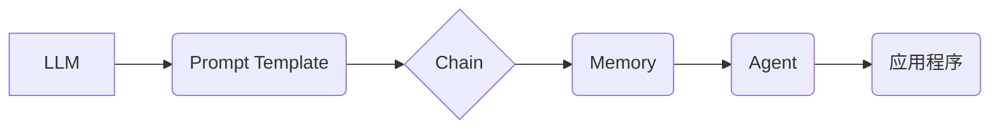

> LangChain, 语言模型, 应用程序, 编程, 开发, 框架, API, 聊天机器人, 代码生成

## 1. 背景介绍

近年来，大型语言模型（LLM）的快速发展掀起了人工智能领域的革命。这些模型，例如 GPT-3、LaMDA 和 BERT，展现出惊人的文本生成、理解和翻译能力，为各种应用领域带来了无限可能。然而，直接与LLM交互往往需要复杂的代码和深入的机器学习知识。为了降低开发门槛，并更好地利用LLM的强大功能，LangChain 应运而生。

LangChain 是一种开源框架，旨在简化与LLM的交互，并构建更复杂的应用程序。它提供了一套工具和组件，帮助开发者将LLM集成到各种应用场景中，例如聊天机器人、问答系统、代码生成器等。

## 2. 核心概念与联系

LangChain 的核心概念围绕着“链”的概念展开。它将LLM视为一个组件，并通过一系列“链”连接多个组件，形成一个完整的应用程序。

**核心组件：**

* **LLM:** 大型语言模型，例如 OpenAI 的 GPT-3 或 Google 的 PaLM。
* **Prompt Template:** 用于构建输入提示的模板，可以根据不同的场景和需求进行定制。
* **Chain:** 连接多个组件的逻辑流程，定义了数据如何流动和处理。
* **Memory:** 用于存储对话历史和上下文信息，帮助LLM理解更复杂的对话。
* **Agent:** 能够根据环境和目标做出决策的智能体，可以利用LLM和其他工具完成任务。

**LangChain 架构：**



## 3. 核心算法原理 & 具体操作步骤

### 3.1  算法原理概述

LangChain 的核心算法原理是基于“链式调用”和“上下文管理”。

* **链式调用:** 通过定义一系列的“链”，将不同的组件连接起来，实现数据和控制流的传递。
* **上下文管理:** 使用“记忆”组件存储对话历史和上下文信息，帮助LLM理解更复杂的对话和任务。

### 3.2  算法步骤详解

1. **定义链:** 根据应用程序的需求，定义一个包含多个组件的链。
2. **构建提示模板:** 为每个组件设计一个提示模板，引导LLM生成期望的输出。
3. **连接组件:** 将组件按照预定义的顺序连接起来，形成一个完整的链。
4. **传递数据:** 将数据从一个组件传递到下一个组件，直到完成整个链的执行。
5. **管理上下文:** 使用“记忆”组件存储对话历史和上下文信息，并将其传递给LLM，帮助LLM理解更复杂的对话和任务。

### 3.3  算法优缺点

**优点:**

* **易于使用:** LangChain 提供了简洁的API和丰富的组件，降低了开发门槛。
* **灵活定制:** 可以根据不同的需求定制链的结构和组件，实现各种复杂的应用程序。
* **可扩展性强:** 可以轻松地将新的组件添加到LangChain框架中，扩展其功能。

**缺点:**

* **性能瓶颈:** 复杂的链可能会导致性能瓶颈，需要进行优化。
* **依赖LLM:** LangChain 的功能依赖于LLM的性能，如果LLM的性能不足，可能会影响应用程序的整体效果。

### 3.4  算法应用领域

LangChain 的应用领域非常广泛，包括：

* **聊天机器人:** 创建更智能、更自然的对话机器人。
* **问答系统:** 开发能够回答复杂问题的问答系统。
* **代码生成器:** 利用LLM生成代码，提高开发效率。
* **文本摘要:** 自动生成文本摘要，节省时间和精力。
* **内容创作:** 辅助创作文章、故事、诗歌等内容。

## 4. 数学模型和公式 & 详细讲解 & 举例说明

### 4.1  数学模型构建

LangChain 的核心算法基于概率模型，例如Transformer模型。这些模型使用注意力机制来学习文本之间的关系，并预测下一个词的概率。

**Transformer模型的注意力机制:**

```latex
Attention(Q, K, V) = softmax(Q K^T / \sqrt{d_k}) V
```

其中：

* Q: 查询向量
* K: 键向量
* V: 值向量
* $d_k$: 键向量的维度
* softmax: 归一化函数

### 4.2  公式推导过程

注意力机制的核心思想是计算每个词与其他词之间的相关性，并根据相关性加权求和，得到最终的输出。

公式推导过程可以参考 Transformer 模型的论文。

### 4.3  案例分析与讲解

例如，在翻译任务中，注意力机制可以帮助模型关注源语言中与目标语言中对应词语相关的词语，从而提高翻译的准确性。

## 5. 项目实践：代码实例和详细解释说明

### 5.1  开发环境搭建

1. 安装 Python 3.7 或更高版本。
2. 安装必要的库，例如：

```bash
pip install langchain transformers openai
```

### 5.2  源代码详细实现

```python
from langchain.llms import OpenAI
from langchain.chains import ConversationChain
from langchain.memory import ConversationBufferMemory

# 初始化 OpenAI LLM
llm = OpenAI(temperature=0.7)

# 初始化对话记忆
memory = ConversationBufferMemory()

# 创建对话链
conversation = ConversationChain(
    llm=llm,
    memory=memory,
    prompt=f"你好，我是你的助手。请问有什么可以帮你的吗？"
)

# 与对话链交互
while True:
    user_input = input("您:")
    response = conversation.run(user_input)
    print("助手:", response)
```

### 5.3  代码解读与分析

* **初始化 LLM 和记忆:** 代码首先初始化 OpenAI 的 LLM 和对话记忆组件。
* **创建对话链:** 使用 `ConversationChain` 类创建对话链，并将 LLM 和记忆组件作为参数传入。
* **与对话链交互:** 使用循环结构与对话链交互，获取用户输入并生成响应。

### 5.4  运行结果展示

运行代码后，可以与对话机器人进行交互，例如：

```
您: 你好
助手: 你好，我是你的助手。请问有什么可以帮你的吗？
您: 你叫什么名字？
助手: 我没有名字。
```

## 6. 实际应用场景

### 6.1  聊天机器人

LangChain 可以用于构建更智能、更自然的聊天机器人，例如客服机器人、陪伴机器人等。

### 6.2  问答系统

LangChain 可以用于构建能够回答复杂问题的问答系统，例如知识问答系统、搜索引擎等。

### 6.3  代码生成器

LangChain 可以利用LLM生成代码，提高开发效率，例如自动生成代码片段、完成代码补全等。

### 6.4  未来应用展望

LangChain 的应用场景还在不断扩展，未来可能会应用于更多领域，例如：

* **教育:** 个性化学习辅导、自动生成学习材料等。
* **医疗:** 辅助医生诊断、生成医疗报告等。
* **金融:** 自动化财务分析、风险评估等。

## 7. 工具和资源推荐

### 7.1  学习资源推荐

* **LangChain 官方文档:** https://python.langchain.com/docs/
* **LangChain GitHub 仓库:** https://github.com/langchain-org/langchain
* **OpenAI API 文档:** https://platform.openai.com/docs/api-reference

### 7.2  开发工具推荐

* **Python:** 作为 LangChain 的开发语言，Python 提供了丰富的库和工具。
* **Jupyter Notebook:** 用于编写和运行 Python 代码，方便进行实验和调试。

### 7.3  相关论文推荐

* **Attention Is All You Need:** https://arxiv.org/abs/1706.03762
* **BERT: Pre-training of Deep Bidirectional Transformers for Language Understanding:** https://arxiv.org/abs/1810.04805

## 8. 总结：未来发展趋势与挑战

### 8.1  研究成果总结

LangChain 框架为开发基于LLM的应用程序提供了便捷的工具和方法，促进了LLM技术的应用推广。

### 8.2  未来发展趋势

* **更强大的LLM:** 未来LLM的性能将会进一步提升，为LangChain提供更强大的基础。
* **更丰富的组件:** LangChain 将会提供更多类型的组件，支持更复杂的应用程序开发。
* **更易于使用的界面:** LangChain 将会提供更易于使用的界面，降低开发门槛。

### 8.3  面临的挑战

* **数据安全和隐私:** LLM的训练和应用需要大量数据，如何保证数据安全和隐私是一个重要的挑战。
* **模型偏见:** LLM可能会存在模型偏见，需要进行相应的处理和缓解。
* **可解释性:** LLM的决策过程往往难以解释，需要提高模型的可解释性。

### 8.4  研究展望

未来研究方向包括：

* 开发更安全、更可靠的LLM模型。
* 提高LLM的泛化能力和鲁棒性。
* 研究LLM的伦理和社会影响。

## 9. 附录：常见问题与解答

**Q1: 如何选择合适的LLM？**

**A1:** 选择合适的LLM取决于具体的应用场景和需求。例如，对于需要高准确率的应用，可以选择GPT-3等大型模型；对于需要低延迟的应用，可以选择更轻量级的模型。

**Q2: 如何解决LLM的偏见问题？**

**A2:** 可以通过以下方法解决LLM的偏见问题：

* 使用更公平的数据集进行训练。
* 在训练过程中加入对抗训练，降低模型对偏见数据的敏感度。
* 使用后处理方法，例如文本去污和观点调整，来修正模型输出的偏见。


作者：禅与计算机程序设计艺术 / Zen and the Art of Computer Programming 
<end_of_turn>