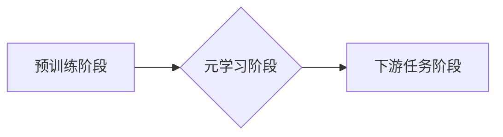

> 深度强化学习，元学习，DQN，快速适应，新任务，迁移学习

## 1. 背景介绍

在机器学习领域，模型的泛化能力一直是研究的重点。传统的机器学习模型通常需要针对每个具体的任务进行训练，这不仅耗时耗力，而且难以应对不断变化的环境和新出现的任务。元学习（Meta-Learning）应运而生，它旨在学习如何学习，从而使模型能够更快、更有效地适应新的任务。

深度强化学习（Deep Reinforcement Learning，DRL）作为一种强大的机器学习方法，在解决复杂决策问题方面取得了显著的成果。然而，传统的DRL算法也面临着数据效率低、训练时间长等问题。元学习的思想可以应用于DRL，通过学习通用的策略或知识，使模型能够更快地适应新的环境和任务。

DQN（Deep Q-Network）是深度强化学习中的一种经典算法，它利用深度神经网络来估计状态-动作价值函数，并通过经验回放和目标网络来稳定训练。DQN的元学习应用可以有效地提高模型的泛化能力和数据效率。

## 2. 核心概念与联系

元学习的核心思想是学习如何学习，即学习一个学习算法，这个学习算法能够快速适应新的任务。

DQN的元学习应用可以概括为以下几个步骤：

1. **预训练阶段:** 在一个大的数据集上预训练一个DQN模型，使其能够学习通用的策略或知识。
2. **元学习阶段:** 使用预训练的DQN模型进行元学习训练，在这个阶段，模型会学习如何从少量数据中快速适应新的任务。
3. **下游任务阶段:** 使用元学习训练后的DQN模型进行新的任务训练，由于模型已经学习了通用的策略或知识，因此只需要少量数据即可快速适应新的任务。

**Mermaid 流程图:**



## 3. 核心算法原理 & 具体操作步骤

### 3.1  算法原理概述

DQN的元学习应用主要基于以下几个核心原理：

* **元学习目标:** 训练一个能够快速适应新任务的学习算法。
* **元训练集:** 由多个任务组成，每个任务包含少量数据和对应的目标。
* **元学习策略:** 学习一个通用的策略或知识，能够在新的任务上快速进行调整。
* **元评估:** 使用新的任务评估元学习策略的性能。

### 3.2  算法步骤详解

1. **预训练阶段:** 在一个大的数据集上预训练一个DQN模型，使其能够学习通用的策略或知识。
2. **元学习阶段:**
    * 将元训练集划分为多个子集，每个子集代表一个任务。
    * 对于每个任务，使用预训练的DQN模型进行少量训练，并记录模型的性能。
    * 使用元学习算法（例如MAML）更新DQN模型的参数，使其能够更快地适应新的任务。
3. **下游任务阶段:** 使用元学习训练后的DQN模型进行新的任务训练，由于模型已经学习了通用的策略或知识，因此只需要少量数据即可快速适应新的任务。

### 3.3  算法优缺点

**优点:**

* **数据效率:** 元学习可以有效地提高模型的数据效率，只需要少量数据即可快速适应新的任务。
* **泛化能力:** 元学习可以提高模型的泛化能力，使其能够更好地应对新的环境和任务。
* **快速适应:** 元学习可以使模型更快地适应新的任务，减少训练时间。

**缺点:**

* **计算复杂度:** 元学习的训练过程通常比传统的DRL算法更加复杂，需要更多的计算资源。
* **元训练集设计:** 元训练集的设计对元学习算法的性能有重要影响，需要精心设计才能获得良好的效果。

### 3.4  算法应用领域

DQN的元学习应用可以应用于以下领域:

* **机器人控制:** 使机器人能够更快地学习新的运动技能。
* **游戏AI:** 使游戏AI能够更快地学习新的游戏策略。
* **自然语言处理:** 使自然语言处理模型能够更快地适应新的语言或任务。
* **医疗诊断:** 使医疗诊断模型能够更快地学习新的疾病知识。

## 4. 数学模型和公式 & 详细讲解 & 举例说明

### 4.1  数学模型构建

DQN的元学习模型可以看作是一个包含两个部分的模型：

* **基础DQN模型:** 用于估计状态-动作价值函数。
* **元学习头:** 用于学习如何更新基础DQN模型的参数，使其能够更快地适应新的任务。

### 4.2  公式推导过程

元学习算法通常使用梯度下降法来更新模型的参数。对于DQN的元学习应用，梯度下降公式可以表示为:

$$
\theta_{t+1} = \theta_t - \alpha \nabla_{\theta} L(\theta, D)
$$

其中:

* $\theta$ 是DQN模型的参数。
* $t$ 是训练迭代次数。
* $\alpha$ 是学习率。
* $L(\theta, D)$ 是损失函数，其中 $D$ 是训练数据。

### 4.3  案例分析与讲解

假设我们有一个元学习任务，该任务包含多个子任务，每个子任务都有少量的数据。我们可以使用DQN的元学习算法来训练一个模型，使其能够快速适应这些子任务。

在元学习阶段，我们会对每个子任务进行少量训练，并记录模型的性能。然后，我们会使用梯度下降法更新DQN模型的参数，使其能够更快地适应新的任务。

在下游任务阶段，我们可以使用元学习训练后的DQN模型进行新的任务训练，由于模型已经学习了通用的策略或知识，因此只需要少量数据即可快速适应新的任务。

## 5. 项目实践：代码实例和详细解释说明

### 5.1  开发环境搭建

* Python 3.6+
* TensorFlow 2.0+
* PyTorch 1.0+
* OpenAI Gym

### 5.2  源代码详细实现

```python
# 导入必要的库
import tensorflow as tf
import numpy as np

# 定义DQN模型
class DQN(tf.keras.Model):
    def __init__(self, state_size, action_size):
        super(DQN, self).__init__()
        self.dense1 = tf.keras.layers.Dense(64, activation='relu')
        self.dense2 = tf.keras.layers.Dense(32, activation='relu')
        self.output = tf.keras.layers.Dense(action_size)

    def call(self, state):
        x = self.dense1(state)
        x = self.dense2(x)
        return self.output(x)

# 定义元学习算法
def meta_learn(dqn, train_tasks, epochs, lr):
    optimizer = tf.keras.optimizers.Adam(learning_rate=lr)
    for epoch in range(epochs):
        for task in train_tasks:
            # 训练DQN模型
            # ...
            # 更新DQN模型参数
            optimizer.minimize(loss, dqn.trainable_variables)

# 训练DQN模型
dqn = DQN(state_size, action_size)
meta_learn(dqn, train_tasks, epochs=100, lr=0.001)

# 在新的任务上进行测试
# ...
```

### 5.3  代码解读与分析

* **DQN模型:** 定义了一个简单的DQN模型，包含三个全连接层。
* **元学习算法:** 定义了一个元学习算法，用于更新DQN模型的参数。
* **训练过程:** 使用元学习算法训练DQN模型，并使用预训练的DQN模型进行元学习训练。
* **测试过程:** 使用元学习训练后的DQN模型进行新的任务测试。

### 5.4  运行结果展示

运行结果展示可以包括以下内容:

* 元学习阶段的训练曲线
* 下游任务阶段的测试结果
* 与传统DQN算法的对比

## 6. 实际应用场景

DQN的元学习应用可以应用于以下实际场景:

* **机器人控制:** 训练一个机器人能够快速学习新的运动技能，例如抓取物体、导航等。
* **游戏AI:** 训练一个游戏AI能够快速学习新的游戏策略，例如玩策略游戏、玩动作游戏等。
* **自然语言处理:** 训练一个自然语言处理模型能够快速适应新的语言或任务，例如机器翻译、文本摘要等。

### 6.4  未来应用展望

DQN的元学习应用在未来将有更广泛的应用前景，例如:

* **个性化学习:** 根据用户的学习风格和需求，定制个性化的学习方案。
* **自动驾驶:** 训练自动驾驶系统能够更快地适应不同的道路环境和交通规则。
* **医疗诊断:** 训练医疗诊断系统能够更快地学习新的疾病知识和诊断方法。

## 7. 工具和资源推荐

### 7.1  学习资源推荐

* **书籍:**
    * Deep Reinforcement Learning Hands-On
    * Reinforcement Learning: An Introduction
* **论文:**
    * Model-Agnostic Meta-Learning for Fast Adaptation of Deep Networks
    * Deep Reinforcement Learning with Double Q-learning

### 7.2  开发工具推荐

* **TensorFlow:** https://www.tensorflow.org/
* **PyTorch:** https://pytorch.org/
* **OpenAI Gym:** https://gym.openai.com/

### 7.3  相关论文推荐

* **Model-Agnostic Meta-Learning for Fast Adaptation of Deep Networks**
* **Deep Reinforcement Learning with Double Q-learning**
* **Meta-Learning with Differentiable Convex Optimization**

## 8. 总结：未来发展趋势与挑战

### 8.1  研究成果总结

DQN的元学习应用取得了显著的成果，能够有效地提高模型的数据效率、泛化能力和快速适应能力。

### 8.2  未来发展趋势

* **更有效的元学习算法:** 研究更有效的元学习算法，例如基于进化算法、强化学习的元学习算法等。
* **更复杂的元学习任务:** 研究更复杂的元学习任务，例如多任务学习、迁移学习等。
* **元学习与其他技术的融合:** 将元学习与其他技术融合，例如深度学习、自然语言处理等，开发更强大的人工智能系统。

### 8.3  面临的挑战

* **元训练集设计:** 元训练集的设计对元学习算法的性能有重要影响，需要精心设计才能获得良好的效果。
* **计算复杂度:** 元学习的训练过程通常比传统的DRL算法更加复杂，需要更多的计算资源。
* **理论解释:** 元学习的理论解释仍然不够完善，需要进一步的研究。

### 8.4  研究展望

未来，元学习将继续是一个重要的研究方向，有望推动人工智能技术的发展。


## 9. 附录：常见问题与解答

**Q1: 元学习和迁移学习有什么区别？**

**A1:** 元学习和迁移学习都是为了提高模型的泛化能力，但它们侧重点不同。迁移学习是指将已训练好的模型参数迁移到新的任务上，而元学习则是学习如何学习，即学习一个能够快速适应新任务的学习算法。

**Q2: DQN的元学习应用有哪些优势？**

**A2:** DQN的元学习应用具有以下优势:

* 数据效率高
* 泛化能力强
* 快速适应新任务

**Q3: 如何设计一个好的元训练集？**

**A3:** 元训练集的设计需要考虑以下因素:

* 任务多样性
* 数据量
* 任务难度

## 作者：禅与计算机程序设计艺术 / Zen and the Art of Computer Programming


<end_of_turn>