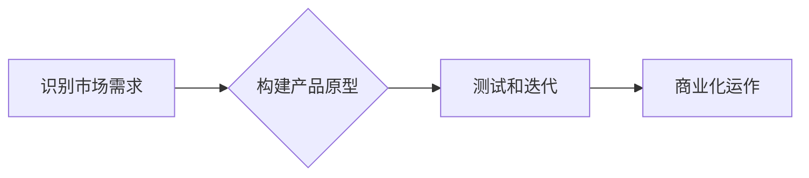

> 大模型、产品创新、创业、人工智能、深度学习、商业化

## 1. 背景介绍

近年来，人工智能（AI）技术突飞猛进，特别是大模型的出现，为各行各业带来了前所未有的机遇。大模型，是指参数规模庞大、训练数据海量的人工智能模型，具备强大的泛化能力和学习能力，能够在自然语言处理、计算机视觉、语音识别等领域取得突破性进展。

然而，大模型的强大功能并不意味着其可以直接应用于实际产品。将大模型转化为具有商业价值的产品，需要进行深入的思考和创新。

## 2. 核心概念与联系

大模型创业的核心在于将大模型的技术优势与市场需求相结合，创造出具有独特价值的产品。

**大模型的优势:**

* **强大的泛化能力:** 大模型能够从海量数据中学习到复杂的模式，并应用于不同的任务和领域。
* **高效的学习能力:** 大模型可以通过微调的方式快速适应新的任务和数据。
* **丰富的功能:** 大模型可以实现多种功能，例如文本生成、图像识别、语音合成等。

**产品创新的关键:**

* **识别市场需求:** 了解用户痛点，找到大模型可以解决的问题。
* **构建独特价值:** 打造差异化产品，提供用户无法获得的价值。
* **实现商业化:** 探索可行的商业模式，实现产品盈利。

**大模型创业的流程:**

## 3. 核心算法原理 & 具体操作步骤

### 3.1  算法原理概述

大模型的训练主要基于深度学习算法，例如Transformer模型。Transformer模型通过自注意力机制学习文本之间的关系，能够捕捉长距离依赖关系，从而实现更准确的文本理解和生成。

### 3.2  算法步骤详解

1. **数据预处理:** 将原始数据清洗、格式化，并转换为模型可理解的格式。
2. **模型构建:** 根据任务需求选择合适的深度学习模型架构，例如Transformer模型。
3. **模型训练:** 使用训练数据训练模型，调整模型参数，使其能够准确地完成任务。
4. **模型评估:** 使用测试数据评估模型的性能，并根据评估结果进行模型调优。
5. **模型部署:** 将训练好的模型部署到生产环境中，供用户使用。

### 3.3  算法优缺点

**优点:**

* 强大的泛化能力和学习能力。
* 可以处理海量数据。
* 能够实现多种功能。

**缺点:**

* 训练成本高昂。
* 需要大量的计算资源。
* 模型解释性差。

### 3.4  算法应用领域

大模型的应用领域非常广泛，包括：

* 自然语言处理：文本生成、机器翻译、问答系统等。
* 计算机视觉：图像识别、物体检测、图像生成等。
* 语音识别：语音转文本、语音合成等。
* 其他领域：药物研发、金融分析、个性化推荐等。

## 4. 数学模型和公式 & 详细讲解 & 举例说明

### 4.1  数学模型构建

大模型的训练基于深度学习算法，其核心是构建复杂的数学模型，通过学习数据中的模式来实现预测或生成目标。

例如，Transformer模型的核心是自注意力机制，其数学模型可以表示为：

$$
Attention(Q, K, V) = \frac{exp(Q \cdot K^T / \sqrt{d_k})}{exp(Q \cdot K^T / \sqrt{d_k})} \cdot V
$$

其中：

* $Q$：查询矩阵
* $K$：键矩阵
* $V$：值矩阵
* $d_k$：键向量的维度

### 4.2  公式推导过程

自注意力机制的公式推导过程涉及到矩阵运算、softmax函数等数学概念。其核心思想是通过计算查询向量与键向量的相似度来确定每个键向量对查询向量的影响权重，然后将这些权重与值向量相加，得到最终的输出。

### 4.3  案例分析与讲解

在机器翻译任务中，Transformer模型可以利用自注意力机制学习源语言和目标语言之间的关系，从而实现更准确的翻译。

例如，当翻译“我爱北京”这句话时，Transformer模型会将“我”和“爱”这两个词语与“北京”这个词语联系起来，并根据它们之间的语义关系进行翻译。

## 5. 项目实践：代码实例和详细解释说明

### 5.1  开发环境搭建

大模型开发通常需要强大的计算资源，例如GPU。可以使用云平台提供的GPU实例进行开发。

### 5.2  源代码详细实现

大模型的源代码通常开源，例如HuggingFace库。可以使用这些开源代码作为基础，进行模型微调和应用开发。

### 5.3  代码解读与分析

需要对模型的代码进行深入解读，理解模型的结构、参数和训练过程。

### 5.4  运行结果展示

需要对模型的运行结果进行展示和分析，评估模型的性能和效果。

## 6. 实际应用场景

### 6.1  自然语言处理

* **聊天机器人:** 大模型可以训练出更智能的聊天机器人，能够进行自然流畅的对话。
* **文本摘要:** 大模型可以自动生成文本摘要，节省用户阅读时间。
* **机器翻译:** 大模型可以实现更准确的机器翻译，打破语言障碍。

### 6.2  计算机视觉

* **图像识别:** 大模型可以识别图像中的物体、场景和人物。
* **图像生成:** 大模型可以生成逼真的图像，用于艺术创作、游戏开发等领域。
* **视频分析:** 大模型可以分析视频内容，例如识别动作、检测异常情况等。

### 6.3  语音识别

* **语音转文本:** 大模型可以将语音转换为文本，用于语音助手、会议记录等应用。
* **语音合成:** 大模型可以生成逼真的语音，用于语音播报、虚拟助手等应用。

### 6.4  未来应用展望

大模型的应用场景还在不断扩展，未来将应用于更多领域，例如：

* **医疗保健:** 辅助诊断、预测疾病风险等。
* **教育:** 个性化学习、智能辅导等。
* **金融:** 风险评估、欺诈检测等。

## 7. 工具和资源推荐

### 7.1  学习资源推荐

* **书籍:** 《深度学习》、《自然语言处理》
* **在线课程:** Coursera、edX、Udacity
* **博客:** OpenAI Blog、Google AI Blog

### 7.2  开发工具推荐

* **框架:** TensorFlow、PyTorch
* **库:** HuggingFace、OpenAI API
* **云平台:** AWS、Google Cloud、Azure

### 7.3  相关论文推荐

* **Attention Is All You Need:** https://arxiv.org/abs/1706.03762
* **BERT: Pre-training of Deep Bidirectional Transformers for Language Understanding:** https://arxiv.org/abs/1810.04805

## 8. 总结：未来发展趋势与挑战

### 8.1  研究成果总结

大模型技术取得了显著进展，在自然语言处理、计算机视觉等领域取得了突破性成果。

### 8.2  未来发展趋势

* **模型规模进一步扩大:** 训练更大规模的模型，提升模型性能。
* **多模态学习:** 融合文本、图像、音频等多模态数据，实现更全面的理解和生成。
* **可解释性增强:** 研究模型的决策机制，提高模型的透明度和可信度。

### 8.3  面临的挑战

* **计算资源需求:** 训练大模型需要大量的计算资源，成本高昂。
* **数据安全和隐私:** 大模型的训练需要海量数据，如何保证数据安全和隐私是一个重要挑战。
* **伦理问题:** 大模型的应用可能带来伦理问题，例如算法偏见、信息操纵等。

### 8.4  研究展望

未来，大模型技术将继续发展，在更多领域发挥重要作用。需要加强基础研究，解决技术难题，并关注大模型的伦理和社会影响。

## 9. 附录：常见问题与解答

### 9.1  常见问题

* 如何选择合适的模型架构？
* 如何进行模型训练和调优？
* 如何部署模型到生产环境？

### 9.2  解答

...

作者：禅与计算机程序设计艺术 / Zen and the Art of Computer Programming

<end_of_turn>