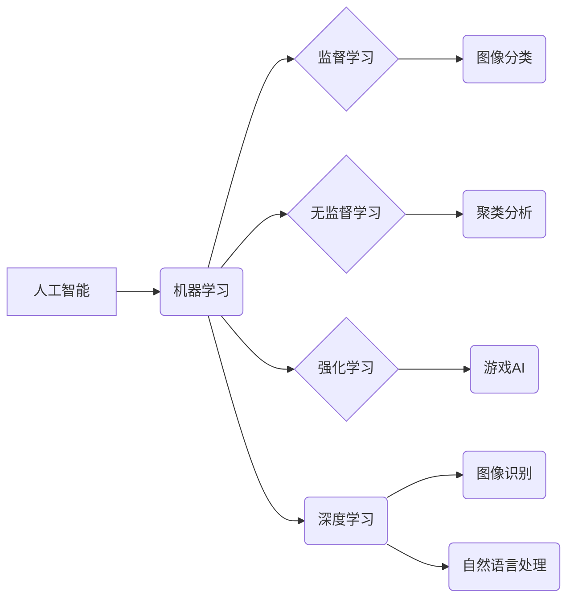

> 人工智能 (AI)
> 机器学习 (Machine Learning)
> 深度学习 (Deep Learning)
> 算法
> 模型
> 代码实例
> 应用场景

## 1. 背景介绍

人工智能 (Artificial Intelligence, AI) 作为一项前沿科技，近年来发展迅速，已渗透到生活的方方面面。从智能手机的语音助手到自动驾驶汽车，从医疗诊断到金融风险评估，AI技术正在改变着我们的世界。

随着数据量的爆炸式增长和计算能力的提升，机器学习 (Machine Learning, ML) 和深度学习 (Deep Learning, DL) 等AI子领域取得了突破性进展。这些技术赋予机器学习能力，使其能够从数据中发现模式、做出预测和决策，从而实现智能化应用。

## 2. 核心概念与联系

**2.1 机器学习 (Machine Learning)**

机器学习是人工智能的一个重要分支，它致力于开发算法，使机器能够从数据中学习，并根据学习到的知识进行预测或决策。机器学习算法可以分为监督学习、无监督学习和强化学习三大类。

* **监督学习:**  利用标记数据训练模型，预测新的数据标签。例如，图像分类、文本情感分析等。
* **无监督学习:**  利用未标记数据发现数据中的潜在结构和模式。例如，聚类分析、异常检测等。
* **强化学习:**  通过试错学习，使智能体在环境中获得最大奖励。例如，游戏AI、机器人控制等。

**2.2 深度学习 (Deep Learning)**

深度学习是机器学习的一个子领域，它利用多层神经网络来模拟人类大脑的学习过程。深度学习模型能够学习到更复杂的特征表示，从而在图像识别、自然语言处理等领域取得更优异的性能。

**2.3 核心概念关系图**



## 3. 核心算法原理 & 具体操作步骤

### 3.1 算法原理概述

本节将介绍一种常用的机器学习算法——线性回归。线性回归是一种监督学习算法，用于预测连续值。它假设数据之间存在线性关系，并通过最小化预测值与真实值的误差来学习模型参数。

### 3.2 算法步骤详解

1. **数据准备:** 收集并预处理数据，将特征和目标变量分离。
2. **模型构建:** 定义线性回归模型，假设目标变量与特征之间存在线性关系。
3. **参数估计:** 使用最小二乘法或梯度下降法等算法，估计模型参数，使预测值与真实值之间的误差最小化。
4. **模型评估:** 使用测试数据评估模型性能，例如计算均方误差 (MSE) 或 R-squared 值。
5. **模型调优:** 根据评估结果，调整模型参数或选择其他算法，以提高模型性能。

### 3.3 算法优缺点

**优点:**

* 算法简单易懂，易于实现。
* 计算效率高，适合处理大规模数据。
* 可解释性强，可以直观地理解模型参数的影响。

**缺点:**

* 只能处理线性关系的数据。
* 对异常值敏感，容易受到噪声影响。

### 3.4 算法应用领域

线性回归广泛应用于以下领域:

* 房价预测
* 股票价格预测
* 销售预测
* 医疗诊断
* 经济预测

## 4. 数学模型和公式 & 详细讲解 & 举例说明

### 4.1 数学模型构建

线性回归模型假设目标变量 y 与特征变量 x 之间存在线性关系，可以表示为：

$$y = w_0 + w_1x + \epsilon$$

其中：

* y 是目标变量
* x 是特征变量
* $w_0$ 是截距
* $w_1$ 是权重
* $\epsilon$ 是误差项

### 4.2 公式推导过程

最小二乘法是一种常用的参数估计方法，其目标是找到最优的 $w_0$ 和 $w_1$，使预测值与真实值之间的误差平方和最小化。

误差平方和 (SSE) 定义为：

$$SSE = \sum_{i=1}^{n}(y_i - \hat{y}_i)^2$$

其中：

* $y_i$ 是第 i 个样本的真实值
* $\hat{y}_i$ 是第 i 个样本的预测值

通过对 SSE 求导并令其等于零，可以得到 $w_0$ 和 $w_1$ 的最优解。

### 4.3 案例分析与讲解

假设我们有一组数据，记录了房屋面积 (x) 和房屋价格 (y)。我们想使用线性回归模型预测房屋价格。

我们可以使用最小二乘法估计模型参数，得到以下线性回归模型：

$$y = 10000 + 500x$$

其中：

* $w_0 = 10000$ 是截距，表示房屋面积为 0 平方米时的价格
* $w_1 = 500$ 是权重，表示每增加 1 平方米面积，房屋价格增加 500 元

我们可以使用这个模型预测不同面积房屋的价格。例如，如果一个房屋面积为 100 平方米，则其预测价格为：

$$y = 10000 + 500 * 100 = 60000$$

## 5. 项目实践：代码实例和详细解释说明

### 5.1 开发环境搭建

本示例使用 Python 语言和 scikit-learn 库进行实现。

需要安装以下软件包：

* Python 3.x
* scikit-learn

可以使用 pip 安装：

```bash
pip install scikit-learn
```

### 5.2 源代码详细实现

```python
import pandas as pd
from sklearn.linear_model import LinearRegression
from sklearn.model_selection import train_test_split

# 加载数据
data = pd.read_csv('housing.csv')

# 分割特征和目标变量
X = data[['area']]  # 特征变量：房屋面积
y = data['price']  # 目标变量：房屋价格

# 将数据分割为训练集和测试集
X_train, X_test, y_train, y_test = train_test_split(X, y, test_size=0.2, random_state=42)

# 创建线性回归模型
model = LinearRegression()

# 训练模型
model.fit(X_train, y_train)

# 预测测试集数据
y_pred = model.predict(X_test)

# 评估模型性能
from sklearn.metrics import mean_squared_error
mse = mean_squared_error(y_test, y_pred)
print(f'均方误差 (MSE): {mse}')
```

### 5.3 代码解读与分析

1. 导入必要的库函数。
2. 加载数据，并将其分割为特征变量和目标变量。
3. 使用 `train_test_split` 函数将数据分割为训练集和测试集。
4. 创建线性回归模型实例。
5. 使用 `fit` 方法训练模型，将训练数据用于模型参数的估计。
6. 使用 `predict` 方法预测测试集数据。
7. 使用 `mean_squared_error` 函数评估模型性能，计算均方误差。

### 5.4 运行结果展示

运行代码后，会输出测试集数据的均方误差值。

## 6. 实际应用场景

### 6.1 房屋价格预测

线性回归模型可以用于预测房屋价格，根据房屋面积、位置、房间数量等特征，预测房屋的市场价值。

### 6.2 股票价格预测

线性回归模型可以用于预测股票价格，根据历史股价、交易量、市场指数等特征，预测股票未来的价格走势。

### 6.3 销售预测

线性回归模型可以用于预测销售额，根据历史销售数据、市场营销活动、季节性因素等特征，预测未来一段时间内的销售量。

### 6.4 未来应用展望

随着数据量的增长和算法的改进，线性回归模型将在更多领域得到应用，例如：

* 医疗诊断
* 经济预测
* 风险评估
* 个性化推荐

## 7. 工具和资源推荐

### 7.1 学习资源推荐

* **书籍:**
    * 《机器学习》 - 周志华
    * 《Python机器学习实战》 - 塞缪尔·阿布拉姆斯
* **在线课程:**
    * Coursera: 机器学习
    * edX: 机器学习
    * Udacity: 机器学习工程师

### 7.2 开发工具推荐

* **Python:** 
    * scikit-learn: 机器学习库
    * pandas: 数据分析库
    * matplotlib: 数据可视化库
* **其他工具:**
    * Jupyter Notebook: 交互式编程环境
    * TensorFlow: 深度学习框架
    * PyTorch: 深度学习框架

### 7.3 相关论文推荐

* **《机器学习》 - 周志华**
* **《深度学习》 - Ian Goodfellow, Yoshua Bengio, Aaron Courville**

## 8. 总结：未来发展趋势与挑战

### 8.1 研究成果总结

近年来，人工智能领域取得了显著进展，机器学习和深度学习算法在多个领域取得了突破性成果。

### 8.2 未来发展趋势

* **模型更加复杂:** 研究人员将继续开发更加复杂、更加强大的机器学习模型，例如 Transformer 模型、生成对抗网络 (GAN) 等。
* **数据更加丰富:** 数据是机器学习的燃料，未来数据量将继续增长，这将推动机器学习算法的进一步发展。
* **应用更加广泛:** 人工智能技术将应用于更多领域，例如医疗、教育、金融、交通等。

### 8.3 面临的挑战

* **数据隐私和安全:** 人工智能算法依赖于大量数据，如何保护数据隐私和安全是一个重要的挑战。
* **算法可解释性:** 许多机器学习算法是黑箱模型，难以解释其决策过程，这限制了其在一些领域应用的推广。
* **伦理问题:** 人工智能技术的发展引发了一些伦理问题，例如算法偏见、工作岗位替代等，需要认真思考和解决。

### 8.4 研究展望

未来，人工智能研究将继续朝着更加智能、更加安全、更加可解释的方向发展。

## 9. 附录：常见问题与解答

**Q1: 线性回归模型只能处理线性关系的数据吗？**

A1: 是的，线性回归模型假设数据之间存在线性关系。如果数据存在非线性关系，可以使用其他类型的机器学习算法，例如决策树、支持向量机等。

**Q2: 如何评估线性回归模型的性能？**

A2: 可以使用均方误差 (MSE)、R-squared 值等指标来评估线性回归模型的性能。

**Q3: 如何处理线性回归模型中的异常值？**

A3: 可以使用数据清洗技术，例如删除异常值或对其进行修正。也可以使用鲁棒回归算法，这些算法对异常值更加鲁棒。


作者：禅与计算机程序设计艺术 / Zen and the Art of Computer Programming 
<end_of_turn>