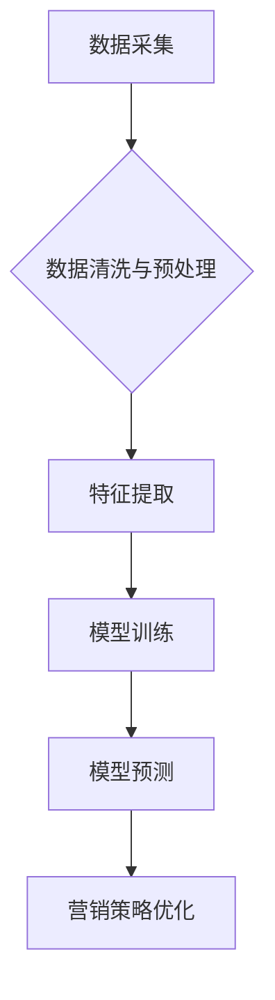

> 人工智能，市场营销，数据分析，机器学习，深度学习，自然语言处理，个性化推荐，自动化营销

## 1. 背景介绍

人工智能（AI）正以惊人的速度发展，其应用领域不断扩展，市场营销领域也不例外。AI技术为市场营销带来了前所未有的机遇，帮助企业更精准地了解客户需求，优化营销策略，提升营销效率。

传统市场营销模式往往依赖于大规模的广告投放和粗放的客户群体划分，难以精准触达目标客户。而AI技术则能够通过数据分析和机器学习，挖掘客户行为模式、偏好和需求，实现精准营销。

## 2. 核心概念与联系

**2.1  人工智能在市场营销中的应用**

人工智能在市场营销中的应用主要集中在以下几个方面：

* **客户画像分析:** 利用AI技术分析客户的购买行为、浏览记录、社交媒体活动等数据，构建精准的客户画像，了解客户的兴趣爱好、需求偏好等信息。
* **个性化推荐:** 基于客户画像和历史行为数据，AI算法可以推荐个性化的产品或服务，提高客户转化率。
* **内容营销优化:** AI可以分析用户对不同内容的反应，优化内容创作方向和传播策略，提高内容营销效果。
* **自动化营销:** AI可以自动执行一些重复性的营销任务，例如发送邮件、回复客户咨询等，提高营销效率。
* **广告投放优化:** AI可以根据用户画像和行为数据，精准投放广告，提高广告转化率。

**2.2  核心概念与架构**



**2.3  AI技术与市场营销的协同作用**

AI技术与市场营销的协同作用可以实现以下目标：

* **提升营销精准度:** AI技术可以帮助企业精准识别目标客户，避免资源浪费。
* **提高营销效率:** AI可以自动化执行一些营销任务，释放人力资源。
* **优化营销效果:** AI可以根据数据分析结果，不断优化营销策略，提升营销效果。
* **增强客户体验:** AI可以提供个性化的产品推荐和服务，提升客户体验。

## 3. 核心算法原理 & 具体操作步骤

**3.1  算法原理概述**

在市场营销领域，常用的AI算法包括：

* **机器学习:** 通过训练模型，从数据中学习规律，进行预测和分类。
* **深度学习:** 基于神经网络，能够处理更复杂的数据，学习更深层次的特征。
* **自然语言处理:** 处理和理解人类语言，用于文本分析、情感分析等。

**3.2  算法步骤详解**

以机器学习为例，其基本步骤如下：

1. **数据收集:** 收集与市场营销相关的各种数据，例如客户行为数据、产品销售数据、市场趋势数据等。
2. **数据预处理:** 对收集到的数据进行清洗、转换、格式化等处理，使其适合模型训练。
3. **特征提取:** 从数据中提取有价值的特征，例如客户年龄、性别、购买历史等。
4. **模型选择:** 根据具体任务选择合适的机器学习模型，例如分类模型、回归模型等。
5. **模型训练:** 使用训练数据训练模型，使其能够学习数据中的规律。
6. **模型评估:** 使用测试数据评估模型的性能，例如准确率、召回率等。
7. **模型部署:** 将训练好的模型部署到实际应用场景中，例如用于客户画像分析、个性化推荐等。

**3.3  算法优缺点**

* **优点:** 能够自动学习数据规律，提高营销精准度和效率。
* **缺点:** 需要大量的数据进行训练，模型训练过程复杂，需要专业技术人员进行操作。

**3.4  算法应用领域**

* **客户关系管理 (CRM):** 分析客户行为，预测客户流失，提供个性化服务。
* **电子商务:** 个性化推荐产品，优化广告投放，提高转化率。
* **社交媒体营销:** 分析用户情绪，优化内容创作，提高用户互动。
* **内容营销:** 自动生成内容，优化内容传播策略。

## 4. 数学模型和公式 & 详细讲解 & 举例说明

**4.1  数学模型构建**

在市场营销领域，常用的数学模型包括：

* **线性回归模型:** 用于预测连续变量，例如客户购买金额。
* **逻辑回归模型:** 用于预测分类变量，例如客户是否会购买产品。
* **决策树模型:** 用于分类和预测，能够处理非线性数据。

**4.2  公式推导过程**

以线性回归模型为例，其目标是找到一条直线，使得预测值与实际值之间的误差最小。

假设我们有n个样本数据，每个样本包含一个输入特征x和一个输出特征y。线性回归模型的公式如下：

$$y = w_0 + w_1x$$

其中，$w_0$和$w_1$是模型的参数，需要通过训练数据进行学习。

**4.3  案例分析与讲解**

假设我们想要预测客户的购买金额，根据历史数据，我们发现客户的年龄和收入与购买金额存在一定的线性关系。我们可以使用线性回归模型来建立这个关系，并预测新客户的购买金额。

## 5. 项目实践：代码实例和详细解释说明

**5.1  开发环境搭建**

* Python 3.x
* Jupyter Notebook
* scikit-learn

**5.2  源代码详细实现**

```python
from sklearn.linear_model import LinearRegression
from sklearn.model_selection import train_test_split
import pandas as pd

# 加载数据
data = pd.read_csv('customer_data.csv')

# 分割数据
X = data[['age', 'income']]
y = data['purchase_amount']
X_train, X_test, y_train, y_test = train_test_split(X, y, test_size=0.2, random_state=42)

# 创建线性回归模型
model = LinearRegression()

# 训练模型
model.fit(X_train, y_train)

# 预测测试数据
y_pred = model.predict(X_test)

# 评估模型性能
from sklearn.metrics import mean_squared_error
mse = mean_squared_error(y_test, y_pred)
print(f'Mean Squared Error: {mse}')
```

**5.3  代码解读与分析**

* 首先，我们加载数据并将其分割成训练集和测试集。
* 然后，我们创建了一个线性回归模型，并使用训练数据对其进行训练。
* 训练完成后，我们使用模型预测测试数据的购买金额。
* 最后，我们使用均方误差来评估模型的性能。

**5.4  运行结果展示**

运行代码后，会输出模型的均方误差值，该值越小，模型的预测精度越高。

## 6. 实际应用场景

**6.1  客户画像分析**

AI技术可以分析客户的购买行为、浏览记录、社交媒体活动等数据，构建精准的客户画像，了解客户的兴趣爱好、需求偏好等信息。

**6.2  个性化推荐**

基于客户画像和历史行为数据，AI算法可以推荐个性化的产品或服务，提高客户转化率。

**6.3  内容营销优化**

AI可以分析用户对不同内容的反应，优化内容创作方向和传播策略，提高内容营销效果。

**6.4  未来应用展望**

随着AI技术的不断发展，其在市场营销领域的应用将更加广泛和深入，例如：

* **更精准的客户分群:** AI可以根据更细粒度的客户特征进行分群，实现更精准的营销策略。
* **更个性化的营销体验:** AI可以根据客户的个性化需求，提供更个性化的产品推荐、服务和内容。
* **更智能的营销自动化:** AI可以自动执行更多营销任务，例如客户关系管理、广告投放优化等，释放人力资源。

## 7. 工具和资源推荐

**7.1  学习资源推荐**

* **在线课程:** Coursera, edX, Udacity 等平台提供丰富的AI课程。
* **书籍:** 《深度学习》、《机器学习实战》等书籍。
* **博客和论坛:** Kaggle, Towards Data Science 等平台提供大量的AI技术文章和讨论。

**7.2  开发工具推荐**

* **Python:** 广泛应用于AI开发，拥有丰富的AI库和工具。
* **TensorFlow:** Google开发的开源深度学习框架。
* **PyTorch:** Facebook开发的开源深度学习框架。

**7.3  相关论文推荐**

* **Attention Is All You Need:** Transformer模型的提出论文。
* **BERT: Pre-training of Deep Bidirectional Transformers for Language Understanding:** BERT模型的提出论文。

## 8. 总结：未来发展趋势与挑战

**8.1  研究成果总结**

近年来，AI技术在市场营销领域取得了显著的成果，例如：

* **精准营销:** AI可以帮助企业精准识别目标客户，提高营销效率。
* **个性化推荐:** AI可以根据客户的个性化需求，提供更精准的产品推荐。
* **自动化营销:** AI可以自动执行一些重复性的营销任务，释放人力资源。

**8.2  未来发展趋势**

* **更强大的AI模型:** 未来，AI模型将更加强大，能够处理更复杂的数据，学习更深层次的特征。
* **更个性化的营销体验:** AI将更加注重个性化，提供更精准、更个性化的营销体验。
* **更智能的营销自动化:** AI将更加智能，能够自动执行更多营销任务，甚至能够自主决策。

**8.3  面临的挑战**

* **数据隐私保护:** AI技术依赖于大量的数据，如何保护用户数据隐私是一个重要的挑战。
* **算法偏见:** AI算法可能会存在偏见，导致不公平的结果。
* **技术可解释性:** AI模型的决策过程往往难以理解，如何提高模型的可解释性是一个重要的挑战。

**8.4  研究展望**

未来，AI技术在市场营销领域的应用将更加广泛和深入，需要进一步研究以下问题：

* 如何更好地保护用户数据隐私？
* 如何解决AI算法的偏见问题？
* 如何提高AI模型的可解释性？


## 9. 附录：常见问题与解答

**9.1  Q: 如何选择合适的AI算法？**

**A:** 选择合适的AI算法需要根据具体任务和数据特点进行选择。例如，如果要预测连续变量，可以使用线性回归模型；如果要预测分类变量，可以使用逻辑回归模型。

**9.2  Q: 如何评估AI模型的性能？**

**A:** 可以使用各种指标来评估AI模型的性能，例如准确率、召回率、F1-score等。

**9.3  Q: 如何解决AI算法的偏见问题？**

**A:** 可以通过以下方法来解决AI算法的偏见问题：

* 使用更公平的数据集进行训练。
* 使用偏见检测工具来识别算法中的偏见。
* 使用偏见缓解技术来减少算法中的偏见。


作者：禅与计算机程序设计艺术 / Zen and the Art of Computer Programming 
<end_of_turn>