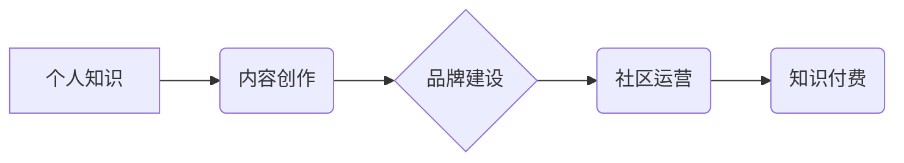

> 个人知识IP，内容创作，技术博客，品牌建设，社区运营，知识付费

## 1. 背景介绍

在当今信息爆炸的时代，知识成为了最宝贵的财富。个人知识IP的崛起，为技术人员提供了展示自我、分享经验、建立影响力的全新平台。打造个人知识IP，不仅可以提升个人品牌价值，还能开拓新的职业发展路径，甚至创造新的商业模式。

然而，打造个人知识IP并非易事，需要付出大量的努力和时间。从零开始，需要明确目标、规划路线、坚持创作，并不断学习和提升。本文将从多个角度探讨如何从0到1打造个人知识IP，并分享一些实用的经验和建议。

## 2. 核心概念与联系

**2.1 个人知识IP的概念**

个人知识IP是指个人通过积累和沉淀的专业知识、技能、经验、观点和影响力，形成的独一无二的知识产权。它是一种具有价值和可持续发展的个人品牌，可以被用于多种场景，例如：

* **内容创作:** 通过博客、视频、音频等形式，分享专业知识和经验，吸引读者和粉丝。
* **品牌建设:** 打造个人品牌形象，提升个人影响力，建立信任和忠诚度。
* **社区运营:** 建立线上线下社区，与同领域的人交流学习，共同成长。
* **知识付费:** 通过付费课程、咨询服务等方式，将知识转化为收益。

**2.2 个人知识IP的构建要素**

个人知识IP的构建需要以下几个要素：

* **专业知识:** 扎实的专业知识是个人知识IP的基础。
* **独特视角:** 独特的见解和观点可以使个人知识IP更加有价值。
* **优质内容:** 高质量的内容是吸引读者和粉丝的关键。
* **品牌形象:** 独特的品牌形象可以帮助个人知识IP脱颖而出。
* **社区运营:** 社区运营可以帮助个人知识IP建立粉丝基础和影响力。

**2.3 个人知识IP的价值链**

个人知识IP的价值链可以概括为以下几个环节：

* **知识积累:** 通过学习、实践、思考等方式积累专业知识。
* **内容创作:** 将知识转化为有价值的内容，例如博客文章、视频、音频等。
* **品牌建设:** 打造个人品牌形象，提升个人影响力。
* **社区运营:** 建立线上线下社区，与同领域的人交流学习。
* **知识付费:** 将知识转化为收益，例如付费课程、咨询服务等。

**2.4  核心概念关系图**



## 3. 核心算法原理 & 具体操作步骤

### 3.1  算法原理概述

**3.1.1  知识图谱构建**

知识图谱是将知识表示为图结构的一种方法，可以有效地组织和存储知识，并支持知识推理和查询。

**3.1.2  内容推荐算法**

内容推荐算法可以根据用户的兴趣和行为，推荐相关的知识内容。常用的算法包括协同过滤、内容过滤和混合推荐等。

**3.1.3  社区运营算法**

社区运营算法可以帮助管理社区成员、促进社区活跃度和用户参与度。常用的算法包括用户画像分析、话题聚类和社区分层等。

### 3.2  算法步骤详解

**3.2.1  知识图谱构建步骤**

1. **知识提取:** 从文本、数据等来源提取知识实体和关系。
2. **知识表示:** 将知识实体和关系表示为图结构。
3. **知识融合:** 将来自不同来源的知识进行融合和整合。
4. **知识推理:** 利用知识图谱进行知识推理和查询。

**3.2.2  内容推荐算法步骤**

1. **用户行为分析:** 收集用户的浏览记录、点赞记录、评论记录等行为数据。
2. **内容特征提取:** 从知识内容中提取特征，例如主题、关键词、作者等。
3. **推荐模型训练:** 利用用户行为数据和内容特征数据，训练推荐模型。
4. **推荐结果生成:** 根据用户的兴趣和行为，生成推荐结果。

**3.2.3  社区运营算法步骤**

1. **用户画像分析:** 分析用户的兴趣、行为、属性等信息，构建用户画像。
2. **话题聚类:** 将社区话题进行聚类，识别热门话题和用户关注点。
3. **社区分层:** 将社区成员根据兴趣、活跃度等因素进行分层，提供个性化服务。

### 3.3  算法优缺点

**3.3.1  知识图谱构建算法**

* **优点:** 可以有效地组织和存储知识，支持知识推理和查询。
* **缺点:** 知识提取和表示需要复杂的算法和大量的数据支持。

**3.3.2  内容推荐算法**

* **优点:** 可以根据用户的兴趣推荐相关的知识内容，提高用户体验。
* **缺点:** 容易出现推荐偏差，例如过滤泡和冷启动问题。

**3.3.3  社区运营算法**

* **优点:** 可以帮助管理社区成员、促进社区活跃度和用户参与度。
* **缺点:** 需要不断收集和分析用户数据，并根据数据调整运营策略。

### 3.4  算法应用领域

* **教育领域:** 个性化学习推荐、知识图谱辅助教学。
* **科研领域:** 知识发现、文献检索、科研成果传播。
* **商业领域:** 客户关系管理、精准营销、产品推荐。

## 4. 数学模型和公式 & 详细讲解 & 举例说明

### 4.1  数学模型构建

**4.1.1  知识图谱构建模型**

知识图谱构建模型可以采用图神经网络 (GNN) 来表示和学习知识图谱中的关系。

**4.1.2  内容推荐模型**

内容推荐模型可以采用协同过滤算法，例如基于用户的协同过滤和基于物品的协同过滤。

**4.1.3  社区运营模型**

社区运营模型可以采用社交网络分析算法，例如度中心性、介数中心性和聚类系数等。

### 4.2  公式推导过程

**4.2.1  协同过滤算法公式**

用户对物品的评分预测公式：

$$
\hat{r}_{u,i} = \bar{r}_u + \frac{\sum_{v \in N(u)} (r_{v,i} - \bar{r}_v) \cdot sim(u,v)}{\sum_{v \in N(u)} sim(u,v)}
$$

其中：

* $\hat{r}_{u,i}$: 用户 $u$ 对物品 $i$ 的评分预测值。
* $\bar{r}_u$: 用户 $u$ 的平均评分。
* $r_{v,i}$: 用户 $v$ 对物品 $i$ 的真实评分。
* $N(u)$: 用户 $u$ 的邻居用户集合。
* $sim(u,v)$: 用户 $u$ 和用户 $v$ 之间的相似度。

**4.2.2  图神经网络公式**

图神经网络的更新公式：

$$
h_i^{(l+1)} = \sigma(W^{(l)} \cdot \text{aggregate}(h_i^{(l)}, \mathcal{N}(i)))
$$

其中：

* $h_i^{(l)}$: 节点 $i$ 在第 $l$ 层的隐藏状态。
* $W^{(l)}$: 第 $l$ 层的权重矩阵。
* $\text{aggregate}$: 聚合函数，例如求和或平均值。
* $\mathcal{N}(i)$: 节点 $i$ 的邻居节点集合。
* $\sigma$: 激活函数，例如ReLU或sigmoid。

### 4.3  案例分析与讲解

**4.3.1  知识图谱构建案例**

可以使用知识图谱构建模型，从维基百科等公开数据中构建知识图谱，例如构建人物关系图谱或学科知识图谱。

**4.3.2  内容推荐案例**

可以使用协同过滤算法，根据用户的阅读记录和点赞记录，推荐相关的技术博客文章或视频。

**4.3.3  社区运营案例**

可以使用社交网络分析算法，分析社区成员之间的关系，识别社区活跃度高的用户和话题，并针对性地进行运营。

## 5. 项目实践：代码实例和详细解释说明

### 5.1  开发环境搭建

* **操作系统:** Linux 或 macOS
* **编程语言:** Python
* **开发工具:** Jupyter Notebook、VS Code 等

### 5.2  源代码详细实现

```python
# 知识图谱构建示例代码

import networkx as nx

# 创建知识图谱
graph = nx.Graph()

# 添加知识实体和关系
graph.add_node("张三")
graph.add_node("李四")
graph.add_edge("张三", "李四", relation="朋友")

# 打印知识图谱
print(graph.nodes())
print(graph.edges(data=True))
```

### 5.3  代码解读与分析

* **网络X库:** 使用网络X库来构建和操作知识图谱。
* **知识实体和关系:** 使用节点和边来表示知识实体和关系。
* **打印知识图谱:** 打印知识图谱中的节点和边信息。

### 5.4  运行结果展示

```
['张三', '李四']
[('张三', '李四', {'relation': '朋友'})]
```

## 6. 实际应用场景

### 6.1  教育领域

* **个性化学习推荐:** 根据学生的学习进度和兴趣，推荐相关的学习资源。
* **知识图谱辅助教学:** 利用知识图谱帮助学生理解知识之间的关系，提高学习效率。

### 6.2  科研领域

* **知识发现:** 从海量数据中发现新的知识和规律。
* **文献检索:** 根据研究主题，快速检索相关的文献资料。

### 6.3  商业领域

* **客户关系管理:** 建立客户画像，提供个性化服务。
* **精准营销:** 根据用户的兴趣和行为，精准推送广告和营销信息。

### 6.4  未来应用展望

* **人工智能辅助创作:** 利用人工智能技术辅助知识创作，提高效率和质量。
* **虚拟现实和增强现实:** 将知识内容融入虚拟现实和增强现实场景，提供更沉浸式的学习体验。

## 7. 工具和资源推荐

### 7.1  学习资源推荐

* **书籍:** 《知识图谱构建与应用》、《深度学习》
* **在线课程:** Coursera、edX、Udacity 等平台上的相关课程。
* **博客和论坛:** 知乎、CSDN 等平台上的技术博客和论坛。

### 7.2  开发工具推荐

* **知识图谱构建工具:** Neo4j、GraphDB 等。
* **内容推荐工具:** TensorFlow、PyTorch 等深度学习框架。
* **社区运营工具:** Discourse、Slack 等。

### 7.3  相关论文推荐

* **知识图谱构建:** 《A Survey on Knowledge Graph Embedding》
* **内容推荐:** 《Collaborative Filtering for Recommender Systems》
* **社区运营:** 《Social Network Analysis: Methods and Applications》

## 8. 总结：未来发展趋势与挑战

### 8.1  研究成果总结

* **知识图谱技术:** 知识图谱技术已经取得了显著的进展，在知识表示、推理和查询方面展现出强大的能力。
* **内容推荐技术:** 内容推荐技术不断发展，利用深度学习和个性化算法，能够提供更精准和有效的推荐结果。
* **社区运营技术:** 社区运营技术不断探索新的方法，利用社交网络分析和用户画像分析，提升社区活跃度和用户参与度。

### 8.2  未来发展趋势

* **知识图谱规模和复杂度:** 知识图谱的规模和复杂度将不断增加，需要开发更强大的算法和工具来处理海量数据。
* **跨领域知识融合:** 不同领域知识的融合将成为未来发展趋势，