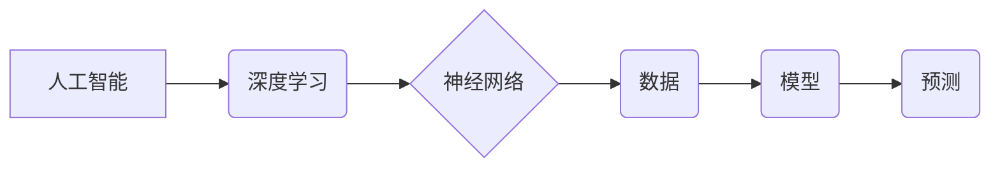

>人工智能、深度学习、神经网络、算法、模型、应用

## 1. 背景介绍

在瞬息万变的科技时代，人工智能（AI）正以惊人的速度发展，深刻地改变着我们的生活和工作方式。从智能手机的语音助手到自动驾驶汽车，AI技术的应用无处不在。然而，AI技术的本质是什么？它是如何从概念到洞见的？

本篇文章将深入探讨AI的核心概念，分析其背后的算法原理和数学模型，并通过实际项目实践，揭示AI技术从概念到洞见的演变过程。

## 2. 核心概念与联系

人工智能的核心概念是模拟人类智能的行为。这包括学习、推理、决策、感知和语言理解等能力。

**2.1 人工智能的类型**

人工智能可以分为以下几类：

* **狭义人工智能 (ANI)：** 能够执行特定任务的人工智能，例如玩游戏、识别图像或翻译语言。
* **通用人工智能 (AGI)：** 能够像人类一样进行任何智能任务的人工智能。
* **超人工智能 (ASI)：** 能够超越人类智能的人工智能。

**2.2 深度学习与神经网络**

深度学习是人工智能领域的一个重要分支，它利用多层神经网络来模拟人类大脑的学习过程。神经网络由许多相互连接的神经元组成，每个神经元接收输入信号，对其进行处理，并输出信号。通过训练神经网络，使其能够从数据中学习模式和规律。

**2.3 核心概念关系图**



## 3. 核心算法原理 & 具体操作步骤

### 3.1 算法原理概述

深度学习算法的核心是反向传播算法。反向传播算法通过计算误差，并根据误差调整神经网络的权重和偏置，从而使神经网络的预测结果越来越准确。

### 3.2 算法步骤详解

1. **前向传播:** 将输入数据传递到神经网络中，并计算每个神经元的输出值。
2. **误差计算:** 将神经网络的输出值与实际值进行比较，计算误差。
3. **反向传播:** 将误差反向传播到神经网络的各个层，并根据误差调整权重和偏置。
4. **重复步骤1-3:** 重复前向传播和反向传播的过程，直到误差达到预设的阈值。

### 3.3 算法优缺点

**优点:**

* 能够学习复杂的数据模式。
* 性能优于传统机器学习算法。
* 可应用于多种领域，例如图像识别、自然语言处理和语音识别。

**缺点:**

* 需要大量的训练数据。
* 训练时间长，计算资源消耗大。
* 模型解释性差，难以理解模型的决策过程。

### 3.4 算法应用领域

深度学习算法已广泛应用于以下领域：

* **计算机视觉:** 图像识别、物体检测、图像分割、人脸识别。
* **自然语言处理:** 文本分类、情感分析、机器翻译、对话系统。
* **语音识别:** 语音转文本、语音助手。
* **推荐系统:** 商品推荐、内容推荐。
* **医疗诊断:** 病情预测、疾病诊断。

## 4. 数学模型和公式 & 详细讲解 & 举例说明

### 4.1 数学模型构建

深度学习模型通常由多层神经网络组成，每层神经网络包含多个神经元。每个神经元接收来自上一层的输出信号，对其进行处理，并输出信号到下一层。

**4.1.1 神经元模型**

一个神经元的数学模型可以表示为：

$$
y = f(w^T x + b)
$$

其中：

* $y$ 是神经元的输出值。
* $f$ 是激活函数，例如 sigmoid 函数或 ReLU 函数。
* $w$ 是神经元的权重向量。
* $x$ 是神经元的输入向量。
* $b$ 是神经元的偏置。

**4.1.2 多层神经网络**

多层神经网络由多个神经元层组成，每一层的神经元接收上一层的输出信号，并将其传递到下一层。

### 4.2 公式推导过程

反向传播算法的核心是计算误差梯度，并根据梯度更新神经网络的权重和偏置。

**4.2.1 误差函数**

误差函数用于衡量模型的预测结果与实际值的差异。常用的误差函数包括均方误差 (MSE) 和交叉熵损失 (Cross-Entropy Loss)。

**4.2.2 梯度计算**

梯度计算用于计算误差函数对权重和偏置的偏导数。

**4.2.3 权重更新**

权重更新规则用于根据梯度更新神经网络的权重和偏置。常用的更新规则包括梯度下降法和动量法。

### 4.3 案例分析与讲解

**4.3.1 图像分类**

假设我们有一个图像分类任务，目标是将图像分类为不同的类别，例如猫、狗和鸟。我们可以使用深度学习模型，例如卷积神经网络 (CNN)，来解决这个问题。

CNN 可以学习图像的特征，并将其用于分类。训练 CNN 模型时，我们会使用大量的图像数据，并使用反向传播算法来更新模型的权重和偏置。

**4.3.2 自然语言处理**

自然语言处理 (NLP) 是一项复杂的任务，它涉及理解和生成人类语言。深度学习模型，例如循环神经网络 (RNN) 和 Transformer，可以用于解决 NLP 问题，例如机器翻译、文本摘要和情感分析。

## 5. 项目实践：代码实例和详细解释说明

### 5.1 开发环境搭建

为了进行深度学习项目实践，我们需要搭建一个开发环境。常用的开发环境包括：

* **Python:** 深度学习的编程语言。
* **TensorFlow 或 PyTorch:** 深度学习框架。
* **GPU:** 加速深度学习训练的硬件。

### 5.2 源代码详细实现

以下是一个使用 TensorFlow 实现图像分类的简单代码示例：

```python
import tensorflow as tf

# 定义模型
model = tf.keras.models.Sequential([
    tf.keras.layers.Conv2D(32, (3, 3), activation='relu', input_shape=(28, 28, 1)),
    tf.keras.layers.MaxPooling2D((2, 2)),
    tf.keras.layers.Conv2D(64, (3, 3), activation='relu'),
    tf.keras.layers.MaxPooling2D((2, 2)),
    tf.keras.layers.Flatten(),
    tf.keras.layers.Dense(10, activation='softmax')
])

# 编译模型
model.compile(optimizer='adam',
              loss='sparse_categorical_crossentropy',
              metrics=['accuracy'])

# 训练模型
model.fit(x_train, y_train, epochs=5)

# 评估模型
loss, accuracy = model.evaluate(x_test, y_test)
print('Test loss:', loss)
print('Test accuracy:', accuracy)
```

### 5.3 代码解读与分析

这段代码定义了一个简单的卷积神经网络 (CNN) 模型，用于图像分类。

* `tf.keras.models.Sequential`: 创建一个顺序模型，即层级结构。
* `tf.keras.layers.Conv2D`: 卷积层，用于学习图像特征。
* `tf.keras.layers.MaxPooling2D`: 最大池化层，用于降维和提取关键特征。
* `tf.keras.layers.Flatten`: 将多维数据转换为一维数据。
* `tf.keras.layers.Dense`: 全连接层，用于分类。
* `model.compile`: 编译模型，指定优化器、损失函数和指标。
* `model.fit`: 训练模型。
* `model.evaluate`: 评估模型。

### 5.4 运行结果展示

训练完成后，我们可以使用测试数据评估模型的性能。

## 6. 实际应用场景

### 6.1 图像识别

深度学习算法在图像识别领域取得了突破性的进展。例如，Google 的 Inception 模型可以识别超过 1000 种物体，而 Facebook 的 Detectron2 模型可以进行目标检测和实例分割。

### 6.2 自然语言处理

深度学习算法也广泛应用于自然语言处理领域。例如，Google 的 BERT 模型可以理解上下文信息，从而提高机器翻译和文本摘要的质量。

### 6.3 语音识别

深度学习算法可以用于语音识别，例如苹果公司的 Siri 和亚马逊公司的 Alexa。

### 6.4 其他应用场景

深度学习算法还可以应用于其他领域，例如医疗诊断、金融预测和自动驾驶。

### 6.5 未来应用展望

随着深度学习技术的不断发展，其应用场景将更加广泛。例如，未来可能出现能够进行更精准的医疗诊断、更智能的自动驾驶汽车和更自然的机器人交互。

## 7. 工具和资源推荐

### 7.1 学习资源推荐

* **书籍:**
    * 深度学习 (Deep Learning) - Ian Goodfellow, Yoshua Bengio, Aaron Courville
    * 构建深度学习模型 (Hands-On Machine Learning with Scikit-Learn, Keras & TensorFlow) - Aurélien Géron
* **在线课程:**
    * 深度学习 Specialization - Andrew Ng (Coursera)
    * fast.ai - Practical Deep Learning for Coders
* **博客和网站:**
    * TensorFlow Blog
    * PyTorch Blog
    * Towards Data Science

### 7.2 开发工具推荐

* **TensorFlow:** 开源深度学习框架。
* **PyTorch:** 开源深度学习框架。
* **Keras:** 高级深度学习 API，可以运行在 TensorFlow、Theano 或 CNTK 后端。

### 7.3 相关论文推荐

* **ImageNet Classification with Deep Convolutional Neural Networks** - Alex Krizhevsky, Ilya Sutskever, Geoffrey E. Hinton
* **Attention Is All You Need** - Ashish Vaswani, Noam Shazeer, Niki Parmar, Jakob Uszkoreit, Llion Jones, Aidan N Gomez, Łukasz Kaiser, Illia Polosukhin
* **BERT: Pre-training of Deep Bidirectional Transformers for Language Understanding** - Jacob Devlin, Ming-Wei Chang, Kenton Lee, Kristina Toutanova

## 8. 总结：未来发展趋势与挑战

### 8.1 研究成果总结

深度学习技术取得了令人瞩目的成就，在图像识别、自然语言处理、语音识别等领域取得了突破性的进展。

### 8.2 未来发展趋势

* **模型规模和复杂度:** 深度学习模型将继续朝着更大、更复杂的方向发展。
* **数据效率:** 研究人员将致力于开发更能利用少量数据的深度学习模型。
* **可解释性:** 研究人员将致力于提高深度学习模型的可解释性，以便更好地理解模型的决策过程。
* **边缘计算:** 深度学习模型将部署到边缘设备上，以便实现更快速的响应时间和更低的延迟。

### 8.3 面临的挑战

* **数据获取和标注:** 深度学习模型需要大量的训练数据，而获取和标注这些数据成本高昂。
* **计算资源:** 训练大型深度学习模型需要大量的计算资源，这对于资源有限的机构来说是一个挑战。
* **伦理问题:** 深度学习技术可能带来一些伦理问题，例如算法偏见和隐私泄露。

### 8.4 研究展望

未来，深度学习技术将继续发展，并应用于更多领域。研究人员将致力于解决深度学习面临的挑战，并探索新的应用场景。

## 9. 附录：常见问题与解答

**9.1 什么是深度学习？**

深度学习是一种机器学习的子领域，它利用多层神经网络来模拟人类大脑的学习过程。

**9.2 深度学习有哪些应用场景？**

深度学习应用场景广泛，包括图像识别、自然语言处理、语音识别、推荐系统、医疗诊断等。

**9.3 如何学习深度学习？**

