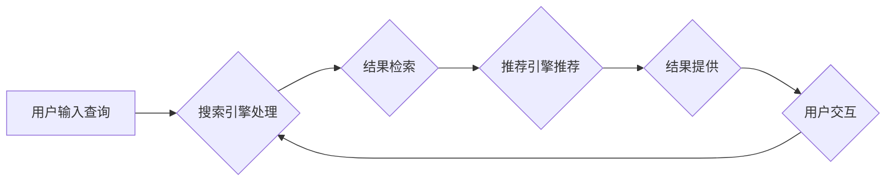

> 搜索推荐系统,结果提供,传统算法,协同过滤,内容过滤,排序算法,推荐引擎

## 1. 背景介绍

在信息爆炸的时代，海量数据和信息涌现，用户在获取所需信息时面临着巨大的挑战。搜索推荐系统应运而生，旨在帮助用户快速找到所需信息，并提供个性化的推荐，提升用户体验。传统搜索推荐系统主要依靠传统的算法和技术，通过对用户历史行为、物品特征等信息的分析，为用户提供精准的搜索结果和推荐列表。

## 2. 核心概念与联系

传统搜索推荐系统主要包含以下核心概念：

* **搜索引擎:**  负责处理用户查询，并根据预先建立的索引结构，快速检索相关信息。
* **推荐引擎:**  基于用户行为、物品特征等数据，预测用户潜在兴趣，并推荐相关物品。
* **结果提供:**  将搜索结果和推荐列表以用户易理解的方式呈现，并提供交互功能，例如排序、筛选、过滤等。

传统搜索推荐系统的核心流程如下：



## 3. 核心算法原理 & 具体操作步骤

传统搜索推荐系统中常用的算法主要包括协同过滤和内容过滤。

### 3.1  算法原理概述

* **协同过滤:**  基于用户对物品的评分或行为数据，预测用户对未交互物品的兴趣。它假设用户具有相似的口味，如果用户A喜欢物品X，那么用户B也可能喜欢物品X。
* **内容过滤:**  基于物品的特征信息，预测用户对物品的兴趣。它假设用户喜欢具有特定特征的物品。

### 3.2  算法步骤详解

**协同过滤算法步骤:**

1. **数据收集:** 收集用户对物品的评分或行为数据。
2. **用户相似度计算:** 计算用户之间的相似度，例如使用余弦相似度或皮尔逊相关系数。
3. **预测评分:**  根据用户相似度和已知评分，预测用户对未交互物品的评分。

**内容过滤算法步骤:**

1. **物品特征提取:**  提取物品的特征信息，例如物品类别、描述、标签等。
2. **用户兴趣建模:**  根据用户历史行为数据，构建用户兴趣模型，例如使用TF-IDF或Word2Vec。
3. **预测兴趣:**  根据物品特征和用户兴趣模型，预测用户对物品的兴趣。

### 3.3  算法优缺点

**协同过滤算法:**

* **优点:**  能够发现隐含的用户兴趣，推荐个性化结果。
* **缺点:**  数据稀疏性问题，新用户新物品冷启动问题。

**内容过滤算法:**

* **优点:**  无需用户历史行为数据，能够推荐新物品。
* **缺点:**  难以捕捉用户隐含兴趣，推荐结果可能缺乏个性化。

### 3.4  算法应用领域

* **电子商务:**  商品推荐、用户画像
* **社交媒体:**  内容推荐、用户匹配
* **音乐/视频平台:**  内容推荐、用户发现
* **新闻资讯:**  个性化新闻推荐

## 4. 数学模型和公式 & 详细讲解 & 举例说明

### 4.1  数学模型构建

协同过滤算法中常用的数学模型是矩阵分解模型。

假设用户集合为U，物品集合为I，用户对物品的评分矩阵为R，其中R(u,i)表示用户u对物品i的评分。

矩阵分解模型将评分矩阵R分解为两个低维矩阵：用户特征矩阵P和物品特征矩阵Q。

P(u,f)表示用户u在特征f上的评分，Q(i,f)表示物品i在特征f上的评分。

评分矩阵R可以表示为：

$$R(u,i) = \sum_{f=1}^{k} P(u,f) * Q(i,f)$$

其中k为特征维度。

### 4.2  公式推导过程

矩阵分解模型的目标是找到最优的用户特征矩阵P和物品特征矩阵Q，使得预测评分与实际评分之间的误差最小。

常用的损失函数是均方误差（MSE）：

$$MSE = \frac{1}{N} \sum_{u \in U, i \in I} (R(u,i) - \hat{R}(u,i))^2$$

其中N为评分矩阵R中非零元素的数量，$\hat{R}(u,i)$为预测评分。

通过梯度下降算法，可以迭代更新P和Q，使得MSE最小化。

### 4.3  案例分析与讲解

假设有一个评分矩阵R，其中用户1对物品1评分为5，用户2对物品1评分为4，用户1对物品2评分为3。

使用矩阵分解模型，可以将评分矩阵R分解为两个低维矩阵P和Q。

例如，假设特征维度k=2，则用户特征矩阵P和物品特征矩阵Q可以表示为：

$$P = \begin{bmatrix} 
0.8 & 0.6 \\
0.5 & 0.4
\end{bmatrix}$$

$$Q = \begin{bmatrix} 
0.7 & 0.3 \\
0.4 & 0.6
\end{bmatrix}$$

根据公式，可以预测用户1对物品2的评分：

$$\hat{R}(1,2) = P(1,1) * Q(2,1) + P(1,2) * Q(2,2) = 0.8 * 0.4 + 0.6 * 0.6 = 0.72$$

## 5. 项目实践：代码实例和详细解释说明

### 5.1  开发环境搭建

* Python 3.x
* scikit-learn
* pandas
* numpy

### 5.2  源代码详细实现

```python
import pandas as pd
from sklearn.metrics.pairwise import cosine_similarity

# 加载评分数据
ratings_data = pd.read_csv('ratings.csv')

# 计算用户相似度
user_similarity = cosine_similarity(ratings_data.T)

# 预测用户对物品的评分
def predict_rating(user_id, item_id):
    # 获取用户历史评分
    user_ratings = ratings_data.loc[user_id]
    # 获取与用户相似的用户
    similar_users = user_similarity[user_id].argsort()[:-10:-1]
    # 计算预测评分
    predicted_rating = 0
    for similar_user in similar_users:
        if ratings_data.loc[similar_user, item_id] != 0:
            predicted_rating += ratings_data.loc[similar_user, item_id] * user_similarity[user_id][similar_user]
    return predicted_rating / sum(user_similarity[user_id][similar_users])

# 预测用户对物品的评分
predicted_rating = predict_rating(user_id=1, item_id=2)
print(f'用户1对物品2的预测评分: {predicted_rating}')
```

### 5.3  代码解读与分析

* 代码首先加载评分数据，并使用cosine_similarity计算用户之间的相似度。
* predict_rating函数用于预测用户对物品的评分，它首先获取用户历史评分，然后找到与用户相似的用户，并根据用户的相似度和相似用户的评分计算预测评分。
* 最后，代码演示了如何使用predict_rating函数预测用户对物品的评分。

### 5.4  运行结果展示

运行代码后，会输出用户1对物品2的预测评分。

## 6. 实际应用场景

传统搜索推荐系统广泛应用于以下场景：

* **电子商务:**  商品推荐、用户画像、个性化促销
* **社交媒体:**  内容推荐、用户匹配、兴趣圈构建
* **音乐/视频平台:**  内容推荐、用户发现、个性化播放列表
* **新闻资讯:**  个性化新闻推荐、热点话题推荐

### 6.4  未来应用展望

随着人工智能技术的不断发展，传统搜索推荐系统将更加智能化、个性化。

* **深度学习:**  利用深度学习算法，挖掘更深层次的用户兴趣和物品特征，提高推荐精准度。
* **多模态推荐:**  融合文本、图像、音频等多模态数据，提供更丰富的推荐体验。
* **实时推荐:**  利用实时数据流，提供更及时、更精准的推荐。

## 7. 工具和资源推荐

### 7.1  学习资源推荐

* **书籍:**
    * 推荐系统设计与实践
    * 算法导论
* **在线课程:**
    * Coursera: Recommender Systems
    * edX: Introduction to Recommender Systems

### 7.2  开发工具推荐

* **Python:**  广泛应用于推荐系统开发，拥有丰富的库和工具。
* **Spark:**  大数据处理框架，用于处理海量数据。
* **TensorFlow/PyTorch:**  深度学习框架，用于构建深度学习推荐模型。

### 7.3  相关论文推荐

* **Collaborative Filtering for Implicit Feedback Datasets**
* **Matrix Factorization Techniques for Recommender Systems**
* **Deep Learning for Recommender Systems**

## 8. 总结：未来发展趋势与挑战

### 8.1  研究成果总结

传统搜索推荐系统已经取得了显著的成果，为用户提供了个性化、便捷的信息获取体验。

### 8.2  未来发展趋势

未来，搜索推荐系统将朝着更加智能化、个性化、实时化的方向发展。

### 8.3  面临的挑战

* **数据稀疏性:**  用户行为数据往往稀疏，难以训练有效的推荐模型。
* **冷启动问题:**  新用户和新物品难以获得推荐，需要新的算法和策略解决。
* **公平性问题:**  推荐结果可能存在偏差，需要保证推荐公平性。

### 8.4  研究展望

未来研究将重点关注以下方面:

* **解决数据稀疏性和冷启动问题:**  探索新的数据挖掘和特征工程方法，以及针对稀疏数据的推荐算法。
* **提升推荐精准度和个性化程度:**  利用深度学习和多模态数据，构建更精准、更个性化的推荐模型。
* **保证推荐公平性和可解释性:**  研究公平性算法和可解释性模型，确保推荐结果公平、透明。

## 9. 附录：常见问题与解答

* **什么是协同过滤？**

协同过滤是一种基于用户行为数据，预测用户对物品的兴趣的推荐算法。

* **什么是内容过滤？**

内容过滤是一种基于物品特征信息，预测用户对物品的兴趣的推荐算法。

* **如何解决数据稀疏性问题？**

可以使用矩阵分解、协同过滤等算法，以及数据增强、特征工程等方法解决数据稀疏性问题。

* **如何解决冷启动问题？**

可以使用基于内容过滤、基于知识图谱、基于用户画像等方法解决冷启动问题。


作者：禅与计算机程序设计艺术 / Zen and the Art of Computer Programming 
<end_of_turn>