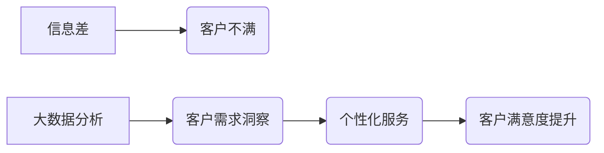

> 大数据，客户满意度，信息差，商业模式，预测分析，个性化服务

## 1. 背景介绍

在当今数据爆炸的时代，企业拥有海量客户数据，但如何有效利用这些数据提升客户满意度，成为一个关键问题。信息差是导致客户不满意的主要原因之一。客户缺乏对产品、服务、价格等信息的了解，容易产生误解和不满。而大数据分析技术能够帮助企业打破信息壁垒，精准洞察客户需求，提供个性化服务，从而有效提升客户满意度。

## 2. 核心概念与联系

**2.1 信息差与客户满意度**

信息差是指客户与企业之间关于产品、服务、价格等方面的知识和理解存在差异。这种差异会导致客户产生不确定性、焦虑和不满，最终影响客户满意度。

**2.2 大数据与客户满意度**

大数据是指海量、高速度、高多样性的数据。通过大数据分析技术，企业可以从客户行为、偏好、反馈等数据中挖掘出隐藏的价值，了解客户需求，预测客户行为，从而提供更精准、更个性化的服务，提升客户满意度。

**2.3 核心概念关系图**



## 3. 核心算法原理 & 具体操作步骤

**3.1 算法原理概述**

提升客户满意度的大数据分析算法主要包括：

* **聚类分析:** 将客户根据相似度进行分组，识别不同客户群体的特征和需求。
* **关联规则挖掘:** 发现客户购买行为之间的关联关系，预测客户未来的购买需求。
* **预测分析:** 利用历史数据预测客户未来的行为，例如 churn rate (流失率) 和购买意愿。
* **推荐系统:** 基于客户的兴趣和历史行为，推荐个性化的产品和服务。

**3.2 算法步骤详解**

以聚类分析为例，其具体步骤如下：

1. **数据收集:** 收集客户的各种数据，例如购买记录、浏览历史、反馈意见等。
2. **数据预处理:** 对收集到的数据进行清洗、转换和格式化，去除噪声和异常值。
3. **特征选择:** 选择与客户行为和需求相关的特征，例如年龄、性别、购买频率、平均消费金额等。
4. **聚类算法选择:** 根据客户数据特点和分析目标，选择合适的聚类算法，例如 K-means 聚类、层次聚类等。
5. **聚类结果分析:** 分析聚类结果，识别不同客户群体的特征和需求，并进行命名和描述。
6. **个性化服务:** 根据不同客户群体的特征和需求，提供个性化的产品推荐、营销活动和服务方案。

**3.3 算法优缺点**

* **聚类分析:**
    * **优点:** 可以识别出隐藏的客户群体，提供更精准的个性化服务。
    * **缺点:** 需要选择合适的聚类算法和参数，聚类结果的解释性较弱。

* **关联规则挖掘:**
    * **优点:** 可以发现客户购买行为之间的关联关系，帮助企业制定更有效的营销策略。
    * **缺点:** 容易产生大量冗余规则，需要进行筛选和过滤。

* **预测分析:**
    * **优点:** 可以预测客户未来的行为，帮助企业提前做好准备。
    * **缺点:** 预测结果的准确性依赖于历史数据的质量和模型的复杂度。

* **推荐系统:**
    * **优点:** 可以提供个性化的产品推荐，提高客户的购买意愿。
    * **缺点:** 需要大量的用户数据和复杂的算法模型，容易产生冷启动问题。

**3.4 算法应用领域**

大数据分析算法在各个行业都有广泛的应用，例如：

* **电商:** 客户画像分析、个性化推荐、精准营销。
* **金融:** 风险评估、欺诈检测、客户服务。
* **医疗:** 疾病预测、个性化治疗、药物研发。
* **教育:** 学生行为分析、个性化学习、教学优化。

## 4. 数学模型和公式 & 详细讲解 & 举例说明

**4.1 数学模型构建**

客户满意度模型可以构建为一个多因素回归模型，其中客户满意度作为因变量，而产品质量、服务质量、价格、品牌等因素作为自变量。

**4.2 公式推导过程**

假设客户满意度模型为线性回归模型，其公式如下：

$$
\text{满意度} = \beta_0 + \beta_1 \text{产品质量} + \beta_2 \text{服务质量} + \beta_3 \text{价格} + \beta_4 \text{品牌} + \epsilon
$$

其中：

* $\beta_0$ 为截距项
* $\beta_1$, $\beta_2$, $\beta_3$, $\beta_4$ 为各自变量的回归系数
* $\epsilon$ 为随机误差项

**4.3 案例分析与讲解**

假设一家电商平台想要预测客户的购买满意度，可以收集客户的购买记录、产品评价、服务评价等数据，构建一个客户满意度模型。通过模型训练，可以得到各自变量的回归系数，例如：

* 产品质量对满意度的影响系数为 0.6，说明产品质量对客户满意度有正向影响。
* 服务质量对满意度的影响系数为 0.4，说明服务质量对客户满意度也有正向影响。
* 价格对满意度的影响系数为 -0.2，说明价格对客户满意度有负向影响。

通过分析这些系数，电商平台可以了解哪些因素对客户满意度影响最大，并制定相应的策略来提升客户满意度。

## 5. 项目实践：代码实例和详细解释说明

**5.1 开发环境搭建**

* 操作系统: Ubuntu 20.04 LTS
* Python 版本: 3.8.10
* 必要的库: pandas, numpy, scikit-learn

**5.2 源代码详细实现**

```python
import pandas as pd
from sklearn.model_selection import train_test_split
from sklearn.linear_model import LinearRegression
from sklearn.metrics import mean_squared_error

# 加载数据
data = pd.read_csv('customer_data.csv')

# 选择特征和目标变量
features = ['product_quality', 'service_quality', 'price', 'brand']
target = 'satisfaction'

# 数据分割
X_train, X_test, y_train, y_test = train_test_split(data[features], data[target], test_size=0.2, random_state=42)

# 创建线性回归模型
model = LinearRegression()

# 模型训练
model.fit(X_train, y_train)

# 模型预测
y_pred = model.predict(X_test)

# 模型评估
mse = mean_squared_error(y_test, y_pred)
print(f'Mean Squared Error: {mse}')

# 打印模型系数
print(f'Coefficients: {model.coef_}')
```

**5.3 代码解读与分析**

* 代码首先加载客户数据，并选择特征和目标变量。
* 然后使用 train_test_split 函数将数据分割成训练集和测试集。
* 创建一个线性回归模型，并使用训练集进行模型训练。
* 使用测试集进行模型预测，并计算模型的均方误差 (MSE) 来评估模型的性能。
* 最后打印模型的系数，了解各自变量对客户满意度的影响程度。

**5.4 运行结果展示**

运行代码后，会输出模型的 MSE 值和系数。MSE 值越小，模型的预测精度越高。系数的正负表示自变量对目标变量的影响方向，绝对值表示影响程度。

## 6. 实际应用场景

**6.1 电商平台**

电商平台可以利用大数据分析技术，分析客户的购买行为、浏览历史、评价反馈等数据，构建客户画像，识别不同客户群体的特征和需求。根据客户画像，提供个性化的产品推荐、营销活动和服务方案，提升客户满意度和复购率。

**6.2 金融机构**

金融机构可以利用大数据分析技术，分析客户的交易记录、信用评分、风险偏好等数据，进行客户风险评估、欺诈检测和个性化服务。例如，可以根据客户的风险偏好，推荐合适的理财产品，或者根据客户的交易习惯，提供个性化的金融服务。

**6.3 医疗机构**

医疗机构可以利用大数据分析技术，分析患者的病历、检查结果、治疗方案等数据，进行疾病预测、个性化治疗和药物研发。例如，可以根据患者的基因信息和病史，预测其患病风险，或者根据患者的病情和体质，制定个性化的治疗方案。

**6.4 未来应用展望**

随着大数据技术的不断发展，其在提升客户满意度方面的应用场景将更加广泛。例如，可以利用人工智能技术，构建更智能的客户服务系统，提供更精准、更个性化的服务体验。

## 7. 工具和资源推荐

**7.1 学习资源推荐**

* **书籍:**
    * 《大数据分析》
    * 《机器学习》
    * 《Python数据科学手册》
* **在线课程:**
    * Coursera: 数据科学专业
    * edX: 机器学习专业
    * Udemy: Python数据分析课程

**7.2 开发工具推荐**

* **Python:** 强大的数据分析和机器学习语言
* **pandas:** 数据处理和分析库
* **numpy:** 数值计算库
* **scikit-learn:** 机器学习库
* **TensorFlow:** 深度学习框架

**7.3 相关论文推荐**

* 《大数据分析在客户满意度提升中的应用研究》
* 《基于机器学习的客户满意度预测模型》
* 《大数据时代客户关系管理的新模式》

## 8. 总结：未来发展趋势与挑战

**8.1 研究成果总结**

大数据分析技术为提升客户满意度提供了强大的工具和方法。通过分析客户数据，企业可以洞察客户需求，提供个性化服务，提升客户体验。

**8.2 未来发展趋势**

* **人工智能技术的融合:** 将人工智能技术与大数据分析技术相结合，构建更智能的客户服务系统。
* **数据隐私保护:** 随着数据隐私保护意识的增强，大数据分析技术需要更加注重数据安全和隐私保护。
* **跨领域应用:** 大数据分析技术将应用于更多领域，例如医疗、教育、交通等，为不同行业提供个性化服务。

**8.3 面临的挑战**

* **数据质量问题:** 大数据分析的准确性依赖于数据质量，需要解决数据清洗、转换和格式化等问题。
* **算法模型的复杂性:** 构建有效的算法模型需要专业的技术能力和经验。
* **数据安全和隐私保护:** 需要制定有效的措施来保护客户数据安全和隐私。

**8.4 研究展望**

未来，大数据分析技术将继续发展，为提升客户满意度提供更强大的工具和方法。研究者需要不断探索新的算法模型和应用场景，并解决数据质量、算法复杂性和数据安全等挑战。


## 9. 附录：常见问题与解答

**9.1 如何选择合适的聚类算法？**

选择合适的聚类算法需要根据客户数据特点和分析目标进行选择。例如，如果客户数据具有明显的层次结构，可以选择层次聚类算法；如果客户数据具有较高的维度，可以选择 K-means 聚类算法。

**9.2 如何评估聚类结果的质量？**

可以使用 silhouette score、Dunn index 等指标来评估聚类结果的质量。

**9.3 如何处理缺失数据？**

可以使用平均值、中位数或其他填充方法来处理缺失数据。

**9.4 如何防止过拟合？**

可以使用交叉验证、正则化等方法来防止过拟合。


作者：禅与计算机程序设计艺术 / Zen and the Art